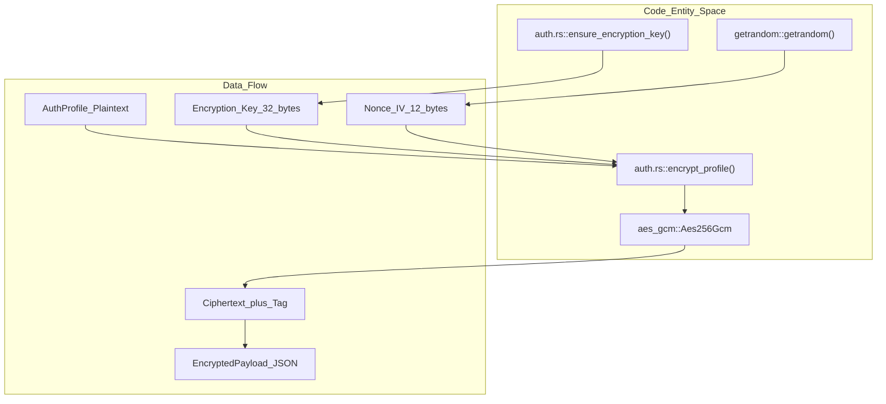
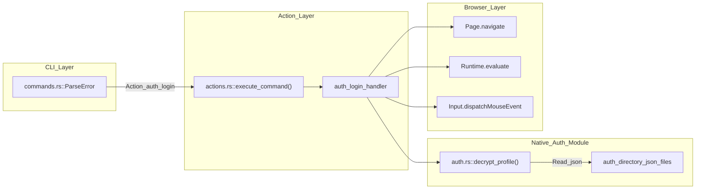

# Authentication

관련 소스 파일

다음 파일들이 이 위키 페이지를 생성하기 위한 컨텍스트로 사용되었습니다.

- [cli/src/commands.rs](cli/src/commands.rs)
- [cli/src/native/auth.rs](cli/src/native/auth.rs)
- [cli/src/native/cdp/types.rs](cli/src/native/cdp/types.rs)
- [cli/src/native/network.rs](cli/src/native/network.rs)
- [cli/src/native/parity_tests.rs](cli/src/native/parity_tests.rs)
- [cli/src/native/recording.rs](cli/src/native/recording.rs)

이 페이지는 credential 저장, automated login, auth profile, encrypted credential storage를 포함한 authentication vault system을 문서화합니다. authentication vault는 command output이나 log에 password를 노출하지 않고 website에 authenticate해야 하는 AI 에이전트를 위해 설계되었습니다.

authentication 이후의 session persistence(cookie, localStorage)에 대한 정보는 [4.1 Sessions and State]()를 참조하세요. authentication action을 제어하는 security policy는 [6.3 Action Policies]()를 참조하세요.

---

## 개요

authentication vault는 profile name으로 참조되는 login credential을 안전하게 encrypted storage에 저장합니다. credential은 AES-256-GCM을 사용해 at rest 상태에서 encrypted됩니다. 시스템은 password가 command output, daemon IPC channel, log에 절대 나타나지 않도록 보장합니다.

**핵심 기능:**
- **Named Profiles**: `AuthProfile` struct를 통해 사람이 읽을 수 있는 name 아래 여러 credential을 저장합니다 [cli/src/native/auth.rs:11-26]().
- **Automatic Encryption**: disk에 쓰기 전에 모든 credential을 AES-256-GCM으로 encrypt합니다 [cli/src/native/auth.rs:152-182]().
- **Safe Input**: password가 shell history에 노출되지 않도록 command parsing이 sensitive data에 대한 standard input을 지원합니다 [cli/src/commands.rs:11-31]().
- **Automated Login**: `auth_login` command는 login page로 navigation하고, credential을 채운 뒤 form을 submit합니다 [cli/src/native/parity_tests.rs:178]().
- **Custom Selectors**: optional `username_selector`, `password_selector`, `submit_selector` field를 통해 비표준 login form을 지원합니다 [cli/src/native/auth.rs:17-21]().

**Storage Location:** `~/.agent-browser/auth/` [cli/src/native/auth.rs:45-51]().

**Encryption Key:** `~/.agent-browser/.encryption-key`에 자동 생성되거나 `AGENT_BROWSER_ENCRYPTION_KEY` environment variable(64-character hex string)을 통해 설정됩니다 [cli/src/native/auth.rs:57-70]().

출처: [cli/src/native/auth.rs:11-26](), [cli/src/native/auth.rs:45-51](), [cli/src/native/auth.rs:152-182](), [cli/src/native/parity_tests.rs:178](), [cli/src/commands.rs:11-31](), [cli/src/native/auth.rs:57-70]()

---

## Data Structures

authentication system의 핵심은 credential과 form selector가 저장되는 방식을 정의하는 `AuthProfile` struct입니다.

### AuthProfile Struct
`AuthProfile` struct(`Credential` alias도 있음)는 automated login을 수행하는 데 필요한 모든 data를 저장합니다.

| Field | Type | Description |
|-------|------|-------------|
| `name` | `String` | profile의 unique identifier입니다. |
| `url` | `String` | target login page URL입니다. |
| `username` | `String` | login identifier입니다. |
| `password` | `String` | secret credential입니다(at rest 상태에서 encrypted). |
| `username_selector`| `Option<String>` | username input에 대한 optional CSS selector입니다. |
| `password_selector`| `Option<String>` | password input에 대한 optional CSS selector입니다. |
| `submit_selector` | `Option<String>` | submit button에 대한 optional CSS selector입니다. |
| `created_at` | `Option<String>` | profile creation의 ISO timestamp입니다. |
| `last_login_at` | `Option<String>` | 마지막 successful login의 ISO timestamp입니다. |

출처: [cli/src/native/auth.rs:11-26](), [cli/src/native/auth.rs:29-30]()

---

## Encryption Implementation

시스템은 authenticated encryption에 AES-256-GCM을 사용합니다. 이 구현은 storage file이 compromise되더라도 master key 없이는 credential이 안전하게 유지되도록 보장합니다.

### Key Management Logic
`get_encryption_key` function은 environment variable `AGENT_BROWSER_ENCRYPTION_KEY` 또는 local file `~/.agent-browser/.encryption-key`에서 256-bit key를 가져오려고 시도합니다 [cli/src/native/auth.rs:85-112](). 둘 다 없으면 `ensure_encryption_key`가 `getrandom`을 사용해 새로운 32-byte key를 생성하고 제한된 permission(key file은 0o600)으로 저장합니다 [cli/src/native/auth.rs:115-149]().

### Encryption Flow
`encrypt_profile`을 통해 profile을 저장할 때 시스템은 다음을 수행합니다.
1. random 12-byte initialization vector(IV/Nonce)를 생성합니다 [cli/src/native/auth.rs:160-161]().
2. `Aes256Gcm`을 사용해 serialized `AuthProfile` JSON을 encrypt합니다 [cli/src/native/auth.rs:154-158]().
3. 16-byte authentication tag를 ciphertext에 append합니다 [cli/src/native/auth.rs:168-170]().
4. `EncryptedPayload`가 정의하는 Base64-encoded JSON envelope로 IV, Tag, Ciphertext를 encode합니다 [cli/src/native/auth.rs:172-178](), [cli/src/native/auth.rs:185-195]().

**Encryption Data Flow**

출처: [cli/src/native/auth.rs:152-182](), [cli/src/native/auth.rs:115-149](), [cli/src/native/auth.rs:185-195]()

---

## Command Processing

authentication command는 `cli/src/commands.rs`에서 parsed되고 `execute_command` pipeline을 통해 native daemon의 적절한 handler로 dispatch됩니다 [cli/src/native/parity_tests.rs:10]().

### Saving Credentials (`auth_save`)
`auth_save` command는 `AuthProfile`을 구성합니다. command parsing logic은 `name`, `url`, `username`, `password` 같은 mandatory field가 존재하는지 보장합니다 [cli/src/native/parity_tests.rs:245-250]().

### Login Automation (`auth_login`)
`auth_login` action은 daemon이 처리하는 high-level command입니다. 다음 sequence를 수행합니다.
1. **Navigate**: `AuthProfile`에 정의된 URL로 이동합니다 [cli/src/native/parity_tests.rs:202-204]().
2. **Identify**: 제공된 selector 또는 heuristic을 사용해 username 및 password field를 찾습니다 [cli/src/native/parity_tests.rs:208-216]().
3. **Interact**: credential을 채우고 form을 submit합니다 [cli/src/native/parity_tests.rs:208-216]().

**Auth Command Lifecycle**

출처: [cli/src/commands.rs:11-31](), [cli/src/native/parity_tests.rs:176-181](), [cli/src/native/auth.rs:197-220](), [cli/src/native/parity_tests.rs:10]()

---

## Profile Management

사용자는 protocol에 정의된 여러 action을 통해 authentication vault의 lifecycle을 관리할 수 있습니다.

| Action | Purpose | Implementation Detail |
|---------|--------|-----------------------|
| `auth_list` | profile name을 나열합니다 | `auth/` directory에서 `.json` file을 scan합니다 [cli/src/native/auth.rs:53-55](). |
| `auth_show` | metadata를 표시합니다 | profile info를 decrypt하고 표시합니다(password 제외) [cli/src/native/auth.rs:11-26](). |
| `auth_delete` | profile을 제거합니다 | `auth/` directory에서 특정 `.json` file을 삭제합니다 [cli/src/native/auth.rs:53-55](). |

### Profile Name Validation
path traversal이나 shell injection을 방지하기 위해 profile name은 엄격하게 validate됩니다. `validate_profile_name` function은 name이 비어 있지 않고 alphanumeric character, underscore, hyphen만으로 구성되었는지 보장합니다 [cli/src/native/auth.rs:31-43]().

출처: [cli/src/native/auth.rs:31-43](), [cli/src/native/auth.rs:53-55](), [cli/src/native/parity_tests.rs:177-181]()

---

## Integration with State Management

authentication은 더 큰 workflow의 첫 단계인 경우가 많습니다. `auth_login`이 성공하면 결과 session(cookie와 localStorage)을 `state_save`로 capture할 수 있습니다 [cli/src/native/parity_tests.rs:85-91]().

state management system은 successful login 이후 cookie와 origin-specific storage를 수집합니다. `AGENT_BROWSER_ENCRYPTION_KEY`가 configured 상태이면, 이러한 state file은 동일한 AES-256-GCM mechanism으로 at rest 상태에서 보호되어 authentication flow 중 획득한 session token이 안전하게 유지됩니다 [cli/src/native/auth.rs:85-93]().

출처: [cli/src/native/parity_tests.rs:85-91](), [cli/src/native/auth.rs:85-93]()
