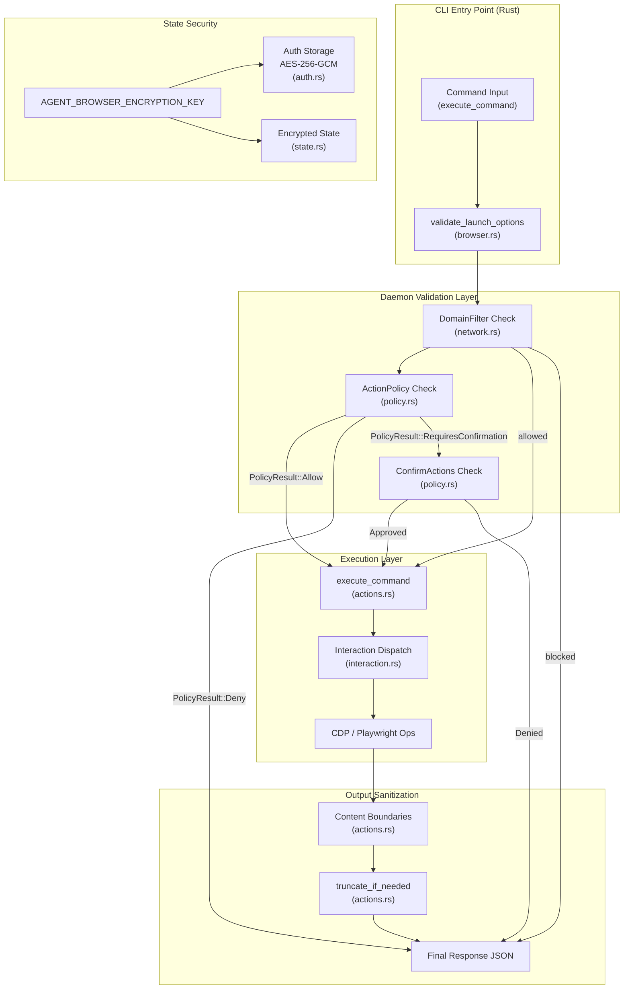

# Security

관련 소스 파일

다음 파일들이 이 위키 페이지를 생성하기 위한 컨텍스트로 사용되었습니다.

- [cli/src/native/actions.rs](cli/src/native/actions.rs)
- [cli/src/native/browser.rs](cli/src/native/browser.rs)
- [cli/src/native/e2e_tests.rs](cli/src/native/e2e_tests.rs)
- [docs/src/app/security/page.mdx](docs/src/app/security/page.mdx)
- [skill-data/core/references/trust-boundaries.md](skill-data/core/references/trust-boundaries.md)

## 목적과 범위

이 문서는 host system과 AI agent를 malicious content 및 unintended action으로부터 보호하도록 설계된 agent-browser의 security architecture 개요를 제공합니다. security model은 독립적으로 활성화하거나 production AI agent deployment를 위해 조합할 수 있는 여러 보호 layer를 갖춘 defense-in-depth를 구현합니다.

특정 security mechanism에 대한 자세한 정보는 다음을 참조하세요.
- [Security Overview](#6.1) — 자세한 threat scenario와 defense-in-depth approach.
- [Domain Allowlists](#6.2) — `DomainFilter`와 `FetchHandler`를 통한 navigation 및 resource filtering.
- [Action Policies](#6.3) — `policy.json`과 `PolicyResult`를 사용한 destructive operation gating.
- [Content Boundaries and Output Limits](#6.4) — CSPRNG nonce와 output truncation을 포함한 LLM safety feature.

authentication과 credential management는 [Authentication](#5.5)을 참조하세요.

---

## Security Model Overview

agent-browser는 다음과 같은 AI agent deployment를 위해 설계되었습니다.
1. **Untrusted websites**가 snapshot 또는 page text에 malicious content를 inject할 수 있습니다(Prompt Injection) [docs/src/app/security/page.mdx:12-12]().
2. **AI agents**가 destructive action을 실행하도록 속을 수 있습니다(Unauthorized Execution) [docs/src/app/security/page.mdx:14-14]().
3. **Credentials**는 `AuthVault`와 `AuthProfile`을 통해 LLM 노출로부터 보호되어야 합니다 [docs/src/app/security/page.mdx:11-11]().
4. **Output size**는 truncation을 통해 context flooding을 방지하도록 제어되어야 합니다 [docs/src/app/security/page.mdx:15-15]().

모든 security feature는 기본적으로 **opt-in**입니다 [docs/src/app/security/page.mdx:5-5](). configuration이 없으면 agent-browser는 navigation, action, output에 아무 제한도 적용하지 않습니다.

**출처:** [docs/src/app/security/page.mdx:1-24](), [skill-data/core/references/trust-boundaries.md:8-27]()

---

## Security Architecture

다음 다이어그램은 CLI command에서 execution까지의 흐름을 매핑하며, security gate와 Natural Language concept 및 Code Entity 사이의 관계를 강조합니다.

### Command Execution Security Flow

**출처:** [cli/src/native/actions.rs:17-42](), [cli/src/native/browser.rs:21-59](), [docs/src/app/security/page.mdx:7-16]()

---

## Security Layers

### Input & Action Security

*   **Domain Allowlist:** `DomainFilter` struct [cli/src/native/network.rs:28-28]()를 사용해 browser를 특정 domain으로 제한합니다. `AGENT_BROWSER_ALLOWED_DOMAINS`를 통해 top-level navigation과 sub-resource request(XHR, Fetch, WebSocket)를 모두 block합니다 [docs/src/app/security/page.mdx:103-109]().
*   **Action Policy:** command를 category(예: `click`, `type`, `eval`)로 gate합니다. policy system은 `ActionPolicy`를 사용해 configuration을 load하고 `PolicyResult`(Allow, Deny, RequiresConfirmation)를 반환합니다 [cli/src/native/actions.rs:29-29]().
*   **Confirmation Workflow:** high-risk action은 `ConfirmActions`를 통해 gate할 수 있습니다. 이러한 action은 명시적 approval(`confirmationId`를 통해)이 필요하며 60초 후 auto-deny됩니다 [docs/src/app/security/page.mdx:22-23]().

### Output & Content Security

*   **Content Boundaries:** `AGENT_BROWSER_CONTENT_BOUNDARIES`로 활성화된 경우 page-sourced data는 CSPRNG nonce가 포함된 structural marker로 감싸집니다 [docs/src/app/security/page.mdx:67-85](). 이를 통해 agent orchestrator는 trusted tool output과 untrusted page content를 구분할 수 있습니다.
*   **Output Truncation:** LLM context window의 context flooding을 방지하기 위해 큰 page output은 `truncate_if_needed` logic으로 제한됩니다 [docs/src/app/security/page.mdx:15-15]().

### Credential & State Security

*   **Auth Vault:** `~/.agent-browser/auth/`에 저장된 credential은 AES-256-GCM으로 encrypted됩니다. `auth_login` command는 form filling을 local에서 처리하므로 secret이 LLM에 노출되지 않습니다 [cli/src/native/actions.rs:44-52](), [docs/src/app/security/page.mdx:63-65]().
*   **Encrypted Sessions:** `AGENT_BROWSER_ENCRYPTION_KEY`가 제공되면 session state(cookie/localStorage)를 disk에서 encrypted 상태로 저장할 수 있습니다 [docs/src/app/security/page.mdx:63-63]().

---

## Code Entity Mapping

다음 table은 security concept를 코드베이스의 implementation entity에 매핑합니다.

| Security Feature | Code Entity / Struct | File Path |
| :--- | :--- | :--- |
| **Domain Filtering** | `DomainFilter` | [cli/src/native/network.rs:28-28]() |
| **Action Policy** | `ActionPolicy`, `PolicyResult` | [cli/src/native/actions.rs:29-29]() |
| **Launch Validation** | `validate_launch_options` | [cli/src/native/browser.rs:21-21]() |
| **Auth Storage** | `auth_save`, `auth_login` | [cli/src/native/actions.rs:14-14]() |
| **Content Boundaries** | `AGENT_BROWSER_CONTENT_BOUNDARIES` | [docs/src/app/security/page.mdx:84-84]() |

---

## Configuration Summary

security는 Environment Variable 또는 CLI flag로 configuration할 수 있습니다.

| Env Variable | Purpose |
| :--- | :--- |
| `AGENT_BROWSER_ALLOWED_DOMAINS` | 허용된 hostname/wildcard의 comma-separated list [docs/src/app/security/page.mdx:104-107](). |
| `AGENT_BROWSER_ACTION_POLICY` | action을 gate하기 위한 `policy.json` file path [docs/src/app/security/page.mdx:14-14](). |
| `AGENT_BROWSER_CONTENT_BOUNDARIES` | CSPRNG nonce wrapping을 활성화하려면 `1`로 설정 [docs/src/app/security/page.mdx:84-85](). |
| `AGENT_BROWSER_ENCRYPTION_KEY` | AES-256-GCM encryption을 위한 32-byte hex key [docs/src/app/security/page.mdx:63-63](). |

**출처:** [docs/src/app/security/page.mdx:67-120]()

---

## Known Limitations

*   **WebSocket Blocking:** constructor patching을 통한 best-effort 방식입니다. `eval`이 허용된 경우 우회될 수 있습니다 [docs/src/app/security/page.mdx:19-19]().
*   **Remote Connections:** CDP를 통해 기존 browser에 연결하는 경우, filter가 attach되기 *전에* load된 content는 retroactive하게 block되지 않을 수 있습니다 [docs/src/app/security/page.mdx:20-20]().
*   **Confirmation Timeout:** pending action은 60초 후 자동으로 deny됩니다 [docs/src/app/security/page.mdx:22-22]().
*   **Non-TTY Contexts:** stdin이 terminal이 아닌 경우 confirmation이 필요한 action은 auto-deny됩니다 [docs/src/app/security/page.mdx:23-23]().

**출처:** [docs/src/app/security/page.mdx:17-23]()
