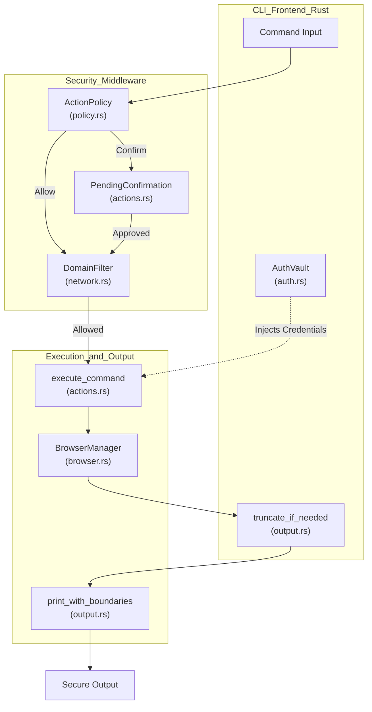
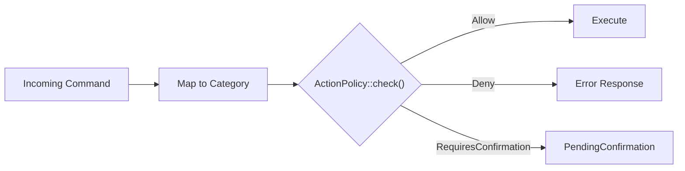
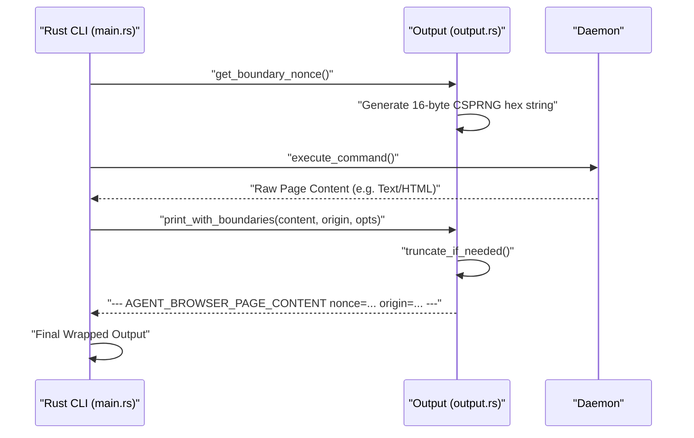

# Security Overview

관련 소스 파일

다음 파일들이 이 위키 페이지를 생성하기 위한 컨텍스트로 사용되었습니다.

- [README.md](README.md)
- [cli/src/output.rs](cli/src/output.rs)
- [docs/src/app/security/page.mdx](docs/src/app/security/page.mdx)
- [skill-data/core/references/trust-boundaries.md](skill-data/core/references/trust-boundaries.md)

이 문서는 `agent-browser`의 security architecture에 대한 기술적 개요를 제공합니다. AI agent deployment를 위해 설계된 이 시스템은 malicious page content, unauthorized action, credential exposure로부터 보호하기 위해 defense-in-depth model을 구현합니다.

---

## Threat Model

security feature는 LLM-driven browser automation에 내재된 특정 risk를 완화하도록 설계되었습니다.

| Threat | Description | Mitigation Mechanism |
|--------|-------------|----------------------|
| **Credential Exposure** | password가 LLM context 또는 shell history로 leak되는 것. | AES-256-GCM encryption을 사용하는 [Authentication Vault](#authentication-vault). |
| **Prompt Injection** | malicious page가 agent instruction을 조작하기 위한 text를 embed하는 것. | [Content Boundary Markers](#content-boundary-markers) (CSPRNG nonce). |
| **Data Exfiltration** | compromise된 agent가 data 전송을 위해 attacker domain으로 navigation하는 것. | `DomainFilter`를 통한 [Domain Allowlist](#domain-allowlist)와 sub-resource blocking. |
| **Destructive Actions** | agent가 위험한 operation(예: `eval`, `download`)을 수행하는 것. | [Action Policies](#action-policy-enforcement)와 confirmation gating. |
| **Context Flooding** | 거대한 page output이 LLM context window를 압도하는 것. | `truncate_if_needed`를 통한 output truncation. |

**출처:** [docs/src/app/security/page.mdx:7-23](), [cli/src/output.rs:36-59]()

---

## Defense-in-Depth Architecture

다음 다이어그램은 CLI에서 security filter를 거쳐 browser execution layer까지 command가 흐르는 과정을 추적하며, 핵심 code entity를 강조합니다.

### System Security Flow

**출처:** [cli/src/output.rs:61-75](), [docs/src/app/security/page.mdx:67-97](), [README.md:146-147]()

---

## Input Security: Action Policy Enforcement

action policy는 risk category를 기준으로 operation을 gate합니다. 이는 `policy.json` file에 대해 evaluate됩니다. 시스템은 `Allow`, `Deny`, `RequiresConfirmation` 같은 result를 지원합니다.

| Category | Example Commands | Risk Level |
|----------|------------------|------------|
| `navigate` | `open`, `back`, `reload` | Medium |
| `read` | `snapshot`, `get text`, `screenshot` | Low |
| `interact` | `click`, `fill`, `type`, `hover` | Medium |
| `eval` | `eval` | High |
| `download` | `pdf` | High |

### Action Policy Logic

**출처:** [docs/src/app/security/page.mdx:14-15](), [README.md:113-144]()

---

## Domain Allowlist

domain allowlist는 browser의 reach를 제한합니다. `AGENT_BROWSER_ALLOWED_DOMAINS` environment variable 또는 `--allowed-domains` flag를 통해 적용됩니다.

- **Navigation Blocking:** browser가 허용되지 않은 origin으로 navigation하지 못하게 합니다.
- **Sub-resource Blocking:** 외부 domain으로 향하는 script, image, XHR/fetch request를 intercept하고 abort합니다 [docs/src/app/security/page.mdx:109-109]().
- **WebSocket/EventSource:** unauthorized connection을 block하기 위해 constructor가 init script를 통해 patch됩니다. 이는 `eval` blocking과 함께 작동하는 best-effort defense입니다 [docs/src/app/security/page.mdx:111-111]().

**출처:** [docs/src/app/security/page.mdx:99-112]()

---

## Content Boundary Markers

LLM이 page content를 system instruction과 혼동하지 않도록, `agent-browser`는 per-process CSPRNG nonce를 사용해 page-sourced data를 structural marker로 감쌉니다. 이 nonce는 `cli/src/output.rs`의 `get_boundary_nonce` function을 통해 `getrandom` crate를 사용해 생성됩니다.

### Content Wrapping Implementation

**출처:** [cli/src/output.rs:6-17](), [cli/src/output.rs:61-75](), [docs/src/app/security/page.mdx:67-85]()

---

## Authentication Vault

authentication vault는 credential을 관리하는 안전한 방법을 제공합니다. profile은 `~/.agent-browser/auth/`에 저장되며 **AES-256-GCM**을 사용해 encrypted됩니다.

### Security Properties:
- **Encryption at Rest:** `AGENT_BROWSER_ENCRYPTION_KEY`를 사용합니다. 설정되지 않은 경우 첫 사용 시 `~/.agent-browser/.encryption-key`에 key가 자동 생성됩니다 [docs/src/app/security/page.mdx:63-63]().
- **Permission Enforcement:** Unix에서는 file과 directory가 `chmod 600` 및 `chmod 700`으로 제한됩니다. Windows에서는 현재 user로 access를 제한하기 위해 `icacls`가 사용됩니다 [docs/src/app/security/page.mdx:65-65]().
- **Credential Isolation:** credential은 CDP를 통해 form을 채우는 데 사용되며, LLM context로 반환되지 않습니다 [docs/src/app/security/page.mdx:11-11]().
- **Secure Input:** process listing 또는 shell history에 secret이 나타나지 않도록 `--password-stdin`을 지원합니다 [docs/src/app/security/page.mdx:31-32]().

**출처:** [docs/src/app/security/page.mdx:25-65]()

---

## Security Configuration Reference

| Feature | Flag / Env Var | Implementation File |
|---------|----------------|---------------------|
| **Domain Filter** | `AGENT_BROWSER_ALLOWED_DOMAINS` | [docs/src/app/security/page.mdx:104-106]() |
| **Output Limits** | `--max-output <chars>` | [cli/src/output.rs:19-34]() |
| **Boundaries** | `AGENT_BROWSER_CONTENT_BOUNDARIES` | [cli/src/output.rs:61-75]() |
| **Auth Vault** | `agent-browser auth` | [README.md:185-186]() |

**출처:** [docs/src/app/security/page.mdx:113-121](), [cli/src/output.rs:19-34]()
