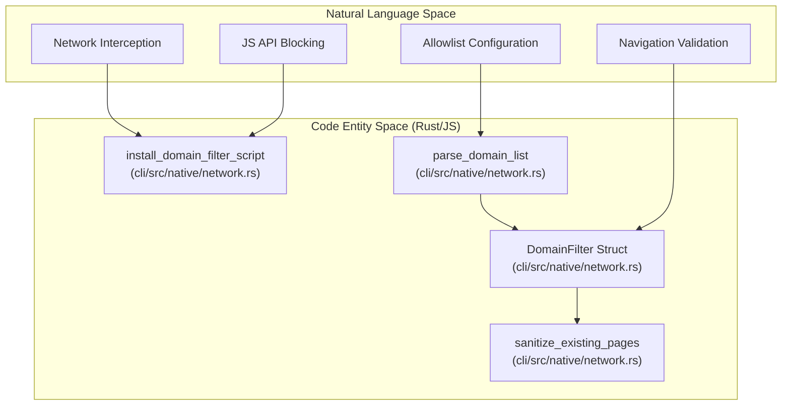
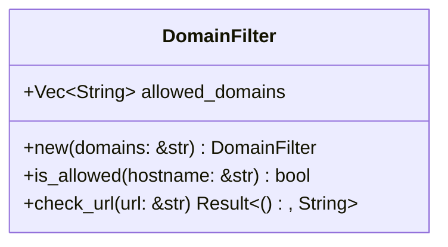
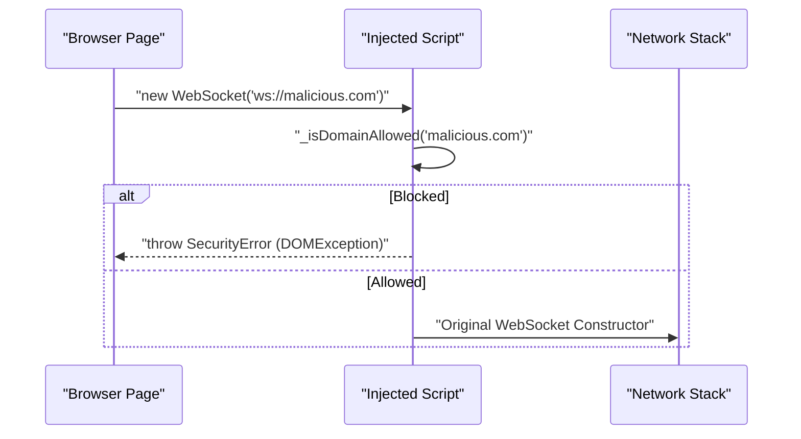

# Domain Allowlists

관련 소스 파일

다음 파일들이 이 위키 페이지를 생성하기 위한 컨텍스트로 사용되었습니다.

- [cli/src/native/actions.rs](cli/src/native/actions.rs)
- [cli/src/native/auth.rs](cli/src/native/auth.rs)
- [cli/src/native/browser.rs](cli/src/native/browser.rs)
- [cli/src/native/cdp/types.rs](cli/src/native/cdp/types.rs)
- [cli/src/native/e2e_tests.rs](cli/src/native/e2e_tests.rs)
- [cli/src/native/network.rs](cli/src/native/network.rs)
- [cli/src/native/parity_tests.rs](cli/src/native/parity_tests.rs)
- [cli/src/native/recording.rs](cli/src/native/recording.rs)
- [docs/src/app/security/page.mdx](docs/src/app/security/page.mdx)

## 목적과 범위

이 페이지는 browser navigation과 network request를 미리 정의된 trusted domain 집합으로 제한하는 domain allowlist security feature를 문서화합니다. 이 기능은 prompt injection 또는 automated redirect를 통해 AI 에이전트가 malicious website로 유도되는 것을 방지하도록 설계되었습니다. native Rust 구현에서는 `DomainFilter` struct [cli/src/native/network.rs:80-82]()가 이를 관리하며, 시스템의 network control logic에 통합되어 있습니다.

다른 security feature에 대한 정보는 [Security Overview](6.1), [Action Policies](6.3), [Content Boundaries](6.4)를 참조하세요.

---

## System Overview

domain allowlist는 navigation과 sub-resource request를 filtering하여 network-level access control을 제공합니다. `AGENT_BROWSER_ALLOWED_DOMAINS` environment variable 또는 `--allowed-domains` CLI flag로 설정되면, 시스템은 명시적으로 허용되지 않은 domain으로 navigation하거나 해당 domain에서 resource를 load하려는 모든 시도를 block합니다.

### Natural Language to Code Entity Mapping

다음 다이어그램은 high-level security concept를 코드베이스의 특정 Rust entity에 매핑합니다.

**출처:** [cli/src/native/network.rs:80-82](), [cli/src/native/network.rs:128-134](), [cli/src/native/network.rs:161-165]()

---

## Configuration

domain allowlist는 input string을 `DomainFilter` object [cli/src/native/network.rs:128-134]()로 parsing하여 설정됩니다.

| Source | Priority | Format | Example |
|--------|----------|--------|---------|
| CLI Flag | High | `--allowed-domains <list>` | `--allowed-domains "google.com,*.github.com"` |
| Env Var | Medium | `AGENT_BROWSER_ALLOWED_DOMAINS` | `export AGENT_BROWSER_ALLOWED_DOMAINS="example.com"` |
| Config | Low | JSON의 `allowedDomains` | `"allowedDomains": ["site.com"]` |

`parse_domain_list` function은 input을 comma로 split하고 case-insensitive matching을 위해 entry를 lowercase로 변환합니다 [cli/src/native/network.rs:128-134]().

**출처:** [cli/src/native/network.rs:128-134](), [docs/src/app/security/page.mdx:103-107]()

---

## DomainFilter Struct

hostname matching의 핵심 logic은 `DomainFilter` struct [cli/src/native/network.rs:80-82]()에 있습니다.

### Wildcard Matching Rules
`is_allowed` method는 다음 logic을 구현합니다 [cli/src/native/network.rs:92-107]().
1. **Exact Match:** pattern이 hostname과 정확히 일치하는 경우(예: `example.com`).
2. **Wildcard Match:** `*.`로 시작하는 pattern(예: `*.example.com`)은 다음과 match됩니다.
    - bare domain(`example.com`).
    - 모든 subdomain(`api.example.com`, `assets.v1.example.com`).
3. **Case Insensitivity:** 모든 hostname은 comparison 전에 lowercase로 변환됩니다.

**출처:** [cli/src/native/network.rs:79-107](), [cli/src/native/network.rs:109-126]()

---

## Enforcement Mechanisms

시스템은 unauthorized traffic을 block하기 위해 multi-layered defense strategy를 사용합니다.

### 1. Navigation Guard
navigation command를 실행하기 전에 시스템은 target URL을 validate합니다. URL의 host가 `DomainFilter::check_url`에 따라 허용되지 않으면 command는 즉시 error를 반환합니다 [cli/src/native/network.rs:109-126](). 이는 browser가 connection을 시작하지 못하게 합니다.

### 2. JavaScript API Patching
WebSocket 또는 EventSource처럼 standard network routing을 우회할 수 있는 request를 block하기 위해, `install_domain_filter_script` function은 CDP `Page.addScriptToEvaluateOnNewDocument` method를 통해 모든 새 document에 script를 inject합니다 [cli/src/native/network.rs:161-165]().

이 script는 다음을 override합니다 [cli/src/native/network.rs:171-216]().
- `window.WebSocket`
- `window.EventSource`
- `navigator.sendBeacon`

**출처:** [cli/src/native/network.rs:161-216](), [docs/src/app/security/page.mdx:109-111]()

### 3. Sanitization of Existing Pages
기존 browser session에 연결할 때(예: `auto-connect` 또는 cloud provider를 통해), `sanitize_existing_pages` function은 열려 있는 모든 target을 순회합니다 [cli/src/native/network.rs:136-140](). 현재 disallowed domain에 있는 page는 강제로 `about:blank`로 navigation됩니다 [cli/src/native/network.rs:148-154]().

**출처:** [cli/src/native/network.rs:136-159]()

---

## Technical Limitations

robust하긴 하지만 domain allowlist에는 특정 boundary가 있습니다 [docs/src/app/security/page.mdx:17-23]().
- **Best-effort JS Blocking:** constructor patching을 통한 best-effort 방식입니다. [Action Policy](6.3)에서 `eval` action category가 허용된 경우, malicious page가 이론적으로 `eval`을 사용해 original browser constructor를 복원하고 WebSocket/EventSource filter를 우회할 수 있습니다 [docs/src/app/security/page.mdx:19-19]().
- **Remote Timing:** cloud provider scenario에서는 connection과 sanitization 사이에 page가 이미 load되어 있을 수 있는 작은 window가 존재합니다 [docs/src/app/security/page.mdx:20-21]().
- **Non-HTTP Schemes:** `data:` URI 또는 `blob:` scheme을 사용하는 sub-resource는 일반적으로 외부 network request를 수반하지 않으므로 허용됩니다 [docs/src/app/security/page.mdx:109-110]().
- **CDN Requirements:** 대부분의 modern website는 CDN에서 asset을 load합니다. broken page layout을 피하려면 사용자가 allowlist에 이를 명시적으로 포함해야 합니다(예: `*.gstatic.com`, `*.cloudfront.net`) [docs/src/app/security/page.mdx:121-125]().

**출처:** [docs/src/app/security/page.mdx:17-23](), [docs/src/app/security/page.mdx:121-125]()

---

## Implementation Details

| Function | File | Description |
|----------|------|-------------|
| `is_allowed` | [cli/src/native/network.rs:92]() | suffix 및 exact matching logic입니다. |
| `check_url` | [cli/src/native/network.rs:109]() | URL string을 validate하고 Result를 반환합니다. |
| `sanitize_existing_pages` | [cli/src/native/network.rs:136]() | disallowed page를 강제로 `about:blank`로 이동시킵니다. |
| `install_domain_filter_script` | [cli/src/native/network.rs:161]() | WebSocket/Beacon용 JS override를 inject합니다. |
| `parse_domain_list` | [cli/src/native/network.rs:128]() | comma-separated string을 `DomainFilter`로 parse합니다. |

**출처:** [cli/src/native/network.rs:92-126](), [cli/src/native/network.rs:128-134](), [cli/src/native/network.rs:136-216]()
