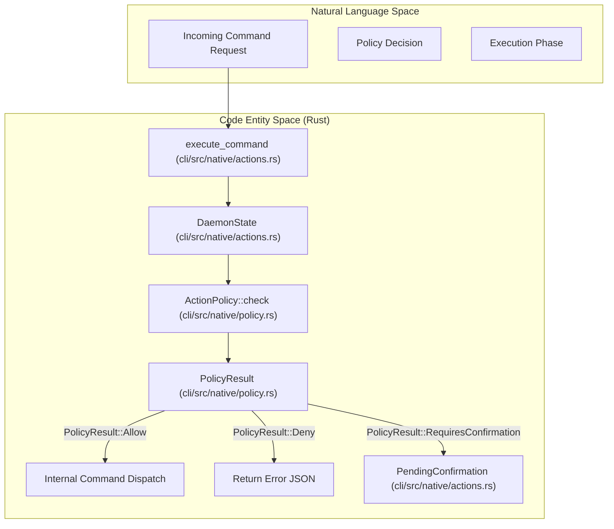
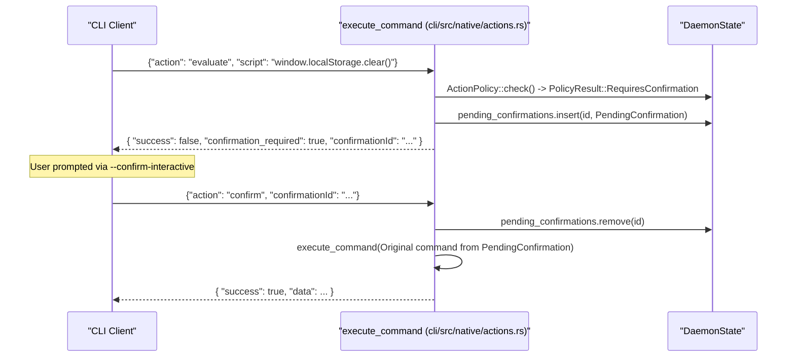

# Action Policies

<details>
<summary>관련 소스 파일</summary>

다음 파일들이 이 위키 페이지를 생성하기 위한 컨텍스트로 사용되었습니다.

- [cli/src/native/actions.rs](cli/src/native/actions.rs)
- [cli/src/native/browser.rs](cli/src/native/browser.rs)
- [cli/src/native/e2e_tests.rs](cli/src/native/e2e_tests.rs)
- [cli/src/native/policy.rs](cli/src/native/policy.rs)
- [cli/src/test_utils.rs](cli/src/test_utils.rs)
- [docs/src/app/security/page.mdx](docs/src/app/security/page.mdx)

</details>


action policy는 risk category를 기준으로 browser action을 gate하기 위한 declarative security control을 제공합니다. 이 시스템은 untrusted LLM이 browser automation을 제어하는 AI agent deployment를 위해 설계되었으며, operator가 안전한 action(navigation, inspection, screenshot)은 허용하면서 destructive operation(code evaluation, file download, data deletion)을 제한할 수 있게 합니다.

domain 기반 navigation restriction은 [Domain Allowlists](6.2)를 참조하세요. output sanitization과 LLM prompt injection 방어는 [Content Boundaries and Output Limits](6.4)를 참조하세요.

---

## 목적과 Threat Model

action policy는 AI agent가 harmful operation을 시도할 수 있는 scenario를 다룹니다.

*   **Code execution**: CDP `Runtime.evaluate` domain을 통해 malicious JavaScript를 실행하는 `eval` command.
*   **Data exfiltration**: sensitive file을 download하거나 session cookie를 전송하는 행위.
*   **Destructive mutations**: storage clear, data deletion, unauthorized form submission.
*   **Resource abuse**: 과도한 tab 열기 또는 unbounded network request 수행.

policy engine은 모든 browser command를 risk level별로 categorization하고, execution 전에 allow/deny/confirm rule을 적용합니다. 이를 통해 LLM이 valid command payload를 생성하더라도 명시적 approval 없이 daemon이 dangerous command를 실행하지 못하게 합니다.

**출처**: [cli/src/native/policy.rs:7-16](), [cli/src/native/policy.rs:84-121](), [docs/src/app/security/page.mdx:14-15]()

---

## Policy File Format

policy는 `ActionPolicy` struct로 표현되는 JSON file에 정의됩니다. 이 format은 explicit list와 fallback default를 지원합니다.

```json
{
  "default": "deny",
  "allow": ["navigate", "snapshot", "click", "scroll", "wait", "get"],
  "deny": ["eval", "download", "storage_clear", "cookies_clear"],
  "confirm": ["submit"]
}
```

### Fields

| Field | Type | Description |
|-------|------|-------------|
| `default` | `Option<String>` | fallback policy: `"allow"`, `"deny"`, 또는 `"confirm"`. |
| `allow` | `Option<Vec<String>>` | 즉시 실행되는 action category. |
| `deny` | `Option<Vec<String>>` | 즉시 error를 반환하는 action category. |
| `confirm` | `Option<Vec<String>>` | manual approval이 필요한 action category. |

`default` field는 명시적으로 listed되지 않은 모든 action에 적용됩니다. `default: "deny"`와 explicit `allow` list를 설정하면 strict allowlist-only policy가 만들어집니다.

**출처**: [cli/src/native/policy.rs:19-31](), [cli/src/native/policy.rs:84-121]()

---

## Policy Enforcement Flow

`DaemonState`는 active `ActionPolicy`를 보유합니다. command가 `execute_command`를 통해 처리될 때, 시스템은 execution 전에 policy를 확인합니다.

### Logic Space to Code Entity Space: Enforcement


**출처**: [cli/src/native/actions.rs:17-18](), [cli/src/native/policy.rs:84-121](), [cli/src/native/actions.rs:61-64]()

---

## Enforcement Modes

`PolicyResult` enum은 주어진 action check에 대한 세 가지 outcome을 정의합니다.

### PolicyResult::Allow
action은 user interaction 없이 즉시 실행됩니다. policy가 제공되지 않았을 때의 default behavior입니다.

### PolicyResult::Deny
action은 daemon level에서 blocked됩니다. daemon은 `"success": false`와 policy violation을 나타내는 error message가 포함된 JSON response를 반환합니다.

### PolicyResult::RequiresConfirmation
action은 명시적 approval이 필요합니다. daemon은 command를 `PendingConfirmation` struct에 저장하고 `confirmation_required` payload를 반환합니다.

**출처**: [cli/src/native/policy.rs:8-16](), [cli/src/native/actions.rs:61-64]()

---

## Confirmation Workflow

confirmation system은 suspended command에 approval을 연결하기 위해 `confirmationId`를 사용합니다. daemon은 이를 `DaemonState.pending_confirmations`에서 추적합니다.

### Confirmation Sequence


**출처**: [cli/src/native/actions.rs:61-64](), [cli/src/native/policy.rs:14-15](), [cli/src/native/actions.rs:17-18]()

---

## Configuration

### Environment Variables
- `AGENT_BROWSER_ACTION_POLICY`: `policy.json` file의 path입니다. [cli/src/native/policy.rs:77-79]()
- `AGENT_BROWSER_POLICY`: backwards compatibility를 위한 `AGENT_BROWSER_ACTION_POLICY` alias입니다. [cli/src/native/policy.rs:78-79]()
- `AGENT_BROWSER_CONFIRM_ACTIONS`: 항상 confirm할 category의 comma-separated list이며, `ConfirmActions::from_env`가 parse합니다. [cli/src/native/policy.rs:40-55]()

### Implementation Components
- `ConfirmActions`: environment variable에서 추출된 action category의 `HashSet<String>`을 포함하는 struct입니다. [cli/src/native/policy.rs:35-37]()
- `ActionPolicy::load`: policy file을 읽고 parse하여 `ActionPolicy` struct로 변환합니다. [cli/src/native/policy.rs:64-72]()

**출처**: [cli/src/native/policy.rs:35-60](), [cli/src/native/policy.rs:74-81]()

---

## Implementation Details

### Policy Decision Logic
`cli/src/native/policy.rs`의 `check` method는 explicit list를 확인하여 action의 fate를 결정합니다. `Deny`는 항상 `Confirm`보다 우선하고, `Confirm`은 `Allow`보다 우선합니다.

```rust
pub fn check(&self, action: &str) -> PolicyResult {
    if let Some(deny) = &self.deny {
        if deny.iter().any(|a| a == action) {
            return PolicyResult::Deny(format!("Action '{}' is denied by policy", action));
        }
    }

    if let Some(confirm) = &self.confirm {
        if confirm.iter().any(|a| a == action) {
            return PolicyResult::RequiresConfirmation;
        }
    }
    // ... logic for allow and default
}
```

**출처**: [cli/src/native/policy.rs:84-121]()

### Reloading Policies
`ActionPolicy::reload` function은 daemon restart 없이 disk에서 security rule을 refresh할 수 있게 합니다. original `path`에서 JSON file을 다시 읽고 policy struct를 in-place로 update합니다.

**출처**: [cli/src/native/policy.rs:124-132]()

---

## Security Considerations

1.  **Strict Defaulting**: `default: "deny"`를 설정하면 operator는 최소한의 safe action(`snapshot`, `get` 등)만 agent가 사용할 수 있도록 보장할 수 있습니다. [cli/src/native/policy.rs:99-110]()
2.  **Precedence**: engine은 action이 실수로 양쪽에 포함되었을 때 accidental exposure를 방지하기 위해 `deny` list를 `allow` list보다 우선하도록 hardcoded되어 있습니다. [cli/src/native/policy.rs:164-168]()
3.  **Default Deny Fallback**: `allow` list가 제공되었지만 action이 그 안에 없으면, `default`가 명시적으로 `allow`로 설정되지 않은 한 시스템은 default로 `Deny`합니다. [cli/src/native/policy.rs:97-110]()
4.  **Confirmation Timeout**: pending confirmation은 resource exhaustion과 hanging process를 방지하기 위해 60초 후 자동으로 deny됩니다. [docs/src/app/security/page.mdx:22-23]()

**출처**: [cli/src/native/policy.rs:84-121](), [cli/src/native/policy.rs:164-168](), [docs/src/app/security/page.mdx:22-23]()
