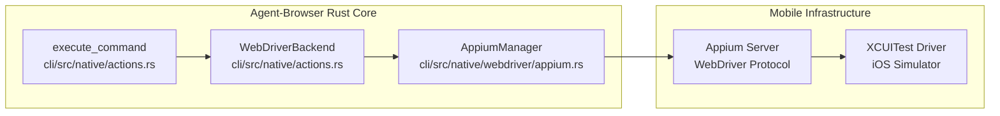

# Advanced Topics

관련 소스 파일

다음 파일들이 이 위키 페이지를 생성하기 위한 컨텍스트로 사용되었습니다.

- [CHANGELOG.md](CHANGELOG.md)
- [cli/src/native/actions.rs](cli/src/native/actions.rs)
- [cli/src/native/browser.rs](cli/src/native/browser.rs)
- [cli/src/native/cdp/chrome.rs](cli/src/native/cdp/chrome.rs)
- [cli/src/native/cdp/client.rs](cli/src/native/cdp/client.rs)
- [cli/src/native/daemon.rs](cli/src/native/daemon.rs)
- [cli/src/native/e2e_tests.rs](cli/src/native/e2e_tests.rs)
- [cli/src/native/providers.rs](cli/src/native/providers.rs)
- [package.json](package.json)

이 페이지는 power user를 위한 specialized feature와 deployment scenario를 다룹니다. 여기에는 native Rust daemon, cloud browser provider integration, iOS automation capability, network monitoring, observability dashboard, visual diffing이 포함됩니다.

기본 configuration과 usage는 [Configuration](#2.3)을 참조하세요. security feature는 [Security](#6)를 참조하세요.

---

## Native Daemon Mode

native daemon은 Chrome DevTools Protocol(CDP)을 통해 browser와 직접 통신하는 pure Rust 구현입니다. 상당한 performance benefit을 제공하며, Node.js daemon의 약 140MB와 비교해 일반적으로 약 7MB의 RAM을 소비합니다 [package.json:23-25](). daemon lifecycle은 socket management, process coordination, session cleanup을 처리하는 `run_daemon`에서 관리됩니다 [cli/src/native/daemon.rs:19-150]().

### Architecture Comparison

```mermaid
graph TB
    subgraph "Legacy / Node.js Mode"
        CLI1["CLI Binary<br/>cli/src/main.rs"]
        DAEMON1["Node.js Daemon<br/>src/daemon.ts"]
        PW["Playwright API<br/>playwright-core"]
        BROWSER1["Chrome/Firefox/WebKit"]
        
        CLI1 -->|IPC| DAEMON1
        DAEMON1 -->|Playwright| PW
        PW --> BROWSER1
    end
    
    subgraph "Native Mode (agent-browser daemon)"
        CLI2["CLI Binary<br/>cli/src/main.rs"]
        DAEMON2["run_daemon<br/>cli/src/native/daemon.rs"]
        CDP["CdpClient<br/>cli/src/native/cdp/client.rs"]
        BROWSER2["ChromeProcess<br/>cli/src/native/cdp/chrome.rs"]
        
        CLI2 -->|IPC| DAEMON2
        DAEMON2 -->|Direct CDP| CDP
        CDP --> BROWSER2
    end
```

**출처:** [cli/src/native/daemon.rs:19-150](), [cli/src/native/cdp/client.rs:29-46](), [cli/src/native/cdp/chrome.rs:8-15]()

자세한 내용은 [Native Daemon Mode](#7.1)를 참조하세요.

---

## Cloud Browser Providers

cloud browser provider는 serverless 또는 containerized deployment를 위한 remote infrastructure를 제공합니다. integration은 여러 vendor의 connection logic을 abstract하는 `providers.rs` module의 `connect_provider`를 통해 처리됩니다 [cli/src/native/providers.rs:26-73]().

### Provider Integration

| Provider | Code Reference | Integration Type |
|----------|----------------|------------------|
| **Browserbase** | `connect_browserbase` | REST API + WSS [cli/src/native/providers.rs:134-184]() |
| **Browserless** | `connect_browserless` | WSS Direct + API [cli/src/native/providers.rs:186-210]() |
| **Kernel** | `connect_kernel` | Cloud Infrastructure [cli/src/native/providers.rs:52-59]() |
| **Browser-Use** | `connect_browser_use` | WSS Connection [cli/src/native/providers.rs:44-51]() |
| **AgentCore** | `connect_agentcore` | Vercel Internal [cli/src/native/providers.rs:60-67]() |

**출처:** [cli/src/native/providers.rs:1-132](), [cli/src/native/actions.rs:30-30]()

자세한 내용은 [Cloud Browser Providers](#7.2)를 참조하세요.

---

## iOS Automation

iOS provider는 Appium과 `AppiumManager`를 사용해 iOS Simulator의 Mobile Safari automation을 가능하게 합니다 [cli/src/native/actions.rs:39-39](). 표준 CDP mouse event와 구분되는 command에는 `WebDriverBackend`를 사용하며, mobile-specific gesture를 지원합니다 [cli/src/native/actions.rs:40-41]().

### iOS Control Flow

**출처:** [cli/src/native/actions.rs:39-42](), [cli/src/native/browser.rs:142-145]()

자세한 내용은 [iOS Automation](#7.3)을 참조하세요.

---

## Network Control and Recording

advanced network feature에는 request interception(`RouteEntry`), HAR 1.2 generation(`HarEntry`), `StreamServer`를 통한 live screencasting이 포함됩니다 [cli/src/native/actions.rs:67-110](). `EventTracker`는 request tracking과 response metadata capture를 조율합니다 [cli/src/native/actions.rs:28-28]().

### Network & Media Entities

| Component | Code Entity | Role |
|-----------|-------------|------|
| **Streaming** | `StreamServer` | WebSocket을 통해 viewport frame을 broadcast합니다 [cli/src/native/actions.rs:37-37]() |
| **Recording** | `RecordingState` | video recording lifecycle을 관리합니다 [cli/src/native/actions.rs:32-32]() |
| **Tracking** | `EventTracker` | network event와 HAR generation을 조율합니다 [cli/src/native/actions.rs:28-28]() |
| **Filtering** | `DomainFilter` | network allowlist를 enforce합니다 [cli/src/native/actions.rs:28-28]() |
| **Routing** | `RouteEntry` | interception과 mocking을 configure합니다 [cli/src/native/actions.rs:95-103]() |

**출처:** [cli/src/native/actions.rs:28-38](), [cli/src/native/actions.rs:67-110](), [CHANGELOG.md:46-46]()

자세한 내용은 [Network Control and Recording](#7.4)을 참조하세요.

---

## Observability Dashboard

dashboard는 `packages/dashboard` [package.json:31-31]()에 위치한 Next.js web UI입니다. AI agent activity에 대한 visual oversight를 제공하기 위해 CLI에 통합되어 있습니다. reverse proxy 뒤에 배포하기 위한 same-origin proxying을 지원합니다 [CHANGELOG.md:48-48]().

**핵심 기능:**
- **Live Viewport:** `StreamServer`를 통한 real-time screencasting [cli/src/native/daemon.rs:102-113]().
- **Activity Feed:** command execution에 대한 structured log [CHANGELOG.md:71-71]().
- **React Inspection:** component tree visibility를 위한 React DevTools integration [CHANGELOG.md:42-42]().

**출처:** [package.json:31-31](), [CHANGELOG.md:42-48](), [cli/src/native/daemon.rs:96-113]()

자세한 내용은 [Observability Dashboard](#7.5)를 참조하세요.

---

## Diffing and Visual Regression

diff subsystem은 page state를 비교하는 도구를 제공하며, AI agent action을 testing하고 verifying하는 데 유용합니다. text 기반 accessibility tree diff와 pixel 기반 mismatch detection을 포함합니다 [cli/src/native/actions.rs:24-24]().

### Diff Methods

| Command | Comparison Type | Implementation Note |
|---------|-----------------|---------------------|
| `diff snapshot` | Semantic/Textual (Aria Tree) | text diff에 `similar` crate를 사용합니다 [cli/src/native/actions.rs:24-24]() |
| `diff screenshot` | Visual (Pixel Mismatch) | threshold 기반 detection을 지원합니다 [cli/src/native/actions.rs:33-33]() |
| `diff url` | Live Comparison | 두 live URL을 real-time으로 비교합니다 [cli/src/native/actions.rs:24-24]() |

**출처:** [cli/src/native/actions.rs:24-24](), [cli/src/native/actions.rs:33-34]()

자세한 내용은 [Diffing and Visual Regression](#7.6)을 참조하세요.
