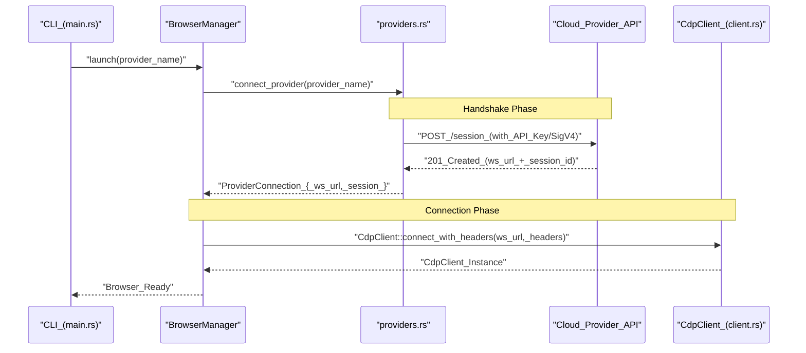

# 클라우드 브라우저 제공자

<details>
<summary>관련 소스 파일</summary>

다음 파일들은 이 위키 페이지를 생성하기 위한 컨텍스트로 사용되었습니다.

- [cli/src/native/cdp/chrome.rs](cli/src/native/cdp/chrome.rs)
- [cli/src/native/cdp/client.rs](cli/src/native/cdp/client.rs)
- [cli/src/native/daemon.rs](cli/src/native/daemon.rs)
- [cli/src/native/providers.rs](cli/src/native/providers.rs)
- [docs/src/app/providers/browser-use/layout.tsx](docs/src/app/providers/browser-use/layout.tsx)
- [docs/src/app/providers/browser-use/page.mdx](docs/src/app/providers/browser-use/page.mdx)
- [docs/src/app/providers/browserbase/layout.tsx](docs/src/app/providers/browserbase/layout.tsx)
- [docs/src/app/providers/browserbase/page.mdx](docs/src/app/providers/browserbase/page.mdx)
- [docs/src/app/providers/browserless/layout.tsx](docs/src/app/providers/browserless/layout.tsx)
- [docs/src/app/providers/browserless/page.mdx](docs/src/app/providers/browserless/page.mdx)
- [docs/src/app/providers/kernel/layout.tsx](docs/src/app/providers/kernel/layout.tsx)
- [docs/src/app/providers/kernel/page.mdx](docs/src/app/providers/kernel/page.mdx)

</details>


이 페이지는 Chrome DevTools Protocol(CDP)을 통해 원격 브라우저 인프라를 제공하는 클라우드 브라우저 서비스와의 통합을 문서화합니다. 클라우드 제공자는 로컬 브라우저 설치를 관리하지 않고도 브라우저 자동화를 가능하게 하며, 관리형 세션, stealth mode, 영구 프로필 같은 기능을 제공합니다.

이러한 제공자의 주요 구현은 [cli/src/native/providers.rs:1-4]()의 네이티브 Rust daemon에 있으며, CDP WebSocket URL을 얻는 데 필요한 REST API handshake를 처리합니다.

## 개요

`agent-browser`는 다섯 가지 주요 클라우드 브라우저 제공자를 지원합니다. 각 제공자는 `connect_provider` 함수에 전달되는 이름 또는 CLI flag로 식별됩니다.

| 제공자 | Flag 값 | 필수 환경 변수 | 주요 기능 |
|----------|-----------|----------------------|--------------|
| **AgentCore** | `agentcore` | `AWS_ACCESS_KEY_ID`, `AWS_SECRET_ACCESS_KEY` | AWS Bedrock 관리형 브라우저, SigV4 인증. |
| **Browserbase** | `browserbase` | `BROWSERBASE_API_KEY` | 세션 기반 인프라, 간단한 설정. |
| **Browserless** | `browserless` | `BROWSERLESS_API_KEY` | 고성능 세션, stealth mode, 사용자 지정 TTL. |
| **Kernel** | `kernel` | `KERNEL_API_KEY` | Stealth mode, 영구 프로필, 설정 가능한 endpoint. |
| **Browser Use** | `browseruse` | `BROWSER_USE_API_KEY` | AI agent를 위한 관리형 클라우드 세션. |

**출처:** [cli/src/native/providers.rs:3-67](), [docs/src/app/providers/browserbase/page.mdx:1-25](), [docs/src/app/providers/browser-use/page.mdx:1-25](), [docs/src/app/providers/browserless/page.mdx:1-40](), [docs/src/app/providers/kernel/page.mdx:1-42]()

## 아키텍처

이 통합은 두 단계 연결 패턴을 따릅니다.
1. **Handshake**: daemon이 제공자에 REST API 호출을 수행하여 새 브라우저 세션을 요청합니다.
2. **CDP Connection**: 제공자가 CDP WebSocket URL을 반환하면, `BrowserManager`가 이를 사용해 직접 제어 링크를 설정합니다.

### 제공자 연결 로직

모든 제공자 로직의 진입점은 [cli/src/native/providers.rs:26-73]()의 `connect_provider`입니다. 이 함수는 제공자 이름에 따라 특정 내부 함수로 dispatch합니다.

```mermaid
graph TD
    subgraph "Native_Daemon_Rust"
        CMD["connect_provider(provider_name)"]
        AC["connect_agentcore()"]
        BB["connect_browserbase()"]
        BL["connect_browserless()"]
        BU["connect_browser_use()"]
        KN["connect_kernel()"]
    end

    subgraph "Cloud_APIs"
        AC_API["bedrock-agent-runtime_AWS"]
        BB_API["api.browserbase.com"]
        BL_API["browserless.io/session"]
        BU_API["api.browser-use.com"]
        KN_API["api.onkernel.com"]
    end

    CMD -->| "agentcore" | AC
    CMD -->| "browserbase" | BB
    CMD -->| "browserless" | BL
    CMD -->| "browser-use" | BU
    CMD -->| "kernel" | KN

    AC -->| "SigV4_Signed_Request" | AC_API
    BB -->| "POST_/v1/sessions" | BB_API
    BL -->| "POST_/session" | BL_API
    BU -->| "POST_/api/v2/browsers" | BU_API
    KN -->| "POST_/browsers" | KN_API

    AC_API -.->| "webSocketUrl" | AC
    BB_API -.->| "connectUrl" | BB
    BL_API -.->| "connect_URL" | BL
    BU_API -.->| "ws_endpoint" | BU
    KN_API -.->| "connectUrl" | KN

    AC & BB & BL & BU & KN --> RET["ProviderConnection_{_ws_url,_session_}"]
```

**출처:** [cli/src/native/providers.rs:26-73](), [cli/src/native/providers.rs:134-184](), [cli/src/native/providers.rs:186-210]()

### 세션 관리 및 정리

고아 세션과 불필요한 과금을 방지하기 위해, 시스템은 `ProviderSession` struct를 사용해 활성 제공자 세션을 추적합니다 [cli/src/native/providers.rs:11-14]().

CDP 연결이 실패하거나 브라우저가 닫히면 `close_provider_session`이 호출됩니다 [cli/src/native/providers.rs:76-132](). 이 함수는 제공자별 종료 요청을 수행합니다.
- **Browserbase**: `REQUEST_RELEASE`와 함께 `/v1/sessions/{id}`로 `POST` [cli/src/native/providers.rs:81-90]().
- **Browser Use**: `stop` action과 함께 `/api/v2/browsers/{id}`로 `PATCH` [cli/src/native/providers.rs:95-104]().
- **Kernel**: 세션 endpoint로 `DELETE` 요청 [cli/src/native/providers.rs:112-124]().
- **Browserless**: 세션별 stop URL로 `DELETE` 요청 [cli/src/native/providers.rs:107-110]().
- **AgentCore**: 서명된 `DELETE` 요청으로 처리 [cli/src/native/providers.rs:126-129]().

daemon은 종료 시 제공자 metadata 파일(예: `.provider`, `.engine`)도 정리되도록 보장합니다 [cli/src/native/daemon.rs:82-87](), [cli/src/native/daemon.rs:141-144]().

**출처:** [cli/src/native/providers.rs:76-132](), [cli/src/native/daemon.rs:82-144]()

## 제공자 설정

### AgentCore (AWS Bedrock)
AgentCore는 SigV4 인증을 사용하는 클라우드 브라우저 세션을 제공합니다. AWS-native 배포에 적합합니다.
- **Cleanup**: 특수한 `close_agentcore_session` 호출을 통해 처리됩니다 [cli/src/native/providers.rs:126-129]().

### Browserbase
Browserbase는 주로 API key를 통해 설정됩니다.
- **환경 변수**: `BROWSERBASE_API_KEY` [cli/src/native/providers.rs:135]()
- **Endpoint**: `https://api.browserbase.com/v1/sessions` [cli/src/native/providers.rs:140]()
- **응답 매핑**: `connectUrl`과 세션 `id`를 추출합니다 [cli/src/native/providers.rs:165-175]().

### Browserless
Browserless는 TTL과 stealth 설정을 포함해 환경 변수를 통한 광범위한 설정을 제공합니다.
- **필수**: `BROWSERLESS_API_KEY` [cli/src/native/providers.rs:187]()
- **선택 설정**:
    - `BROWSERLESS_API_URL`: 사용자 지정 region 또는 self-hosted endpoint (기본값: `https://production-sfo.browserless.io`) [cli/src/native/providers.rs:190-191]()
    - `BROWSERLESS_BROWSER_TYPE`: `chromium` 또는 `chrome` [cli/src/native/providers.rs:192-193]()
    - `BROWSERLESS_TTL`: 세션 지속 시간(ms) [cli/src/native/providers.rs:204-206]().

### Kernel
Kernel은 영구 브라우저 프로필을 지원하여, 쿠키와 로그인이 서로 다른 세션 간에도 유지될 수 있게 합니다.
- **필수**: `KERNEL_API_KEY` [cli/src/native/providers.rs:112]()
- **Endpoint**: `KERNEL_ENDPOINT`로 설정 가능하며, 기본값은 `https://api.onkernel.com`입니다 [cli/src/native/providers.rs:113-114]().

### Browser Use
Browser Use는 AI agent를 위한 클라우드 브라우저 인프라입니다.
- **필수**: `BROWSER_USE_API_KEY` [cli/src/native/providers.rs:94]()
- **Endpoint**: `https://api.browser-use.com/api/v2/browsers` [cli/src/native/providers.rs:96-98]().

## 데이터 흐름: CLI에서 클라우드까지

다음 다이어그램은 네이티브 Rust 구현을 사용해 CLI 명령에서 실제 원격 브라우저 연결까지의 흐름을 추적합니다.



**출처:** [cli/src/native/providers.rs:26-73](), [cli/src/native/providers.rs:17-22](), [cli/src/native/cdp/client.rs:53-83]()

## 오류 처리

제공자 시스템에는 일반적인 실패 모드에 대한 견고한 오류 처리가 포함되어 있습니다.
1. **누락된 Key**: 제공자가 선택되었지만 해당 환경 변수가 없으면, `connect_provider`는 즉시 `Err`를 반환합니다 [cli/src/native/providers.rs:135-136]().
2. **API 오류**: 제공자 API가 성공 상태 코드를 반환하지 않으면, 응답 body가 캡처되어 설명적인 오류 메시지로 반환됩니다 [cli/src/native/providers.rs:154-160]().
3. **잘못된 응답**: API가 malformed JSON을 반환하거나 필수 연결 URL이 누락된 경우, 진단 메시지와 함께 연결이 실패합니다 [cli/src/native/providers.rs:171-175]().
4. **Daemon Crash Prevention**: Unix에서는 stderr가 `/dev/null`로 redirect되어, 부모 CLI가 pipe의 자기 쪽 끝을 닫은 뒤 클라우드 제공자가 stderr에 쓰더라도 daemon이 crash하지 않도록 합니다 [cli/src/native/daemon.rs:45-59]().

**출처:** [cli/src/native/providers.rs:154-175](), [cli/src/native/providers.rs:187-200](), [cli/src/native/daemon.rs:45-59]()
