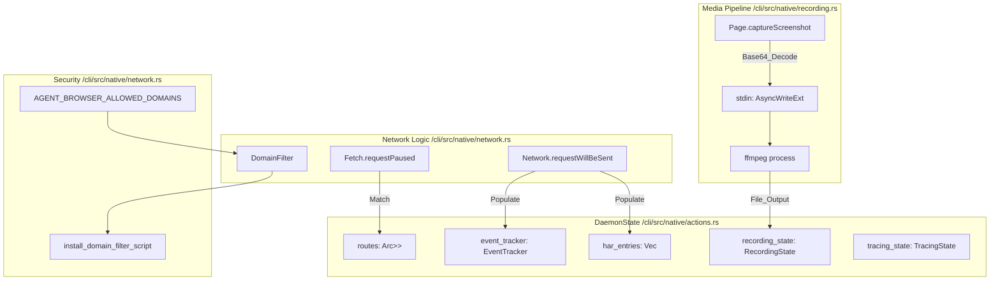
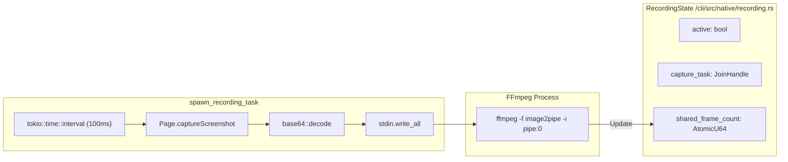
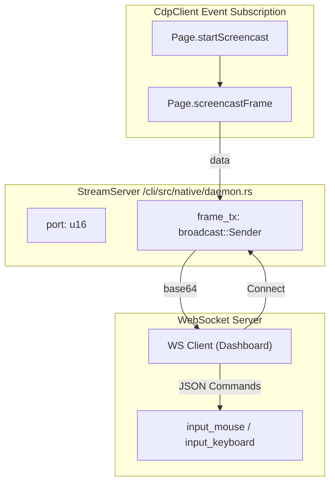

# 네트워크 제어 및 녹화

<details>
<summary>관련 소스 파일</summary>

다음 파일들은 이 위키 페이지를 생성하기 위한 컨텍스트로 사용되었습니다.

- [cli/src/native/auth.rs](cli/src/native/auth.rs)
- [cli/src/native/cdp/types.rs](cli/src/native/cdp/types.rs)
- [cli/src/native/network.rs](cli/src/native/network.rs)
- [cli/src/native/parity_tests.rs](cli/src/native/parity_tests.rs)
- [cli/src/native/recording.rs](cli/src/native/recording.rs)
- [docs/src/app/network/page.mdx](docs/src/app/network/page.mdx)
- [docs/src/app/recording/page.mdx](docs/src/app/recording/page.mdx)

</details>


이 페이지는 agent-browser의 네트워크 모니터링, interception, 녹화 기능을 문서화합니다. 이러한 기능은 네트워크 traffic 캡처, request/response 수정, 브라우저 활동을 video 또는 frame stream으로 녹화, performance profiling을 가능하게 합니다.

구현은 TypeScript high-level API와 native Rust daemon의 직접 CDP 통합 양쪽에 걸쳐 있습니다.

---

## 개요

네트워크 제어 및 녹화 기능은 여러 capability를 제공합니다.

| 기능 | 목적 | 출력 형식 | 구현 Entity |
|---------|---------|---------------|-----------------------|
| **Request Tracking** | 모든 HTTP request 모니터링 | `TrackedRequest[]` | `EventTracker` [cli/src/native/actions.rs:108-125]() |
| **Route Interception** | request/response mocking 또는 수정 | N/A (runtime) | `RouteEntry` [cli/src/native/actions.rs:94-98]() |
| **HAR Recording** | replay를 위한 network traffic 캡처 | `.har` 1.2 file | `HarEntry` [cli/src/native/actions.rs:66-92]() |
| **Screencast** | 실시간 frame streaming | base64 MJPEG | `StreamServer` [cli/src/native/daemon.rs:250-280]() |
| **Video Recording** | session을 video로 녹화 | `.webm` / `.mp4` | `RecordingState` [cli/src/native/recording.rs:15-35]() |
| **Profiling** | CDP performance data 캡처 | `.json` (Trace) | `TracingState` [cli/src/native/actions.rs:169-200]() |

Sources: [cli/src/native/actions.rs:66-125](), [cli/src/native/recording.rs:15-35](), [cli/src/native/parity_tests.rs:168-174]()

---

## 시스템 아키텍처

다음 다이어그램은 코드의 네트워크 및 녹화 entity가 기본 브라우저 protocol(CDP), 그리고 FFmpeg 같은 외부 process와 어떻게 상호작용하는지 보여줍니다.

Title: Network and Recording Code Entity Map


**구현 세부 사항:**
native Rust 구현의 `DaemonState` struct는 network interception과 media capture의 lifecycle을 관리합니다. 보안은 `DomainFilter`를 통해 적용되며, 이는 CDP-level navigation을 intercept하고 WebSocket과 EventSource를 차단하기 위한 script를 inject합니다 [cli/src/native/network.rs:161-214]().

Sources: [cli/src/native/actions.rs:169-200](), [cli/src/native/network.rs:80-126](), [cli/src/native/recording.rs:125-156]()

---

## Request Tracking

Request tracking은 page가 수행하는 모든 HTTP request에 대한 metadata를 캡처합니다. native daemon에서는 `EventTracker`가 이를 처리하며 `tracked_requests`에 저장합니다.

### 추적되는 데이터 구조
`TrackedRequest` struct는 다음을 캡처합니다.
- `url`, `method`, `headers` [cli/src/native/actions.rs:109-111]()
- `resource_type` 및 `requestId` [cli/src/native/actions.rs:114-115]()
- `post_data`(사용 가능한 경우) [cli/src/native/actions.rs:117-118]()
- `status` 및 `response_headers`(완료 시 채워짐) [cli/src/native/actions.rs:120-122]()

### CLI 사용법
```bash
# List tracked requests
agent-browser network requests

# Clear tracked requests
agent-browser network requests --clear
```

Sources: [cli/src/native/actions.rs:108-125](), [cli/src/native/parity_tests.rs:174-175](), [docs/src/app/network/page.mdx:33-41]()

---

## Route Interception

Route interception은 `Fetch` CDP domain을 사용해 request를 수정하거나 mocking할 수 있게 합니다.

### Route Entry
Route는 URL pattern과 선택적 `RouteResponse`를 포함하는 `RouteEntry`로 정의됩니다 [cli/src/native/actions.rs:94-98]().
`RouteResponse`는 다음을 지정할 수 있습니다.
- `status`(HTTP code) [cli/src/native/actions.rs:101]()
- `body`(mocking된 content) [cli/src/native/actions.rs:102]()
- `headers` [cli/src/native/actions.rs:104]()

### 구현 로직
`Fetch.requestPaused`를 통해 request가 일시 중지되면 daemon은 `routes` vector를 확인합니다. match가 발견되면 다음과 같이 처리합니다.
1. `abort`가 true이면 request를 실패 처리합니다.
2. `response`가 제공되면 mock data와 함께 `Fetch.fulfillRequest`를 호출합니다.
3. 그렇지 않으면 `Fetch.continueRequest`를 호출합니다.

Sources: [cli/src/native/actions.rs:94-106](), [cli/src/native/parity_tests.rs:172-173](), [docs/src/app/network/page.mdx:9-14]()

---

## HAR 1.2 Recording

daemon은 `Network` domain event를 구독하고 `HarEntry` object를 채워 native HAR 생성을 구현합니다.

### 데이터 캡처
`HarEntry` struct는 CDP `wallTime`을 사용해 고정밀 timing을 저장합니다 [cli/src/native/actions.rs:69](). protocol을 정규화하고(예: "h2"를 "HTTP/2.0"으로) [cli/src/native/actions.rs:80-81](), `Network.loadingFinished`에서 body size를 계산합니다 [cli/src/native/actions.rs:85-86]().

### 내보내기
`har_stop`이 호출되면 누적된 `har_entries`가 HAR 1.2 JSON 형식으로 serialize됩니다.

Sources: [cli/src/native/actions.rs:66-92](), [cli/src/native/parity_tests.rs:170-171](), [docs/src/app/network/page.mdx:61-67]()

---

## Video Recording

native daemon의 video recording은 screenshot을 외부 `ffmpeg` process로 pipe하여 구현됩니다.

Title: Video Recording Pipeline and State


### Recording Task
`spawn_recording_task` 함수는 lifecycle을 관리합니다.
1. `image2pipe` input으로 `ffmpeg`를 spawn합니다 [cli/src/native/recording.rs:82-121]().
2. capture interval을 설정합니다(기본값 100ms / 10 FPS) [cli/src/native/recording.rs:12-13]().
3. CDP를 통해 `Page.captureScreenshot`를 반복 호출합니다 [cli/src/native/recording.rs:164-166]().
4. base64 decode된 byte를 `ffmpeg` stdin에 직접 씁니다 [cli/src/native/recording.rs:186-188]().

### FFmpeg 설정
command는 `.webm`(`libvpx` 사용)과 `.mp4`(`libx264` 사용)를 모두 지원하도록 구성됩니다 [cli/src/native/recording.rs:107-111](). 넓은 호환성을 위해 `yuv420p` pixel format을 사용합니다 [cli/src/native/recording.rs:113]().

Sources: [cli/src/native/recording.rs:82-121](), [cli/src/native/recording.rs:125-209](), [docs/src/app/recording/page.mdx:7-14]()

---

## StreamServer를 통한 Screencasting

`StreamServer`는 주로 observability dashboard에서 사용하는 WebSocket 기반 실시간 브라우저 viewport streaming을 제공합니다.

Title: StreamServer Data Flow


### StreamServer Lifecycle
- **Start**: port에 bind하고 frame distribution을 위한 broadcast channel을 초기화합니다.
- **CDP Loop**: server는 `CdpClient`를 통해 `Page.startScreencast`를 trigger합니다.
- **Input Injection**: server는 interaction(mouse/keyboard)을 위한 수신 WebSocket message를 처리하고, CDP를 통해 browser로 relay합니다 [cli/src/native/parity_tests.rs:186-194]().

Sources: [cli/src/native/parity_tests.rs:143-144](), [cli/src/native/parity_tests.rs:186-194]()

---

## Profiling 및 Tracing

Performance profiling은 `Tracing` CDP domain을 사용해 Chrome DevTools 및 Perfetto와 호환되는 JSON 형식의 trace event를 수집합니다.

### Tracing State
`TracingState`는 trace chunk collection을 관리합니다. `trace_start`와 `trace_stop` command를 통해 toggle됩니다 [cli/src/native/parity_tests.rs:92-93]().

### Profiler
특정 V8 profiling(CPU/Heap)은 `profiler_start`와 `profiler_stop`을 통해 처리됩니다 [cli/src/native/parity_tests.rs:94-95](). 이러한 command는 `Runtime` 및 `Profiler` CDP domain과 상호작용하여 profile tree를 생성합니다.

Sources: [cli/src/native/parity_tests.rs:92-95](), [cli/src/native/actions.rs:169-200]()

---

## 네트워크 유틸리티

`network.rs` module은 일반적인 network state 변경을 위한 helper function을 제공합니다.

| Function | CDP Method | 설명 |
|----------|------------|-------------|
| `set_extra_headers` | `Network.setExtraHTTPHeaders` | session의 global header를 설정합니다 [cli/src/native/network.rs:6-26](). |
| `set_offline` | `Network.emulateNetworkConditions` | offline mode를 toggle합니다 [cli/src/native/network.rs:28-46](). |
| `set_content` | `Page.setDocumentContent` | frame의 HTML을 직접 설정합니다 [cli/src/native/network.rs:48-73](). |

### Domain Filtering
`DomainFilter` struct는 wildcard matching(예: `*.example.com`)을 구현합니다 [cli/src/native/network.rs:98-102](). 다음 방식으로 강제됩니다.
1. `Page.navigate` 중 URL 확인 [cli/src/native/network.rs:109-125]().
2. allowlist 밖에 있는 기존 page 정리 [cli/src/native/network.rs:136-159]().
3. `window.WebSocket`, `window.EventSource`, `navigator.sendBeacon`을 override하는 security script inject [cli/src/native/network.rs:172-214]().

Sources: [cli/src/native/network.rs:6-73](), [cli/src/native/network.rs:80-134](), [cli/src/native/network.rs:161-217]()
