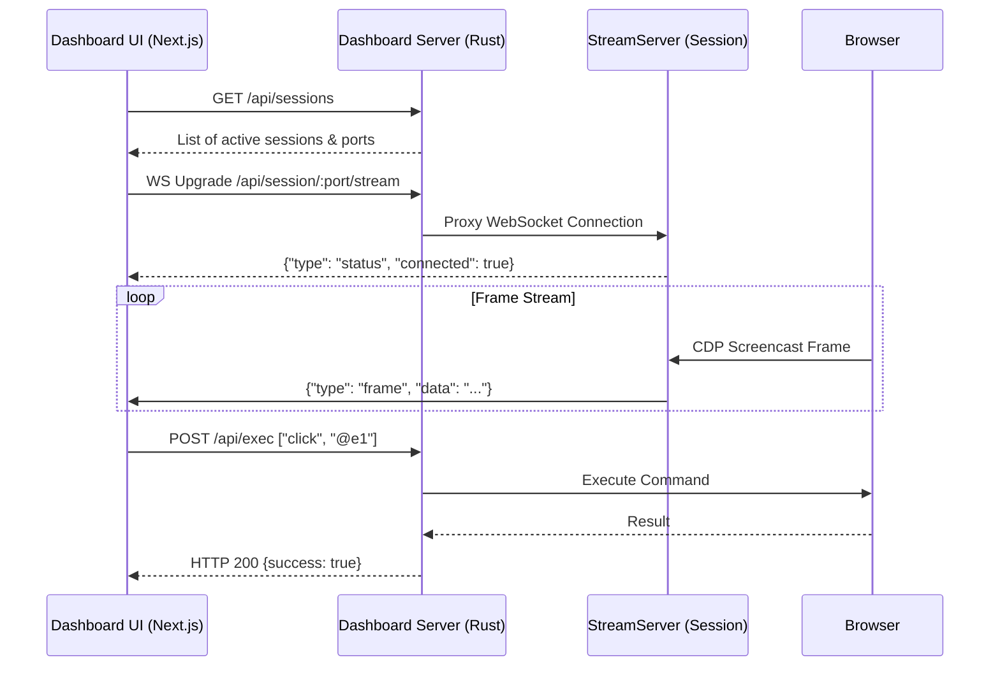

# 관측성 대시보드

<details>
<summary>관련 소스 파일</summary>

다음 파일들은 이 위키 페이지를 생성하기 위한 컨텍스트로 사용되었습니다.

- [AGENTS.md](AGENTS.md)
- [cli/src/native/stream/dashboard.rs](cli/src/native/stream/dashboard.rs)
- [docs/src/app/dashboard/page.mdx](docs/src/app/dashboard/page.mdx)
- [packages/dashboard/package.json](packages/dashboard/package.json)
- [packages/dashboard/src/components/session-tree.tsx](packages/dashboard/src/components/session-tree.tsx)
- [packages/dashboard/src/components/viewport.tsx](packages/dashboard/src/components/viewport.tsx)
- [packages/dashboard/src/lib/dashboard-routes.ts](packages/dashboard/src/lib/dashboard-routes.ts)
- [packages/dashboard/src/store/sessions.ts](packages/dashboard/src/store/sessions.ts)
- [packages/dashboard/src/store/stream.ts](packages/dashboard/src/store/stream.ts)
- [packages/dashboard/src/types.ts](packages/dashboard/src/types.ts)

</details>


Observability Dashboard는 브라우저 자동화 과정에 대한 실시간 visibility를 제공하도록 설계된 Next.js 기반 web interface입니다. 개발자와 AI agent가 통합 UI를 통해 session state를 모니터링하고, live screencast를 보고, network activity를 inspect하며, element interaction을 debug할 수 있게 합니다.

## 아키텍처 및 데이터 흐름

dashboard는 Next.js로 빌드되고 static asset(`output: 'export'`)으로 export되는 single-page application(SPA)입니다 [packages/dashboard/package.json:7-7](). 이러한 asset은 `rust-embed` crate를 사용해 Rust CLI binary에 직접 bundle됩니다 [docs/src/app/dashboard/page.mdx:125-126]().

dashboard server는 embedded file을 HTTP로 제공하고 WebSocket request를 `StreamServer` protocol로 upgrade하여 incoming connection을 처리합니다 [cli/src/native/stream/dashboard.rs:107-116](). 또한 proxy 역할을 하여, route를 내부 session port에 mapping함으로써 frontend가 단일 same-origin interface를 통해 여러 격리된 browser session과 통신할 수 있게 합니다 [cli/src/native/stream/dashboard.rs:13-19]().

### 시스템 Component Mapping

다음 다이어그램은 논리적 dashboard feature를 codebase에서 이를 구현하는 entity에 mapping합니다.

**Dashboard Entity Mapping**

```mermaid
graph TD
    subgraph "Frontend_packages_dashboard"
        ["Next.js Web UI"]
        ST["SessionTree (session-tree.tsx)"]
        VP["Viewport (viewport.tsx)"]
        AF["Activity Feed"]
        Store["Jotai Store (sessions.ts)"]
    end

    subgraph "Daemon_StreamServer_cli_src_native_stream"
        SS["StreamServer (mod.rs)"]
        WS["WebSocket Handler (websocket.rs)"]
        HTTP["HTTP Handler (http.rs)"]
        CHAT["Chat Proxy (chat.rs)"]
        DASH["Dashboard Server (dashboard.rs)"]
    end

    ["Next.js Web UI"] -- "HTTP GET /" --> HTTP
    ["Next.js Web UI"] -- "WS Upgrade /api/session/:port/stream" --> DASH
    DASH -- "Proxy WS" --> WS
    WS -- "Broadcast" --> SS
    ["Next.js Web UI"] -- "POST /api/chat" --> CHAT
    Store -- "GET /api/sessions" --> DASH
```
Sources: [cli/src/native/stream/dashboard.rs:13-19](), [packages/dashboard/src/store/sessions.ts:44-63](), [packages/dashboard/src/components/viewport.tsx:124-135](), [docs/src/app/dashboard/page.mdx:119-126]()

## Stream Protocol 및 Message Type

dashboard는 실시간 observability를 위해 특화된 WebSocket protocol을 사용합니다. data는 frontend의 `useStreamSync` hook을 통해 동기화됩니다 [packages/dashboard/src/store/stream.ts:76-98]().

| Message Type | 방향 | 목적 |
| :--- | :--- | :--- |
| `frame` | Server -> Client | base64 JPEG data와 viewport metadata를 broadcast합니다 [packages/dashboard/src/types.ts:1-13]() |
| `status` | Server -> Client | browser connection, screencast state, engine type을 보고합니다 [packages/dashboard/src/types.ts:15-23]() |
| `command` | Server -> Client | command 실행이 시작될 때 전송됩니다(예: `click`) [packages/dashboard/src/types.ts:25-31]() |
| `result` | Server -> Client | command가 완료될 때 success status와 duration을 포함해 전송됩니다 [packages/dashboard/src/types.ts:33-41]() |
| `console` | Server -> Client | level과 text가 포함된 browser console log를 proxy합니다 [packages/dashboard/src/types.ts:43-48]() |
| `tabs` | Server -> Client | 열린 tab 목록과 metadata를 동기화합니다 [packages/dashboard/src/types.ts:80-84]() |
| `url` | Server -> Client | dashboard address bar의 active URL을 update합니다 [packages/dashboard/src/types.ts:50-54]() |
| `page_error`| Server -> Client | page에서 발생한 uncaught JavaScript exception을 보고합니다 [packages/dashboard/src/types.ts:56-62]() |

Sources: [packages/dashboard/src/types.ts:1-95](), [packages/dashboard/src/store/stream.ts:151-219](), [docs/src/app/dashboard/page.mdx:65-115]()

## 주요 Dashboard 기능

### 1. Viewport 및 Screencasting
`Viewport` component는 실시간 JPEG frame을 HTML5 canvas에 render합니다 [packages/dashboard/src/components/viewport.tsx:137-143]().
*   **Interaction**: 이 component는 mouse event(click, move, wheel)와 keyboard event를 캡처하고, 이를 WebSocket을 통해 `sendInputAtom`으로 전송되는 CDP-compatible input message로 변환합니다 [packages/dashboard/src/components/viewport.tsx:48-80](), [packages/dashboard/src/components/viewport.tsx:135-135]().
*   **Control**: 사용자는 viewport toolbar에서 직접 navigation, device emulation(예: iPhone 15), color scheme toggle을 trigger할 수 있습니다 [packages/dashboard/src/components/viewport.tsx:90-102](), [packages/dashboard/src/components/viewport.tsx:192-211]().

### 2. Session Tree 및 관리
`SessionTree`는 모든 active browser session과 그 tab의 hierarchical view를 제공합니다 [packages/dashboard/src/components/session-tree.tsx:179-207]().
*   **Discovery**: `useSessionsSync` hook은 `/api/sessions` endpoint를 polling하여 local 및 remote session의 정확한 목록을 유지합니다 [packages/dashboard/src/store/sessions.ts:213-230]().
*   **Actions**: 특정 engine(Chrome, Lightpanda) 또는 cloud provider(Browserbase, AgentCore 등)로 새 session을 생성하고, 기존 session을 close하거나 kill하는 기능을 지원합니다 [packages/dashboard/src/store/sessions.ts:86-109](), [packages/dashboard/src/store/sessions.ts:132-150]().

### 3. AI Chat Panel
통합 AI chat을 통해 사용자는 natural language로 browser session과 interaction할 수 있습니다 [docs/src/app/dashboard/page.mdx:127-130]().
*   **Proxying**: Rust server는 chat request를 Vercel AI Gateway로 proxy합니다 [cli/src/native/stream/dashboard.rs:9-9]().
*   **Integration**: dashboard는 message streaming과 state 처리를 위해 `@ai-sdk/react`를 사용합니다 [packages/dashboard/package.json:11-13]().

### 4. Activity 및 Console Panel
*   **Activity Feed**: `command`와 `result` event의 chronological stream을 표시하여 사용자가 모든 agent action의 parameter와 output을 inspect할 수 있게 합니다 [packages/dashboard/src/store/stream.ts:168-173]().
*   **Console Panel**: browser의 JavaScript environment에서 온 `console` 및 `page_error` message를 severity별로 filtering하여 aggregate합니다 [packages/dashboard/src/store/stream.ts:175-187]().

## 연결 및 상호작용 흐름

**Dashboard Communication Sequence**


Sources: [cli/src/native/stream/dashboard.rs:197-220](), [packages/dashboard/src/store/sessions.ts:101-106](), [packages/dashboard/src/store/stream.ts:123-130](), [docs/src/app/dashboard/page.mdx:125-126]()

## 기술 구현 세부 사항

*   **Same-Origin Proxy**: dashboard server는 cross-site hijacking을 방지하기 위해 WebSocket 및 HTTP request가 같은 host에서 originate하는지 validate합니다 [cli/src/native/stream/dashboard.rs:179-194]().
*   **Route Handling**: Rust server는 `/api/session/<port>/<endpoint>` 형식의 session proxy route를 parse하여 traffic을 올바른 local session으로 route합니다 [cli/src/native/stream/dashboard.rs:197-222]().
*   **State Management**: atomic state management에 `jotai`를 사용하며, `sessionsAtom`은 polled, pending, closing session state를 merge합니다 [packages/dashboard/src/store/sessions.ts:44-63]().
*   **Environment Configuration**: dashboard와 chat feature는 `AI_GATEWAY_API_KEY`, `AI_GATEWAY_URL`, `AI_GATEWAY_MODEL`을 따릅니다 [docs/src/app/dashboard/page.mdx:131-145]().

Sources: [cli/src/native/stream/dashboard.rs:13-50](), [packages/dashboard/src/store/sessions.ts:30-40](), [docs/src/app/dashboard/page.mdx:18-32]()
