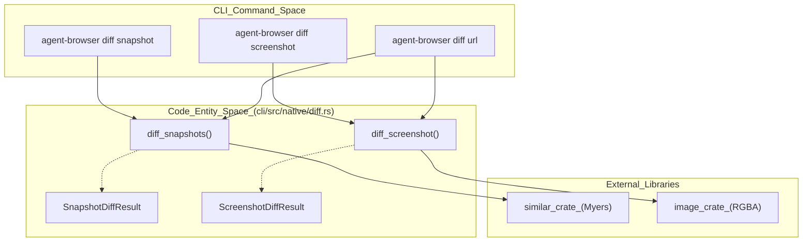
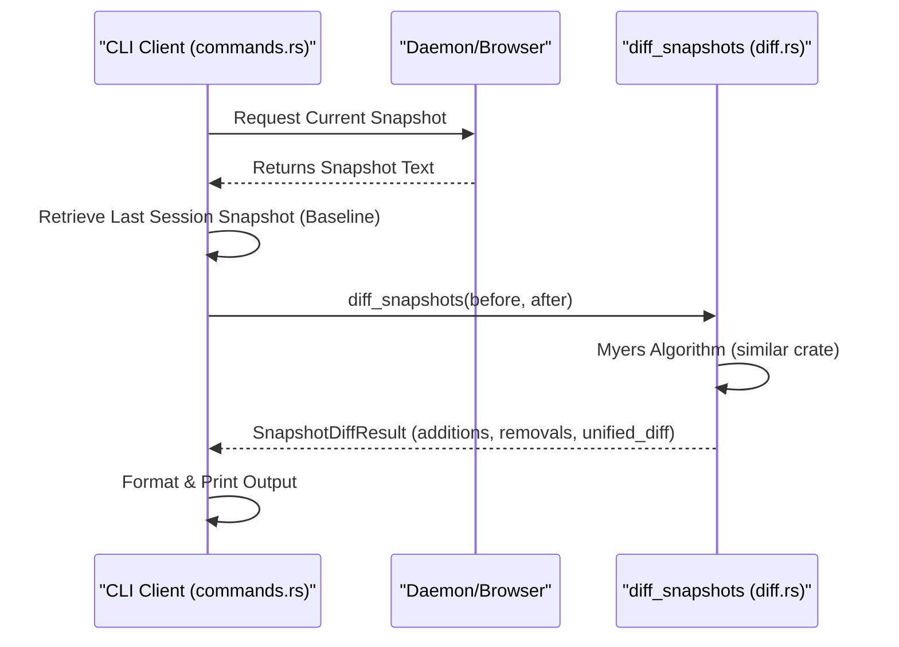

# Diffing 및 Visual Regression

<details>
<summary>관련 소스 파일</summary>

다음 파일들은 이 위키 페이지를 생성하기 위한 컨텍스트로 사용되었습니다.

- [cli/src/native/diff.rs](cli/src/native/diff.rs)
- [cli/src/native/element.rs](cli/src/native/element.rs)
- [cli/src/native/interaction.rs](cli/src/native/interaction.rs)
- [cli/src/native/screenshot.rs](cli/src/native/screenshot.rs)
- [cli/src/native/snapshot.rs](cli/src/native/snapshot.rs)
- [docs/src/app/diffing/page.mdx](docs/src/app/diffing/page.mdx)
- [docs/src/app/ios/page.mdx](docs/src/app/ios/page.mdx)
- [docs/src/app/sessions/page.mdx](docs/src/app/sessions/page.mdx)

</details>


`agent-browser`의 diffing subsystem은 시간에 따른 page state 또는 서로 다른 URL 간 page state를 비교하기 위한 도구를 제공합니다. accessibility tree snapshot을 통한 구조적 비교, pixel-level screenshot matching을 통한 visual 비교, 그리고 environment parity check를 위한 sequential navigation을 지원합니다.

## Diff 메커니즘 개요

시스템은 세 가지 주요 diffing 전략을 구현합니다.

1.  **Snapshot Diffing**: Myers diff algorithm을 사용한 accessibility tree의 text 기반 비교입니다. 이는 AI agent가 click 또는 form fill 같은 interaction이 예상된 DOM/accessibility state change를 만들었는지 검증하는 데 사용하는 주요 방법입니다 [docs/src/app/diffing/page.mdx:23-38]().
2.  **Screenshot Diffing**: 설정 가능한 color distance threshold를 사용해 PNG buffer를 pixel-by-pixel로 비교합니다 [cli/src/native/diff.rs:21-25]().
3.  **URL Diffing**: snapshot 비교와 선택적 screenshot 비교를 모두 수행하기 위해 두 개의 distinct URL을 순서대로 navigate하는 high-level orchestration입니다 [docs/src/app/diffing/page.mdx:100-115]().

### Component Architecture: Diff Subsystem

다음 다이어그램은 CLI command가 native diff module의 기반 Rust 구현에 어떻게 mapping되는지 보여줍니다.

**Diff Entity Mapping**

Sources: [cli/src/native/diff.rs:1-148](), [docs/src/app/diffing/page.mdx:9-21]()

---

## Snapshot Diffing

Snapshot diffing은 accessibility tree의 text representation을 대상으로 동작합니다. 기본적으로 `diff snapshot`은 현재 page state를 active session에 저장된 가장 최근 snapshot과 비교합니다 [docs/src/app/diffing/page.mdx:28-32]().

### 구현 세부 사항
핵심 로직은 `diff_snapshots`에 있습니다 [cli/src/native/diff.rs:103](). 이 함수는 `similar` crate를 사용해 unified diff를 생성합니다 [cli/src/native/diff.rs:103-119]().

*   **Fast Path**: `before`와 `after` string이 동일하면 함수는 diff engine을 호출하지 않고 즉시 반환하여 retry/loop workload에서 overhead를 피합니다 [cli/src/native/diff.rs:108-117]().
*   **Algorithm**: `TextDiff::from_lines`를 사용해 change를 iterate하고 이를 `Insert`, `Delete`, `Equal`로 categorize합니다 [cli/src/native/diff.rs:119-131]().
*   **Output**: 3 line의 context radius가 포함된 unified diff string을 담은 `SnapshotDiffResult`를 생성합니다 [cli/src/native/diff.rs:135-147]().

### Data Flow: Snapshot Diff

Sources: [cli/src/native/diff.rs:103-148](), [docs/src/app/diffing/page.mdx:23-38]()

---

## Visual Regression (Screenshot Diffing)

Screenshot diffing은 baseline image와 현재 viewport(또는 특정 element) 사이의 pixel-level 비교를 수행합니다 [docs/src/app/diffing/page.mdx:64-77]().

### Pixel 비교 로직
`diff_screenshot` 함수는 두 image buffer를 처리합니다 [cli/src/native/diff.rs:21-25]().

1.  **Dimension Validation**: width 또는 height가 다르면 `dimension_mismatch`가 채워지고 100% mismatch인 `ScreenshotDiffResult`를 반환합니다 [cli/src/native/diff.rs:34-46]().
2.  **Color Distance**: 각 pixel에 대해 RGBA 값 사이의 Euclidean distance를 계산합니다 [cli/src/native/diff.rs:57-63]().
3.  **Thresholding**: distance가 `threshold * 255.0 * sqrt(3)`으로 계산되는 `max_color_distance`를 초과하면 해당 pixel은 "different"로 표시됩니다 [cli/src/native/diff.rs:51-65]().
4.  **Diff Image Generation**: 
    *   **Changed Pixels**: 밝은 빨간색 `[255, 0, 0, 255]`으로 highlight됩니다 [cli/src/native/diff.rs:67]().
    *   **Unchanged Pixels**: context를 제공하기 위해 원래 grayscale 값의 30%로 dim 처리됩니다 [cli/src/native/diff.rs:69-71]().

### Screenshot Diff Parameter
| Parameter | Type | 설명 |
| :--- | :--- | :--- |
| `baseline` | `&[u8]` | 기준 image byte(PNG/JPEG) [cli/src/native/diff.rs:22]() |
| `current` | `&[u8]` | 현재 page/element screenshot byte [cli/src/native/diff.rs:23]() |
| `threshold` | `f64` | color distance 허용 오차(0.0에서 1.0). 기본값: 0.1 [cli/src/native/diff.rs:24](), [docs/src/app/diffing/page.mdx:88]() |

Sources: [cli/src/native/diff.rs:21-100](), [docs/src/app/diffing/page.mdx:81-92]()

---

## URL Diffing

`diff url <url1> <url2>` command는 각 URL로 순서대로 navigate하여 서로 다른 두 live page를 비교합니다 [docs/src/app/diffing/page.mdx:100-115]().

1.  **Navigate to URL 1**: baseline snapshot을 캡처합니다(`--screenshot`이 제공된 경우 screenshot도 캡처).
2.  **Navigate to URL 2**: current snapshot과 screenshot을 캡처합니다.
3.  **Execute Diff**: 수집된 data에 대해 `diff_snapshots` 및/또는 `diff_screenshot`을 실행합니다.

이 command는 environment parity(예: staging vs production)를 검증하는 데 사용됩니다 [docs/src/app/diffing/page.mdx:169-175]().

### Command Option
*   `--screenshot`: visual pixel 비교를 수행합니다 [docs/src/app/diffing/page.mdx:126]().
*   `--wait-until`: navigation wait strategy(`load`, `domcontentloaded`, `networkidle`) [docs/src/app/diffing/page.mdx:128]().
*   `--selector`: snapshot과 screenshot 범위를 특정 element로 제한합니다 [docs/src/app/diffing/page.mdx:129]().

Sources: [docs/src/app/diffing/page.mdx:100-133]()

---

## Diff Result의 기술 요약

native module은 두 diff 유형 모두에 대해 structured data를 반환합니다.

### Result Structure
[cli/src/native/diff.rs:4-19]()
```rust
pub struct ScreenshotDiffResult {
    pub total_pixels: u64,
    pub different_pixels: u64,
    pub mismatch_percentage: f64,
    pub matched: bool,
    pub diff_image: Option<Vec<u8>>,
    pub dimension_mismatch: Option<Value>,
}

pub struct SnapshotDiffResult {
    pub diff: String, // Unified diff text
    pub additions: usize,
    pub removals: usize,
    pub unchanged: usize,
    pub changed: bool,
}
```

### Legacy Compatibility
JSON output을 기대하는 consumer를 위해 `diff_text`는 boolean flag와 change count가 포함된 `serde_json::Value`를 반환하는 wrapper를 제공합니다 [cli/src/native/diff.rs:151-161]().

Sources: [cli/src/native/diff.rs:4-19](), [cli/src/native/diff.rs:151-161]()
