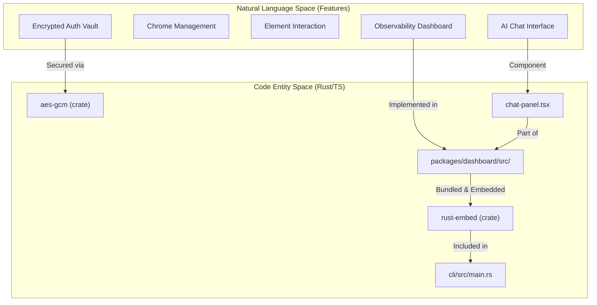
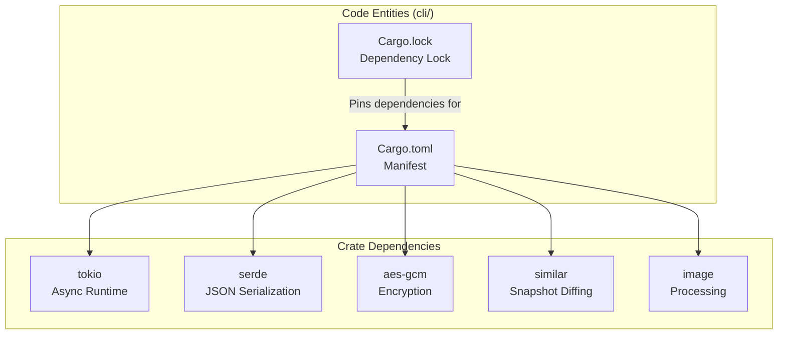

# 개발

<details>
<summary>관련 소스 파일</summary>

다음 파일들은 이 위키 페이지를 생성하기 위한 컨텍스트로 사용되었습니다.

- [.github/workflows/ci.yml](.github/workflows/ci.yml)
- [.github/workflows/release.yml](.github/workflows/release.yml)
- [.husky/pre-commit](.husky/pre-commit)
- [.node-version](.node-version)
- [docker/Dockerfile.build](docker/Dockerfile.build)
- [docker/docker-compose.yml](docker/docker-compose.yml)
- [docs/src/app/installation/page.mdx](docs/src/app/installation/page.mdx)
- [packages/dashboard/src/components/chat-panel.tsx](packages/dashboard/src/components/chat-panel.tsx)
- [pnpm-workspace.yaml](pnpm-workspace.yaml)
- [scripts/build-all-platforms.sh](scripts/build-all-platforms.sh)
- [scripts/check-version-sync.js](scripts/check-version-sync.js)
- [scripts/sync-version.js](scripts/sync-version.js)

</details>


이 섹션은 `agent-browser`에 기여하거나 내부 구조를 이해하려는 개발자를 위한 지침을 제공합니다. 개발 환경 설정, build process, testing workflow, 그리고 개발 작업에 영향을 주는 주요 architectural decision을 다룹니다.

특정 subsystem에 대한 자세한 정보:
- **Build System**: TypeScript compilation, `cargo-zigbuild`를 통한 Rust cross-compilation, binary packaging에 대한 세부 사항. [Build System](#8.1)을 참조하세요.
- **CI/CD Pipeline**: GitHub Actions workflow(`ci.yml`, `release.yml`), version synchronization, release process에 대한 문서. [CI/CD Pipeline](#8.2)을 참조하세요.
- **Project Structure**: `cli/`, `packages/dashboard/`를 포함한 repository organization과 TypeScript 및 Rust codebase 간 관계의 개요. [Project Structure](#8.3)을 참조하세요.
- **Testing and Benchmarks**: `e2e_tests.rs`와 performance suite를 포함한 testing infrastructure에 대한 문서. [Testing and Benchmarks](#8.4)를 참조하세요.
- **Examples and Integrations**: Next.js demo와 web application을 위한 integration pattern에 대한 문서. [Examples and Integrations](#8.5)를 참조하세요.

## 사전 요구 사항

개발에는 시스템에 다음 도구가 설치되어 있어야 합니다.

| 도구 | 목적 | 최소 버전 |
|------|---------|-----------------|
| **Node.js** | Dashboard compilation 및 scripting | 24.x |
| **pnpm** | Package management | 11.x |
| **Rust** | CLI binary compilation | 1.88+ |
| **cargo** | Rust build system | (Rust에 bundled) |
| **ziglang** | Cross-platform compilation | 0.13.0 (zigbuild용) |

**Sources:** [.node-version:1](), [docs/src/app/installation/page.mdx:46-46](), [docker/Dockerfile.build:2-25](), [.github/workflows/release.yml:155-155]()

## 개발 Quick Start

### 초기 설정

repository를 clone하고 dependency를 설치합니다.

```bash
git clone https://github.com/vercel-labs/agent-browser.git
cd agent-browser
pnpm install
```

이 project는 root, dashboard, documentation package를 관리하기 위해 **pnpm workspace**를 사용합니다 [pnpm-workspace.yaml:1-4]().

### Source에서 Build

```bash
# Build dashboard (required for embedding in binary)
pnpm --filter dashboard build

# Build native Rust CLI for current platform
cd cli && cargo build --release
```

**Sources:** [docs/src/app/installation/page.mdx:48-58](), [.github/workflows/release.yml:130-131](), [pnpm-workspace.yaml:1-4]()

## 개발 Workflow

개발 cycle은 multi-stage CI pipeline으로 검증됩니다. observability dashboard는 Next.js application이며, build된 뒤 zero-dependency distribution을 제공하기 위해 Rust binary에 직접 embedded됩니다 [cli/Cargo.toml:37](), [packages/dashboard/src/components/chat-panel.tsx:1-5]().

### Code-to-Binary 관계



**Sources:** [cli/Cargo.toml:27-37](), [packages/dashboard/src/components/chat-panel.tsx:1-15](), [docs/src/app/installation/page.mdx:98-100]()

## Technology Stack

### Rust CLI 및 Native Daemon
core logic은 performance와 작은 footprint를 위해 Rust로 구현됩니다. CLI는 async runtime에 `tokio`를, protocol serialization에 `serde`를 사용합니다 [cli/Cargo.toml:13-20]().



**Sources:** [cli/Cargo.toml:13-37](), [docs/src/app/installation/page.mdx:12-13]()

## Build System 개요

### Multi-Platform 배포
`agent-browser`는 GitHub Actions를 통해 여러 platform/architecture 조합의 native binary를 배포합니다. 여기에는 Docker environment를 위한 `musl` target과 `mingw-w64`를 통한 Windows 지원이 포함됩니다 [.github/workflows/release.yml:71-116]().

| Platform | Target Triple | Binary Name |
|----------|---------------|-------------|
| Linux x64 | `x86_64-unknown-linux-gnu` | `agent-browser-linux-x64` |
| Linux ARM64 | `aarch64-unknown-linux-gnu` | `agent-browser-linux-arm64` |
| Linux musl x64 | `x86_64-unknown-linux-musl` | `agent-browser-linux-musl-x64` |
| Windows x64 | `x86_64-pc-windows-gnu` | `agent-browser-win32-x64.exe` |
| macOS ARM64 | `aarch64-apple-darwin` | `agent-browser-darwin-arm64` |

**Sources:** [.github/workflows/release.yml:71-116](), [.github/workflows/ci.yml:191-207](), [scripts/build-all-platforms.sh:60-79]()

### 설치 및 Diagnostics
CLI에는 "Chrome for Testing"을 직접 download하는 `install` command가 포함되어 있습니다 [docs/src/app/installation/page.mdx:9](). 개발과 troubleshooting을 위해 `doctor` command는 environment, configuration, connectivity에 대한 one-shot diagnosis를 제공하며, common issue를 repair하는 선택적 `--fix` flag도 제공합니다 [docs/src/app/installation/page.mdx:82-87]().

## Testing Strategy

### Test Suite
- **Rust Unit & Integration Tests**: `cargo test`로 실행되는 빠른 test [.github/workflows/ci.yml:49-51]().
- **End-to-End Tests**: 실제 Chrome instance를 launch하고 daemon lifecycle(open, snapshot, close)을 exercise하는 native E2E test입니다. port conflict를 방지하기 위해 CI에서는 `--test-threads=1`로 실행됩니다 [.github/workflows/ci.yml:106-132]().
- **Cross-Platform Validation**: non-Unix system에서 binary compatibility와 daemon liveness를 보장하기 위한 Windows integration 전용 workflow [.github/workflows/ci.yml:133-189]().

**Sources:** [.github/workflows/ci.yml:49-51](), [.github/workflows/ci.yml:130-132](), [.github/workflows/ci.yml:173-188]()

## Version Management

project가 여러 ecosystem(npm/Node.js 및 Cargo/Rust)에 걸쳐 있기 때문에 version synchronization은 중요합니다.

### Synchronization Flow
1. **Source of Truth**: root `package.json` version field [scripts/sync-version.js:17-21]().
2. **Sync Script**: `scripts/sync-version.js`는 이 version을 `cli/Cargo.toml`과 `packages/dashboard/package.json`에 propagate합니다 [scripts/sync-version.js:25-57]().
3. **Pre-commit Automation**: husky hook이 sync script를 실행하고 update된 Cargo file을 commit에 add합니다 [.husky/pre-commit:1-2]().
4. **CI Enforcement**: `scripts/check-version-sync.js`는 모든 version이 일치하는지 validate하고, drift가 감지되면 build를 fail시킵니다 [scripts/check-version-sync.js:34-49](), [.github/workflows/ci.yml:11-24]().

**Sources:** [scripts/sync-version.js:1-81](), [scripts/check-version-sync.js:1-52](), [.husky/pre-commit:1-3](), [.github/workflows/ci.yml:11-24]()
