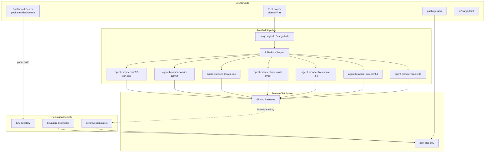
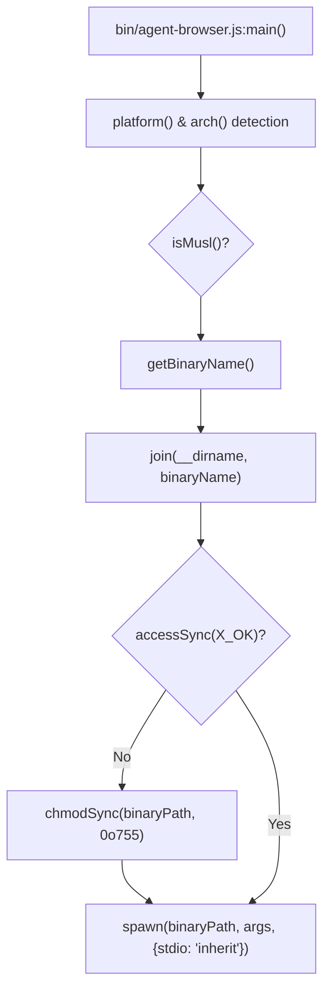

# Build System

관련 소스 파일

다음 파일들은 이 위키 페이지를 생성하기 위한 컨텍스트로 사용되었습니다.

- [.gitignore](.gitignore)
- [bin/agent-browser.js](bin/agent-browser.js)
- [cli/build.rs](cli/build.rs)
- [cli/src/upgrade.rs](cli/src/upgrade.rs)
- [docker/Dockerfile.build](docker/Dockerfile.build)
- [docker/docker-compose.yml](docker/docker-compose.yml)
- [pnpm-lock.yaml](pnpm-lock.yaml)
- [scripts/build-all-platforms.sh](scripts/build-all-platforms.sh)
- [scripts/postinstall.js](scripts/postinstall.js)

이 문서는 Rust 기반 CLI와 TypeScript 기반 dashboard로 구성된 dual-language codebase를 관리하는 `agent-browser`의 build system을 설명합니다. compilation pipeline, multi-platform distribution을 위한 cross-compilation 전략, automated installation logic을 자세히 다룹니다.

---

## 개요

build system은 단일 npm distribution으로 package되는 두 가지 distinct compilation pipeline을 처리합니다.

1.  **Rust Pipeline**: Cargo를 사용해 고성능 CLI와 native daemon을 compile합니다. `cargo-zigbuild` 또는 native toolchain을 사용한 7개 target platform의 cross-compilation을 지원합니다. [scripts/build-all-platforms.sh:60-80](), [docker/docker-compose.yml:17-39]()
2.  **TypeScript Pipeline**: `packages/dashboard`에 있는 Next.js 기반 dashboard를 compile합니다. [cli/build.rs:9-19]()
3.  **Distribution**: 이러한 artifact를 npm package로 결합하며, `postinstall.js` script가 GitHub Releases에서 platform-specific native binary를 가져오는 작업을 처리합니다. [scripts/postinstall.js:1-10]()

**Sources:** [scripts/postinstall.js:1-10](), [scripts/build-all-platforms.sh:1-86](), [docker/docker-compose.yml:1-164]()

---

## Build Pipeline Architecture

다음 다이어그램은 Rust compilation과 Node.js packaging 사이의 integration을 강조하면서 source code에서 multi-platform distribution까지의 흐름을 보여줍니다.

### Build and Distribution Flow

**Sources:** [scripts/postinstall.js:34-49](), [bin/agent-browser.js:31-66](), [scripts/build-all-platforms.sh:60-80]()

---

## Rust Cross-Compilation

core CLI는 Rust로 작성되어 있으며, 다양한 operating system과 architecture에서 native binary로 사용할 수 있어야 합니다.

### Target Platform
system은 cloud environment(Alpine/musl 포함), developer workstation, Windows 전반의 compatibility를 보장하기 위해 7개의 primary configuration을 target으로 합니다. [scripts/build-all-platforms.sh:60-80]()

| Platform | Target Triple | Binary Name |
| :--- | :--- | :--- |
| Linux x64 | `x86_64-unknown-linux-gnu` | `agent-browser-linux-x64` |
| Linux ARM64 | `aarch64-unknown-linux-gnu` | `agent-browser-linux-arm64` |
| Linux musl x64 | `x86_64-unknown-linux-musl` | `agent-browser-linux-musl-x64` |
| Linux musl ARM64 | `aarch64-unknown-linux-musl` | `agent-browser-linux-musl-arm64` |
| macOS x64 | `x86_64-apple-darwin` | `agent-browser-darwin-x64` |
| macOS ARM64 | `aarch64-apple-darwin` | `agent-browser-darwin-arm64` |
| Windows x64 | `x86_64-pc-windows-gnu` | `agent-browser-win32-x64.exe` |

**Sources:** [scripts/build-all-platforms.sh:60-80](), [bin/agent-browser.js:31-66]()

### Build Process 및 Tool
project는 cross-platform requirement를 처리하기 위해 `cargo-zigbuild`와 specialized linker를 사용합니다.
*   **Dockerized Build**: `build-all-platforms.sh` script는 `agent-browser-builder` Docker image를 사용해 모든 target에 대해 `cargo zigbuild`를 실행합니다. [scripts/build-all-platforms.sh:24-57]()
*   **CDP Protocol Generation**: custom `cli/build.rs` script는 build 중 Chrome DevTools Protocol JSON file(`browser_protocol.json`, `js_protocol.json`)에서 Rust type을 생성합니다. [cli/build.rs:21-88]()
*   **Dashboard Embedding**: `build.rs`의 `ensure_dashboard_dir` function은 dashboard가 아직 build되지 않은 경우 `packages/dashboard/out`에 placeholder `index.html`이 존재하도록 보장하여 `rust-embed` 실패를 방지합니다. [cli/build.rs:9-19]()
*   **Target Normalization**: `docker-compose.yml`에는 older Linux distribution과의 compatibility를 보장하기 위해 다양한 target string을 특정 glibc version(예: `.2.28`)으로 map하는 logic이 포함되어 있습니다. [docker/docker-compose.yml:87-149]()

**Sources:** [scripts/build-all-platforms.sh:1-86](), [cli/build.rs:1-88](), [docker/docker-compose.yml:1-164]()

---

## Binary Distribution Mechanism

`agent-browser`는 npm package가 사용자의 system에 맞는 native binary download를 trigger하는 hybrid distribution model을 사용합니다.

### Post-Installation Logic (`postinstall.js`)
사용자가 `npm install agent-browser`를 실행하면 `postinstall.js` script가 실행됩니다.
1.  **Platform Detection**: OS, architecture, 그리고 `isMusl()`을 통해 system이 `musl` libc를 사용하는지 식별합니다. [scripts/postinstall.js:24-36]()
2.  **Download**: GitHub Release asset(예: `v0.25.4/agent-browser-linux-x64`)을 가리키는 `DOWNLOAD_URL`을 구성하고 response를 `bin/`으로 pipe합니다. [scripts/postinstall.js:47-81]()
3.  **Permissions**: Unix-like system에서 binary가 executable이 되도록 `chmodSync(binaryPath, 0o755)`를 적용합니다. [scripts/postinstall.js:137-140]()
4.  **Install Method Marker**: `npm_config_user_agent`에서 파생된 `.install-method` file(예: "pnpm", "npm")을 작성하여 `cli/src/upgrade.rs`의 `run_upgrade` function이 어떤 package manager를 사용할지 알 수 있게 합니다. [scripts/postinstall.js:91-106](), [cli/src/upgrade.rs:35-44]()
5.  **Chrome Detection**: `findSystemChrome()`을 통해 Chrome/Chromium의 system installation을 찾으려 시도하고, `agent-browser install`을 통한 manual installation이 필요한 경우 사용자에게 알립니다. [scripts/postinstall.js:160-215]()

**Sources:** [scripts/postinstall.js:1-158](), [scripts/postinstall.js:160-215](), [cli/src/upgrade.rs:35-44]()

---

## Runtime Binary Selection

native binary가 globally patched되지 않은 경우, `bin/agent-browser.js` Node.js wrapper가 fallback entry point 역할을 합니다.

### Binary Selection Logic

`bin/agent-browser.js`의 `getBinaryName` function은 Node.js environment variable을 project의 binary naming convention(예: `agent-browser-darwin-arm64`)으로 map합니다. [bin/agent-browser.js:31-66]()

**Sources:** [bin/agent-browser.js:11-118]()

---

## Version Synchronization 및 Upgrade

build system은 valid distribution과 runtime behavior를 보장하기 위해 여러 configuration file 간 parity에 의존합니다.

*   **Version Check**: CI pipeline과 developer는 script를 사용해 `package.json`, `cli/Cargo.toml`, `packages/dashboard/package.json`이 완전히 sync되어 있는지 verify합니다.
*   **CLI Upgrades**: `cli/src/upgrade.rs` module은 `agent-browser upgrade` command를 처리합니다. `.install-method` marker를 읽거나 environment를 probing하여 `InstallMethod`(예: `Npm`, `Pnpm`, `Homebrew`, `Cargo`)를 detect합니다. [cli/src/upgrade.rs:8-16](), [cli/src/upgrade.rs:46-121]()
*   **Automated Commands**: detect된 method에 따라 적절한 shell command(예: `npm install -g agent-browser@latest`)를 실행해 package를 update합니다. [cli/src/upgrade.rs:142-185]()

**Sources:** [cli/src/upgrade.rs:1-240](), [scripts/postinstall.js:91-106]()
