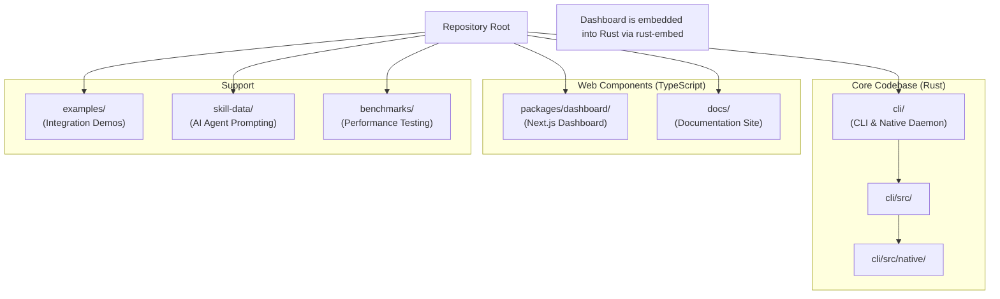
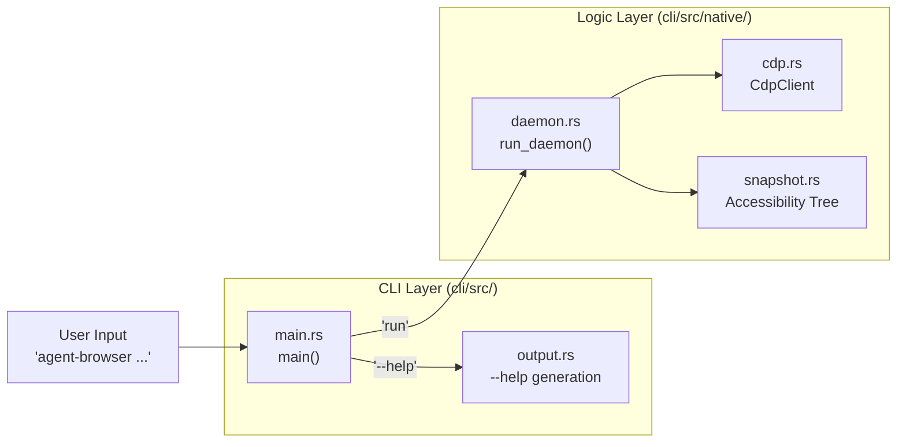
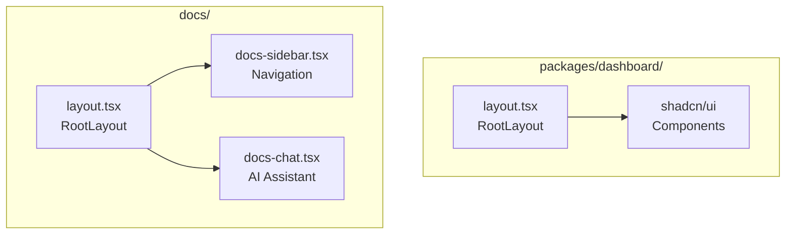

# Project Structure

관련 소스 파일

다음 파일들은 이 위키 페이지를 생성하기 위한 컨텍스트로 사용되었습니다.

- [AGENTS.md](AGENTS.md)
- [cli/Cargo.lock](cli/Cargo.lock)
- [cli/Cargo.toml](cli/Cargo.toml)
- [docs/package.json](docs/package.json)
- [docs/pnpm-lock.yaml](docs/pnpm-lock.yaml)
- [docs/src/app/layout.tsx](docs/src/app/layout.tsx)
- [packages/dashboard/package.json](packages/dashboard/package.json)

이 문서는 `agent-browser` repository organization에 대한 기술적 개요를 제공하며, TypeScript와 Rust codebase 간 관계, 주요 directory, CLI와 embedded component의 distribution mechanism을 설명합니다.

---

## Repository Layout

`agent-browser` repository는 `pnpm` workspace로 관리되는 hybrid monorepo입니다 [docs/pnpm-lock.yaml:7-9](). core logic은 high performance와 낮은 memory footprint를 위해 Rust로 구현되어 있으며, observability dashboard와 documentation은 TypeScript 및 Next.js로 build됩니다.

Title: Repository Directory Map

**Sources:** [cli/Cargo.toml:1-38](), [docs/package.json:1-49](), [AGENTS.md:90-93]()

---

## 주요 Directory

### Rust CLI 및 Daemon (`cli/`)

`cli/` directory에는 주요 Rust 구현이 포함되어 있습니다. JSON protocol handling에는 `serde`를 사용하고, asynchronous I/O 및 process management에는 `tokio`를 사용합니다 [cli/Cargo.toml:14-19]().

| Directory/File | 목적 |
|:---|:---|
| `cli/src/` | CLI entry point와 command parsing을 위한 source code. |
| `cli/src/native/` | core browser automation logic(daemon, actions, browser, CDP client, snapshot, state) [AGENTS.md:91-92](). |
| `cli/Cargo.toml` | state encryption을 위한 `aes-gcm`, WebSocket communication을 위한 `tokio-tungstenite`를 포함한 Rust dependency를 정의합니다 [cli/Cargo.toml:20-27](). |
| `cli/Cargo.lock` | reproducible build를 위한 locked dependency tree [cli/Cargo.lock:47-77](). |

**Sources:** [cli/Cargo.toml:1-38](), [cli/Cargo.lock:47-77](), [AGENTS.md:90-93]()

### Dashboard 및 Docs (`packages/dashboard/`, `docs/`)

repository에는 두 개의 주요 web application이 포함되어 있습니다.

*   **Dashboard**: `packages/dashboard/`에 위치한 이 Next.js app은 browser session의 live view를 제공합니다 [packages/dashboard/package.json:1-38](). state management에는 `shadcn/ui` component와 `jotai`를 사용합니다 [packages/dashboard/package.json:17-25]().
*   **Docs**: `docs/`에 위치하며, Next.js와 MDX를 사용해 technical documentation site를 구동합니다 [docs/package.json:11-16](). `DocsChat`, `SpeedInsights`, `Analytics` 같은 기능을 포함합니다 [docs/src/app/layout.tsx:10-13]().

**Sources:** [packages/dashboard/package.json:1-38](), [docs/package.json:1-49](), [docs/src/app/layout.tsx:1-94]()

### Support 및 Testing

*   **`skill-data/`**: AI agent를 위한 core "skills"를 포함하며, 특히 workflow instruction용 `skill-data/core/SKILL.md`가 있습니다 [AGENTS.md:22-22]().
*   **`benchmarks/`**: Rust daemon을 평가하기 위한 performance testing suite [AGENTS.md:110-116]().
*   **`examples/`**: `agent-browser`를 다른 application에 embed하는 방법을 보여주는 integration demo.

---

## Code Entity Mapping

### CLI Command Execution Flow

이 다이어그램은 사용자의 natural language input을 내부 Rust execution flow와 core logic entity로 연결합니다.

Title: Natural Language to Code Entity Flow

**Sources:** [cli/Cargo.toml:1-12](), [AGENTS.md:20-20](), [AGENTS.md:90-93]()

### Dashboard 및 Documentation Architecture

dashboard와 documentation은 유사한 Next.js foundation을 공유하지만 ecosystem에서 서로 다른 역할을 수행합니다.

Title: Web Application Structure

**Sources:** [docs/src/app/layout.tsx:1-15](), [packages/dashboard/package.json:25-25]()

---

## 기술 사양

### Dependency Profile

project는 high-performance Rust crate를 사용해 overhead를 최소화합니다.

| Category | Crate / Tool | 역할 |
|:---|:---|:---|
| **Async Runtime** | `tokio` | IPC와 browser control을 위한 multi-threaded executor [cli/Cargo.toml:19-19](). |
| **Serialization** | `serde_json` | JSON 기반 command protocol을 처리합니다 [cli/Cargo.toml:15-15](). |
| **Security** | `aes-gcm` | authentication vault를 위한 AES-256-GCM encryption [cli/Cargo.toml:27-27](). |
| **Diffing** | `similar` | text 기반 accessibility tree diffing [cli/Cargo.toml:30-30](). |
| **Embedded UI** | `rust-embed` | dashboard asset을 Rust binary에 bundle합니다 [cli/Cargo.toml:37-37](). |
| **Web UI** | `next` | dashboard와 docs를 위한 React framework [docs/package.json:27-27](). |

**Sources:** [cli/Cargo.toml:13-37](), [docs/package.json:27-31]()
