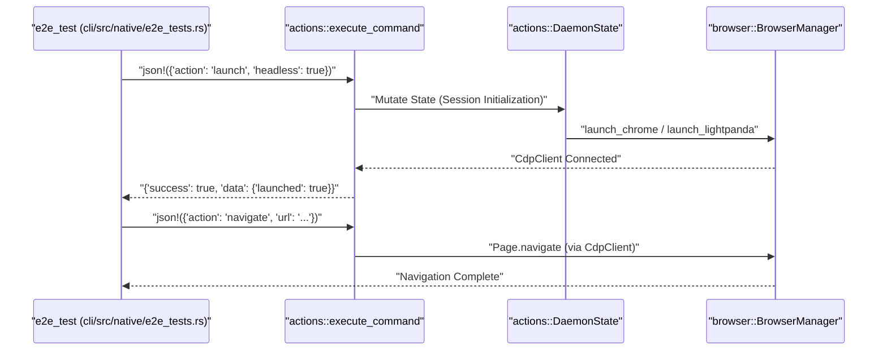
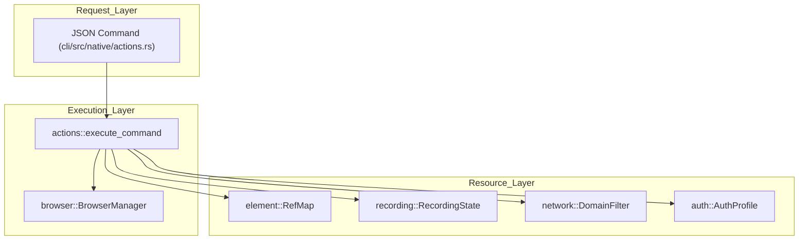

# Testing and Benchmarks

관련 소스 파일

다음 파일들은 이 위키 페이지를 생성하기 위한 컨텍스트로 사용되었습니다.

- [benchmarks/.env.example](benchmarks/.env.example)
- [benchmarks/.gitignore](benchmarks/.gitignore)
- [benchmarks/README.md](benchmarks/README.md)
- [benchmarks/bench.ts](benchmarks/bench.ts)
- [benchmarks/package.json](benchmarks/package.json)
- [benchmarks/pnpm-lock.yaml](benchmarks/pnpm-lock.yaml)
- [benchmarks/scenarios.ts](benchmarks/scenarios.ts)
- [cli/src/native/actions.rs](cli/src/native/actions.rs)
- [cli/src/native/auth.rs](cli/src/native/auth.rs)
- [cli/src/native/browser.rs](cli/src/native/browser.rs)
- [cli/src/native/cdp/types.rs](cli/src/native/cdp/types.rs)
- [cli/src/native/e2e_tests.rs](cli/src/native/e2e_tests.rs)
- [cli/src/native/network.rs](cli/src/native/network.rs)
- [cli/src/native/parity_tests.rs](cli/src/native/parity_tests.rs)
- [cli/src/native/recording.rs](cli/src/native/recording.rs)
- [evals/.env.example](evals/.env.example)
- [evals/.gitignore](evals/.gitignore)
- [evals/README.md](evals/README.md)
- [evals/bun.lock](evals/bun.lock)

이 페이지는 `agent-browser`의 testing infrastructure와 performance benchmarking suite를 문서화합니다. codebase는 Rust와 TypeScript 구현 전반에 걸쳐 unit test, integration test, full end-to-end(E2E) suite를 포함하는 multi-layered testing strategy를 사용합니다. 또한 dedicated benchmark suite는 Vercel Sandbox microVM 내에서 native Rust daemon과 Node.js 구현의 resource efficiency를 비교합니다.

## Testing Infrastructure 개요

testing environment는 Rust 기반 native daemon과 TypeScript 기반 CLI/client component로 나뉩니다.

| Test Suite | Location | Technology | 목적 |
|:---|:---|:---|:---|
| **Native E2E** | `cli/src/native/e2e_tests.rs` | Rust (`tokio::test`) | 실제 Chromium/Lightpanda instance를 사용한 full command pipeline validation. |
| **Parity Tests** | `cli/src/native/parity_tests.rs` | Rust | 100개 이상의 action 전반에서 Node.js와 Rust 구현 간 functional equivalence 보장. |
| **Doctor Integration**| `cli/tests/doctor_cli.rs` | Rust | throwaway environment를 사용하는 `doctor` command integration test. |
| **Skills Evals** | `evals/` | Bun / TS | skill loading, selection, command usage에 대한 LLM 기반 평가. |
| **Benchmarks** | `benchmarks/` | Node.js / Vercel Sandbox | microVM environment에서 performance와 memory footprint 비교. |

Sources: [cli/src/native/e2e_tests.rs:1-8](), [cli/src/native/parity_tests.rs:1-6](), [evals/README.md:1-4]()

## Native E2E Testing Pipeline

native E2E test는 전체 `execute_command` [cli/src/native/e2e_tests.rs:17-17]() lifecycle을 exercise합니다. 이러한 test는 browser가 설치되지 않은 environment에서 실행되는 것을 방지하기 위해 기본적으로 `#[ignore]` [cli/src/native/e2e_tests.rs:4-5]()로 표시되어 있습니다. browser instance contention을 피하기 위해 `--test-threads=1`을 사용해 serial하게 실행해야 합니다 [cli/src/native/e2e_tests.rs:7-8]().

**주요 Component:**
*   **`DaemonState`**: test 중 browser process와 session state의 lifecycle을 관리합니다 [cli/src/native/e2e_tests.rs:50-50]().
*   **`execute_command`**: CDP를 통해 JSON command를 browser로 routing하는 primary entry point입니다 [cli/src/native/e2e_tests.rs:52-61]().
*   **Test Fixtures**: local HTML file(예: `drag_probe.html`, `upload_probe.html`)은 reproducible DOM environment를 제공하기 위해 Base64 data URL로 encode됩니다 [cli/src/native/e2e_tests.rs:32-47]().
*   **Engine Testing**: `Lightpanda`용 특정 test는 experimental engine이 launch 및 navigate할 수 있는지 보장합니다 [cli/src/native/e2e_tests.rs:216-226]().

### E2E Command Execution Flow
다음 다이어그램은 test case가 system entity와 어떻게 상호작용하는지 보여줍니다.

**E2E Command Execution Flow**

Sources: [cli/src/native/e2e_tests.rs:158-212](), [cli/src/native/browser.rs:8-11](), [cli/src/native/actions.rs:183-200]()

## Parity 및 Compatibility Testing

parity suite [cli/src/native/parity_tests.rs:1-6]()는 Rust 구현이 legacy Node.js daemon에서 지원하는 모든 action을 올바르게 처리하는지 보장합니다. 100개 이상의 documented action을 verify합니다 [cli/src/native/parity_tests.rs:45-195]().

### Credential 및 Auth Validation
parity의 중요한 부분은 authentication 및 encryption system입니다. test는 다음을 verify합니다.
*   **Encryption Key Management**: `TestKeyGuard`는 test 중 `AGENT_BROWSER_ENCRYPTION_KEY`가 안전하게 처리되도록 보장합니다 [cli/src/native/parity_tests.rs:14-42]().
*   **Credential Storage**: `credentials_set`, `auth_save`, `auth_login` 같은 action이 `AuthProfile` struct와 함께 동작하는지 verify합니다 [cli/src/native/auth.rs:11-26]().
*   **Selector Logic**: `auth_login` command가 `WaitUntil::Load` [cli/src/native/actions.rs:52-52]()를 사용하고, 100ms interval로 form selector를 polling하는지 확인합니다 [cli/src/native/actions.rs:55-55]().
*   **Preferred Selectors**: targeted username selector를 5초 동안 우선시하는 logic [cli/src/native/actions.rs:57-59]().

### Action Handling Architecture

Sources: [cli/src/native/actions.rs:25-32](), [cli/src/native/browser.rs:159-173](), [cli/src/native/auth.rs:11-26](), [cli/src/native/network.rs:80-82]()

## LLM-Based Evaluations (Evals)

`evals/` suite는 `bun`을 사용해 AI가 tool을 사용할 수 있는 능력에 대한 automated quality check를 실행합니다.

*   **Categories**: test는 `skill-loading`(agent가 먼저 `agent-browser skills get`을 실행하도록 보장), `skill-selection`, `command-usage`를 다룹니다 [evals/README.md:72-84]().
*   **Mechanism**: `SKILL.md`를 context로 inject하고 provider CLI(Claude 또는 Codex)를 호출하여 올바른 command production을 verify합니다 [evals/README.md:85-92]().
*   **Judge**: agent response의 quality를 1-5 scale로 score하는 optional LLM judge(Claude Opus)를 포함합니다 [evals/README.md:89-92]().

Sources: [evals/README.md:1-49](), [evals/README.md:69-69]()

## Performance Benchmarks

`benchmarks/` suite는 특히 Vercel Sandbox microVM 내에서 native Rust daemon의 resource efficiency를 정량화합니다 [benchmarks/README.md:1-3]().

### Scenario 및 Methodology
`benchmarks/scenarios.ts`에 정의된 scenario는 다음을 포함합니다.
*   **`navigate`**: 기본 page load round-trip.
*   **`snapshot`**: Accessibility tree generation 및 RefMap population.
*   **`agent-loop`**: `snapshot -> interaction -> snapshot`의 일반적인 cycle.
*   **`full-workflow`**: navigation, injection, screenshot을 포함하는 sequence.

### Key Performance Indicators (KPIs)
*   **Daemon RSS**: Rust daemon은 약 7 MB RAM을 target으로 하며, Node.js version은 약 140 MB입니다 [benchmarks/README.md:70-75]().
*   **Cold Start**: daemon spawn부터 첫 command execution까지의 시간을 측정합니다.
*   **Distribution Size**: binary footprint와 browser dependency overhead를 비교합니다.

Sources: [benchmarks/README.md:1-3](), [benchmarks/README.md:70-77]()
