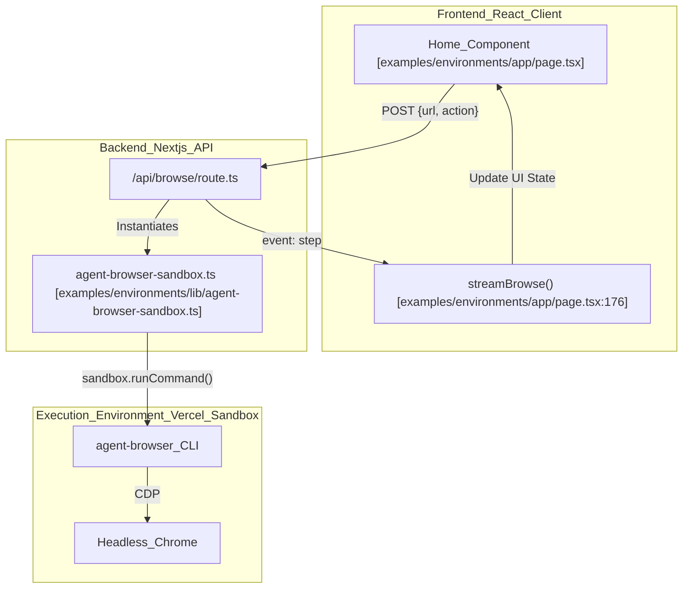
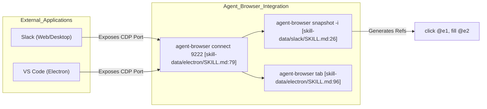

# 예제 및 통합

관련 소스 파일

다음 파일들은 이 위키 페이지를 생성하기 위한 컨텍스트로 사용되었습니다.

- [docs/src/app/next/page.mdx](docs/src/app/next/page.mdx)
- [examples/environments/.gitignore](examples/environments/.gitignore)
- [examples/environments/README.md](examples/environments/README.md)
- [examples/environments/app/page.tsx](examples/environments/app/page.tsx)
- [examples/environments/next.config.ts](examples/environments/next.config.ts)
- [skill-data/electron/SKILL.md](skill-data/electron/SKILL.md)
- [skill-data/slack/SKILL.md](skill-data/slack/SKILL.md)
- [skill-data/slack/references/slack-tasks.md](skill-data/slack/references/slack-tasks.md)
- [skill-data/slack/templates/slack-report-template.md](skill-data/slack/templates/slack-report-template.md)
- [skill-data/vercel-sandbox/SKILL.md](skill-data/vercel-sandbox/SKILL.md)

`agent-browser` codebase는 주로 **Vercel Sandbox** 같은 ephemeral high-performance environment에서 browser automation을 실행하고 **Slack** 또는 **Electron** app 같은 복잡한 third-party application을 자동화하는 데 초점을 둔 포괄적인 예제와 integration pattern을 제공합니다. 이러한 예제는 screenshot capture, accessibility tree extraction, multi-step interaction 같은 작업을 수행하기 위해 web application backend와 `agent-browser` CLI 사이의 간극을 연결하는 방법을 보여줍니다.

## Vercel Sandbox 통합

serverless environment에서 `agent-browser`의 주요 integration pattern은 **Vercel Sandbox**를 통하는 것입니다. 이를 통해 Lambda binary size limit나 복잡한 Chromium bundling 제약 없이, 필요할 때 full Linux microVM을 실행해 `agent-browser`와 headless Chrome을 사용할 수 있습니다 [docs/src/app/next/page.mdx:3-5]().

### Implementation Pattern: `withBrowser`

sandbox와 browser의 lifecycle을 관리하기 위해 이 integration은 higher-order function pattern을 사용합니다. 이를 통해 sandbox가 provision되고, dependency가 확인되며, 실행 후 VM이 중지되도록 보장합니다 [docs/src/app/next/page.mdx:49-76](), [skill-data/vercel-sandbox/SKILL.md:47-75]().

**Data Flow: Sandbox Execution**

1.  **Provisioning**: system은 `AGENT_BROWSER_SNAPSHOT_ID`가 있는지 확인합니다. 있으면 `Sandbox.create`를 통해 `snapshot` source가 있는 pre-configured VM image를 boot합니다 [docs/src/app/next/page.mdx:54-59](). 없으면 fresh `node24` runtime을 생성합니다 [docs/src/app/next/page.mdx:60]().
2.  **Dependency Injection**: fresh sandbox에서는 `agent-browser`가 Chrome을 launch하기 전에 `dnf`를 통해 `CHROMIUM_SYSTEM_DEPS`(예: `nss`, `libxkbcommon`, `gtk3`)를 설치해야 합니다 [docs/src/app/next/page.mdx:26-32](), [docs/src/app/next/page.mdx:63-66]().
3.  **Command Execution**: command는 `sandbox.runCommand("agent-browser", [...])`를 통해 sandbox로 전송됩니다 [docs/src/app/next/page.mdx:80-82]().
4.  **Cleanup**: resource를 release하기 위해 `finally` block에서 sandbox가 명시적으로 중지됩니다 [docs/src/app/next/page.mdx:71-75]().

### 성능을 위한 Sandbox Snapshot

**Sandbox Snapshot**은 OS, system library, `agent-browser` binary, Chromium을 포함하는 저장된 VM image입니다 [docs/src/app/next/page.mdx:112-116]().
*   **Cold Start (No Snapshot)**: `dnf` package와 npm module 설치에 약 30초 [examples/environments/README.md:23-25]().
*   **Warm Start (With Snapshot)**: 저장된 image에서 직접 boot하여 sub-second startup [docs/src/app/next/page.mdx:115-116]().
*   **Creation**: snapshot은 state를 저장하기 전에 `dnf install`과 `npm install -g agent-browser` 단계를 자동화하는 helper script `scripts/create-snapshot.ts`를 사용해 생성됩니다 [docs/src/app/next/page.mdx:125-133](), [skill-data/vercel-sandbox/SKILL.md:189-198]().

Sources: [docs/src/app/next/page.mdx:1-120](), [examples/environments/README.md:1-32](), [skill-data/vercel-sandbox/SKILL.md:166-198]()

## Demo Application: `examples/environments`

`examples/environments` directory에는 streaming feedback과 함께 real-time browser automation을 보여주는 production-grade Next.js application이 포함되어 있습니다.

### 아키텍처 및 데이터 흐름

demo app은 **Server-Sent Events (SSE)**를 사용해 Vercel Sandbox에서 실행되는 browser agent의 progress를 React frontend로 다시 stream합니다 [examples/environments/README.md:9-10]().

#### System Entity Mapping
다음 다이어그램은 high-level demo concept을 특정 code entity와 route에 mapping합니다.

**Diagram: Demo Application Interaction Flow**

Sources: [examples/environments/app/page.tsx:176-229](), [examples/environments/README.md:47-62]()

### 주요 Integration Function

이 integration은 일반적인 AI agent task를 위한 특정 wrapper를 제공합니다.

| Task | Implementation Detail | Code Reference |
| :--- | :--- | :--- |
| **Screenshot** | `screenshot --json`을 실행하고 path를 가져온 뒤 `base64 -w 0`을 통해 Base64로 변환 | [docs/src/app/next/page.mdx:78-92](), [skill-data/vercel-sandbox/SKILL.md:83-103]() |
| **Accessibility Snapshot** | interactive하고 정리된 accessibility tree를 얻기 위해 `snapshot -i -c` 실행 | [docs/src/app/next/page.mdx:94-106](), [skill-data/vercel-sandbox/SKILL.md:109-127]() |
| **Multi-Step Form** | 단일 `withBrowser` session 안에서 `open`, `snapshot`, `fill`, `click` chain 실행 | [skill-data/vercel-sandbox/SKILL.md:135-163]() |
| **Scheduled Monitoring** | recurring task를 위해 Vercel Cron Jobs로 `withBrowser` trigger | [docs/src/app/next/page.mdx:162-178]() |

### UI 구현: Progress Streaming

frontend는 SSE stream을 parse하는 `streamBrowse` function을 사용합니다 [examples/environments/app/page.tsx:176-229](). 이 function은 두 가지 event type을 찾습니다.
1.  `event: step`: `StepIndicator` component를 update하기 위한 `StepInfo`(step name, status, elapsed time)를 포함합니다 [examples/environments/app/page.tsx:118-148](), [examples/environments/app/page.tsx:217-219]().
2.  `event: result`: final `BrowseResult`(screenshot 또는 snapshot data)를 포함합니다 [examples/environments/app/page.tsx:219-221]().

Sources: [examples/environments/app/page.tsx:64-76](), [examples/environments/app/page.tsx:176-229]()

## Application 통합

### Slack 자동화
`agent-browser`는 port `9222`의 기존 session에 연결하거나 `app.slack.com`을 열어 Slack을 자동화할 수 있습니다 [skill-data/slack/SKILL.md:13-21]().
*   **Task Patterns**: unread 확인 [skill-data/slack/references/slack-tasks.md:5-38](), channel 찾기 [skill-data/slack/references/slack-tasks.md:46-81](), message 검색 [skill-data/slack/references/slack-tasks.md:84-128]()을 위한 특정 workflow를 포함합니다.
*   **Data Extraction**: sidebar tree와 message block을 parse하기 위해 `snapshot --json`을 사용합니다 [skill-data/slack/references/slack-tasks.md:191-204]().
*   **Reporting**: workspace activity의 structured analysis를 위한 `slack-report-template.md`를 제공합니다 [skill-data/slack/templates/slack-report-template.md:1-164]().

### Electron Desktop Apps
Electron app은 Chromium 위에 build되므로 `--remote-debugging-port` flag를 통해 자동화할 수 있습니다 [skill-data/electron/SKILL.md:32-34]().
*   **Connectivity**: VS Code, Discord, Figma 같은 실행 중인 app에 attach하려면 `agent-browser connect <port>`를 사용합니다 [skill-data/electron/SKILL.md:36-56]().
*   **Target Management**: `agent-browser tab` command를 사용하면 main window와 embedded `<webview>` element 사이를 전환할 수 있습니다 [skill-data/electron/SKILL.md:92-128]().

**Diagram: Application Automation Entity Mapping**

Sources: [skill-data/slack/SKILL.md:1-228](), [skill-data/electron/SKILL.md:1-237]()

## Integration Patterns

### Scheduled Workflows (Cron)
`agent-browser`는 recurring monitoring task를 위해 Vercel Cron Jobs에 통합될 수 있습니다. 이 pattern은 `withBrowser` utility를 trigger하는 Route Handler(예: `app/api/cron/monitor/route.ts`) 안에 logic을 wrapping하는 방식입니다 [docs/src/app/next/page.mdx:162-178]().

### 통합에서의 Authentication
Vercel에서 실행할 때 Sandbox SDK는 automatic authentication에 OIDC를 사용합니다. local development 또는 external integration의 경우 세 가지 environment variable이 필요합니다 [docs/src/app/next/page.mdx:143-152](), [examples/environments/README.md:36-41]():
*   `VERCEL_TOKEN`: Personal access token.
*   `VERCEL_TEAM_ID`: Target team.
*   `VERCEL_PROJECT_ID`: Target project.

Sources: [docs/src/app/next/page.mdx:138-156](), [examples/environments/README.md:34-46]()
