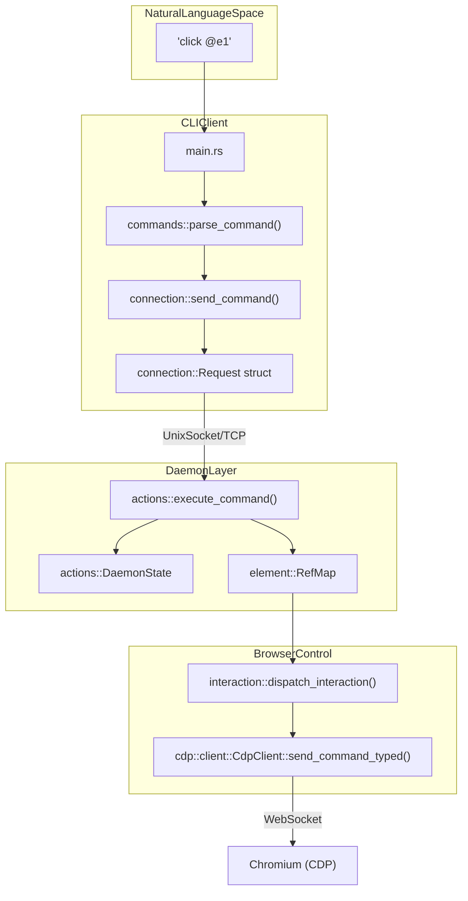
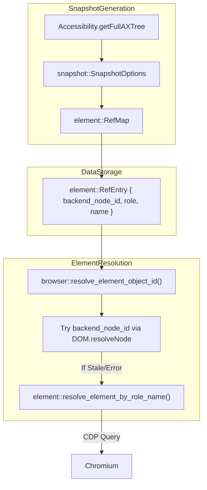

# 용어집

관련 소스 파일

다음 파일들은 이 위키 페이지를 생성하기 위한 컨텍스트로 사용되었습니다.

- [CHANGELOG.md](CHANGELOG.md)
- [README.md](README.md)
- [cli/src/connection.rs](cli/src/connection.rs)
- [cli/src/flags.rs](cli/src/flags.rs)
- [cli/src/main.rs](cli/src/main.rs)
- [cli/src/native/actions.rs](cli/src/native/actions.rs)
- [cli/src/native/browser.rs](cli/src/native/browser.rs)
- [cli/src/native/cdp/chrome.rs](cli/src/native/cdp/chrome.rs)
- [cli/src/native/cdp/client.rs](cli/src/native/cdp/client.rs)
- [cli/src/native/daemon.rs](cli/src/native/daemon.rs)
- [cli/src/native/e2e_tests.rs](cli/src/native/e2e_tests.rs)
- [cli/src/native/providers.rs](cli/src/native/providers.rs)
- [cli/src/output.rs](cli/src/output.rs)
- [docs/src/app/commands/page.mdx](docs/src/app/commands/page.mdx)
- [package.json](package.json)
- [skills/agent-browser/SKILL.md](skills/agent-browser/SKILL.md)

이 용어집은 `agent-browser` codebase에서 사용되는 technical term, jargon, domain-specific concept을 정의합니다. high-level concept과 기반 Rust 구현 사이의 mapping을 제공합니다.

## Core Domain Terms

### Session
**Session**은 격리된 browser context를 나타냅니다. 자체 cookies, localStorage, browser metadata를 관리합니다. Session은 ephemeral(기본값)이거나 persistent일 수 있습니다.
*   **Implementation**: `DaemonState` 내에서 관리됩니다 [cli/src/native/actions.rs:17-18]().
*   **Persistent Sessions**: `--session-name` flag로 trigger되며, `state_save`와 `state_load` action을 통해 local filesystem에 state를 자동 저장/복원합니다 [cli/src/native/actions.rs:35-36]().
*   **Data Flow**: command가 수신되면 `DaemonState`가 active session을 식별하고 CDP command를 적절한 `CdpClient`로 route합니다 [cli/src/native/actions.rs:17-18]().
*   **Stable Tab IDs**: session 내에서 tab에는 `t1`, `t2` 같은 stable identifier가 할당되며, 다른 tab이 닫혀도 변경되지 않습니다 [cli/src/native/browser.rs:178-180]().

### Ref (Element Reference)
**Ref**는 AI agent가 복잡한 CSS 또는 XPath selector 없이 element와 interaction하는 데 사용하는 안정적이고 짧은 형식의 identifier(예: `@e1`, `@e2`)입니다.
*   **Lifecycle**: `snapshot` command 중 생성됩니다 [cli/src/native/snapshot.rs:34]().
*   **Mapping**: ID를 `backend_node_id`, role, accessible name을 포함하는 `RefEntry`에 mapping하는 `RefMap`에 저장됩니다 [cli/src/native/element.rs:25]().
*   **Stale Ref Fallback**: `backend_node_id`가 stale 상태가 되면(예: DOM mutation 이후), system은 `resolve_element_object_id`를 통해 cached role과 name을 사용해 element를 다시 resolve하려고 시도합니다 [cli/src/native/browser.rs:13]().

### Snapshot
**Snapshot**은 page의 accessibility tree를 serialized representation으로 나타낸 것입니다. AI agent가 page를 "보는" 주요 방식입니다.
*   **Extraction**: `SnapshotOptions`를 통해 CDP `Accessibility.getFullAXTree` command를 사용합니다 [cli/src/native/snapshot.rs:34]().
*   **Filtering**: system은 LLM token usage를 줄이기 위해 raw tree를 filtering하여 "interactive" 또는 "content" role만 포함합니다.
*   **Enhanced Metadata**: `--annotate` flag를 사용해 bounding box 또는 annotation을 포함할 수 있습니다 [cli/src/native/snapshot.rs:34]().

### Daemon
**Daemon**은 browser instance를 유지하고 Unix socket 또는 TCP를 통해 IPC(Inter-Process Communication)를 관리하는 long-running background process(Rust로 구현)입니다.
*   **Lifecycle**: 아직 실행 중이 아니면 첫 command에서 `ensure_daemon`에 의해 자동 시작됩니다 [cli/src/main.rs:27-30](). socket directory의 `.pid` 및 `.sock` file을 사용해 liveness를 추적합니다 [cli/src/connection.rs:118-128]().
*   **State**: `BrowserManager`, `RefMap`, active network/tracing state를 추적하는 `DaemonState`에 보관됩니다 [cli/src/native/actions.rs:17-18]().

---

## Technical Architecture Diagrams

### Natural Language에서 Code Entity까지 (Interaction Flow)
다음 다이어그램은 user command와 이를 처리하는 내부 Rust structure 사이의 간극을 연결합니다.

**Sources**: [cli/src/main.rs:26-31](), [cli/src/connection.rs:22-27](), [cli/src/native/actions.rs:17-42](), [cli/src/native/cdp/client.rs:9-20]()

### Snapshot 및 Ref Resolution System
이 다이어그램은 system이 visual element를 stable Reference로 변환하는 방식을 보여줍니다.

**Sources**: [cli/src/native/snapshot.rs:34](), [cli/src/native/element.rs:13-25](), [cli/src/native/browser.rs:13-14]()

---

## Glossary Table

| Term | Definition | Relevant Code |
| :--- | :--- | :--- |
| **CDP** | Chrome DevTools Protocol. Chromium을 제어하는 데 사용되는 주요 protocol입니다. | `cli/src/native/cdp/` |
| **CdpClient** | browser와의 WebSocket connection을 관리하고 command를 dispatch하는 Rust struct입니다. | `CdpClient` [cli/src/native/cdp/client.rs:9]() |
| **RefMap** | snapshot 중 생성되는 element reference collection입니다. | `RefMap` [cli/src/native/element.rs:25]() |
| **BackendNodeId** | Chromium이 DOM node에 제공하는 identifier로, 일부 mutation에서는 안정적이지만 stale 상태가 될 수 있습니다. | [cli/src/native/element.rs:13]() |
| **DomainFilter** | allowlist를 기반으로 navigation을 허용/차단하는 security mechanism입니다. | `DomainFilter` [cli/src/native/network.rs:28]() |
| **ActionPolicy** | `click` 같은 특정 action이 허용되는지 또는 confirmation이 필요한지 결정하는 configuration-driven system입니다. | `ActionPolicy` [cli/src/native/policy.rs:29]() |
| **HarEntry** | HAR 1.2 file export에 사용되는 단일 network request/response의 metadata입니다. | `HarEntry` [cli/src/native/actions.rs:67-93]() |
| **StreamServer** | screencast와 browser event를 dashboard로 stream하는 daemon 내부의 WebSocket server입니다. | `StreamServer` [cli/src/native/stream.rs:37]() |
| **Boundary Nonce** | LLM prompt injection을 방지하기 위해 CLI output에서 untrusted page content를 감싸는 데 사용되는 CSPRNG-generated token입니다. | `get_boundary_nonce` [cli/src/output.rs:11-17]() |
| **ChromeProcess** | spawn된 Chromium child process의 wrapper로, lifecycle과 process group을 관리합니다. | `ChromeProcess` [cli/src/native/cdp/chrome.rs:8]() |
| **WaitUntil** | page navigation이 완료된 시점을 판단하는 strategy입니다(예: `Load`, `NetworkIdle`). | `WaitUntil` [cli/src/native/browser.rs:15]() |
| **TabRef** | stable ID(예: `t1`) 또는 user-assigned label로 browser tab을 참조하는 reference입니다. | `TabRef` [cli/src/native/browser.rs:185-188]() |
| **LaunchOptions** | browser startup parameter(headless, proxy, user-data-dir 등)를 위한 configuration struct입니다. | `LaunchOptions` [cli/src/native/cdp/chrome.rs:90-113]() |
| **Auth Vault** | `auth_login`에서 사용하는 user credential용 AES-256-GCM encrypted storage입니다. | [cli/src/native/auth.rs:14]() |
| **Skill** | AI agent에게 특정 task 수행 방법을 가르치는 packaged instruction 및 metadata(YAML + Markdown)입니다. | [cli/src/skills.rs:10]() |

## Abbreviation Key
*   **AX**: Accessibility(AXTree의 AX).
*   **CDP**: Chrome DevTools Protocol.
*   **IPC**: Inter-Process Communication.
*   **SPA**: Single Page Application(`pushstate` 및 `auth_login` wait strategy와 관련 [cli/src/native/actions.rs:52](), [CHANGELOG.md:44]()).
*   **CSPRNG**: Cryptographically Secure Pseudo-Random Number Generator(output boundary에 사용 [cli/src/output.rs:8-10]()).
*   **LCP/CLS/TTFB**: `vitals` command가 report하는 Core Web Vitals metric [CHANGELOG.md:43]().

**Sources**:
- Definitions: [cli/src/native/actions.rs:61-200](), [cli/src/native/element.rs:1-25](), [cli/src/native/snapshot.rs:1-35](), [cli/src/output.rs:1-35](), [cli/src/connection.rs:1-180]()
- Implementation details: [cli/src/native/interaction.rs:1-20](), [cli/src/native/cdp/chrome.rs:1-113](), [cli/src/native/browser.rs:1-190](), [CHANGELOG.md:3-80]()
