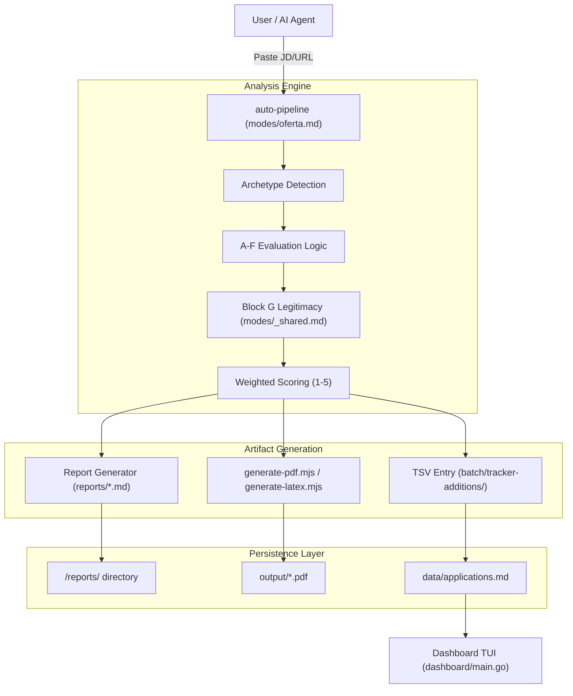
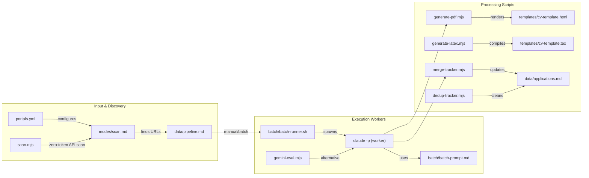

# Career-Ops 개요

관련 소스 파일

다음 파일들이 이 위키 페이지를 생성하기 위한 컨텍스트로 사용되었습니다:

- [.release-please-manifest.json](.release-please-manifest.json)
- [AGENTS.md](AGENTS.md)
- [CHANGELOG.md](CHANGELOG.md)
- [CLAUDE.md](CLAUDE.md)
- [README.es.md](README.es.md)
- [README.md](README.md)
- [modes/tr/README.md](modes/tr/README.md)
- [modes/tr/_shared.md](modes/tr/_shared.md)
- [modes/tr/basvuru.md](modes/tr/basvuru.md)
- [modes/tr/is-ilani.md](modes/tr/is-ilani.md)
- [modes/tr/pipeline.md](modes/tr/pipeline.md)
- [package.json](package.json)

Career-Ops는 **Claude Code**와 기타 AI 코딩 CLI 위에 구축된 AI 기반 구직 커맨드 센터입니다. 수동적이고 종종 감당하기 어려운 구직 과정을 구조화된 자동화 파이프라인으로 전환합니다. 이 시스템은 "spray-and-pray"식 대량 지원이 아니라 고품질의 표적 지원을 위해 설계되었으며, 정교한 A-G 채점 로직을 사용해 후보자와 역할 사이에 실제 적합성이 있는지 보장합니다.

이 프로젝트는 원래 740건 이상의 평가와 100개 이상의 맞춤형 CV가 포함된 대규모 검색을 관리하기 위해 개발되었습니다 [README.md:41-44](), [AGENTS.md:3-5]().

## 핵심 철학: 자동화를 통한 품질

시스템은 세 가지 주요 축으로 작동합니다:
1.  **심층 평가**: 모든 직무 설명(JD)은 10개의 가중 차원에 걸쳐 분석되어 1.0부터 5.0까지의 점수와 정성적 합법성 평가(Block G)를 산출합니다 [README.md:48-58](), [modes/tr/_shared.md:26-47]().
2.  **맞춤형 산출물**: 일반적인 이력서 대신, 키워드 주입 엔진을 사용해 대상 JD에 맞게 특별히 커스터마이즈된 ATS 최적화 PDF 또는 LaTeX 문서를 생성합니다 [README.md:71-74](), [package.json:11-11]().
3.  **데이터 무결성**: 플랫 파일 "데이터베이스"(`data/applications.md`)가 단일 진실 공급원 역할을 하며, 일관성, 중복 제거, 상태 정규화를 보장하기 위해 Node.js 스크립트 모음으로 유지 관리됩니다 [package.json:7-10](), [AGENTS.md:50-56]().

Sources: [README.md:48-64](), [AGENTS.md:3-11](), [package.json:5-19]()

## 시스템 토폴로지

다음 다이어그램은 사용자 상호작용(URL 붙여넣기)이 하위 시스템을 거쳐 구조화된 데이터와 문서를 생성하는 흐름을 보여줍니다.

### 상위 수준 데이터 흐름(자연어에서 코드 공간으로)

Sources: [README.md:128-144](), [AGENTS.md:72-115](), [modes/tr/is-ilani.md:12-150]()

## 하위 시스템 상호작용(코드 엔티티 공간)

이 다이어그램은 논리적 기능을 코드베이스 내에서 이를 실행하는 특정 파일과 스크립트에 매핑합니다.

### 코드 엔티티 맵

Sources: [package.json:5-19](), [AGENTS.md:49-70](), [README.md:116-127]()

## 주요 하위 시스템

### 1. AI 에이전트 모드(`/modes`)
시스템의 지능은 Markdown "skill" 파일에 담겨 있습니다. 이 파일들은 특정 명령이 호출될 때 AI가 어떻게 동작하는지 정의합니다.
*   **평가**: `oferta.md`(또는 TR의 `is-ilani.md`)는 7개 블록 A-G 구조를 포함한 단일 분석을 처리합니다 [modes/tr/is-ilani.md:1-150]().
*   **발견**: `scan.md`와 `scan.mjs`는 `portals.yml`을 기반으로 새 역할을 찾습니다 [AGENTS.md:56-67]().
*   **실행**: `apply.md`(양식 작성 어시스턴트)와 `contacto.md`(LinkedIn 아웃리치)는 외부 단계를 처리합니다 [modes/tr/basvuru.md:1-21]().
*   **컨텍스트**: `_shared.md`에는 핵심 archetype과 채점 가중치가 포함되어 있고, `_profile.md`에는 업데이트 중 덮어쓰기를 방지하기 위한 사용자별 커스터마이징이 들어 있습니다 [AGENTS.md:11-23]().

### 2. 배치 처리(`/batch`)
대량 처리를 위해 시스템은 오케스트레이터/워커 아키텍처를 사용합니다. `batch-runner.sh`는 여러 `claude -p` 인스턴스를 관리하며, 각 인스턴스는 `batch-prompt.md` 로직을 실행해 수십 개의 공고를 병렬로 평가하고 보고서/PDF를 자동 생성합니다 [AGENTS.md:59-60](), [CHANGELOG.md:43-43]().

### 3. 생성 엔진
시스템은 CV에 대해 두 가지 출력 경로를 지원합니다:
*   **HTML/PDF**: `generate-pdf.mjs`는 Playwright를 사용해 `templates/cv-template.html`을 렌더링합니다 [package.json:11-11]().
*   **LaTeX**: `generate-latex.mjs`는 `pdflatex` 또는 `tectonic`을 사용해 `templates/cv-template.tex`를 컴파일합니다 [CHANGELOG.md:51-52]().
선택은 `cv.output_format`으로 제어됩니다 [CHANGELOG.md:57-57]().

### 4. 데이터 관리 및 TUI
`data/` 디렉터리는 파이프라인 상태를 저장합니다. 이것은 플랫 파일 시스템이므로 `merge-tracker.mjs`, `dedup-tracker.mjs`, `normalize-statuses.mjs` 같은 무결성 스크립트를 사용해 `applications.md` 데이터베이스를 유지 관리합니다 [package.json:7-10](). Go로 작성된 **Dashboard TUI**는 이 데이터를 필터링하고 정렬하기 위한 터미널 인터페이스를 제공합니다 [README.md:77-77]().

### 5. 인터뷰 인텔리전스(`/interview-prep`)
이 하위 시스템은 여러 평가에 걸쳐 `story-bank.md`에 STAR+Reflection 스토리를 축적합니다 [AGENTS.md:62-62](). `deep.md` 모드는 면접 준비를 위한 회사별 인텔리전스 보고서를 생성합니다 [AGENTS.md:63-63]().

## 하위 페이지

특정 컴포넌트에 대한 자세한 기술 문서는 다음 페이지를 참조하세요:

*   **[시작하기 및 설정](#1.1)**: 설치(Node, Go, Playwright)와 초기 온보딩 흐름(CV 및 Profile 설정).
*   **[구성 참조](#1.2)**: `profile.yml`, `portals.yml`, `DATA_CONTRACT.md` 경계에 대한 상세 분석.
*   **[예제 및 샘플 파일](#1.3)**: 샘플 CV, 평가, proof point 형식의 단계별 설명.

Sources: [README.md:81-114](), [AGENTS.md:72-134](), [CHANGELOG.md:1-57]()
