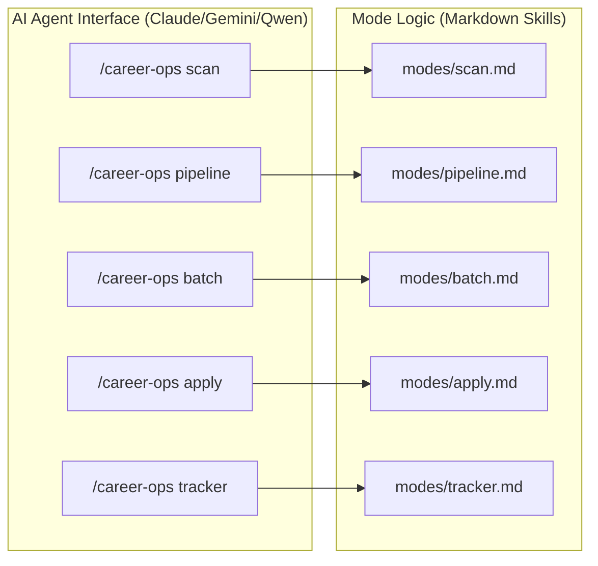

# 시작하기 및 설정

<details>
<summary>관련 소스 파일</summary>

다음 파일들이 이 위키 페이지를 생성하기 위한 컨텍스트로 사용되었습니다:

- [.envrc](.envrc)
- [.github/PULL_REQUEST_TEMPLATE.md](.github/PULL_REQUEST_TEMPLATE.md)
- [.github/SECURITY.md](.github/SECURITY.md)
- [.gitignore](.gitignore)
- [CONTRIBUTING.md](CONTRIBUTING.md)
- [LEGAL_DISCLAIMER.md](LEGAL_DISCLAIMER.md)
- [README.es.md](README.es.md)
- [README.md](README.md)
- [TRADEMARK.md](TRADEMARK.md)
- [doctor.mjs](doctor.mjs)
- [flake.lock](flake.lock)
- [flake.nix](flake.nix)

</details>


이 페이지는 `career-ops` 파이프라인을 초기화하기 위한 포괄적인 기술 가이드를 제공합니다. 의존성 관리, 개인 신원 파일 구성, AI 에이전트가 평가에 대해 일관된 "source of truth"를 갖도록 보장하는 검증 도구 모음을 다룹니다.

## 시스템 사전 요구 사항

설치 전에 다음 환경을 사용할 수 있는지 확인하세요:

*   **Claude Code / Gemini CLI / OpenCode**: 핵심 실행 엔진입니다. `career-ops`는 이러한 AI 에이전트를 확장하는 특수 프롬프트와 스크립트 모음으로 구축되어 있습니다 [README.md:16-19](), [README.md:116-118]().
*   **Node.js (v18+)**: 유틸리티 스크립트(병합, 중복 제거, 검증)와 PDF 생성 엔진을 실행하는 데 필요합니다 [doctor.mjs:21-31]().
*   **Playwright**: `generate-pdf.mjs`와 `apply` 모드가 웹 브라우저와 상호작용하는 데 사용합니다 [README.md:87-87](), [doctor.mjs:44-63]().
*   **Go (v1.22+)**: Terminal User Interface(TUI) 대시보드를 빌드하고 실행하는 데 필요합니다 [README.md:21-21](), [CONTRIBUTING.md:65-67]().

Sources: [README.md:16-22](), [doctor.mjs:21-63](), [CONTRIBUTING.md:65-67]()

## 설치 워크플로

설정은 깨끗한 clone 상태에서 작동하는 AI 구직 에이전트로 전환하기 위한 6단계 프로세스를 따릅니다.

### 1. Clone 및 의존성 해결
이 프로젝트는 Node.js 의존성 관리를 위해 `npm`을 사용하고, Playwright의 브라우저 바이너리를 위해 `npx`를 사용합니다.

```bash
git clone https://github.com/santifer/career-ops.git
cd career-ops && npm install
npx playwright install chromium
```
Sources: [README.md:83-87](), [doctor.mjs:33-63]()

### 2. 환경 검증
`doctor.mjs` 스크립트는 로컬 환경 검증을 자동화합니다.

```bash
npm run doctor
```
Sources: [README.md:90-90](), [doctor.mjs:1-10]()

### 3. 신원 구성
시스템은 후보자 신원, 목표 역할, 보상을 정의하기 위해 `config/profile.yml`에 의존합니다. 이 파일은 PII를 보호하기 위해 `.gitignore`를 통해 git에서 제외됩니다 [README.md:92-93](), [.gitignore:24-24]().

```bash
cp config/profile.example.yml config/profile.yml
```
Sources: [README.md:93-93](), [doctor.mjs:79-91]()

### 4. Source of Truth 설정
`cv.md`는 모든 AI 평가와 PDF 생성을 위한 기본 컨텍스트 역할을 합니다. 프로젝트 루트에 생성해야 합니다 [README.md:96-97]().

```bash
# Create cv.md in the project root with your CV in markdown
```
Sources: [README.md:97-97](), [doctor.mjs:65-77]()

### 5. 포털 스캐너 설정
`/career-ops scan` 명령을 사용하려면 `portals.yml`을 구성해야 합니다. 이 파일은 채용 공고 제목을 필터링하는 데 사용하는 키워드와 추적할 특정 회사를 정의합니다 [README.md:94-94]().

```bash
cp templates/portals.example.yml portals.yml
```
Sources: [README.md:94-94](), [doctor.mjs:93-105]()

### 6. 개인화
구성이 완료되면 사용자는 AI 에이전트(예: Claude Code)에게 새로 생성된 파일을 읽고 시스템을 맞춤 조정하도록 요청해야 합니다 [README.md:99-106]().

## 데이터 흐름 및 엔티티 매핑

다음 다이어그램은 첫 평가를 위해 시스템을 준비할 때 구성 파일과 스크립트가 어떻게 상호작용하는지 보여줍니다.

### 설정 데이터 흐름: Config에서 실행까지
```mermaid
graph TD
    subgraph "Natural Language Space (Input)"
        CV["cv.md (Source of Truth)"]
        Profile["config/profile.yml (Identity)"]
        Portals["portals.yml (Search Filters)"]
    end

    subgraph "Code Entity Space (Validation & Execution)"
        Doctor["doctor.mjs"]
        SyncCheck["cv-sync-check.mjs"]
        UpdateSys["update-system.mjs"]
        ClaudeCode["Claude Code Agent"]
    end

    CV --> Doctor
    Profile --> Doctor
    Portals --> ClaudeCode
    
    Doctor -- "Validates Prereqs" --> SyncCheck
    SyncCheck -- "Validates Required Fields" --> Profile
    SyncCheck -- "Checks Content Length" --> CV
    
    UpdateSys -- "Enforces" --> DataContract["DATA_CONTRACT.md"]
    DataContract -- "Protects" --> CV
    DataContract -- "Protects" --> Profile
end
```
Sources: [doctor.mjs:152-194](), [README.md:100-110](), [CONTRIBUTING.md:58-67]()

## 상태 점검 및 시스템 유지 관리

`career-ops`에는 환경 준비 상태와 데이터 무결성을 보장하기 위한 특수 검증 도구 모음이 포함되어 있습니다.

### 설정 검증(doctor.mjs)
`npm run doctor` 명령은 `doctor.mjs`를 실행하며, 다음 항목에 대한 통과/실패 체크리스트를 제공합니다:
*   Node.js 버전 호환성 [doctor.mjs:21-31]().
*   `node_modules` 및 Playwright Chromium 바이너리 존재 여부 [doctor.mjs:33-63]().
*   필수 사용자 파일(`cv.md`, `config/profile.yml`, `portals.yml`) 존재 여부 [doctor.mjs:65-105]().
*   데이터 디렉터리(`data/`, `output/`, `reports/`) 준비 상태 [doctor.mjs:135-150]().

### 자동 업데이트 시스템(update-system.mjs)
사용자 데이터를 보호하면서 시스템 로직을 최신 상태로 유지하기 위해 `update-system.mjs`는 `DATA_CONTRACT.md`에 정의된 경계를 강제합니다. `cv.md`나 `profile.yml` 같은 개인 구성을 덮어쓰지 않고 업데이트를 안전하게 관리하기 위해 `check`, `apply`, `rollback`, `dismiss` 명령을 지원합니다.

### 실행 표
| Command | Script | Purpose |
| :--- | :--- | :--- |
| `npm run doctor` | `doctor.mjs` | 전체 환경 사전 요구 사항 점검 [doctor.mjs:4-6]() |
| `node cv-sync-check.mjs` | `cv-sync-check.mjs` | CV와 Profile 일관성 검증 [CONTRIBUTING.md:62-62]() |
| `node verify-pipeline.mjs` | `verify-pipeline.mjs` | 애플리케이션 데이터 계층에 대한 상태 점검 [CONTRIBUTING.md:61-61]() |
| `node update-system.mjs` | `update-system.mjs` | Data Contract를 따르는 관리형 시스템 업데이트 |

Sources: [doctor.mjs:152-182](), [CONTRIBUTING.md:58-67](), [.gitignore:27-28]()

## Slash Commands 개요

설정이 검증되면 시스템은 AI 에이전트 인터페이스 내에서 `/career-ops` 명령으로 제어됩니다.

### 명령과 코드 엔티티 매핑

Sources: [README.es.md:111-124](), [CONTRIBUTING.md:36-40]()

### 명령 참조
*   **공고 평가**: URL 또는 JD 텍스트를 붙여넣으면 트리거됩니다. 전체 평가 파이프라인을 실행합니다 [README.es.md:115-115]().
*   **`/career-ops scan`**: `portals.yml`을 사용해 새 채용 공고를 발견합니다 [README.es.md:116-116]().
*   **`/career-ops pipeline`**: `data/pipeline.md`에 대기 중인 URL을 처리합니다 [README.es.md:121-121]().
*   **`/career-ops pdf`**: ATS 최적화 CV를 생성합니다 [README.es.md:117-117]().
*   **`/career-ops batch`**: 대량 평가를 오케스트레이션합니다 [README.es.md:118-118]().
*   **`/career-ops tracker`**: 지원 상태를 보고 관리합니다 [README.es.md:119-119]().
*   **`/career-ops apply`**: AI 기반 양식 작성 어시스턴트를 실행합니다 [README.es.md:120-120]().

Sources: [README.es.md:111-124](), [README.md:68-80]()
