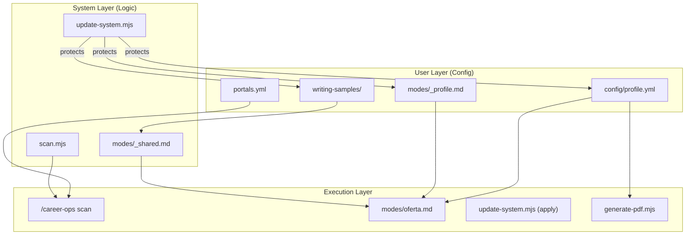
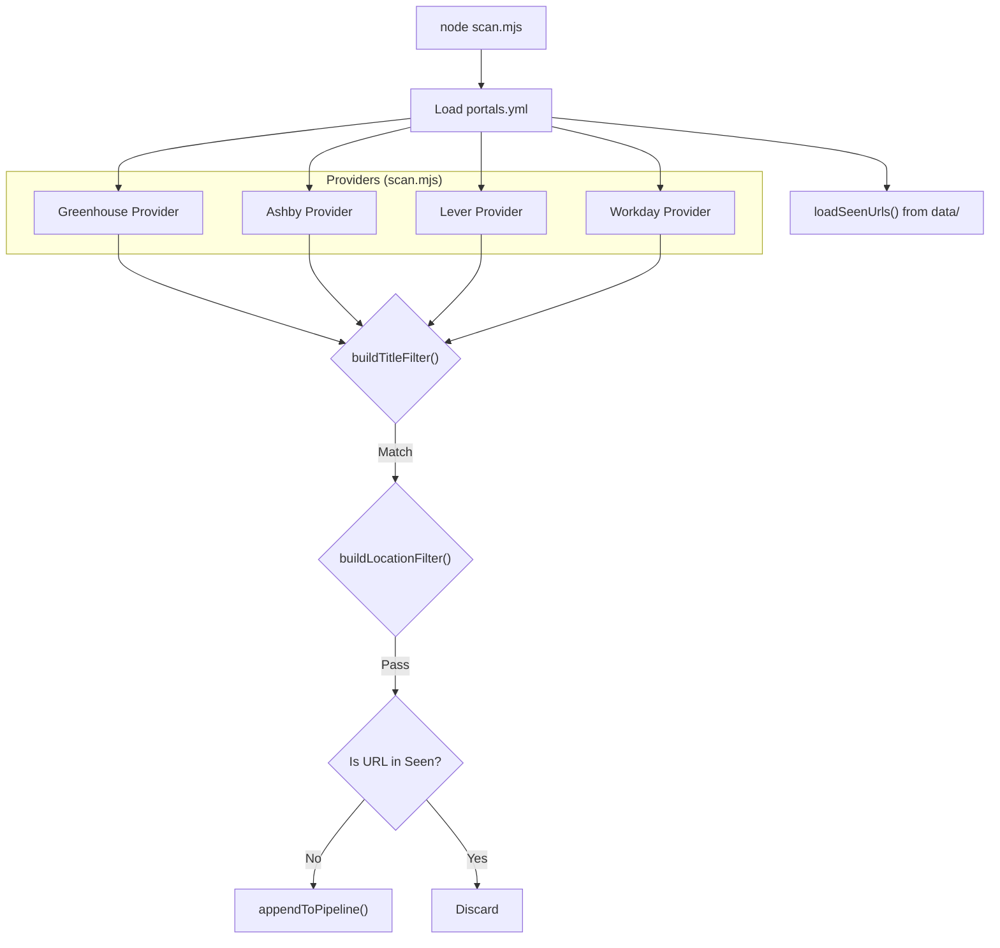
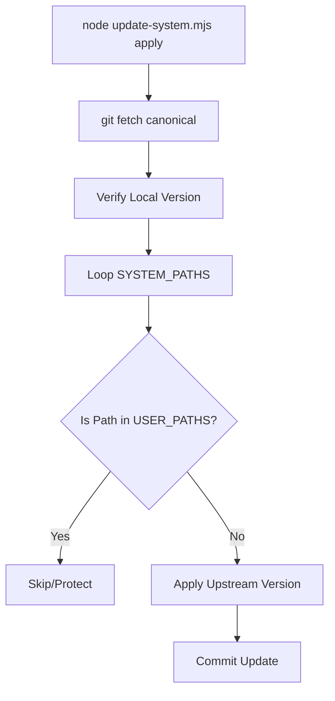

# 구성 참조

관련 소스 파일

다음 파일들이 이 위키 페이지를 생성하기 위한 컨텍스트로 사용되었습니다:

- [DATA_CONTRACT.md](DATA_CONTRACT.md)
- [config/profile.example.yml](config/profile.example.yml)
- [docs/CUSTOMIZATION.md](docs/CUSTOMIZATION.md)
- [modes/_shared.md](modes/_shared.md)
- [modes/auto-pipeline.md](modes/auto-pipeline.md)
- [modes/pdf.md](modes/pdf.md)
- [modes/scan.md](modes/scan.md)
- [scan.mjs](scan.mjs)
- [templates/cv-template.html](templates/cv-template.html)
- [templates/portals.example.yml](templates/portals.example.yml)
- [update-system.mjs](update-system.mjs)
- [writing-samples/README.md](writing-samples/README.md)

이 페이지는 Career-Ops의 구성 계층에 대한 자세한 기술 참조를 제공합니다. 이 시스템은 YAML 파일이 후보자의 정체성, 발견 에이전트를 위한 검색 매개변수, 지원 파이프라인의 상태 머신을 정의하는 "Configuration-as-Data" 접근 방식을 사용합니다.

## 시스템 구성 흐름

구성 파일은 AI 에이전트(`modes/`)의 주요 컨텍스트 제공자이자 처리 스크립트의 데이터 검증 규칙으로 작동합니다. 아키텍처는 안전한 업데이트를 보장하기 위해 **System Layer**(로직 및 템플릿)와 **User Layer**(개인 데이터 및 커스터마이징) 사이에 엄격한 경계를 강제합니다.

### 구성 수집 맵
다음 다이어그램은 구성 파일이 여러 시스템 컴포넌트에 어떻게 수집되는지, 그리고 코드 엔티티와 어떻게 연결되는지 보여줍니다.

**구성 수집 맵**

Sources: [DATA_CONTRACT.md:5-24](), [update-system.mjs:31-105](), [modes/_shared.md:11-24](), [scan.mjs:37-43]()

---

## 1. 후보자 프로필(`config/profile.yml`)

`config/profile.yml` 파일은 후보자의 전문적 정체성에 대한 "Single Source of Truth"입니다. `oferta`, `auto-pipeline`, `pdf` 모드가 직무 적합도를 채점하고 맞춤형 CV를 생성하는 데 사용합니다.

### 주요 스키마 엔티티

| 섹션 | 코드 영향 | 설명 |
|:---|:---|:---|
| `candidate` | `modes/pdf.md` | `templates/cv-template.html`에 주입되는 개인 연락처 정보(이름, LinkedIn, Portfolio) [modes/pdf.md:66-79](). |
| `target_roles` | `modes/oferta.md` | "North Star alignment" 점수를 계산하는 데 사용하는 "North Star" 역할을 정의합니다 [modes/_shared.md:34](). |
| `narrative` | `modes/pdf.md` | Professional Summary를 다시 작성하는 데 사용하는 `exit_story`를 제공합니다 [modes/pdf.md:13](). |
| `compensation` | `modes/oferta.md` | Block D(Comp Research)를 위한 `target_range`와 `minimum`을 설정합니다 [config/profile.example.yml:55-59](). |
| `cv.output_format` | `modes/auto-pipeline.md` | 생성 파이프라인을 `modes/pdf.md`(HTML) 또는 `modes/latex.md`로 라우팅합니다 [modes/auto-pipeline.md:30-33](). |

### 구현 세부 사항: User Layer
`DATA_CONTRACT.md`에 정의된 것처럼 `config/profile.yml`은 **User Layer**의 핵심 부분입니다 [DATA_CONTRACT.md:12](). `update-system.mjs` 스크립트는 업데이트 작업이 개인 정체성 데이터를 절대 덮어쓰지 않도록 이 경로를 `USER_PATHS` 배열에 명시적으로 포함합니다 [update-system.mjs:95]().

Sources: [docs/CUSTOMIZATION.md:3-13](), [update-system.mjs:92-105](), [DATA_CONTRACT.md:5-15](), [modes/pdf.md:64-94]()

---

## 2. 포털 스캐너 구성(`portals.yml`)

`portals.yml` 파일(`templates/portals.example.yml`에서 복사)은 발견 엔진을 구성합니다.

### 발견 전략
시스템은 두 가지 별도의 스캐너 구현을 사용합니다:
1.  **Zero-Token Scanner(`scan.mjs`)**: AI 토큰을 소비하지 않고 공개 API(Greenhouse, Ashby, Lever, Workday)를 쿼리하는 고속 Node.js 스크립트입니다 [scan.mjs:3-20]().
2.  **Agentic Scanner(`modes/scan.md`)**: 복잡한 SPA를 심층 탐색하거나 API를 사용할 수 없을 때 AI 에이전트가 사용하는 Playwright 기반 전략입니다 [modes/scan.md:26-49]().

### 필터링 로직
두 구현은 모두 `portals.yml`에 정의된 필터링 로직을 공유합니다:
*   **Title Filter**: 관련성을 판단하기 위해 `positive` 및 `negative` 키워드를 사용합니다 [scan.mjs:106-116]().
*   **Location Filter**: `block` 키워드가 `allow` 키워드보다 우선하는 계층형 로직입니다 [scan.mjs:127-139]().

**스캐너 로직 흐름**

Sources: [templates/portals.example.yml:1-58](), [scan.mjs:106-188](), [modes/scan.md:26-68]()

---

## 3. 전역 컨텍스트 및 규칙(`modes/_shared.md`)

`modes/_shared.md`는 AI 동작을 위한 시스템 수준 구성 역할을 합니다. 채점 루브릭, archetype 감지 규칙, 글쓰기 스타일 보정을 정의합니다.

### 채점 시스템
평가 엔진은 6개 차원(A-F)에 걸쳐 표준화된 1-5 척도를 사용하며, 정성적 "Posting Legitimacy" 점검(Block G)을 포함합니다 [modes/_shared.md:29-54]().

### Archetype 감지
시스템은 CV와 커버레터의 프레이밍을 조정하기 위해 직무 설명을 특정 archetype(예: `AI Platform`, `Agentic / Automation`)에 매핑합니다 [modes/_shared.md:74-87]().

### 글쓰기 스타일 보정
시스템은 후보자의 목소리를 모방하기 위해 `writing-samples/` 디렉터리에서 사용자가 제공한 샘플을 수집할 수 있습니다 [modes/_shared.md:138-144]().
*   **소스**: `writing-samples/`의 파일(`README.md` 제외) [modes/_shared.md:141]().
*   **지속성**: 한 번 보정되면 중복 스캔을 피하기 위해 스타일이 `modes/_profile.md`에 캐시됩니다 [modes/_shared.md:140]().

Sources: [modes/_shared.md:1-144](), [writing-samples/README.md:1-22]()

---

## 4. System Layer vs. User Layer(`DATA_CONTRACT.md`)

`DATA_CONTRACT.md` 파일은 `update-system.mjs` 스크립트의 기술적 경계를 정의하며, 엄격한 관심사 분리를 강제합니다.

*   **System Layer**: 로직(`*.mjs`), AI 지침(`modes/`), 템플릿(`templates/`), 대시보드 코드(`dashboard/`)를 포함합니다. 이 항목들은 자동 업데이트해도 안전합니다 [DATA_CONTRACT.md:26-66]().
*   **User Layer**: `cv.md`, `config/profile.yml` 같은 개인 데이터와 `data/`의 추적 데이터를 포함합니다. 이 항목들은 시스템에 의해 절대 수정되지 않습니다 [DATA_CONTRACT.md:5-25]().

**업데이트 안전 메커니즘**

Sources: [DATA_CONTRACT.md:1-72](), [update-system.mjs:31-105](), [update-system.mjs:156-242]()
