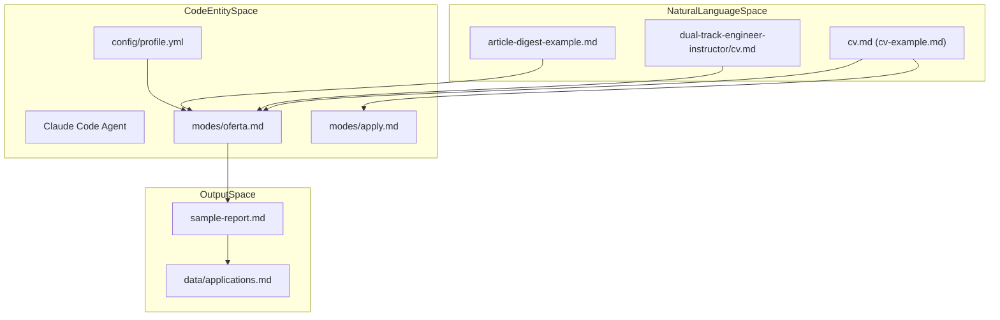
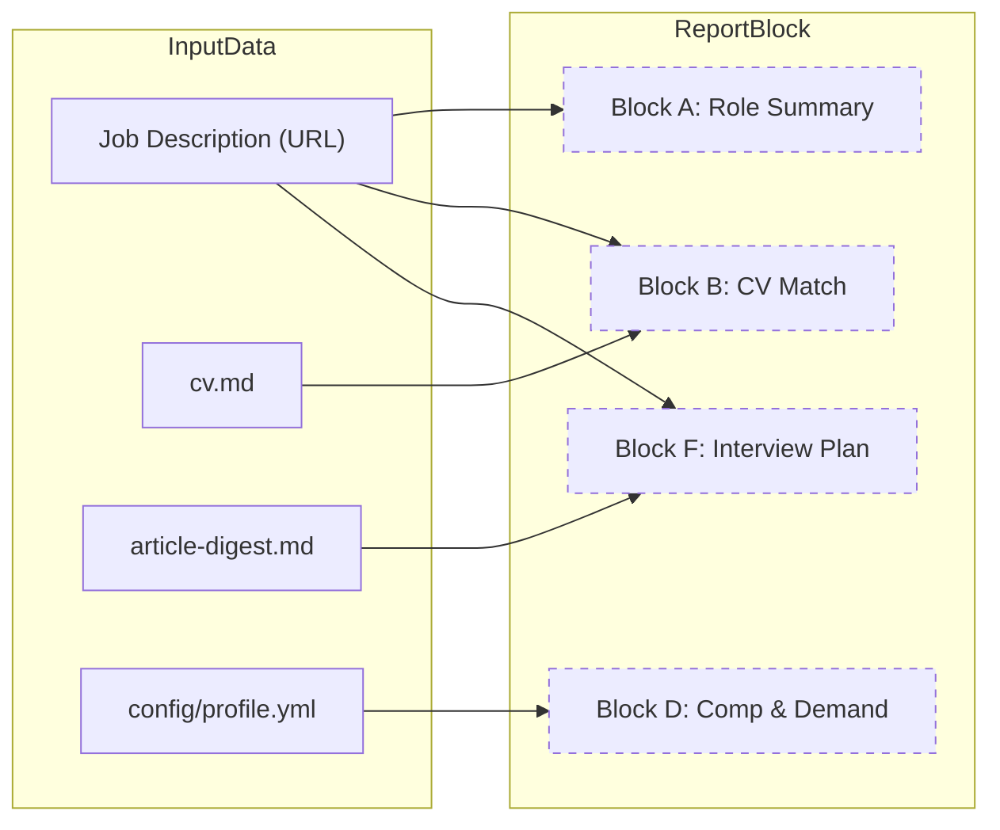

# 예제 및 샘플 파일

관련 소스 파일

다음 파일들이 이 위키 페이지를 생성하기 위한 컨텍스트로 사용되었습니다:

- [examples/article-digest-example.md](examples/article-digest-example.md)
- [examples/cv-example.md](examples/cv-example.md)
- [examples/dual-track-engineer-instructor/README.md](examples/dual-track-engineer-instructor/README.md)
- [examples/dual-track-engineer-instructor/cv.md](examples/dual-track-engineer-instructor/cv.md)
- [examples/dual-track-engineer-instructor/profile.yml](examples/dual-track-engineer-instructor/profile.yml)
- [examples/sample-report.md](examples/sample-report.md)

이 페이지는 `examples/` 디렉터리에 있는 참조 파일에 대한 기술적 walkthrough를 제공합니다. 이 파일들은 Career-Ops 시스템의 구조적 청사진 역할을 하며, 후보자 데이터, 프로젝트 근거, AI 에이전트가 생성하는 최종 평가 출력의 예상 스키마를 정의합니다.

## 1. Examples 디렉터리 개요

`examples/` 디렉터리에는 원시 후보자 정보에서 구조화된 평가 보고서로 이어지는 데이터 흐름을 보여주는 파일들이 포함되어 있습니다. 단일 트랙 및 듀얼 트랙 커리어 예제가 모두 포함됩니다.

| 파일 | 역할 | 형식 | 사용 방식 |
|:---|:---|:---|:---|
| `cv-example.md` | Source of Truth | Markdown | `oferta` 및 `apply` 모드의 입력 [examples/cv-example.md:1-49](). |
| `article-digest-example.md` | Evidence Bank | Markdown | 심층 평가를 위한 맥락적 "Proof Points" [examples/article-digest-example.md:1-41](). |
| `sample-report.md` | 출력 스키마 | Markdown | 표준 A-F 평가 구조 [examples/sample-report.md:1-76](). |
| `dual-track-engineer-instructor/` | 고급 구성 | Directory | 두 가지 주요 archetype을 가진 후보자를 위한 참조 [examples/dual-track-engineer-instructor/README.md:1-22](). |

### 데이터 흐름 아키텍처
다음 다이어그램은 이러한 예제 파일들이 핵심 시스템 엔티티 및 처리 모드와 어떻게 연결되는지 보여줍니다.

**다이어그램: 예제 파일 통합**

Sources: [examples/cv-example.md:1-49](), [examples/article-digest-example.md:1-41](), [examples/sample-report.md:1-76](), [examples/dual-track-engineer-instructor/README.md:1-22]()

---

## 2. CV 구조(`cv-example.md` 및 `cv.md`)

시스템은 Markdown 기반 CV를 Job Description(JD)에 대해 기술을 매칭하는 주요 컨텍스트로 사용합니다.

### 주요 구성 요소
*   **헤더 메타데이터:** `apply` 모드가 웹 양식을 작성하는 데 사용하는 연락처 정보와 소셜 링크를 포함합니다 [examples/cv-example.md:1-8]().
*   **Professional Summary:** `oferta` 모드가 "Candidate's natural level"을 판단하는 데 사용하는 상위 수준의 narrative입니다 [examples/cv-example.md:9-11]().
*   **Work Experience:** 성과의 글머리표 목록입니다. 시스템은 CV Match 블록을 위한 특정 "Source" 인용을 찾기 위해 이를 파싱합니다 [examples/cv-example.md:13-32]().
*   **Dual-Track Variant:** 하이브리드 역할(예: Engineer + Instructor)을 가진 후보자를 위해 `examples/dual-track-engineer-instructor/`의 `cv.md`는 요약에서 두 트랙을 모두 명명하고 역할 내 bullet을 혼합하는 "Layered" 접근 방식을 보여줍니다 [examples/dual-track-engineer-instructor/cv.md:1-11](), [examples/dual-track-engineer-instructor/README.md:51-57]().

Sources: [examples/cv-example.md:1-49](), [examples/dual-track-engineer-instructor/cv.md:1-81]()

---

## 3. Article Digest 및 Proof Points(`article-digest-example.md`)

`article-digest-example.md`는 "Story Bank" 또는 "Evidence Bank" 역할을 합니다. `cv.md`가 간결성을 위해 최적화되어 있는 반면, digest는 평가의 Block F(Interview Plan)에 필요한 "Proof Points"를 제공합니다.

### 구현 세부 사항: "Hero Metrics" 패턴
digest의 각 프로젝트는 특정 패턴을 따릅니다:
1.  **Hero Metrics:** 정량화 가능한 영향(예: "99.7% precision", "$2M/year saved") [examples/article-digest-example.md:9]().
2.  **Architecture:** 기술 스택과 데이터 흐름(예: "Kafka Streams → XGBoost") [examples/article-digest-example.md:11]().
3.  **Key Decisions:** 트레이드오프 분석(예: "streaming over batch") [examples/article-digest-example.md:13-16]().
4.  **Proof Points:** 외부 검증(GitHub stars, conference talks) [examples/article-digest-example.md:18-22]().

`oferta` 모드는 최종 보고서에서 STAR(Situation, Task, Action, Result) 스토리를 생성하기 위해 이 파일에서 내용을 가져옵니다 [examples/sample-report.md:64-68]().

Sources: [examples/article-digest-example.md:1-41](), [examples/sample-report.md:64-68]()

---

## 4. A-F 평가 보고서(`sample-report.md`)

`sample-report.md`는 `oferta` 또는 `auto-pipeline` 모드의 대표적인 출력입니다. 채용 기회를 점수화하는 데 사용되는 6개 블록 평가 구조를 보여줍니다.

### 블록별 기술 분석

| 블록 | 제목 | 코드 엔티티 / 목적 |
|:---|:---|:---|
| **A** | **Role Summary** | JD에서 Archetype, Seniority, "TL;DR"을 추출합니다 [examples/sample-report.md:11-21](). |
| **B** | **CV Match** | JD 요구사항과 `cv.md` line item 간의 매핑 표 [examples/sample-report.md:23-31](). |
| **C** | **Level & Strategy** | "Detected level"과 "Natural level"을 비교해 "Sell Plan"을 만듭니다 [examples/sample-report.md:39-45](). |
| **D** | **Comp & Demand** | 시장 조사 데이터 포인트(예: Levels.fyi ranges) [examples/sample-report.md:46-52](). |
| **E** | **Personalization** | ATS 및 recruiter 매칭을 극대화하기 위한 CV 수정 제안 [examples/sample-report.md:54-61](). |
| **F** | **Interview Plan** | JD 요구사항에 매핑된 STAR 스토리 [examples/sample-report.md:62-70](). |

### 시스템 이름 매핑
다음 다이어그램은 보고서의 논리적 섹션을 데이터 소스 및 처리 로직에 매핑합니다.

**다이어그램: 보고서 데이터 매핑**

Sources: [examples/sample-report.md:1-76](), [examples/cv-example.md:1-49](), [examples/article-digest-example.md:1-41](), [examples/dual-track-engineer-instructor/profile.yml:91-109]()

---

## 5. Dual-Track 구성(`profile.yml`)

`examples/dual-track-engineer-instructor/profile.yml`은 여러 커리어 경로를 동시에 추구하는 후보자를 위해 시스템을 구성하는 방법을 보여줍니다.

*   **Archetypes:** 여러 `fit: primary` 항목을 정의합니다. 평가기(`oferta` 모드)는 JD에 가장 가까운 항목을 선택합니다 [examples/dual-track-engineer-instructor/profile.yml:22-39]().
*   **Alternate Ranges:** `alternate_ranges` 블록을 통해 서로 다른 트랙(예: "teaching" vs "engineering")에 대한 별도의 보상 목표를 제공합니다 [examples/dual-track-engineer-instructor/profile.yml:98-108]().
*   **Narrative:** 두 트랙을 하나의 가치 제안으로 연결하는 결합 headline과 exit story [examples/dual-track-engineer-instructor/profile.yml:56-60]().

### 이의 처리
듀얼 트랙 예제에는 과도한 자격에 대한 우려나 "왜 하나만 선택하지 않나?" 같은 하이브리드 CV로 인해 발생하는 면접 이의를 처리하기 위한 playbook 역할을 하는 `README.md`가 포함되어 있습니다 [examples/dual-track-engineer-instructor/README.md:66-87]().

Sources: [examples/dual-track-engineer-instructor/profile.yml:1-116](), [examples/dual-track-engineer-instructor/README.md:1-107]()
