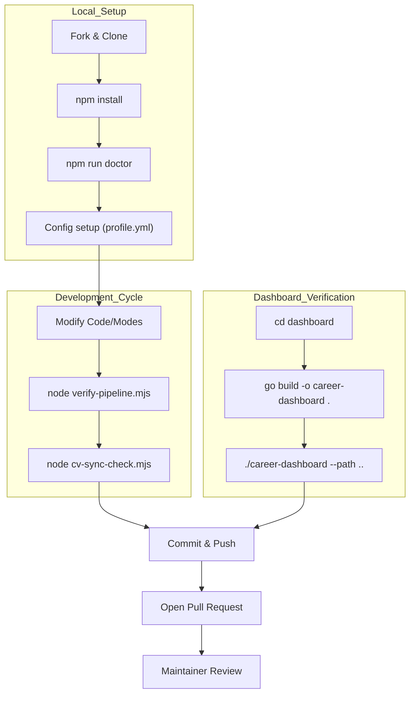
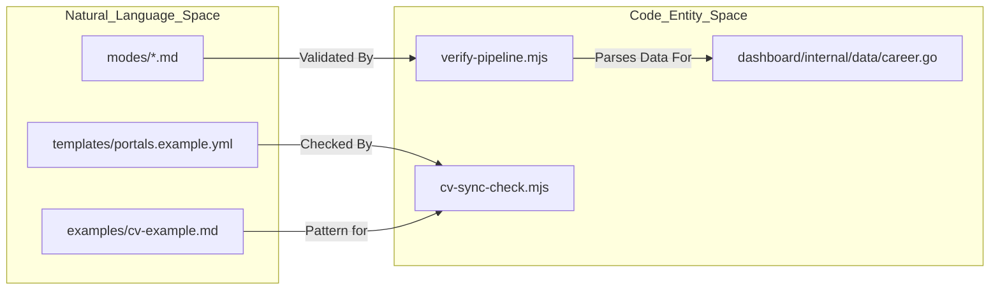

# Contributing 및 Community

관련 소스 파일

다음 파일들은 이 위키 페이지를 생성하기 위한 컨텍스트로 사용되었습니다.

- [.github/FUNDING.yml](.github/FUNDING.yml)
- [.github/ISSUE_TEMPLATE/bug_report.yml](.github/ISSUE_TEMPLATE/bug_report.yml)
- [.github/ISSUE_TEMPLATE/config.yml](.github/ISSUE_TEMPLATE/config.yml)
- [.github/ISSUE_TEMPLATE/feature_request.yml](.github/ISSUE_TEMPLATE/feature_request.yml)
- [.github/ISSUE_TEMPLATE/i-got-hired.yml](.github/ISSUE_TEMPLATE/i-got-hired.yml)
- [CITATION.cff](CITATION.cff)
- [CODE_OF_CONDUCT.md](CODE_OF_CONDUCT.md)
- [CONTRIBUTING.md](CONTRIBUTING.md)
- [CONTRIBUTORS.md](CONTRIBUTORS.md)
- [GOVERNANCE.md](GOVERNANCE.md)
- [LEGAL_DISCLAIMER.md](LEGAL_DISCLAIMER.md)
- [SECURITY.md](SECURITY.md)
- [SUPPORT.md](SUPPORT.md)
- [TRADEMARK.md](TRADEMARK.md)

이 페이지는 Career-Ops ecosystem에 contribution하기 위한 protocol과 technical workflow를 설명합니다. 표준 fork/PR process, development environment verification, governance model, community contribution이 우선시되는 특정 영역을 다룹니다.

## Contribution Workflow

Career-Ops는 표준 GitHub flow를 따릅니다. 프로젝트의 prompt engineering 및 script structure가 이러한 환경에 최적화되어 있으므로, contributor는 development에 `claude code` 같은 AI assisted engineering tool을 사용하는 것이 권장됩니다 [CONTRIBUTING.md:1-3]().

### 표준 PR Process
1.  **Issue 열기**: coding 전에 issue에서 변경 사항을 논의해 project architecture와 정렬합니다 [CONTRIBUTING.md:7-9]().
2.  **Fork**: repository의 personal fork를 생성합니다 [CONTRIBUTING.md:20]().
3.  **Branch**: feature branch(예: `feature/my-feature`)를 생성합니다 [CONTRIBUTING.md:21]().
4.  **Develop**: 프로젝트의 minimal and simple 철학을 따라 변경 사항을 구현합니다 [CONTRIBUTING.md:15]().
5.  **Verify**: fresh clone으로 변경 사항을 test하고 전체 test suite를 실행합니다 [CONTRIBUTING.md:23]().
6.  **Submit**: 원래 issue를 참조하는 Pull Request를 엽니다 [CONTRIBUTING.md:25]().

### Development Health Checks
PR을 제출하기 전에 contributor는 모든 local validation이 통과하는지 확인해야 합니다. `package.json`은 이를 위한 여러 script를 정의합니다.

*   `npm run doctor`: local environment setup을 검증합니다 [CONTRIBUTING.md:60]().
*   `node verify-pipeline.mjs`: application tracker의 health 및 schema integrity를 check합니다 [CONTRIBUTING.md:61]().
*   `node cv-sync-check.mjs`: configuration file이 CV structure와 일치하는지 확인합니다 [CONTRIBUTING.md:62]().
*   `go build`: `dashboard/` directory의 TUI를 수정하는 경우 필요합니다 [CONTRIBUTING.md:65]().

### Contribution Lifecycle Diagram

다음 다이어그램은 local environment setup에서 upstream PR review까지의 transition을 보여줍니다.

**Code Contribution Flow**

출처: [CONTRIBUTING.md:17-25](), [CONTRIBUTING.md:58-67]()

---

## Targeted Contribution Areas

프로젝트는 "human-in-the-loop" 철학을 훼손하지 않으면서 tool의 utility를 향상시키는 contribution을 우선시합니다.

### Good First Contributions
이 task들은 newcomer에게 적합하며 프로젝트의 도달 범위를 넓히는 데 도움이 됩니다.
*   **Portal Expansion**: target company를 `templates/portals.example.yml`에 추가합니다 [CONTRIBUTING.md:30]().
*   **Localization**: `modes/`에 있는 skill mode를 새로운 language로 번역합니다 [CONTRIBUTING.md:31]().
*   **Documentation**: guide를 개선하거나 industry-specific advice를 추가합니다 [CONTRIBUTING.md:32]().
*   **Examples**: 다양한 role에 대한 fictional `cv.md` sample을 `examples/` folder에 추가합니다 [CONTRIBUTING.md:33]().

### Advanced Contributions
더 큰 architectural change는 core logic과 TUI를 포함합니다.
*   **Evaluation Logic**: Markdown mode에서 scoring dimension 또는 archetype detection을 정교화합니다 [CONTRIBUTING.md:37]().
*   **Dashboard Features**: `dashboard/`의 Go 기반 TUI를 향상시킵니다 [CONTRIBUTING.md:38]().
*   **Utility Scripts**: data merging, deduplication 또는 PDF generation을 위한 `.mjs` tool을 개선합니다 [CONTRIBUTING.md:40]().

### 허용되지 않는 Contribution
ethical 및 legal standard를 유지하기 위해 프로젝트는 다음 PR을 거부합니다.
*   automated access를 금지하는 platform(예: LinkedIn)을 scrape하는 PR [CONTRIBUTING.md:51]().
*   human review 없이 application auto-submission을 가능하게 하는 PR [CONTRIBUTING.md:52]().
*   실제 personal data(PII)를 포함하는 PR [CONTRIBUTING.md:54]().

출처: [CONTRIBUTING.md:27-41](), [CONTRIBUTING.md:49-55]()

---

## Technical Guidelines 및 Governance

### Data Contract 및 Privacy
시스템은 "System Layer"(code, modes, templates)와 "User Layer"(personal data) 사이에 엄격한 boundary를 강제합니다.
*   **User Files**: `cv.md`, `profile.yml`, `applications.md` 같은 파일은 gitignore 처리되며 절대 commit되어서는 안 됩니다 [CONTRIBUTING.md:47]().
*   **Acceptable Use**: user는 모든 AI-generated content를 검증하고 third-party Terms of Service를 준수할 책임이 있습니다 [LEGAL_DISCLAIMER.md:22-34]().

### Contributor Ladder
Career-Ops는 명확한 advancement path가 있는 **Benevolent Dictator for Life (BDFL)** model을 사용합니다 [GOVERNANCE.md:3-5]().

| Role | Requirement | Responsibilities |
| :--- | :--- | :--- |
| **Participant** | 모두 여기서 시작 | issue 열기, Discord에서 돕기, bug report [GOVERNANCE.md:20-27](). |
| **Contributor** | merge된 PR 2개 이상 | release note에 등재, discussion에서 weighted input [GOVERNANCE.md:30-34](). |
| **Triager** | 지속적인 contribution | issue label 지정, duplicate close, PR change request [GOVERNANCE.md:36-43](). |
| **Reviewer** | quality PR 5개 이상 | PR approve, architectural discussion 참여 [GOVERNANCE.md:45-51](). |
| **Maintainer** | 6개월 이상 alignment | PR merge, version release, governance decision [GOVERNANCE.md:53-60](). |

### Trademark Policy
"career-ops" name은 trademark입니다. code는 MIT이지만, brand는 혼동을 방지하기 위해 관리됩니다 [TRADEMARK.md:7-13]().
*   **Permitted**: "Based on career-ops", "Fork of career-ops" [TRADEMARK.md:32-33]().
*   **Restricted**: "career-ops Cloud" 또는 "Official career-ops" 같은 commercial product name은 written permission이 필요합니다 [TRADEMARK.md:48-55]().

**System Entity Mapping**

출처: [GOVERNANCE.md:1-72](), [CONTRIBUTING.md:58-67](), [TRADEMARK.md:1-25]()

---

## Community Resources

### Issue Templates 및 Support
*   **Bug Reports**: OS, Node version, `npm run doctor` output을 포착하도록 구조화되어 있습니다 [.github/ISSUE_TEMPLATE/bug_report.yml:38-53]().
*   **Feature Requests**: area(Evaluation, PDF, Dashboard 등)별로 분류됩니다 [.github/ISSUE_TEMPLATE/feature_request.yml:33-47]().
*   **I Got Hired!**: user가 success story와 role을 얻는 데 도움이 된 feature를 공유하기 위한 template입니다 [.github/ISSUE_TEMPLATE/i-got-hired.yml:1-66]().
*   **Security**: vulnerability는 public issue로 열지 말고 `hi@santifer.io`로 email을 보내야 합니다 [SECURITY.md:5-7]().

### Legal 및 Ethics
모든 contributor는 **Code of Conduct** [CODE_OF_CONDUCT.md:3-7]() 및 `career-ops`가 hosted service가 아니라 local execution tool임을 강조하는 **Legal Disclaimer**를 준수해야 합니다 [LEGAL_DISCLAIMER.md:3-8]().

### Funding
프로젝트는 maintainer profile을 통한 GitHub Sponsors로 community support를 받습니다 [.github/FUNDING.yml:1-2]().

출처: [.github/ISSUE_TEMPLATE/bug_report.yml:1-54](), [.github/ISSUE_TEMPLATE/feature_request.yml:1-48](), [.github/ISSUE_TEMPLATE/i-got-hired.yml:1-66](), [SECURITY.md:1-14](), [CODE_OF_CONDUCT.md:1-44](), [LEGAL_DISCLAIMER.md:1-85]()
