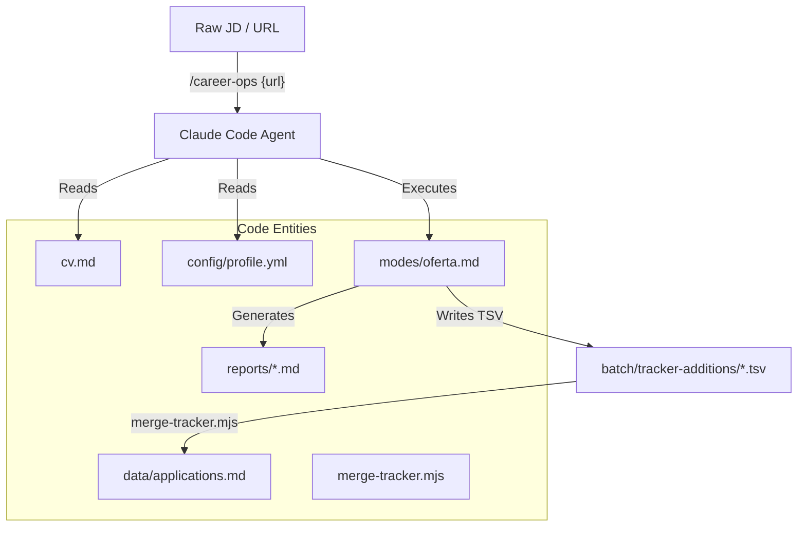
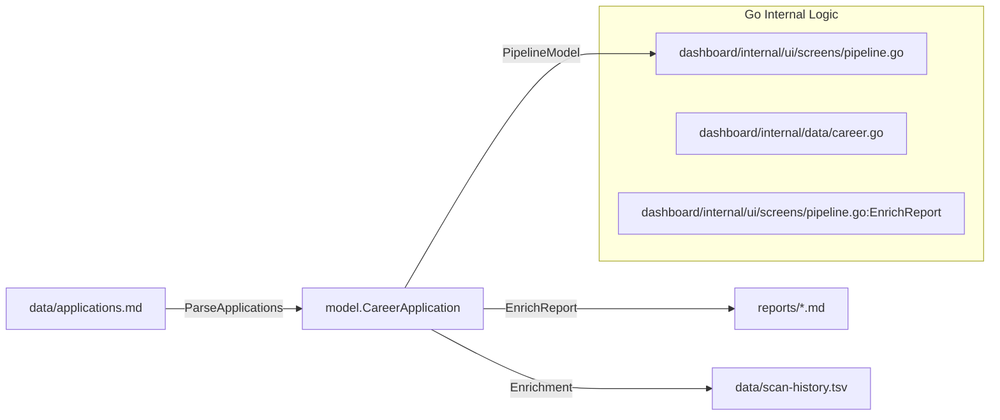

# Glossary

관련 소스 파일

다음 파일들은 이 위키 페이지를 생성하기 위한 컨텍스트로 사용되었습니다.

- [AGENTS.md](AGENTS.md)
- [DATA_CONTRACT.md](DATA_CONTRACT.md)
- [README.es.md](README.es.md)
- [README.md](README.md)
- [config/profile.example.yml](config/profile.example.yml)
- [dashboard/internal/data/career.go](dashboard/internal/data/career.go)
- [dashboard/internal/data/career_test.go](dashboard/internal/data/career_test.go)
- [dashboard/internal/ui/screens/pipeline.go](dashboard/internal/ui/screens/pipeline.go)
- [dashboard/internal/ui/screens/pipeline_test.go](dashboard/internal/ui/screens/pipeline_test.go)
- [dedup-tracker.mjs](dedup-tracker.mjs)
- [merge-tracker.mjs](merge-tracker.mjs)
- [modes/_shared.md](modes/_shared.md)
- [modes/auto-pipeline.md](modes/auto-pipeline.md)
- [modes/pdf.md](modes/pdf.md)
- [modes/scan.md](modes/scan.md)
- [modes/tr/README.md](modes/tr/README.md)
- [modes/tr/_shared.md](modes/tr/_shared.md)
- [modes/tr/basvuru.md](modes/tr/basvuru.md)
- [modes/tr/is-ilani.md](modes/tr/is-ilani.md)
- [modes/tr/pipeline.md](modes/tr/pipeline.md)
- [normalize-statuses.mjs](normalize-statuses.mjs)
- [scan.mjs](scan.mjs)
- [templates/cv-template.html](templates/cv-template.html)
- [templates/portals.example.yml](templates/portals.example.yml)
- [templates/states.yml](templates/states.yml)
- [update-system.mjs](update-system.mjs)
- [verify-pipeline.mjs](verify-pipeline.mjs)
- [writing-samples/README.md](writing-samples/README.md)

이 페이지는 `career-ops` codebase에서 사용되는 domain-specific term, abbreviation, architectural concept에 대한 technical reference를 제공합니다. engineer가 특정 logic과 data structure를 찾을 수 있도록 돕는 onboarding map 역할을 합니다.

## 핵심 시스템 개념

### Archetype
job offer를 미리 정의된 여러 career profile(예: AI Platform/LLMOps, Agentic/Automation, Technical AI PM, Solutions Architect) 중 하나로 분류하는 데 사용되는 classification system입니다. 이 classification은 scoring weight, CV tailoring strategy, interview story selection에 영향을 줍니다.
*   **Implementation**: `modes/_shared.md`에 정의되어 있으며 evaluation의 initial phase에서 감지됩니다.
*   **Data Flow**: evaluation의 첫 단계에서 감지되어 `_profile.md`의 특정 proof point를 load합니다.
*   **출처**: [modes/_shared.md:74-88](), [modes/oferta.md:5-10]()

### A-F Evaluation
모든 job description에 대해 AI가 생성하는 표준화된 6-block reporting structure입니다.
*   **Block A**: Role Summary (Metadata, TL;DR, Remote status, Legitimacy tier).
*   **Block B**: CV Match (Requirement mapping 및 gap mitigation).
*   **Block C**: Level Strategy (Seniority positioning 및 archetype fit).
*   **Block D**: Comp & Demand (Market research 및 salary target).
*   **Block E**: Personalization Plan (구체적인 CV/LinkedIn edit 및 keyword injection).
*   **Block F**: Interview Prep (STAR+R story 및 technical challenge).
*   **출처**: [modes/oferta.md:12-88](), [README.md:68-72](), [modes/_shared.md:27-46]()

### STAR+R
**Reflection**을 추가한 STAR(Situation, Task, Action, Result) interview technique의 확장입니다. 시스템은 과거 경험에서 learned lesson, architectural trade-off 또는 impact analysis를 추출해 seniority를 드러내는 데 이를 사용합니다.
*   **출처**: [modes/oferta.md:67-75](), [README.md:72-72](), [modes/_shared.md:65-66]()

---

## Data Entities 및 Files

| Term | File Path | Description |
| :--- | :--- | :--- |
| **Application Tracker** | `data/applications.md` | 모든 evaluation history와 status를 포함하는 flat-file Markdown database입니다. |
| **Story Bank** | `interview-prep/story-bank.md` | 모든 high-score evaluation 중 새 entry를 축적하는 STAR+R story의 persistent repository입니다. |
| **Scan History** | `data/scan-history.tsv` | portal scanner가 동일한 job URL을 다시 처리하지 않도록 사용하는 deduplication log입니다. |
| **Profile Config** | `config/profile.yml` | prompt를 hydrate하는 데 사용되는 user-specific identity data(name, target role, salary range)입니다. |
| **Portals Config** | `portals.yml` | 3-level discovery strategy(Playwright, API, WebSearch)를 포함하는 scanner configuration입니다. |
| **Data Contract** | `DATA_CONTRACT.md` | "System Layer"(update 가능)와 "User Layer"(protected)를 구분하는 specification입니다. |

**출처**: [DATA_CONTRACT.md:5-24](), [README.md:151-164](), [update-system.mjs:92-105]()

---

## Technical Workflows

### 1. Evaluation Pipeline
raw Job Description(JD)에서 structured report 및 tracker entry로 전환되는 과정입니다.

**Natural Language to Code Entity Space: Evaluation**

**출처**: [modes/oferta.md:92-158](), [README.md:102-120](), [modes/_shared.md:115-116](), [merge-tracker.mjs:1-15]()

### 2. Data Integrity 및 Maintenance
`applications.md` 파일을 consistent하고 deduplicated된 상태로 유지하며 batch result와 synchronized되도록 하는 데 사용되는 script입니다.

*   **Merge**: `merge-tracker.mjs`는 `batch/tracker-additions/`의 TSV 파일을 ingest하고 duplicate를 방지하기 위해 fuzzy role matching을 처리합니다. [merge-tracker.mjs:1-15]()
*   **Dedup**: `dedup-tracker.mjs`는 normalized company name으로 grouping하고 highest score를 유지하여 redundant entry를 제거합니다. 또한 status promotion(예: "Evaluated"보다 "Applied" 유지)을 처리합니다. [merge-tracker.mjs:130-151]()
*   **Normalize**: `normalize-statuses.mjs`는 모든 application state가 canonical ID와 일치하도록 보장하고, markdown bolding을 제거하며, note를 이동합니다. [merge-tracker.mjs:39-68]()
*   **Verify**: `verify-pipeline.mjs`는 전체 pipeline에 대한 health check(broken link, non-canonical state, formatting error)를 실행합니다. [update-system.mjs:59-60]()

---

## Dashboard Terms (Go TUI)

### PipelineModel
filtering, sorting, report summary의 lazy-loading을 포함해 TUI의 state를 관리하는 Go dashboard(`dashboard/internal/ui/screens/pipeline.go`)의 primary data structure입니다.
*   **출처**: [dashboard/internal/ui/screens/pipeline.go:102-121]()

### Report Enrichment
모든 scroll에서 file을 다시 parse하지 않고 instant preview를 제공하기 위해 Markdown report에서 metadata(Archetype, TL;DR, Remote, Comp)를 Go TUI cache로 lazy-load하는 process입니다.
*   **출처**: [dashboard/internal/ui/screens/pipeline.go:166-173]()

**Natural Language to Code Entity Space: Dashboard Data Flow**

**출처**: [dashboard/internal/ui/screens/pipeline.go:124-139](), [dashboard/internal/ui/screens/pipeline.go:166-173](), [dashboard/internal/ui/screens/pipeline_test.go:26-51]()

---

## Canonical Application States

시스템은 Node.js script와 Go Dashboard 사이의 consistency를 보장하기 위해 application에 엄격한 state machine을 적용합니다.

| State ID | Label | Description |
| :--- | :--- | :--- |
| `evaluated` | Evaluated | AI analysis 이후의 initial state입니다. |
| `applied` | Applied | company에 application을 제출한 상태입니다. |
| `responded` | Responded | recruiter 또는 automated response를 받은 상태입니다. |
| `interview` | Interview | active interview stage입니다. |
| `offer` | Offer | financial offer를 받은 상태입니다. |
| `rejected` | Rejected | terminal state(Company side)입니다. |
| `discarded` | Discarded | terminal state(Candidate side)입니다. |
| `skip` | SKIP | candidate 또는 AI에 의해 filtered out된 상태입니다. |

**출처**: [merge-tracker.mjs:37-37](), [dashboard/internal/ui/screens/pipeline.go:96-99](), [templates/states.yml:1-10]()
