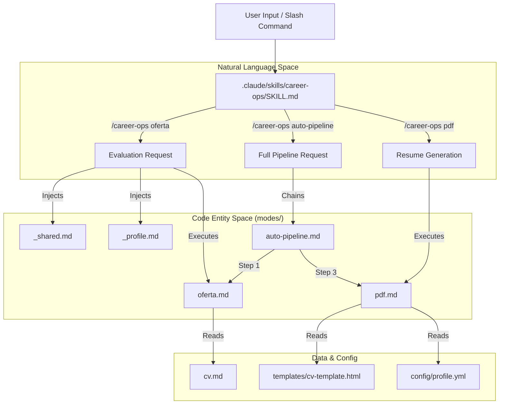
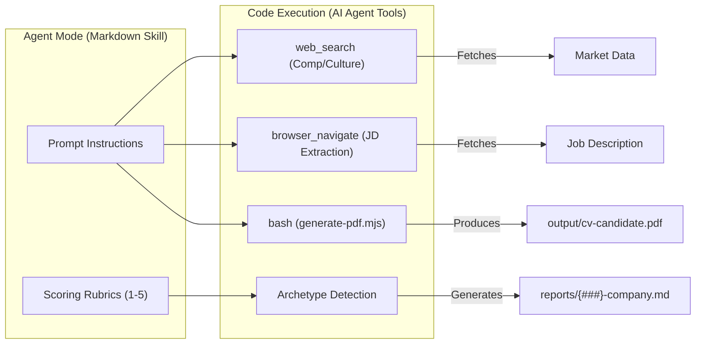

# AI 에이전트 모드

관련 소스 파일

다음 파일들이 이 위키 페이지를 생성하기 위한 컨텍스트로 사용되었습니다:

- [AGENTS.md](AGENTS.md)
- [config/profile.example.yml](config/profile.example.yml)
- [interview-prep/story-bank.md](interview-prep/story-bank.md)
- [modes/_shared.md](modes/_shared.md)
- [modes/auto-pipeline.md](modes/auto-pipeline.md)
- [modes/oferta.md](modes/oferta.md)
- [modes/pdf.md](modes/pdf.md)
- [modes/tr/README.md](modes/tr/README.md)
- [modes/tr/_shared.md](modes/tr/_shared.md)
- [modes/tr/basvuru.md](modes/tr/basvuru.md)
- [modes/tr/is-ilani.md](modes/tr/is-ilani.md)
- [modes/tr/pipeline.md](modes/tr/pipeline.md)
- [templates/cv-template.html](templates/cv-template.html)

`career-ops` 시스템은 `modes/` 디렉터리에 Markdown 파일로 정의된 "Skill Modes" 모음에 의해 구동됩니다. 이 파일들은 AI 에이전트의 "두뇌" 역할을 하며, `/career-ops` 제품군의 모든 하위 명령에 대한 구체적인 지침, 평가 루브릭, 행동 가이드라인을 제공합니다 [AGENTS.md:45-48]().

로직을 이러한 Markdown skill로 분리함으로써, 시스템은 기본 실행 엔진을 변경하지 않고도 채용 적합도를 채점하는 방식부터 LinkedIn 아웃리치 초안을 작성하는 방식까지 에이전트 동작을 깊이 커스터마이즈할 수 있습니다.

### Skill 아키텍처

사용자가 명령(예: `/career-ops scan`)을 호출하면 에이전트 라우터가 요청된 모드를 식별하고 해당 컨텍스트를 로드합니다. 이 아키텍처는 일관성을 유지하면서도 작업별 유연성을 허용하기 위해 "Shared + Specific" 패턴을 따릅니다.

1.  **공유 컨텍스트(`_shared.md`)**: 시스템 규칙, 채점 로직, 도구 구성에 관한 "Source of Truth"를 제공하기 위해 대부분의 모드에 주입됩니다 [modes/_shared.md:1-10]().
2.  **사용자 프로필(`_profile.md`)**: 온보딩 중 `modes/_profile.template.md`에서 복사되는 사용자 계층 파일로, 개인 archetype, narrative, 협상 스크립트를 통해 `_shared.md`의 기본값을 재정의합니다 [AGENTS.md:78-81](), [modes/_shared.md:18-23]().
3.  **모드별 로직**: 명령에 해당하는 개별 `.md` 파일(예: `oferta.md`, `pdf.md`)로, 해당 작업을 위한 구체적인 프롬프트 엔지니어링을 포함합니다.

**Sources:** [AGENTS.md:11-23](), [modes/_shared.md:1-24]()

---

### 공유 컨텍스트 계층(`_shared.md`)

`modes/_shared.md` 파일은 에이전트 추론의 기반 계층입니다. 에이전트가 채용 공고를 평가하든 메시지를 작성하든 일관된 "North Star"를 유지하도록 보장합니다.

*   **Archetype 감지**: 특정 역할(예: "AI Platform / LLMOps", "Agentic / Automation", "Technical AI PM")과 에이전트가 Job Description(JD)에서 찾아야 하는 핵심 신호를 정의합니다 [modes/_shared.md:74-86]().
*   **채점 시스템**: CV Match, North Star alignment, Compensation, Cultural signals, Red flags를 측정하는 6개 블록(A-F) 평가 루브릭을 설정합니다 [modes/_shared.md:26-38]().
*   **Source of Truth**: 에이전트가 하드코딩된 지표에 의존하지 않고 평가 시점에 `cv.md`, `config/profile.yml`, `article-digest.md`를 반드시 읽어야 한다는 엄격한 규칙을 강제합니다 [modes/_shared.md:11-22]().
*   **Posting Legitimacy(Block G)**: 게시 연령, 기술 구체성, 최근 해고 뉴스에 기반해 채용 공고가 실제인지 또는 "ghost job"인지 평가하는 프레임워크를 제공합니다 [modes/_shared.md:46-67]().

**Sources:** [modes/_shared.md:1-115]()

---

### 모드 그룹

다양한 모드는 구직 라이프사이클에서의 역할에 따라 분류됩니다. 각 그룹에 대한 자세한 기술 문서는 아래에 연결된 하위 페이지에서 확인할 수 있습니다.

#### [2.1 평가 모드(oferta, ofertas, auto-pipeline)](#)
이 모드들은 Job Description의 수집과 분석을 처리합니다. 표준화된 6개 블록(A-F) 평가 구조를 사용하며, 게시물 합법성을 평가하는 "Block G"를 포함합니다 [modes/oferta.md:1-4](). `auto-pipeline.md`는 URL에서 PDF까지 완전 자동 처리를 위한 순서를 정의합니다 [modes/auto-pipeline.md:1-4]().
*   **핵심 엔티티**: `modes/oferta.md`, `modes/auto-pipeline.md`, `reports/`.
*   자세한 내용은 [평가 모드(oferta, ofertas, auto-pipeline)](#2.1)를 참조하세요.

#### [2.2 발견 및 파이프라인 모드(scan, pipeline)](#)
새 기회를 찾는 데 중점을 둡니다. `scan` 모드는 `scan.mjs`를 통해 ATS API를 직접 호출하고 [AGENTS.md:67-67](), `pipeline`은 `data/pipeline.md`에 대기 중인 URL을 처리합니다 [modes/tr/pipeline.md:1-3]().
*   **핵심 엔티티**: `scan.mjs`, `portals.yml`, `data/pipeline.md`, `data/scan-history.tsv`.
*   자세한 내용은 [발견 및 파이프라인 모드(scan, pipeline)](#2.2)를 참조하세요.

#### [2.3 지원 및 아웃리치 모드(apply, contacto, tracker, followup)](#)
검색의 능동적 단계를 지원합니다. 실시간 양식 작성을 위한 `apply`(또는 터키어의 `basvuru.md`) [modes/tr/basvuru.md:1-3](), 그리고 `generate-pdf.mjs`를 사용해 ATS 최적화 이력서를 생성하는 `pdf.md`가 포함됩니다 [modes/pdf.md:1-22]().
*   **핵심 엔티티**: `modes/pdf.md`, `generate-pdf.mjs`, `data/applications.md`, `followup-cadence.mjs`.
*   자세한 내용은 [지원 및 아웃리치 모드(apply, contacto, tracker, followup)](#2.3)를 참조하세요.

#### [2.4 커리어 개발 모드(deep, training, project, patterns)](#)
장기 성장을 위한 지원 모드입니다. `deep`은 면접 인텔리전스를 위한 조사를 수행하고, `analyze-patterns.mjs`는 거절 데이터를 처리해 기술 스택 격차를 식별합니다 [AGENTS.md:64-65]().
*   **핵심 엔티티**: `interview-prep/story-bank.md`, `analyze-patterns.mjs`, `followup-cadence.mjs`.
*   자세한 내용은 [커리어 개발 모드(deep, training, project, patterns)](#2.4)를 참조하세요.

#### [2.5 국제화(i18n 모드)](#)
특정 지역 시장, 법적 프레임워크(예: 터키의 SGK, TÜFE), 언어에 맞춰 평가 및 지원 로직을 조정하는 현지화된 하위 디렉터리(예: `modes/tr/`, `modes/ja/`)입니다 [modes/tr/README.md:1-15]().
*   자세한 내용은 [국제화(i18n 모드)](#2.5)를 참조하세요.

---

### 에이전트 모드 흐름

다음 다이어그램은 시스템이 자연어 요청을 에이전트 동작을 제어하는 특정 코드 엔티티(Markdown skill) 및 도구와 어떻게 연결하는지 보여줍니다.

**시스템 모드 라우팅 및 컨텍스트 브리지**

**Sources:** [modes/_shared.md:11-23](), [modes/auto-pipeline.md:1-35](), [modes/pdf.md:1-22]()

**에이전트 상호작용 및 도구 사용**

**Sources:** [modes/_shared.md:118-129](), [modes/pdf.md:19-22](), [modes/oferta.md:149-153]()

**Sources:** [AGENTS.md:1-81](), [modes/_shared.md:1-115](), [modes/pdf.md:1-94](), [modes/auto-pipeline.md:1-76]()
