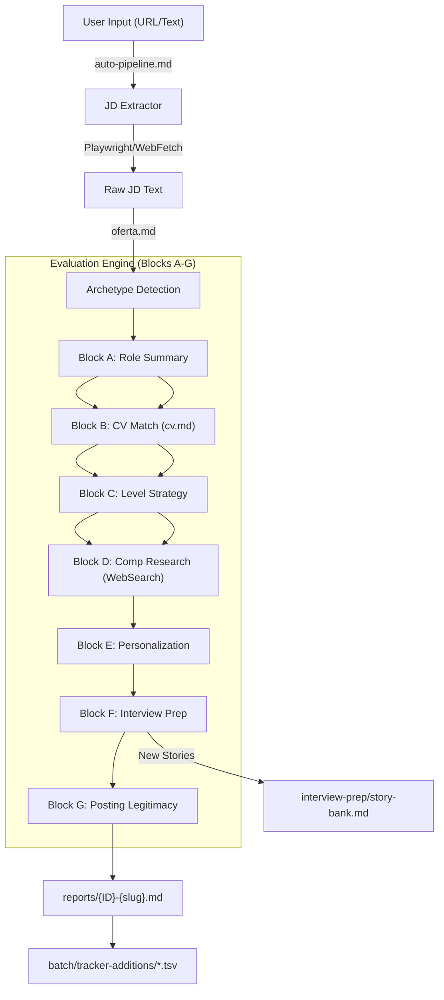
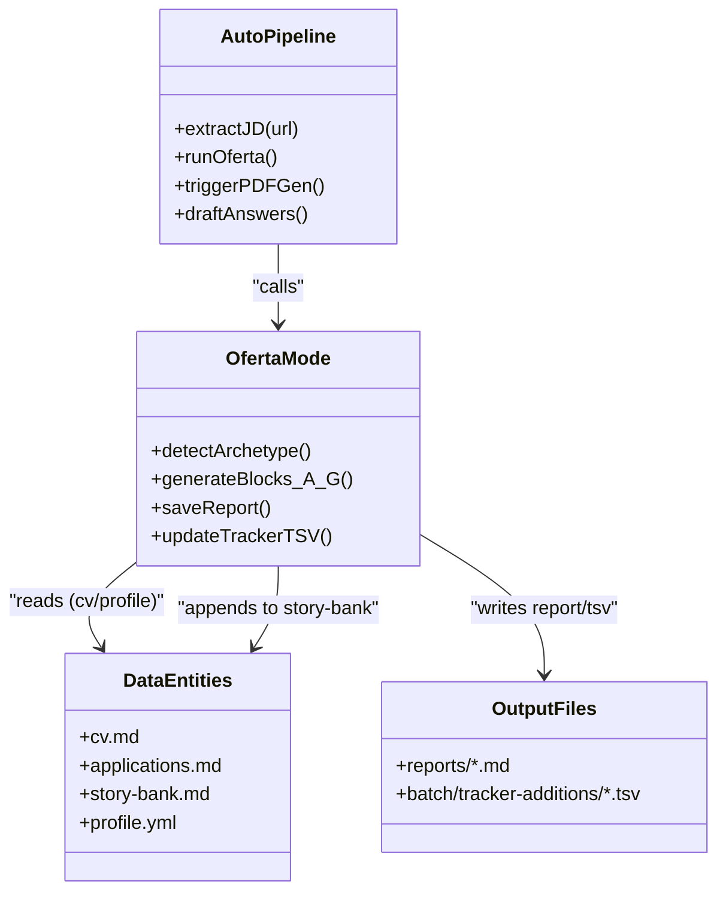

# 평가 모드(oferta, ofertas, auto-pipeline)

관련 소스 파일

다음 파일들이 이 위키 페이지를 생성하기 위한 컨텍스트로 사용되었습니다:

- [.env.example](.env.example)
- [config/profile.example.yml](config/profile.example.yml)
- [gemini-eval.mjs](gemini-eval.mjs)
- [interview-prep/story-bank.md](interview-prep/story-bank.md)
- [modes/_shared.md](modes/_shared.md)
- [modes/auto-pipeline.md](modes/auto-pipeline.md)
- [modes/oferta.md](modes/oferta.md)
- [modes/ofertas.md](modes/ofertas.md)
- [modes/pdf.md](modes/pdf.md)
- [templates/cv-template.html](templates/cv-template.html)

이 페이지는 `career-ops`의 핵심 평가 엔진을 기술적으로 깊이 설명합니다. 이 모드들은 원시 직무 설명(JD)을 후보자 프로필에 매핑하고, 전략적 정렬도를 계산하며, 면접 자료를 준비함으로써 구조화되고 실행 가능한 인텔리전스로 변환합니다.

## 평가 워크플로

평가 프로세스는 초기 수집에서 장기 추적까지 이어지도록 결정론적이고 포괄적으로 설계되어 있습니다. 시스템은 단일 공고 심층 분석(`oferta`), 비교 분석(`ofertas`), 완전 자동화된 엔드투엔드 실행(`auto-pipeline`)을 지원합니다.

### 데이터 흐름 개요

다음 다이어그램은 Job Description이 시스템 엔티티를 통해 처리되어 원시 입력에서 구조화된 보고서와 장기 저장소로 이동하는 방식을 보여줍니다.

**다이어그램: JD 수집에서 보고서 생성까지**

**Sources:** [modes/oferta.md:3-90](), [modes/auto-pipeline.md:3-23](), [modes/oferta.md:141-158](), [modes/_shared.md:115-115]()

---

## 1. 핵심 평가: `modo: oferta`

`oferta` 모드는 평가의 원자적 단위입니다. 전략적 차원이 누락되지 않도록 엄격한 7개 블록 구조(A-G)를 따릅니다.

### Step 0: Archetype 감지
평가가 시작되기 전에 에이전트는 역할을 `_shared.md`에 정의된 표준 archetype 중 하나로 분류합니다. 이 분류는 이후 블록의 우선순위를 바꾸는 "전략 필터" 역할을 합니다.
*   **AI Platform / LLMOps:** 관측 가능성, 신뢰성, 파이프라인에 집중합니다 [modes/_shared.md:80-80]().
*   **Agentic / Automation:** 오케스트레이션, HITL, multi-agent 시스템을 우선시합니다 [modes/_shared.md:81-81]().
*   **Technical AI PM:** 제품 발견, 로드맵, 지표를 우선시합니다 [modes/oferta.md:30-30]().
*   **AI Solutions Architect:** 시스템 설계와 엔터프라이즈 통합에 집중합니다 [modes/oferta.md:29-29]().
*   **AI Forward Deployed:** 전달 속도와 고객 대면 프로토타이핑을 우선시합니다 [modes/oferta.md:28-28]().
*   **AI Transformation:** 변화 관리와 조직적 도입에 집중합니다 [modes/oferta.md:33-33]().

**Sources:** [modes/oferta.md:5-10](), [modes/_shared.md:74-87]()

### 7개 블록 구조

| Block | 이름 | 기술적 구현 |
| :--- | :--- | :--- |
| **A** | **Role Summary** | 메타데이터(Seniority, Remote, Team size)와 1문장 TL;DR을 추출합니다 [modes/oferta.md:12-21](). |
| **B** | **CV Match** | JD 요구사항을 `cv.md`의 정확한 line에 매핑합니다. 완화 계획이 포함된 **Gaps**를 식별합니다 [modes/oferta.md:23-40](). |
| **C** | **Level Strategy** | JD level과 natural level을 비교합니다. "Sell Senior without Lying" 스크립트와 "Downlevel" 협상 계획을 만듭니다 [modes/oferta.md:41-46](). |
| **D** | **Comp & Demand** | 실시간 급여 데이터와 수요 추세를 찾기 위해 `WebSearch`(Glassdoor, Levels.fyi)를 실행합니다 [modes/oferta.md:47-54](). |
| **E** | **Personalization** | 특정 archetype에 대한 매칭을 극대화하기 위해 CV와 LinkedIn에 적용할 상위 5개 변경 사항 [modes/oferta.md:56-64](). |
| **F** | **Interview Prep** | 6-10개의 **STAR+R** 스토리를 생성합니다. **R (Reflection)**은 seniority를 나타냅니다 [modes/oferta.md:65-87](). |
| **G** | **Posting Legitimacy** | "Ghost Job" 신호(Freshness, JD quality, Layoff news)에 대한 정성 평가 [modes/oferta.md:88-143](). |

**Sources:** [modes/oferta.md:12-143](), [modes/_shared.md:28-71]()

---

## 2. 자동화: `modo: auto-pipeline`

`auto-pipeline` 모드는 URL에서 PDF까지 무접촉 경험을 제공하기 위해 평가와 유틸리티 스크립트를 연결합니다.

### JD 추출 전략
URL이 제공되면 시스템은 우선순위가 지정된 추출 계층을 따릅니다:
1.  **Playwright(`browser_navigate` + `browser_snapshot`):** Lever, Greenhouse, Workday 같은 SPA에 사용됩니다 [modes/auto-pipeline.md:11-11]().
2.  **WebFetch:** 정적 HTML 페이지를 위한 fallback입니다 [modes/auto-pipeline.md:12-12]().
3.  **WebSearch:** 보조 인덱서에서 JD를 찾기 위한 최후의 수단입니다 [modes/auto-pipeline.md:13-13]().

### 평가 후 자동화
계산된 점수가 **>= 4.5**이면 파이프라인은 추가 단계인 **Draft Application Answers**를 트리거합니다.
*   "I'm choosing you" 톤, 즉 자신감 있고 선택적이며 구체적인 톤을 기반으로 답변을 생성합니다 [modes/auto-pipeline.md:53-61]().
*   일반적인 질문(Why this role? Why this company?)을 위한 특정 프레임워크를 사용합니다 [modes/auto-pipeline.md:62-68]().
*   이러한 초안을 보고서의 Section H에 저장합니다 [modes/auto-pipeline.md:41-41]().

**Sources:** [modes/auto-pipeline.md:5-17](), [modes/auto-pipeline.md:35-68]()

---

## 3. 비교 분석: `modo: ofertas`

이 모드는 후보자가 지원 우선순위를 정할 수 있도록 10개 차원의 가중 채점 매트릭스를 사용해 여러 공고 시나리오를 처리합니다.

| 차원 | 가중치 | 핵심 지표 |
| :--- | :--- | :--- |
| North Star Alignment | 25% | `config/profile.yml`의 목표 archetype과의 정렬도 [modes/ofertas.md:7-7](). |
| CV Match | 15% | 충족한 요구사항 비율(90%+ = 5) [modes/ofertas.md:8-8](). |
| Level (Senior+) | 15% | Staff+(5)부터 Junior(1)까지 [modes/ofertas.md:9-9](). |
| Estimated Comp | 10% | 급여와 시장 사분위 비교 [modes/ofertas.md:10-10](). |
| Remote Quality | 5% | Full remote async(5) vs Onsite(1) [modes/ofertas.md:12-12](). |

**Sources:** [modes/ofertas.md:3-19]()

---

## 4. 기술적 지속성 및 상태

평가 후 시스템은 주요 파일과 register를 업데이트하여 데이터 무결성을 보장합니다.

### 로직 흐름: 엔티티 연결
이 다이어그램은 Markdown 모드의 시스템 이름이 파일 구조 및 데이터 엔티티에 어떻게 매핑되는지 보여줍니다.

**다이어그램: 시스템 엔티티 매핑**

**Sources:** [modes/oferta.md:147-158](), [modes/auto-pipeline.md:19-76](), [modes/_shared.md:11-22](), [modes/_shared.md:115-115]()

### 구현 세부 사항
*   **Story Bank 통합:** Block F는 `interview-prep/story-bank.md`를 확인합니다. 새 스토리라면 재사용 가능한 저장소를 구축하기 위해 bank에 추가됩니다 [modes/oferta.md:74-75](), [interview-prep/story-bank.md:1-12]().
*   **Tracker 안전성:** 에이전트는 `applications.md`를 직접 수정하지 않습니다. 나중에 `merge-tracker.mjs`로 병합할 수 있도록 TSV 파일을 `batch/tracker-additions/`에 작성합니다 [modes/_shared.md:115-115]().
*   **Gemini 대안:** Claude 접근 권한이 없는 사용자를 위해 `gemini-eval.mjs`는 `modes/oferta.md`와 `modes/_shared.md`를 읽어 `oferta` 로직을 복제하는 무료 티어 대안을 제공합니다 [gemini-eval.mjs:3-8](), [gemini-eval.mjs:188-192]().

**Sources:** [modes/oferta.md:74-75](), [modes/_shared.md:115-115](), [interview-prep/story-bank.md:1-12](), [gemini-eval.mjs:3-17]()
