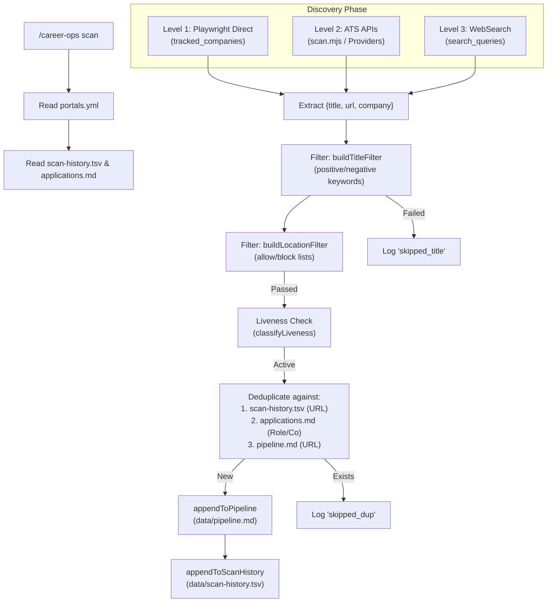
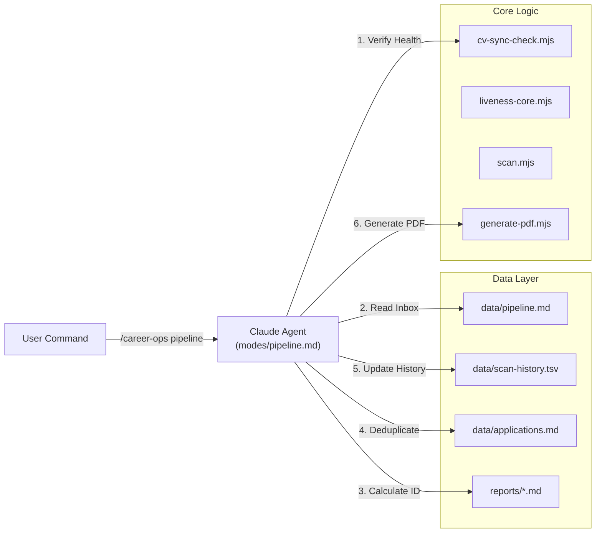

# 발견 및 파이프라인 모드(scan, pipeline)

관련 소스 파일

다음 파일들이 이 위키 페이지를 생성하기 위한 컨텍스트로 사용되었습니다:

- [check-liveness.mjs](check-liveness.mjs)
- [docs/SETUP.md](docs/SETUP.md)
- [liveness-core.mjs](liveness-core.mjs)
- [modes/apply.md](modes/apply.md)
- [modes/batch.md](modes/batch.md)
- [modes/pipeline.md](modes/pipeline.md)
- [modes/scan.md](modes/scan.md)
- [modes/tracker.md](modes/tracker.md)
- [providers/_http.mjs](providers/_http.mjs)
- [providers/_types.js](providers/_types.js)
- [providers/ashby.mjs](providers/ashby.mjs)
- [providers/greenhouse.mjs](providers/greenhouse.mjs)
- [providers/lever.mjs](providers/lever.mjs)
- [scan.mjs](scan.mjs)
- [templates/portals.example.yml](templates/portals.example.yml)
- [test-all.mjs](test-all.mjs)

이 페이지는 `career-ops`의 발견 및 수집 엔진을 다룹니다. 시스템이 포털 스캐너를 통해 새 채용 기회를 식별하는 방식과 파이프라인 inbox를 통해 대기 중인 URL을 처리하는 방식을 자세히 설명합니다.

## 1. 포털 스캐너(scan 모드)

`scan` 모드는 여러 플랫폼에서 새 채용 공고를 발견하고 평가 대기열에 추가하는 역할을 합니다. 속도, 신뢰성, 범위를 균형 있게 맞추기 위해 다층 발견 전략을 구현합니다. 로직은 `modes/scan.md`에 정의되어 있지만, API 기반 발견을 위한 고성능 구현은 `scan.mjs`가 처리합니다 [scan.mjs:3-10]().

### 1.1 발견 전략(3단계)

스캐너는 세 가지 깊이 수준에서 작동하며, 이를 누적 실행하고 결과를 중복 제거합니다.

| Level | Method | 주요 도구 | 설명 |
| :--- | :--- | :--- | :--- |
| **Level 1** | **Direct Navigation** | Playwright | `tracked_companies`에 있는 회사의 `careers_url`로 이동합니다. SPA(Ashby, Lever, Workday)에 가장 신뢰할 수 있습니다 [modes/scan.md:28-36](). |
| **Level 2** | **ATS APIs / Feeds** | `scan.mjs` / Plugins | 구조화된 API(Greenhouse, Ashby, Lever, Workday, BambooHR)를 쿼리합니다. 더 빠르고 zero-token입니다 [modes/scan.md:38-57](), [scan.mjs:3-20](). |
| **Level 3** | **WebSearch Queries** | WebSearch | 아직 추적되지 않은 회사의 역할을 발견하기 위해 job board 전반에 `site:` 필터를 사용합니다 [modes/scan.md:58-65](). |

### 1.2 Scan 워크플로 및 데이터 흐름

스캐너는 데이터 무결성을 보장하고 중복 평가를 방지하기 위해 엄격한 순서를 따릅니다.

**Sources:** [modes/scan.md:69-114](), [scan.mjs:106-116](), [scan.mjs:127-139](), [scan.mjs:143-172](), [liveness-core.mjs:49-78]()

### 1.3 구성(portals.yml)

스캐너 동작은 `portals.yml`에 의해 제어됩니다. 핵심 구성 요소는 다음과 같습니다:
*   **`tracked_companies`**: 모니터링할 특정 조직 목록입니다. 각 항목은 이상적으로 `careers_url`을 가져야 합니다 [templates/portals.example.yml:9-13]().
*   **`provider`**: 특정 API parser(예: `greenhouse`, `ashby`, `lever`) 사용을 강제하는 선택 필드입니다 [scan.mjs:85-90](), [providers/_types.js:35-35]().
*   **`title_filter`**: `positive`(필수), `negative`(금지), `seniority_boost`(우선순위) 키워드를 포함합니다 [templates/portals.example.yml:60-134]().
*   **`location_filter`**: 특정 지역을 `allow` 또는 `block`하기 위한 선택 블록입니다 [templates/portals.example.yml:37-54]().
*   **`search_queries`**: `site:ashbyhq.com`, `site:greenhouse.io` 등을 사용하는 광범위한 쿼리입니다 [templates/portals.example.yml:140-212]().

### 1.4 Liveness 검증

시스템은 처리 전에 채용 공고가 아직 활성 상태인지 확인하기 위해 liveness check를 수행합니다. 이는 오래되었을 수 있는 WebSearch 결과에 특히 중요합니다 [modes/scan.md:115-117]().

*   **Active**: 보이는 지원 컨트롤(예: "Apply", "Bewerben", "Postuler")과 충분한 콘텐츠 길이 [liveness-core.mjs:28-37](), [liveness-core.mjs:64-66]().
*   **Expired**: "job no longer available" 또는 "applications have closed" 같은 패턴과 일치합니다 [liveness-core.mjs:1-17]().
*   **Uncertain**: 콘텐츠는 있지만 명확한 지원 버튼을 찾을 수 없습니다 [liveness-core.mjs:77-77]().

**Sources:** [liveness-core.mjs:1-79](), [check-liveness.mjs:21-69]()

---

## 2. 파이프라인 Inbox(pipeline 모드)

`pipeline` 모드는 "Second Brain" inbox 역할을 합니다. 일반적으로 `scan` 모드가 채우거나 사용자가 수동으로 추가한 `data/pipeline.md`에 누적된 URL을 처리합니다 [modes/pipeline.md:1-3]().

### 2.1 처리 로직

`/career-ops pipeline`이 실행되면 에이전트는 다음 단계를 수행합니다:

1.  **Sync Check**: CV와 profile이 최신 상태인지 확인하기 위해 `node cv-sync-check.mjs`를 실행합니다 [modes/pipeline.md:53-57]().
2.  **Queue Parsing**: `data/pipeline.md`를 읽고 "Pending" 섹션에서 `[ ]`로 표시된 항목을 식별합니다 [modes/pipeline.md:7-7]().
3.  **Sequential Numbering**: `reports/` 디렉터리를 스캔해 가장 높은 기존 prefix를 찾고 다음 `REPORT_NUM`을 계산합니다 [modes/pipeline.md:45-49]().
4.  **JD Extraction**: Job Description을 가져오기 위해 계층형 접근 방식을 사용합니다:
    *   **Playwright**: `browser_navigate` + `browser_snapshot`(SPA 지원) [modes/pipeline.md:36-36]().
    *   **Local Files**: URL에 `local:` prefix가 있으면 로컬 파일시스템에서 읽습니다(예: `local:jds/pm-role.md`) [modes/pipeline.md:43-43]().
5.  **Execution**: 전체 `auto-pipeline`(Evaluation A-F → Report .md → PDF → Tracker)을 실행합니다 [modes/pipeline.md:12-12]().
6.  **State Transition**: 항목을 "Pending"에서 "Processed"로 이동하고 Score, PDF 상태 같은 메타데이터를 추가합니다 [modes/pipeline.md:13-13]().

### 2.2 시스템 상호작용 다이어그램

이 다이어그램은 자연어 명령을 기본 파일 구조 및 스크립트 엔티티에 매핑합니다.

**Sources:** [modes/pipeline.md:5-14](), [scan.mjs:143-172](), [scan.mjs:192-210](), [test-all.mjs:63-83]()

### 2.3 파일 형식: pipeline.md

`data/pipeline.md` 파일은 표준 Markdown task list를 사용해 상태를 추적합니다.

| Marker | 의미 | 작업 |
| :--- | :--- | :--- |
| `[ ]` | Pending | 다음 실행에서 처리 예정 [modes/pipeline.md:7-7](). |
| `[x]` | Processed | 완료됨. Report ID, Company, Role, Score를 포함합니다 [modes/pipeline.md:30-31](). |
| `[!]` | Error | 실패(예: login required 또는 404). 수동 개입이 필요합니다 [modes/pipeline.md:27-27](). |

**Sources:** [modes/pipeline.md:21-32]()
