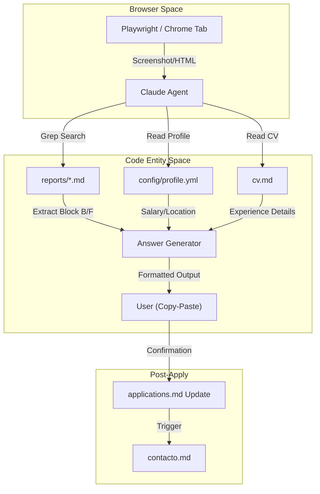
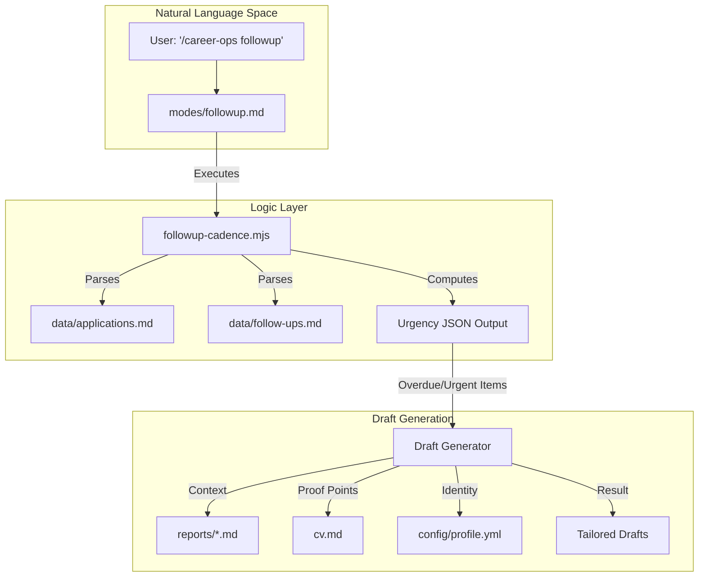

# 지원 및 아웃리치 모드(apply, contacto, tracker, followup)

관련 소스 파일

다음 파일들이 이 위키 페이지를 생성하기 위한 컨텍스트로 사용되었습니다:

- [.agents/skills/career-ops/SKILL.md](.agents/skills/career-ops/SKILL.md)
- [.claude/skills/career-ops/SKILL.md](.claude/skills/career-ops/SKILL.md)
- [analyze-patterns.mjs](analyze-patterns.mjs)
- [docs/SETUP.md](docs/SETUP.md)
- [followup-cadence.mjs](followup-cadence.mjs)
- [modes/apply.md](modes/apply.md)
- [modes/batch.md](modes/batch.md)
- [modes/contacto.md](modes/contacto.md)
- [modes/followup.md](modes/followup.md)
- [modes/patterns.md](modes/patterns.md)
- [modes/pipeline.md](modes/pipeline.md)
- [modes/tracker.md](modes/tracker.md)

이 섹션은 채용 평가와 실제 구직 활동 사이의 간극을 잇는 Career-Ops의 상호작용 및 운영 모드를 다룹니다. 이 모드들은 복잡한 지원서 양식 작성, 효과 높은 LinkedIn 아웃리치 메시지 생성, 지원 라이프사이클 관리, 정해진 follow-up cadence 유지를 지원합니다.

## 1. 지원 어시스턴트(`apply.md`)

`apply` 모드는 후보자가 채용 지원 양식을 실시간으로 작성하도록 돕는 상호작용형 어시스턴트입니다. 평가 단계(Blocks A-F)에서 생성된 컨텍스트를 활용해 form field에 개인화된 고품질 답변을 제공합니다.

### 워크플로 및 구현
어시스턴트는 평가된 직무 설명과 실제 작성 중인 양식 사이의 일관성을 보장하기 위해 구조화된 파이프라인을 따릅니다.

1.  **감지**: Claude는 Playwright를 사용해 활성 Chrome 탭(URL, 제목, 콘텐츠)을 읽거나 사용자가 제공한 스크린샷/텍스트를 처리합니다 [modes/apply.md:12-13](), [modes/apply.md:23-30]().
2.  **컨텍스트 매칭**: 시스템은 회사명과 역할 제목을 추출한 뒤 대소문자를 구분하지 않는 grep을 사용해 `reports/` 디렉터리에서 기존 보고서를 검색합니다 [modes/apply.md:32-36]().
3.  **드리프트 감지**: 화면의 역할과 보고서의 역할을 비교합니다. 서로 다르면 답변을 조정할지 또는 전체 평가 파이프라인을 다시 실행할지 사용자에게 묻습니다 [modes/apply.md:40-47]().
4.  **필드 분석**: free-text field(cover letter), dropdown(work authorization), Yes/No 질문, salary expectation을 포함한 form element를 식별합니다 [modes/apply.md:48-55]().
5.  **응답 생성**: 답변은 Block B의 proof point, Block F의 STAR story, 보고서 "Section G"의 기존 draft answer를 사용해 합성됩니다 [modes/apply.md:61-69]().

### 데이터 흐름: Apply 모드
다음 다이어그램은 `apply.md`가 파일시스템 및 브라우저와 어떻게 상호작용하는지 보여줍니다.

**다이어그램: Apply 모드 컨텍스트 통합**

Sources: [modes/apply.md:12-21](), [modes/apply.md:32-39](), [modes/apply.md:61-71]()

---

## 2. LinkedIn 아웃리치(`contacto.md`)

`contacto` 모드(LinkedIn Power Move)는 300자 연결 요청을 매우 간결하게 생성합니다. "corporate-speak"를 피하고 "hook-proof-proposal" 프레임워크를 사용합니다.

### 생성 프레임워크
이 모드는 LinkedIn의 글자 수 제한에 맞추기 위해 엄격한 3문장 구조를 따릅니다 [modes/contacto.md:47-53]():
*   **문장 1(The Hook)**: 회사의 과제 또는 팀별 hook에 대한 구체적인 관찰 [modes/contacto.md:25]().
*   **문장 2(The Proof)**: 후보자의 CV에서 가져온 정량화 가능한 성과 또는 직접적인 적합 기준 [modes/contacto.md:21](), [modes/contacto.md:26]().
*   **문장 3(The Proposal/CTA)**: 대화 요청 또는 CV 공유 제안처럼 부담이 낮은 요청 [modes/contacto.md:22](), [modes/contacto.md:27]().

### 대상 식별
에이전트는 `WebSearch`를 사용해 대상 회사 내부의 특정 인물을 식별합니다 [modes/contacto.md:3-7]():
1.  **Hiring Manager**: 채용 팀을 이끄는 사람.
2.  **Recruiter**: Talent acquisition 또는 sourcing 전문가.
3.  **Peers**: "bottom-up" networking/referral을 위한 유사 역할의 2-3명.
4.  **Interviewer**: 예정된 세션을 위한 특정 면접관 조사.

Sources: [modes/contacto.md:1-54]()

---

## 3. 지원 Tracker(`tracker.md`)

`tracker` 모드는 `data/applications.md` 플랫 파일 데이터베이스를 위한 CLI 기반 보기 및 관리 인터페이스를 제공합니다. 사용자가 파이프라인 상태를 보고 지원 단계를 수동으로 업데이트할 수 있습니다.

### 지원 상태 머신
tracker는 dashboard와 평가 스크립트 전반의 데이터 무결성을 보장하기 위해 표준 상태 집합을 강제합니다.

| 상태 | 설명 |
| :--- | :--- |
| `Evaluada` | `oferta` 또는 `batch` 처리 후 초기 상태입니다. |
| `Aplicado` | 회사에 양식이 제출되었습니다. |
| `Respondido` | recruiter/company로부터 inbound contact를 받았습니다. |
| `Contacto` | outbound outreach(LinkedIn)가 수행되었습니다. |
| `Entrevista` | 활성 면접 프로세스입니다. |
| `Oferta` | 최종 offer를 받았습니다. |
| `Rechazada` | 회사가 후보자를 거절했습니다. |
| `Descartada` | 후보자가 진행하지 않기로 결정했습니다. |

Sources: [modes/tracker.md:10-14]()

### 데이터 구조 및 통계
tracker는 `data/applications.md`의 Markdown table을 읽으며, 이 table은 8열 스키마 `| # | Fecha | Empresa | Rol | Score | Estado | PDF | Report |`를 따릅니다 [modes/tracker.md:5-8]().

호출되면 이 모드는 다음을 포함한 실시간 통계를 계산합니다 [modes/tracker.md:18-24]():
*   총 지원 수와 상태별 breakdown.
*   파이프라인 전체의 평균 match score.
*   생성된 PDF 및 Report의 completion percentage.

Sources: [modes/tracker.md:1-24]()

---

## 4. Follow-up Cadence(`followup.md`)

`followup` 모드는 지원 후 커뮤니케이션 주기를 관리합니다. `followup-cadence.mjs` 스크립트를 사용해 기한이 지난 상호작용을 식별하고 맞춤형 draft를 생성합니다.

### Cadence 로직 및 긴급도
시스템은 지원 상태와 마지막 action 이후 경과 시간을 기반으로 긴급도를 계산합니다 [followup-cadence.mjs:32-40]():
*   **Applied**: 7일 후 첫 follow-up, 이후 7일마다(최대 2회) [followup-cadence.mjs:157-162]().
*   **Responded**: 1일 이내 긴급 reply, 이후 3일마다 [followup-cadence.mjs:163-167]().
*   **Interview**: 1일 이내 thank-you note, 이후 3일마다 [followup-cadence.mjs:168-171]().

### 구현 및 데이터 흐름
이 모드는 여러 데이터 소스를 오케스트레이션해 일반적인 "circling back" 표현 없이 높은 컨텍스트를 반영한 draft를 생성합니다 [modes/followup.md:68-71]().

**다이어그램: Follow-up Cadence 엔진**

### 히스토리 기록
사용자가 follow-up이 전송되었다고 확인하면 에이전트는 `data/follow-ups.md`에 record를 추가합니다 [modes/followup.md:126-147](). 이 파일은 지원 번호, 날짜, 회사, 채널(Email/LinkedIn), 연락한 특정 contact를 추적합니다 [modes/followup.md:131-136]().

Sources: [modes/followup.md:1-174](), [followup-cadence.mjs:1-191]()

---

## 5. 거절 패턴 분석(`patterns.md`)

`patterns` 모드는 `analyze-patterns.mjs`를 사용해 과거 지원 결과에서 실행 가능한 인사이트를 드러내며, 어디에서 노력이 낭비되고 어디에서 결과가 나오고 있는지 식별합니다.

### 분석 로직
`analyze-patterns.mjs` 스크립트는 `data/applications.md`와 연결된 모든 보고서를 파싱해 archetype, seniority, remote policy, score 같은 차원을 추출합니다 [analyze-patterns.mjs:5-12](). 결과를 positive, negative, self-filtered, pending으로 분류합니다 [analyze-patterns.mjs:53-60]().

주요 기능은 다음과 같습니다:
*   **Funnel Analysis**: 각 상태 단계의 conversion rate 추적 [modes/patterns.md:37]().
*   **Score Thresholds**: 그 아래에서는 positive outcome이 발생하지 않는 최소 score 판단 [modes/patterns.md:101-104]().
*   **Blocker Detection**: geo-restriction 또는 tech stack gap 같은 반복적인 거절 이유 식별 [modes/patterns.md:88-91]().

### 자동화된 추천
분석 후 에이전트는 특정 geo-restricted role을 걸러내도록 `portals.yml`을 업데이트하거나 `config/profile.yml`의 archetype targeting을 조정하는 등 추천 사항을 자동으로 적용할 수 있습니다 [modes/patterns.md:129-144]().

Sources: [modes/patterns.md:1-155](), [analyze-patterns.mjs:1-170]()
