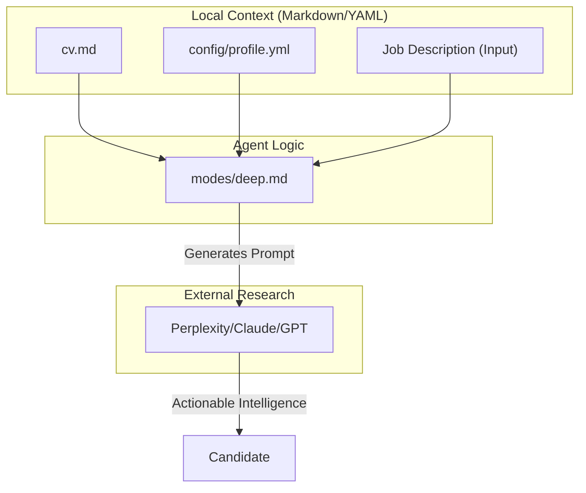
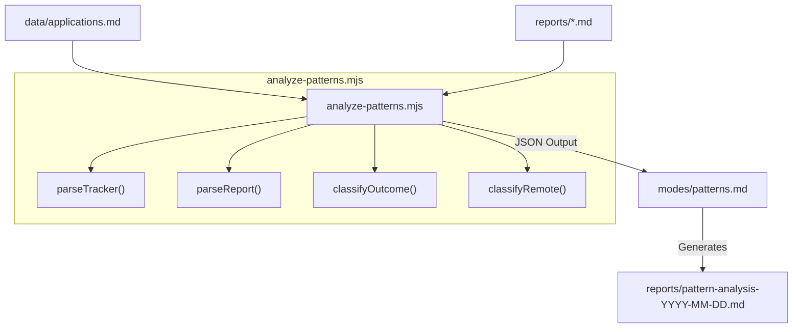
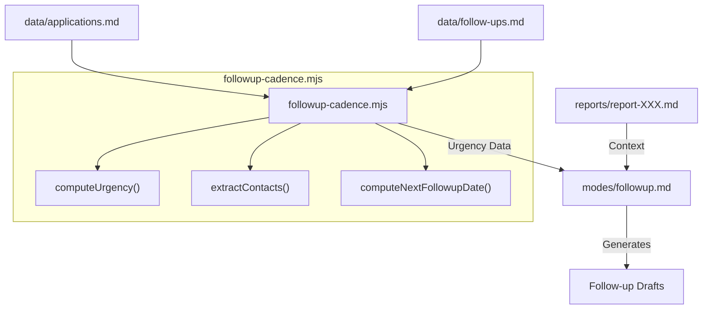

# 커리어 개발 모드(deep, training, project, patterns)

관련 소스 파일

다음 파일들이 이 위키 페이지를 생성하기 위한 컨텍스트로 사용되었습니다:

- [.agents/skills/career-ops/SKILL.md](.agents/skills/career-ops/SKILL.md)
- [.claude/skills/career-ops/SKILL.md](.claude/skills/career-ops/SKILL.md)
- [analyze-patterns.mjs](analyze-patterns.mjs)
- [followup-cadence.mjs](followup-cadence.mjs)
- [modes/deep.md](modes/deep.md)
- [modes/followup.md](modes/followup.md)
- [modes/patterns.md](modes/patterns.md)
- [modes/project.md](modes/project.md)
- [modes/training.md](modes/training.md)

이 섹션은 `modes/` 디렉터리 안의 보조 커리어 개발 모드를 자세히 설명합니다. 핵심 평가 모드가 채용 공고에 집중하는 반면, 이 모드들은 후보자가 면접을 준비하고, 전문성 개발 기회를 평가하고, 사이드 프로젝트를 채점하고, 구직 성과에 대한 상위 수준의 메타 분석을 수행하며, follow-up cadence를 관리하도록 돕습니다.

## 개발 모드 개요

개발 모드는 장기적인 커리어 성장과 단기적인 면접 성공을 위한 구조화된 프레임워크를 제공합니다. 후보자의 profile과 CV를 활용해 개인화된 조언과 데이터 기반 인사이트를 제공합니다.

| 모드 | 파일 | 목적 |
|:---|:---|:---|
| `deep` | [modes/deep.md:1-1]() | 회사 인텔리전스를 위한 심층 조사 프롬프트를 생성합니다. |
| `training` | [modes/training.md:1-1]() | course, certification, training의 ROI를 평가합니다. |
| `project` | [modes/project.md:1-1]() | 채용 신호와 실현 가능성을 기준으로 사이드 프로젝트 아이디어를 채점합니다. |
| `patterns` | [modes/patterns.md:1-1]() | `analyze-patterns.mjs`를 통해 거절 패턴과 conversion funnel을 분석합니다. |
| `followup` | [modes/followup.md:1-1]() | `followup-cadence.mjs`를 통해 follow-up cadence를 추적하고 맞춤형 draft를 생성합니다. |

---

## 심층 조사 모드(`deep.md`)

`deep` 모드는 면접 전에 회사 인텔리전스 수집을 수행하기 위해 고추론 LLM(Perplexity, Claude, ChatGPT)에서 사용하도록 설계된 구조화된 다차원 프롬프트를 생성합니다 [modes/deep.md:22-25]().

### 조사 차원
생성된 프롬프트는 후보자가 평균 지원자보다 더 많은 정보를 갖도록 보장하기 위해 여섯 가지 핵심 축을 다룹니다:

1.  **AI Strategy**: 회사의 AI stack, engineering blog, published research 분석 [modes/deep.md:29-33]().
2.  **Recent Movements**: 최근 6개월의 funding, leadership changes, product launches 추적 [modes/deep.md:35-39]().
3.  **Engineering Culture**: deployment cadence, repository structure(mono vs. multi), remote-work policies 같은 기술적 세부 사항 [modes/deep.md:41-46]().
4.  **Scaling Challenges**: review에 언급된 reliability, cost, latency의 잠재적 pain point 식별 [modes/deep.md:48-52]().
5.  **Competitors and Differentiation**: 회사의 differentiation과 market positioning 이해 [modes/deep.md:54-57]().
6.  **Candidate Angle**: 후보자의 `cv.md`와 `profile.yml`을 회사의 구체적 니즈에 개인화해 매핑 [modes/deep.md:59-64]().

### 언어 결정
이 모드는 표준 "JD의 언어" 규칙을 재정의합니다. 출력 언어는 다음 기준으로 결정됩니다:
1. 사용자 프롬프트 언어 [modes/deep.md:10-12]().
2. `config/profile.yml` locale 설정 [modes/deep.md:13-14]().
3. 최후의 수단으로 JD 언어 [modes/deep.md:15-16]().

**Deep Research Prompt Synthesis**

**Sources:** [modes/deep.md:1-68](), [.claude/skills/career-ops/SKILL.md:82-85]()

---

## Training 평가 모드(`training.md`)

`training` 모드는 전문성 개발 기회를 평가합니다. opportunity cost와 recruiter signal 평가를 강제함으로써 "tutorial hell"을 방지합니다 [modes/training.md:3-12]().

### 평가 차원
모든 training 요청은 여섯 가지 차원에 걸쳐 채점됩니다:
*   **North Star Alignment**: 이것이 후보자를 목표 역할에 더 가깝게 이동시키는가? [modes/training.md:7-7]()
*   **Recruiter Signal**: Hiring Manager에게 인식되는 가치는 무엇인가? [modes/training.md:8-8]()
*   **Opportunity Cost**: 어떤 다른 활동이 희생되는가? [modes/training.md:10-10]()
*   **Portfolio Deliverable**: course가 시연 가능한 artifact로 이어지는가? [modes/training.md:12-12]()

### 의사결정 로직
에이전트는 세 가지 verdict 중 하나를 반환합니다:
1.  **HACER (DO)**: 주간 deliverable이 포함된 4-12주 계획을 포함합니다 [modes/training.md:16-16]().
2.  **NO HACER (DON'T DO)**: 더 나은 대안을 제공합니다 [modes/training.md:17-17]().
3.  **HACER CON TIMEBOX**: 핵심에만 집중하는 압축 계획입니다 [modes/training.md:18-18]().

**Sources:** [modes/training.md:1-28]()

---

## 프로젝트 포트폴리오 평가기(`project.md`)

`project` 모드는 사이드 프로젝트를 위한 채점 엔진입니다. 프로젝트가 engineering effort를 들일 가치가 있는지 판단하기 위해 가중 다기준 의사결정 분석(MCDA)을 사용합니다 [modes/project.md:6-15]().

### 채점 루브릭
| 차원 | 가중치 | 5/5 기준 |
|:---|:---|:---|
| Target Role Signal | 25% | 목표 JD가 요구하는 기술을 직접 보여줍니다 [modes/project.md:10-10]() |
| Uniqueness | 20% | 참신한 구현이며, 표준 "todo" app이 아닙니다 [modes/project.md:11-11]() |
| Demo-ability | 20% | 2분 안에 live로 시연할 수 있습니다 [modes/project.md:12-12]() |
| Metric Potential | 15% | 명확한 metrics(latency, cost, accuracy)가 있습니다 [modes/project.md:13-13]() |
| Time to MVP | 10% | 1주 안에 달성 가능합니다 [modes/project.md:14-14]() |
| STAR Story Potential | 10% | trade-off와 기술적 결정이 풍부합니다 [modes/project.md:15-15]() |

### "Interview Pack" 요구 사항
**BUILD** verdict로 승인된 모든 프로젝트에 대해 시스템은 세 가지 artifact를 의무화합니다:
1.  **One-pager**: 아키텍처와 평가 계획 [modes/project.md:20-20]().
2.  **Demo**: Live URL 또는 2분 walkthrough [modes/project.md:21-21]().
3.  **Postmortem**: 실패와 완화책 분석 [modes/project.md:22-22]().

**Sources:** [modes/project.md:1-34]()

---

## 패턴 분석 모드(`patterns.md`)

`patterns` 모드는 `analyze-patterns.mjs` 스크립트를 사용해 후보자의 지원 전략에서 구조적 문제를 식별합니다 [modes/patterns.md:1-5](). 실행하려면 "Evaluated" 이후의 결과가 있는 추적된 지원이 최소 5개 필요합니다 [modes/patterns.md:17-20]().

### 기술적 구현
분석 로직은 지원 tracker와 관련 report 파일을 파싱하는 `analyze-patterns.mjs`에 캡슐화되어 있습니다 [analyze-patterns.mjs:3-7]().

1.  **Data Ingestion**: `parseTracker()`가 `data/applications.md`를 읽습니다 [analyze-patterns.mjs:62-79]().
2.  **Report Parsing**: `parseReport()`가 `reports/`의 Markdown 파일에서 archetype, seniority, remote policy, scores, tech gaps를 추출합니다 [analyze-patterns.mjs:82-169]().
3.  **Outcome Classification**: 상태가 정규화되고 `positive`, `negative`, `self_filtered`, `pending`으로 분류됩니다 [analyze-patterns.mjs:53-59]().
4.  **Bucket Analysis**: 데이터는 remote policy(예: `geo-restricted`, `global remote`) [analyze-patterns.mjs:172-180]() 및 archetype conversion rate별로 그룹화됩니다.

**Rejection Pattern Analysis Pipeline**

**Sources:** [modes/patterns.md:1-155](), [analyze-patterns.mjs:1-180]()

---

## Follow-up Cadence 모드(`followup.md`)

`followup` 모드는 지원 후 커뮤니케이션을 관리합니다. `followup-cadence.mjs`를 사용해 상태에 따라 회사에 연락할 시점을 계산합니다 [modes/followup.md:3-5]().

### Cadence 로직
시스템은 스크립트에 정의된 특정 간격을 적용합니다 [followup-cadence.mjs:33-40]():
*   **Applied**: 7일 후 첫 follow-up, 이후 7일마다(최대 2회) [followup-cadence.mjs:177-182]().
*   **Responded**: 1일 이내 initial reply, 이후 3일마다 [followup-cadence.mjs:183-186]().
*   **Interview**: 1일 이내 thank-you note [followup-cadence.mjs:187-189]().

### 데이터 흐름: Follow-up 생성
에이전트는 cadence 데이터와 원본 job report를 합성해 개인화된 draft를 만듭니다.

**Follow-up Generation Logic**

**Sources:** [modes/followup.md:1-174](), [followup-cadence.mjs:1-205]()
