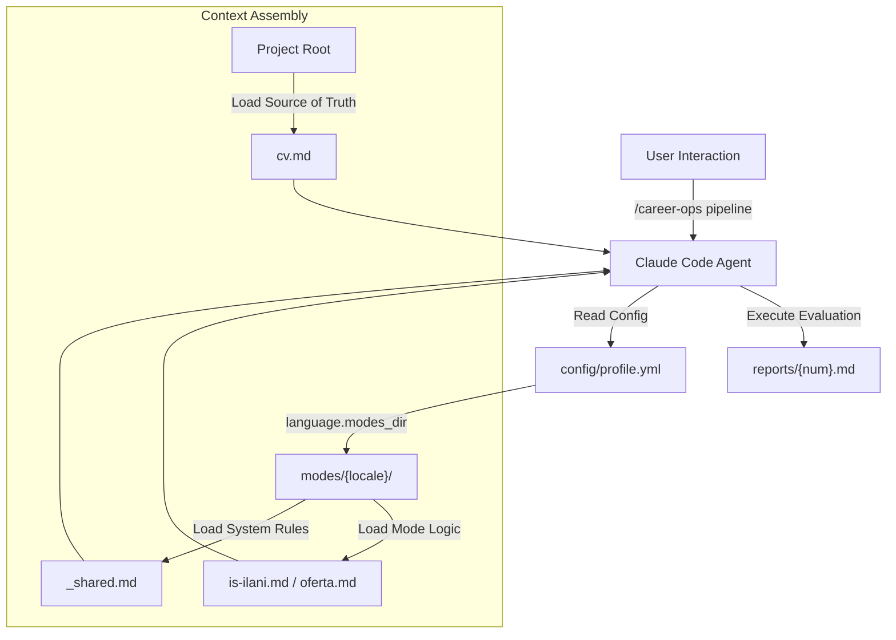
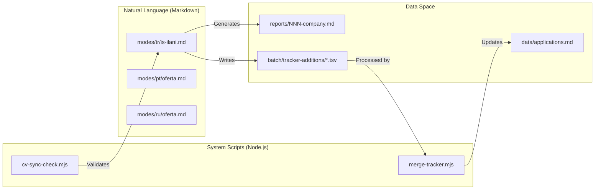

# 국제화(i18n 모드)

관련 소스 파일

다음 파일들이 이 위키 페이지를 생성하기 위한 컨텍스트로 사용되었습니다:

- [AGENTS.md](AGENTS.md)
- [modes/de/README.md](modes/de/README.md)
- [modes/de/_shared.md](modes/de/_shared.md)
- [modes/de/angebot.md](modes/de/angebot.md)
- [modes/de/bewerben.md](modes/de/bewerben.md)
- [modes/de/pipeline.md](modes/de/pipeline.md)
- [modes/fr/README.md](modes/fr/README.md)
- [modes/fr/_shared.md](modes/fr/_shared.md)
- [modes/fr/offre.md](modes/fr/offre.md)
- [modes/fr/pipeline.md](modes/fr/pipeline.md)
- [modes/fr/postuler.md](modes/fr/postuler.md)
- [modes/ja/README.md](modes/ja/README.md)
- [modes/ja/_shared.md](modes/ja/_shared.md)
- [modes/ja/kyujin.md](modes/ja/kyujin.md)
- [modes/ja/oubo.md](modes/ja/oubo.md)
- [modes/ja/pipeline.md](modes/ja/pipeline.md)
- [modes/pt/README.md](modes/pt/README.md)
- [modes/pt/_shared.md](modes/pt/_shared.md)
- [modes/pt/aplicar.md](modes/pt/aplicar.md)
- [modes/pt/oferta.md](modes/pt/oferta.md)
- [modes/pt/pipeline.md](modes/pt/pipeline.md)
- [modes/ru/README.md](modes/ru/README.md)
- [modes/ru/_shared.md](modes/ru/_shared.md)
- [modes/ru/apply.md](modes/ru/apply.md)
- [modes/ru/interview-prep.md](modes/ru/interview-prep.md)
- [modes/ru/oferta.md](modes/ru/oferta.md)
- [modes/ru/pipeline.md](modes/ru/pipeline.md)
- [modes/tr/README.md](modes/tr/README.md)
- [modes/tr/_shared.md](modes/tr/_shared.md)
- [modes/tr/basvuru.md](modes/tr/basvuru.md)
- [modes/tr/is-ilani.md](modes/tr/is-ilani.md)
- [modes/tr/pipeline.md](modes/tr/pipeline.md)

`career-ops` 시스템은 `modes/` 하위 디렉터리를 통해 현지화된 에이전트 동작을 제공합니다. 이러한 국제화(i18n) 모드는 핵심 평가 및 지원 로직을 특정 지역의 채용 시장, 법적 프레임워크, 언어 관습에 맞게 조정합니다. 단순한 번역이 아니라, 각 locale은 지역별 보상 구조(예: 터키 SGK, 브라질 CLT vs PJ), 고용 유형, 문화적 면접 규범을 반영하도록 **Evaluation (A-G)** 및 **Application** 워크플로를 수정합니다.

## 구현 아키텍처

i18n 시스템은 AI 에이전트가 사용자 구성에 따라 로드하는 특수 "skill" 집합으로 작동합니다. `merge-tracker.mjs` 같은 핵심 스크립트는 언어에 독립적으로 유지되지만, AI의 의사결정을 구동하는 프롬프트는 현지화된 버전으로 교체됩니다.

### 현지화된 모드 매핑

| Locale | Directory | 핵심 모드 파일(평가) | 핵심 모드 파일(지원) | 시장 초점 |
| :--- | :--- | :--- | :--- | :--- |
| **Turkish** | `modes/tr/` | `is-ilani.md` | `basvuru.md` | Turkey (Kariyer.net, Yenibiris.com) |
| **Russian** | `modes/ru/` | `oferta.md` | `apply.md` | CIS/RU (hh.ru, Habr) |
| **Japanese** | `modes/ja/` | `kyujin.md` | `oubo.md` | Japan (Wantedly, Green, BizReach) |
| **Portuguese** | `modes/pt/` | `oferta.md` | `aplicar.md` | Brazil (Gupy, Greenhouse BR) |
| **French** | `modes/fr/` | `offre.md` | `postuler.md` | France / Francophone markets |
| **German** | `modes/de/` | `angebot.md` | `bewerben.md` | DACH (Xing, LinkedIn DE) |

Sources: [modes/tr/README.md:42-49](), [modes/pt/README.md:48-55](), [modes/ru/README.md:42-49]()

### 시스템 데이터 흐름: Locale 활성화

시스템은 구성 계층을 통해 활성 모드 디렉터리를 결정합니다. 사용자는 `config/profile.yml`에서 영구 locale을 설정하거나 에이전트에 대한 자연어 지시로 세션별로 트리거할 수 있습니다.

**Title: Mode Selection and Context Injection**

Sources: [modes/tr/README.md:18-40](), [modes/pt/README.md:18-44](), [AGENTS.md:74-81]()

---

## 시장별 조정

### 1. 터키 시장(modes/tr/)
터키 모드는 높은 인플레이션 환경과 특정 노동법(No. 4857)에 집중합니다.

*   **Legal Framework**: **SGK**(사회 보장), **Kıdem tazminatı**(퇴직금), **İhbar süresi**(통지 기간)에 대한 점검을 포함합니다 [modes/tr/README.md:53-65]().
*   **Compensation**: **TÜFE**(인플레이션) 기반 급여 조정, net vs. gross 계산, "Yemek kartı"(Sodexo/Multinet 같은 식대 카드)를 평가합니다 [modes/tr/is-ilani.md:56-61]().
*   **Portal Integration**: Playwright를 사용해 `Kariyer.net` 및 `Yenibiris.com`에 최적화되어 있습니다 [modes/tr/pipeline.md:42-46]().

### 2. 러시아 시장(modes/ru/)
러시아 모드는 **Gross vs Net** 급여의 구분과 **Labor Code (TK RF)**의 특정 법적 보호를 우선시합니다.

*   **Compensation Logic**: 순소득(`net ≈ gross × 0.87`)을 자동 계산하고 계약 유형(TK RF vs. GPH vs. Self-employed)에 따라 안정성을 평가합니다 [modes/ru/_shared.md:114-126]().
*   **Interviewing**: STAR+R 프레임워크를 러시아어로 조정하고, 최상위 RU tech 기업을 위한 "Bar-raiser" 라운드 준비를 포함합니다 [modes/ru/_shared.md:89-104]().

### 3. 포르투갈어/브라질 시장(modes/pt/)
브라질 모드는 "CLT vs PJ"(정규직 vs 계약직) 협상 환경에 맞게 조정됩니다.

*   **Benefits Evaluation**: **FGTS**, 13th salary, **PLR**(profit sharing) 같은 현지 필수 benefits를 채점 모델에 포함합니다 [modes/pt/oferta.md:56-62]().
*   **Terminology**: 현지 엔지니어링 문화에 맞추기 위해 "Português tech"(예: 직역 대신 "Pipeline" 사용)를 사용합니다 [modes/pt/README.md:70-71]().

---

## 기술 구성 및 규칙

### _shared.md 계약
모든 locale 디렉터리에는 `_shared.md` 파일이 포함됩니다. 이는 에이전트가 모든 평가 전에 **반드시** 읽어야 하는 시스템 수준 파일입니다. 이 파일은 다음을 정의합니다:
1.  **North Star Archetypes**: 역할의 현지화된 정의(예: AI Platform/LLMOps vs. Backend-разработчик) [modes/ru/_shared.md:38-62]().
2.  **Scoring Interpretation**: 시장별 salary quartile 및 culture signal [modes/tr/_shared.md:28-44]().
3.  **Posting Legitimacy (Block G)**: 게시 연령과 기술 구체성을 기준으로 "Ghost Jobs"를 식별하는 기준 [modes/tr/_shared.md:45-72]().

### 현지화된 평가 블록 구조(A-G)
언어와 관계없이, 모드는 dashboard 및 `merge-tracker.mjs`와의 호환성을 보장하기 위해 표준 구조를 유지합니다.

| Block | Turkish (`is-ilani.md`) | Portuguese (`oferta.md`) | 목적 |
| :--- | :--- | :--- | :--- |
| **A** | Rol Özeti | Resumo da Vaga | Role Summary & Metadata |
| **B** | CV Eşleştirmesi | Match com o Currículo | Skill alignment & gap analysis |
| **C** | Seviye ve Strateji | Nível e Estratégia | Seniority positioning |
| **D** | Maaş ve Piyasa | Remuneração e Demanda | Market rate benchmarking |
| **E** | Kişiselleştirme Planı | Plano de Personalização | CV/LinkedIn update plan |
| **F** | Mülakat Hazırlığı | Plano de Entrevistas | STAR+R story mapping |
| **G** | İlan Meşruiyeti | (Optional/Integrated) | Posting Legitimacy check |

Sources: [modes/tr/is-ilani.md:12-93](), [modes/pt/oferta.md:12-95]()

### 엔티티 매핑: 모드 파일에서 로직까지

**Title: Natural Language Space to Code Entity Mapping**

Sources: [modes/tr/is-ilani.md:100-168](), [modes/pt/oferta.md:100-167]()

## 기술 기여자를 위한 사용 가이드라인

1.  **언어적 일관성**: 모드는 "Natural Technical Language"를 사용합니다. 명령과 도구 이름(예: `Playwright`, `WebSearch`, `WebFetch`)은 **절대** 번역하면 안 됩니다 [modes/tr/README.md:69-76](), [modes/pt/README.md:63-69]().
2.  **TSV 데이터 무결성**: 현지화된 모드에서도 `merge-tracker.mjs` 스크립트는 dashboard 호환성을 유지하기 위해 상태 값이 영어(예: `Evaluated`, `Applied`, `Interview`)이기를 기대합니다 [modes/tr/README.md:73-73](), [modes/pt/README.md:67-67]().
3.  **평가 임계값**: 모든 모드는 윤리적 임계값을 준수해야 합니다. **3.5/5** 미만의 점수는 일반적으로 권장하지 않으며, **4.0** 미만의 점수는 "not ideal"로 간주됩니다 [modes/tr/_shared.md:39-43](), [modes/pt/_shared.md:39-43]().

Sources: [modes/tr/README.md:1-119](), [modes/pt/README.md:1-112](), [modes/ru/README.md:1-49](), [modes/tr/_shared.md:1-72](), [modes/pt/_shared.md:1-125]()
