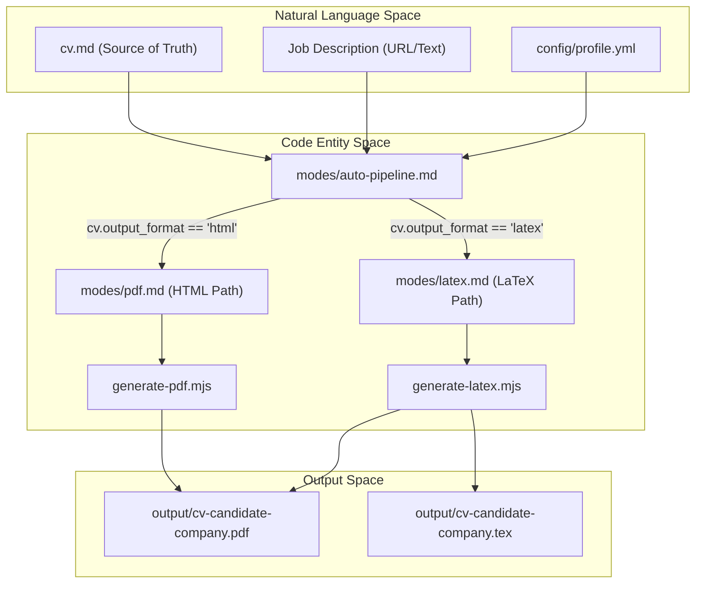
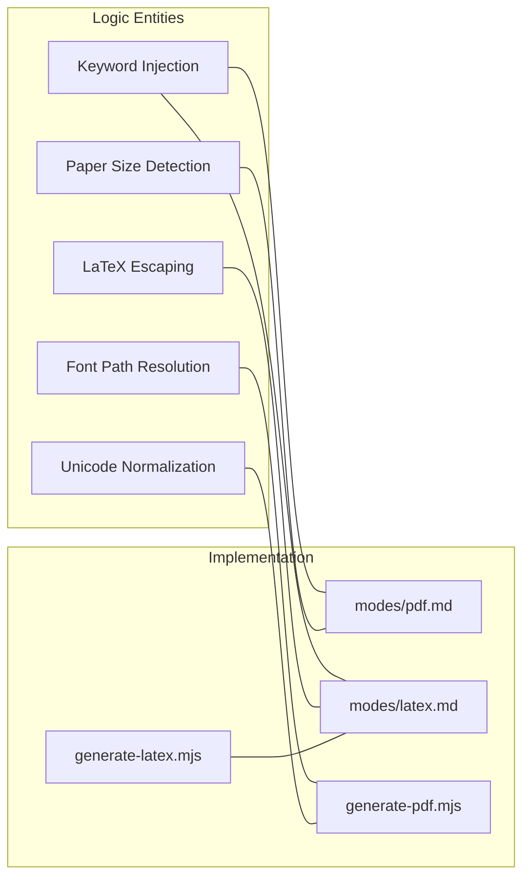

# PDF 및 LaTeX 생성 엔진

관련 소스 파일

다음 파일들이 이 위키 페이지를 생성하기 위한 컨텍스트로 사용되었습니다:

- [config/profile.example.yml](config/profile.example.yml)
- [examples/ats-normalization-test.md](examples/ats-normalization-test.md)
- [generate-latex.mjs](generate-latex.mjs)
- [generate-pdf.mjs](generate-pdf.mjs)
- [modes/_shared.md](modes/_shared.md)
- [modes/auto-pipeline.md](modes/auto-pipeline.md)
- [modes/latex.md](modes/latex.md)
- [modes/pdf.md](modes/pdf.md)
- [templates/cv-template.html](templates/cv-template.html)
- [templates/cv-template.tex](templates/cv-template.tex)

**PDF & LaTeX Generation Engine**은 Markdown 기반 CV source of truth를 ATS에 최적화되고 전문적으로 디자인된 문서로 변환하도록 설계된 특수 하위 시스템입니다. 두 가지 주요 출력 경로를 지원합니다. 하나는 headless browser rendering을 사용하는 고충실도 HTML-to-PDF 파이프라인이고, 다른 하나는 학술적 형식이나 Overleaf 호환 export를 위한 구조화된 LaTeX-to-PDF 파이프라인입니다.

### 시스템 개요

엔진은 원시 `cv.md`에서 시작해 렌더링된 PDF 파일로 끝나는 선형 파이프라인을 따릅니다. 사용할 파이프라인은 `config/profile.yml`의 `cv.output_format` 설정에 의해 결정됩니다 [config/profile.example.yml:70]().

#### 생성 파이프라인
1.  **컨텍스트 수집**: 기본 `cv.md`, `config/profile.yml`, 대상 Job Description(JD)을 로드합니다 [modes/pdf.md:5-6](), [modes/latex.md:7-9]().
2.  **AI 조정**: JD에서 15-20개의 키워드를 추출하고 관련성에 따라 experience bullet의 순서를 재배치합니다 [modes/pdf.md:7-15](), [modes/latex.md:10-15]().
3.  **지역별 형식 지정**: 회사 위치를 감지해 용지 크기를 설정합니다(미국/캐나다는 `letter`, 그 외 지역은 `a4`) [modes/pdf.md:9-11]().
4.  **템플릿 합성**: 개인화된 콘텐츠로 `templates/cv-template.html` 또는 `templates/cv-template.tex`를 채웁니다 [modes/pdf.md:18-19](), [modes/latex.md:17-18]().
5.  **ATS 정규화**: HTML의 경우 스크립트가 Unicode 문자(smart quotes, em-dashes)를 정리합니다 [generate-pdf.mjs:25-33](). LaTeX의 경우 시스템은 `\pdfgentounicode=1`을 통해 기계 판독성을 강제합니다 [templates/cv-template.tex:45]().
6.  **렌더링**: `generate-pdf.mjs`(Playwright 경유) 또는 `generate-latex.mjs`(Tectonic/pdfLaTeX 경유)를 실행해 최종 문서를 생성합니다 [modes/pdf.md:21](), [modes/latex.md:19]().

#### 데이터 흐름: 소스에서 출력까지
다음 다이어그램은 자연어 CV 데이터가 코드 엔티티에 의해 최종 PDF로 처리되는 방식을 보여줍니다.

**CV Transformation Flow**

Sources: [modes/auto-pipeline.md:30-34](), [modes/pdf.md:1-21](), [modes/latex.md:1-20]()

---

### 핵심 컴포넌트

엔진은 세 가지 주요 기능 영역으로 나뉩니다.

#### CV HTML 템플릿 및 폰트
기본 시스템은 `templates/cv-template.html`에 정의된 단일 열 ATS 최적화 레이아웃을 사용합니다 [modes/pdf.md:26](). 제목에는 **Space Grotesk**, 본문 텍스트에는 **DM Sans**를 기반으로 한 CSS 디자인 시스템을 활용합니다 [templates/cv-template.html:8-42](). 템플릿은 조정 단계에서 AI 에이전트가 채우는 placeholder 시스템(예: `{{NAME}}`, `{{SUMMARY_TEXT}}`)에 의존합니다 [modes/pdf.md:66-93]().

자세한 내용은 [CV HTML Template & Fonts](#3.1)를 참조하세요.

#### generate-pdf.mjs 스크립트
이 Node.js 유틸리티는 HTML 템플릿을 PDF로 렌더링합니다. `playwright`를 사용해 headless Chromium 인스턴스를 실행하고 [generate-pdf.mjs:136](), self-hosted font를 위한 절대 `file://` URL을 주입하며 [generate-pdf.mjs:112-125](), 0.6in margins 같은 특정 print setting으로 페이지를 렌더링합니다 [generate-pdf.mjs:153-158](). 문제가 되는 Unicode 문자를 ASCII-safe equivalent로 변환하기 위한 `normalizeTextForATS` 함수를 포함합니다 [generate-pdf.mjs:34-75]().

자세한 내용은 [generate-pdf.mjs Script](#3.2)를 참조하세요.

#### LaTeX/Overleaf Export
대체 파이프라인은 `templates/cv-template.tex`를 사용해 전문적인 LaTeX 문서를 생성합니다 [modes/latex.md:26](). 이 경로는 Overleaf를 선호하거나 전통적인 학술 형식이 필요한 사용자에게 이상적입니다. `generate-latex.mjs` 스크립트는 `tectonic` 또는 `pdflatex`로 컴파일하기 전에 [generate-latex.mjs:133-141]() 생성된 `.tex` 파일에 `Education`, `Work Experience` 같은 필수 섹션이 있는지 검증합니다 [generate-latex.mjs:21-26]().

자세한 내용은 [LaTeX/Overleaf Export](#3.3)를 참조하세요.

---

### 구현 세부 사항

엔진은 다음 매핑을 통해 AI 생성 텍스트와 고정된 문서 형식 사이의 간극을 연결합니다:

**Component Mapping: Logic to Files**

Sources: [modes/pdf.md:7-11](), [modes/latex.md:99-115](), [generate-pdf.mjs:34-75](), [generate-pdf.mjs:112-125]()

#### 기술 사양
| 기능 | HTML 구현 | LaTeX 구현 |
| :--- | :--- | :--- |
| **Rendering Engine** | Playwright (Chromium) [generate-pdf.mjs:13]() | Tectonic / pdfLaTeX [generate-latex.mjs:133]() |
| **Typography** | Space Grotesk & DM Sans [templates/cv-template.html:8-42]() | Standard LaTeX Computer Modern / FontAwesome [templates/cv-template.tex:20]() |
| **ATS Strategy** | Unicode cleanup, Single-column [generate-pdf.mjs:63-74]() | `\pdfgentounicode=1`, Single-column [templates/cv-template.tex:45]() |
| **Paper Formats** | A4 / Letter (CSS-driven) [modes/pdf.md:71]() | A4 / Letter (Class-driven) [templates/cv-template.tex:8]() |
| **Placeholders** | `{{PLACEHOLDER}}` [modes/pdf.md:66]() | `{{PLACEHOLDER}}` [modes/latex.md:26]() |

Sources: [modes/pdf.md:24-43](), [modes/latex.md:123-130](), [generate-pdf.mjs:81-110](), [templates/cv-template.html:8-42](), [templates/cv-template.tex:8-45]()
