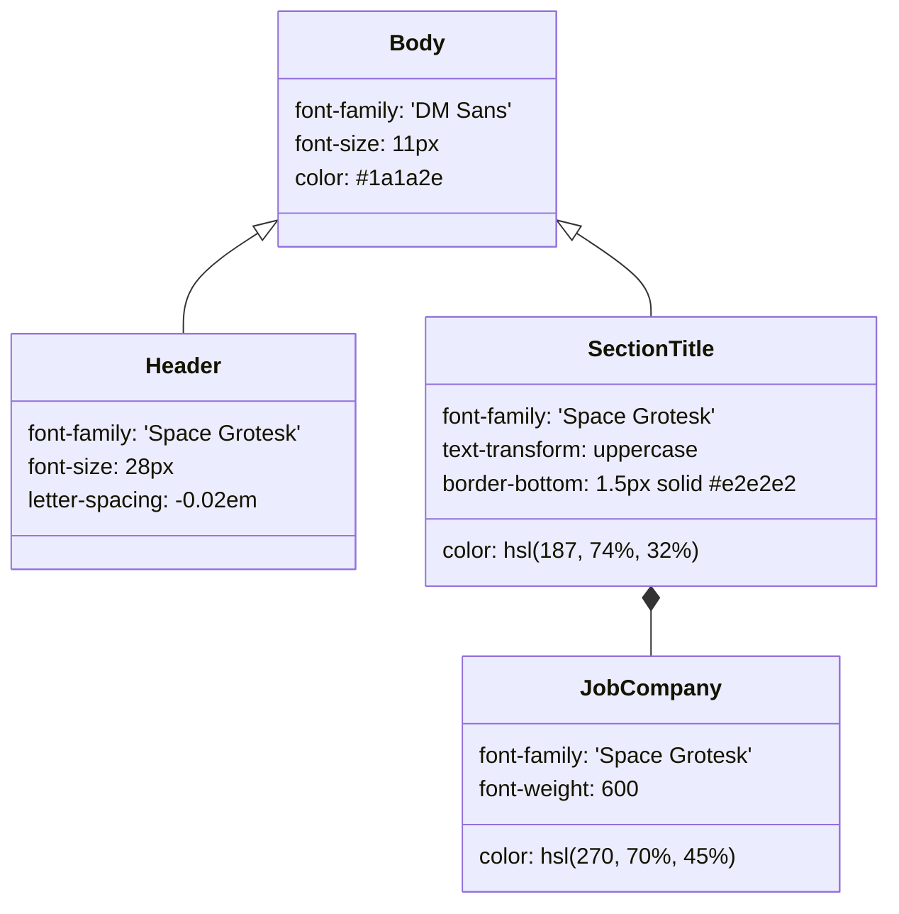

# CV HTML 템플릿 및 폰트

<details>
<summary>관련 소스 파일</summary>

다음 파일들이 이 위키 페이지를 생성하기 위한 컨텍스트로 사용되었습니다:

- [config/profile.example.yml](config/profile.example.yml)
- [fonts/dm-sans-latin-ext.woff2](fonts/dm-sans-latin-ext.woff2)
- [fonts/dm-sans-latin.woff2](fonts/dm-sans-latin.woff2)
- [fonts/space-grotesk-latin-ext.woff2](fonts/space-grotesk-latin-ext.woff2)
- [fonts/space-grotesk-latin.woff2](fonts/space-grotesk-latin.woff2)
- [modes/_shared.md](modes/_shared.md)
- [modes/auto-pipeline.md](modes/auto-pipeline.md)
- [modes/pdf.md](modes/pdf.md)
- [templates/cv-template.html](templates/cv-template.html)

</details>


CV 생성 엔진은 **ATS(Applicant Tracking System) 호환성**과 recruiter의 빠른 스캔에 맞게 설계된 고도로 구조화된 HTML 템플릿을 활용합니다. 이 템플릿은 `cv.md`에 저장된 데이터의 시각 계층으로 작동하며, Markdown 콘텐츠를 전문적으로 스타일링된 단일 열 PDF로 변환합니다.

## 템플릿 아키텍처

`templates/cv-template.html`에 있는 템플릿은 커스텀 placeholder 시스템을 사용합니다. PDF 생성 과정에서 `generate-pdf.mjs` 스크립트(`modes/pdf.md`가 오케스트레이션)가 문자열 치환 또는 DOM 조작을 수행해 profile 데이터를 이러한 특정 slot에 주입합니다.

### Placeholder 시스템

템플릿은 `pdf` 모드 실행 중 교체되는 double-brace placeholder 집합에 의존합니다.

| Placeholder | 설명 | 구현 컨텍스트 |
|:---|:---|:---|
| `{{LANG}}` | HTML `lang` 속성을 설정합니다(예: `en`, `es`). | [templates/cv-template.html:2](), [modes/pdf.md:70]() |
| `{{PAGE_WIDTH}}` | 용지 형식에 대한 CSS 변수입니다(Letter는 `8.5in`, A4는 `210mm`). | [templates/cv-template.html:67](), [modes/pdf.md:71]() |
| `{{NAME}}` | `profile.yml`의 후보자 이름입니다. | [templates/cv-template.html:6](), [modes/pdf.md:72]() |
| `{{PHONE}}` | 전화번호입니다(`profile.yml`에서 비어 있으면 생략). | [modes/pdf.md:73]() |
| `{{EMAIL}}` | `profile.yml`의 후보자 이메일입니다. | [modes/pdf.md:74]() |
| `{{SUMMARY_TEXT}}` | JD 키워드와 exit narrative가 주입된 커스텀 summary입니다. | [templates/cv-template.html:132](), [modes/pdf.md:81]() |
| `{{COMPETENCIES}}` | `<span class="competency-tag">` 요소의 flex-grid입니다. | [templates/cv-template.html:144](), [modes/pdf.md:83]() |
| `{{EXPERIENCE}}` | 재정렬된 bullet이 포함된 work history HTML 블록입니다. | [templates/cv-template.html:162](), [modes/pdf.md:85]() |
| `{{PROJECTS}}` | 관련성이 높은 상위 3-4개 project를 위한 HTML 블록입니다. | [modes/pdf.md:87]() |

**Sources:** [templates/cv-template.html:1-162](), [modes/pdf.md:64-94](), [config/profile.example.yml:5-13]()

### 레이아웃 및 디자인 전략
이 레이아웃은 영향력 높은 정보를 상단에 배치해 "6-second recruiter scan"에 최적화되어 있습니다.

*   **Single Column Layout:** 오래된 ATS 소프트웨어의 파싱 오류를 방지하기 위해 sidebar나 병렬 column을 엄격히 피합니다. [modes/pdf.md:26]()
*   **Visual Hierarchy:** header에는 현대적인 느낌을 주기 위해 `Space Grotesk`(weights 600-700)를 사용하고, 본문 텍스트에는 11px에서 높은 가독성을 제공하는 `DM Sans`(weights 400-500)를 사용합니다. [modes/pdf.md:36-40](), [templates/cv-template.html:56-79]()
*   **Color Scheme:** 전문적인 "Cyan/Purple" scheme을 사용합니다. section header는 Cyan(`hsl(187, 74%, 32%)`)을 사용하고, company name은 Purple(`hsl(270, 70%, 45%)`)을 사용합니다. [modes/pdf.md:39-41](), [templates/cv-template.html:124-178]()
*   **Section Ordering:** 다음 순서로 최적화되어 있습니다: 1. Header, 2. Professional Summary, 3. Core Competencies, 4. Work Experience, 5. Projects, 6. Education, 7. Skills. [modes/pdf.md:45-53]()

### 데이터 흐름: Markdown에서 스타일링된 HTML까지

다음 다이어그램은 시스템이 원시 Markdown 데이터와 최종 렌더링된 HTML 구조 사이의 간극을 어떻게 연결하는지 보여줍니다.

**CV Transformation Map**
```mermaid
graph TD
    subgraph "NaturalLanguageSpace (cv.md & profile.yml)"
        MD_Name["profile.yml: candidate.full_name"]
        MD_Summary["> Summary Block"]
        MD_Exp["## Experience"]
        MD_Keywords["JD Keywords (Extracted)"]
    end

    subgraph "CodeEntitySpace (templates/cv-template.html)"
        H1_Tag["class='header' h1"]
        Summary_Div["class='summary-text'"]
        Job_Section["class='job'"]
        
        MD_Name -->|Injected into {{NAME}}| H1_Tag
        MD_Summary -->|Tailored with Keywords| Summary_Div
        MD_Exp -->|Reordered Bullets| Job_Section
        MD_Keywords -->|Injected into| Summary_Div
    end

    subgraph "CSSDesignTokens"
        SG_Font["'Space Grotesk' (Headings)"]
        DM_Font["'DM Sans' (Body)"]
        Gradient["linear-gradient: hsl 187 to hsl 270"]
    end

    H1_Tag -.-> SG_Font
    Summary_Div -.-> DM_Font
    Job_Section -.-> Gradient
```
**Sources:** [modes/pdf.md:5-22](), [templates/cv-template.html:73-136](), [config/profile.example.yml:5-13]()

---

## 타이포그래피 및 Self-Hosted Fonts

다양한 운영체제와 CI/CD 환경에서 일관된 렌더링을 보장하기 위해 프로젝트는 `fonts/` 디렉터리에 typography를 self-host합니다.

### 폰트 정의
템플릿은 로컬 `.woff2` 파일을 가리키는 `@font-face` 규칙을 정의합니다. 이는 로컬 파일 경로를 사용해 headless browser로 PDF를 렌더링하는 `generate-pdf.mjs` 스크립트에 중요합니다.

*   **Space Grotesk:** header를 위한 기본 branding font입니다. 특수 문자를 지원하기 위해 `latin` 및 `latin-ext` subset을 포함합니다. [templates/cv-template.html:8-24]()
*   **DM Sans:** 본문을 위한 기본 font입니다. `latin` 및 `latin-ext` subset을 포함합니다. [templates/cv-template.html:26-42]()

### Font Assets
| 파일 경로 | 목적 | Subset |
|:---|:---|:---|
| `fonts/space-grotesk-latin.woff2` | Headers | Standard Latin |
| `fonts/space-grotesk-latin-ext.woff2` | Headers | Extended Latin |
| `fonts/dm-sans-latin.woff2` | Body Text | Standard Latin |
| `fonts/dm-sans-latin-ext.woff2` | Body Text | Extended Latin |

**Sources:** [fonts/space-grotesk-latin.woff2:1](), [fonts/dm-sans-latin.woff2:1](), [templates/cv-template.html:10-37]()

---

## CSS 구현 세부 사항

템플릿에는 PDF 생성과 ATS 파싱의 세부 차이를 처리하기 위한 특정 CSS 로직이 포함되어 있습니다.

### Print 최적화
템플릿은 브라우저가 PDF를 렌더링할 때 competency tag와 gradient의 배경색이 보존되도록 `-webkit-print-color-adjust: exact`를 강제합니다. [templates/cv-template.html:51-52]()

### 구조적 컴포넌트
CSS class는 전문 CV의 semantic section에 직접 매핑됩니다:

*   `.competency-tag`: 고밀도 skill 표시를 위해 밝은 cyan background(`hsl(187, 40%, 95%)`)와 subtle border로 스타일링됩니다. [templates/cv-template.html:150-159]()
*   `.job-header`: Company/Role은 왼쪽에, Date/Location은 오른쪽에 정렬하기 위해 `display: flex`와 `justify-content: space-between`을 사용합니다. [templates/cv-template.html:166-172]()
*   `.avoid-break`: job description 또는 education entry가 두 페이지에 걸쳐 나뉘지 않도록 entry에 적용됩니다(widows/orphans control). [templates/cv-template.html:331-333]()

**Style Entity Relationship**

**Sources:** [templates/cv-template.html:55-129](), [templates/cv-template.html:174-179]()
