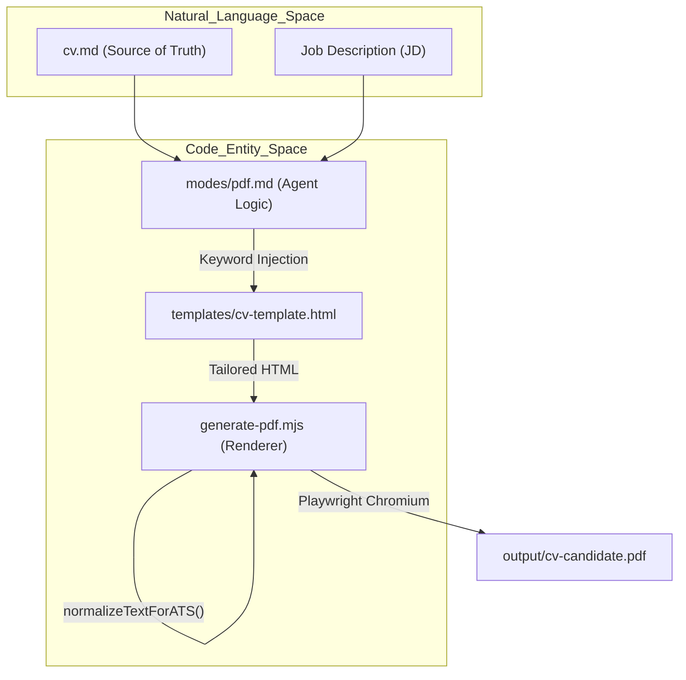
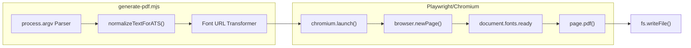

# generate-pdf.mjs 스크립트

<details>
<summary>관련 소스 파일</summary>

다음 파일들이 이 위키 페이지를 생성하기 위한 컨텍스트로 사용되었습니다:

- [config/profile.example.yml](config/profile.example.yml)
- [examples/ats-normalization-test.md](examples/ats-normalization-test.md)
- [generate-pdf.mjs](generate-pdf.mjs)
- [modes/_shared.md](modes/_shared.md)
- [modes/auto-pipeline.md](modes/auto-pipeline.md)
- [modes/pdf.md](modes/pdf.md)
- [templates/cv-template.html](templates/cv-template.html)

</details>


`generate-pdf.mjs` 스크립트는 맞춤형 HTML CV를 ATS 최적화 PDF 문서로 변환하는 역할을 담당하는 Career-Ops 엔진 내부의 특수 유틸리티입니다. Playwright와 headless Chromium을 활용해 고충실도 렌더링, 정확한 font embedding, 표준화된 용지 형식을 보장하며, Applicant Tracking Systems(ATS)를 위한 핵심 Unicode 정규화를 구현합니다.

## 개요 및 CLI 사용법

이 스크립트는 사용자가 수동으로 호출하거나 `pdf` 에이전트 모드가 자동으로 호출하도록 설계되어 있습니다 [modes/pdf.md:21-21](). 입력 및 출력 경로를 위한 positional argument와 용지 크기를 위한 선택적 flag를 받습니다.

**Command Syntax:**
```bash
node generate-pdf.mjs <input.html> <output.pdf> [--format=letter|a4]
```

### Argument Parsing
스크립트는 `process.argv`를 파싱해 `inputPath`, `outputPath`, `format`을 추출합니다 [generate-pdf.mjs:83-91]().
*   **Default Format**: `a4` [generate-pdf.mjs:81-81]().
*   **Validation**: format이 `a4` 또는 `letter`인지 엄격히 검증합니다 [generate-pdf.mjs:102-106]().
*   **Path Resolution**: headless rendering 중 일관성을 보장하기 위해 모든 경로는 `path.resolve`를 사용해 절대 경로로 해석됩니다 [generate-pdf.mjs:98-99]().

**Sources:** [generate-pdf.mjs:78-106]()

## 기술적 구현

### ATS Unicode 정규화
스크립트의 핵심 기능은 `normalizeTextForATS`입니다. 이 함수는 legacy ATS 시스템에서 "mojibake" 또는 파싱 오류를 방지하기 위해 본문 텍스트를 sanitize합니다 [generate-pdf.mjs:34-75]().
*   **Protection**: CSS, JS, tag attribute는 보존하고 visible text만 수정하기 위해 masking technique을 사용합니다 [generate-pdf.mjs:38-61]().
*   **Replacements**: em-dashes(`\u2014`)와 en-dashes(`\u2013`)를 표준 hyphen으로, "smart" quotes를 straight quotes로 변환하고 zero-width characters를 제거합니다 [generate-pdf.mjs:66-72]().
*   **Logging**: 스크립트는 수행한 모든 replacement의 breakdown을 로그로 남깁니다(예: `nbsp=5, smart-double-quote=2`) [generate-pdf.mjs:131-134]().

### Font Path Resolution(file:// URLs)
PDF가 일반적인 웹 서버 없이 headless browser context에서 렌더링되기 때문에 font에 대한 상대 CSS 경로(예: `./fonts/font.woff2`)는 해석에 실패합니다. 스크립트는 다음을 수행하는 pre-processing step을 구현합니다:
1.  HTML source를 읽습니다 [generate-pdf.mjs:113-113]().
2.  스크립트 위치를 기준으로 `fonts/` 디렉터리를 해석합니다 [generate-pdf.mjs:116-116]().
3.  상대 경로를 절대 `file://` URL로 교체합니다 [generate-pdf.mjs:117-125]().

### Playwright 렌더링 파이프라인
스크립트는 모든 asset이 완전히 로드된 뒤에만 PDF가 렌더링되도록 다음 순서를 사용합니다:
1.  **Launch**: headless Chromium 인스턴스를 시작합니다 [generate-pdf.mjs:136-136]().
2.  **Content Injection**: 처리된 HTML을 사용해 page content를 설정하고, 다른 상대 resource를 처리하기 위한 `baseURL`을 정의합니다 [generate-pdf.mjs:141-144]().
3.  **Network Idle**: `networkidle` 상태를 기다립니다 [generate-pdf.mjs:142-142]().
4.  **Font Readiness**: typography가 올바르게 적용되었는지 확인하기 위해 `document.fonts.ready`를 사용하는 browser-side check를 실행합니다 [generate-pdf.mjs:147-147]().

**Sources:** [generate-pdf.mjs:34-147]()

## 데이터 흐름: HTML에서 PDF까지

다음 다이어그램은 원시 Markdown source of truth에서 최종 PDF binary까지의 변환을 보여줍니다.

### CV 생성 로직 흐름

**Sources:** [modes/pdf.md:3-21](), [generate-pdf.mjs:34-75](), [templates/cv-template.html:1-7]()

## 고급 기능

### 용지 형식 감지
시스템은 채용 회사의 위치를 기반으로 적절한 용지 형식을 자동 감지합니다. 회사가 미국 또는 캐나다에 있으면 기본값은 `letter`이고, 그 외에는 `a4`를 사용합니다 [modes/pdf.md:9-11]().

### 페이지 수 추정
스크립트는 생성 후 approximate page count를 포함한 보고서를 제공합니다. 정규식을 사용해 PDF binary structure를 파싱하고 `/Type /Page` object를 계산합니다 [generate-pdf.mjs:167-168]().

### 시스템 컴포넌트 상호작용
이 다이어그램은 CLI 스크립트를 그것이 관리하는 내부 browser entity에 매핑합니다.


**Sources:** [generate-pdf.mjs:78-177]()

## Batch Pipeline과의 통합
이 스크립트는 `auto-pipeline` 및 `batch-runner.sh` 워크플로의 downstream consumer입니다. `cv.output_format`이 `html`(기본값)로 설정되어 있으면, AI 에이전트가 HTML content tailoring을 완료한 뒤 파이프라인이 PDF 생성을 트리거합니다 [modes/auto-pipeline.md:29-33]().

## 기술 사양 표

| 기능 | 구현 세부 사항 |
| :--- | :--- |
| **Engine** | Playwright (Chromium Headless) [generate-pdf.mjs:13-13]() |
| **ATS Normalization** | em-dashes, smart quotes, non-breaking spaces 변환 [generate-pdf.mjs:66-72]() |
| **Typography** | Space Grotesk (Headings), DM Sans (Body) [templates/cv-template.html:8-42]() |
| **ATS Layout** | Single-column, standard headers, SVG 안에 text 없음 [modes/pdf.md:26-31]() |
| **Margins** | 0.6 inch로 고정 [generate-pdf.mjs:153-158]() |
| **File Handling** | font를 위한 절대 `file://` 해석 [generate-pdf.mjs:117-120]() |

**Sources:** [generate-pdf.mjs:1-178](), [modes/pdf.md:1-62](), [templates/cv-template.html:1-130](), [modes/auto-pipeline.md:29-33]()
