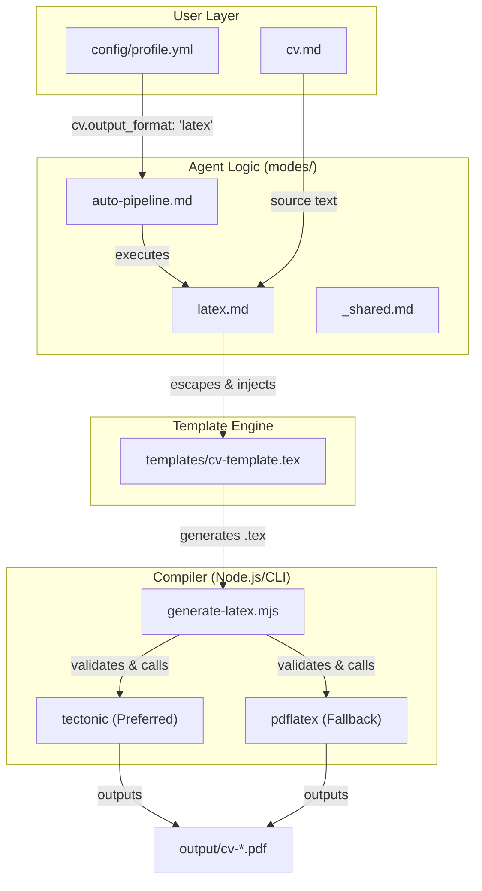

# LaTeX/Overleaf Export

관련 소스 파일

다음 파일들이 이 위키 페이지를 생성하기 위한 컨텍스트로 사용되었습니다:

- [config/profile.example.yml](config/profile.example.yml)
- [generate-latex.mjs](generate-latex.mjs)
- [modes/_shared.md](modes/_shared.md)
- [modes/auto-pipeline.md](modes/auto-pipeline.md)
- [modes/latex.md](modes/latex.md)
- [modes/pdf.md](modes/pdf.md)
- [templates/cv-template.html](templates/cv-template.html)
- [templates/cv-template.tex](templates/cv-template.tex)

LaTeX/Overleaf export 경로는 표준 HTML-to-PDF 워크플로에 대한 고충실도 전문 대안을 제공합니다. 전통적인 학술 또는 고급 엔지니어링 CV 형식이 필요하고, Overleaf와 100% 호환되며 native Unicode mapping을 통해 ATS(Applicant Tracking Systems)에 최적화된 형식을 원하는 후보자를 위해 설계되었습니다.

### 파이프라인 개요

LaTeX export 프로세스는 `modes/latex.md`를 통해 오케스트레이션됩니다 [modes/latex.md:1-22](). `pdf` 모드와 유사한 구조화된 순서를 따르지만, `.tex` 소스 생성과 특수 LaTeX compilation을 대상으로 합니다.

1.  **컨텍스트 수집**: `cv.md`(Source of Truth)와 `config/profile.yml`(Identity)을 읽습니다 [modes/latex.md:7-8]().
2.  **JD 분석**: 15-20개의 키워드를 추출하고 role archetype을 감지합니다 [modes/latex.md:10-12]().
3.  **맞춤형 생성**: JD 관련성을 기준으로 Professional Summary를 다시 작성하고 experience bullet/project의 순서를 재배치합니다 [modes/latex.md:13-16]().
4.  **Templating**: 특정 placeholder 시스템을 사용해 처리된 콘텐츠를 `templates/cv-template.tex`에 주입합니다 [modes/latex.md:17]().
5.  **검증 및 컴파일**: `generate-latex.mjs`를 실행해 구조를 검증하고 `tectonic` 또는 `pdflatex`를 사용해 PDF를 컴파일합니다 [modes/latex.md:19]().

### 데이터 흐름: Markdown에서 LaTeX까지

다음 다이어그램은 사용자 구성에 따라 시스템이 LaTeX 워크플로를 통해 데이터를 라우팅하는 방식을 보여줍니다.

**LaTeX Export System Topology**

**Sources:** [modes/auto-pipeline.md:30-33](), [modes/latex.md:1-22](), [generate-latex.mjs:133-141]()

### 템플릿 Placeholder 시스템

`templates/cv-template.tex` 파일은 double-brace placeholder를 사용합니다. 에이전트는 모든 콘텐츠가 LaTeX syntax에 맞게 적절히 escaped되도록 보장하면서 substitution을 수행할 책임이 있습니다.

| Placeholder | 설명 | 소스 매핑 |
| :--- | :--- | :--- |
| `{{NAME}}` | 후보자 전체 이름 | `profile.yml` → `candidate.full_name` |
| `{{CONTACT_LINE}}` | 전화번호, 위치, Visa status | `profile.yml`에서 연결 |
| `{{EMAIL_URL}}` | `mailto:` link를 위한 raw email | `profile.yml` → `candidate.email` |
| `{{EMAIL_DISPLAY}}` | 텍스트 표시를 위한 escaped email | `profile.yml` → `candidate.email` (escaped) |
| `{{EXPERIENCE}}` | `\resumeSubheading` block 목록 | `cv.md` Work Experience |
| `{{PROJECTS}}` | `\resumeProjectHeading` block 목록 | `cv.md` Projects (Top 3-4) |
| `{{SKILLS}}` | 형식화된 `\textbf{Category}` line | `cv.md` Technical Skills |

**Sources:** [modes/latex.md:24-41](), [templates/cv-template.tex:83-119]()

### LaTeX 콘텐츠 생성 규칙

에이전트는 Markdown 섹션을 템플릿에 정의된 특정 LaTeX environment로 변환합니다 [templates/cv-template.tex:48-78]().

#### Experience 및 Projects
각 work experience 항목은 Company, Date Range, Role Title, Location이라는 네 개의 argument를 받는 `\resumeSubheading`으로 감싸집니다 [modes/latex.md:67-75](). 각 subheading 내부에서 bullet은 `\resumeItem` 항목으로 생성됩니다 [templates/cv-template.tex:48-52]().

#### 중요 Escaping 규칙
컴파일 오류를 방지하기 위해 에이전트는 substitution 전에 사용자 제공 텍스트의 특수 LaTeX 문자를 escape해야 합니다 [modes/latex.md:97-115]():
*   `&` → `\&`
*   `_` → `\_`
*   `$` → `\$`
*   `%` → `\%`
*   `±` → `$\pm$`

**예외**: `\href{URL}{...}` 안의 URL은 첫 번째 argument에서 raw 상태로 유지되어야 하며, 두 번째 argument(display text)는 escape되어야 합니다 [modes/latex.md:118-121]().

### 컴파일 및 검증: `generate-latex.mjs`

`generate-latex.mjs` 스크립트는 safeguard 및 compiler wrapper 역할을 합니다.

**검증 로직**:
컴파일을 시도하기 전에 스크립트는 다음을 확인합니다 [generate-latex.mjs:21-32]():
*   **필수 섹션**: Education, Work Experience, Personal Projects, Technical Skills의 존재 여부.
*   **필수 명령**: `\resumeSubheading`, `\resumeItem`, `\resumeProjectHeading` 사용 여부.
*   **해결되지 않은 Placeholder**: 남아 있는 `{{PLACEHOLDER}}` 문자열을 감지합니다 [generate-latex.mjs:75-79]().
*   **ATS 호환성**: 기계 판독성을 위해 `\pdfgentounicode=1`이 있는지 확인합니다 [generate-latex.mjs:93-96]().

**엔진 선택**:
스크립트는 시스템 `PATH`에서 사용 가능한 엔진을 다음 순서로 감지합니다 [generate-latex.mjs:133-141]():
1.  **Tectonic**: LaTeX package를 자동으로 관리하므로 선호됩니다. Tectonic을 사용할 때 스크립트는 XeTeX 기반 Tectonic 엔진에서 crash를 유발하는 `pdflatex` 전용 primitive(예: `\pdfgentounicode`)를 제거합니다 [generate-latex.mjs:154-160]().
2.  **pdflatex**: TeX Live 또는 MiKTeX에서 찾을 수 있는 표준 fallback입니다.

**Compiler Execution Flow**

```mermaid
graph TD
    START["generate-latex.mjs <input.tex>"] --> READ["Read .tex File"]
    READ --> VALIDATE{"Validate Structure"}
    VALIDATE -- "Fail" --> EXIT_ERR["Exit with JSON Issues Report"]
    VALIDATE -- "Pass" --> DETECT_ENG{"Detect Engine"}
    
    DETECT_ENG -- "tectonic found" --> PATCH["Patch .tex (Remove pdf-primitives)"]
    PATCH --> RUN_TECTONIC["execFileSync('tectonic', ...)"]
    
    DETECT_ENG -- "pdflatex found" --> RUN_PDFLATEX["execFileSync('pdflatex', ...) x2"]
    
    RUN_TECTONIC --> SUCCESS{"Check PDF Created"}
    RUN_PDFLATEX --> SUCCESS
    
    SUCCESS -- "Yes" --> CLEANUP["Remove .aux, .log, .out"]
    CLEANUP --> EXIT_OK["Report .pdf path & size"]
    SUCCESS -- "No" --> EXIT_COMPILE_ERR["Report LaTeX Error Log"]
```

**Sources:** [generate-latex.mjs:121-201](), [generate-latex.mjs:222-225]()

### Overleaf 호환성
템플릿은 Overleaf에서 "zero-config"로 작동하도록 설계되었습니다. `titlesec`, `hyperref`, `fontawesome5` 같은 표준 CTAN package를 활용합니다 [modes/latex.md:142-145](). 생성된 `.tex` 파일은 추가 `.cls` 또는 `.sty` 파일 없이 Overleaf 프로젝트에 바로 업로드해 컴파일할 수 있습니다 [modes/latex.md:147]().

**Sources:** [modes/latex.md:140-148](), [templates/cv-template.tex:9-21]()
