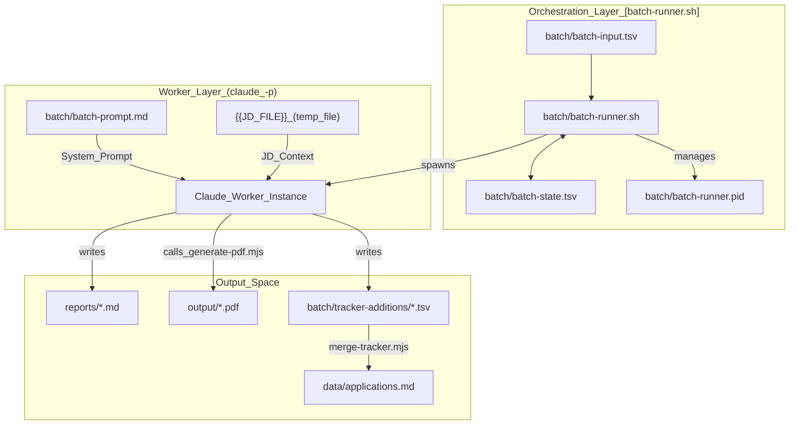
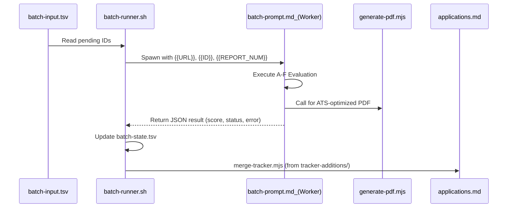

# 배치 처리 시스템

관련 소스 파일

다음 파일들이 이 위키 페이지를 생성하기 위한 컨텍스트로 사용되었습니다:

- [LICENSE](LICENSE)
- [batch/batch-prompt.md](batch/batch-prompt.md)
- [batch/batch-runner.sh](batch/batch-runner.sh)
- [batch/tracker-additions/.gitkeep](batch/tracker-additions/.gitkeep)
- [cv-sync-check.mjs](cv-sync-check.mjs)
- [docs/ARCHITECTURE.md](docs/ARCHITECTURE.md)
- [docs/SETUP.md](docs/SETUP.md)
- [modes/apply.md](modes/apply.md)
- [modes/batch.md](modes/batch.md)
- [modes/pipeline.md](modes/pipeline.md)
- [modes/tracker.md](modes/tracker.md)

**Batch Processing System**은 채용 공고를 병렬로 처리하도록 설계된 대량 평가 하위 시스템입니다. 원시 URL 또는 Job Description(JD)에서 생성된 PDF CV와 application tracker의 구조화된 항목을 포함한 완전한 전문 평가로 전환하는 과정을 자동화합니다.

이 시스템은 후보자가 수십 개의 잠재 역할을 식별하고 각 단계마다 수동 개입 없이 빠르고 고품질의 평가가 필요한 "burst" 처리에 맞게 설계되었습니다.

## 시스템 아키텍처

배치 시스템은 **Orchestrator/Worker** 패턴을 따릅니다. orchestrator는 상태, 동시성, 오류 복구를 관리하고, 독립 worker(Claude 기반)는 실제 분석과 파일 생성을 수행합니다.

### 상위 수준 흐름
1.  **Input**: URL 또는 JD 목록이 `batch/batch-input.tsv`를 통해 제공됩니다 [batch/batch-runner.sh:16]().
2.  **Orchestration**: 시스템은 `batch/batch-state.tsv`를 확인해 pending 상태의 공고를 결정합니다 [batch/batch-runner.sh:17]().
3.  **Execution**: `batch-prompt.md` 템플릿과 함께 `claude -p`를 사용해 각 공고를 처리할 worker가 생성됩니다(순차 또는 병렬) [batch/batch-runner.sh:40-46]().
4.  **Output**: 각 worker는 `reports/`에 Markdown report, `generate-pdf.mjs`를 통한 custom PDF, `batch/tracker-additions/`에 tracker TSV line을 생성합니다 [batch/batch-prompt.md:5-7]().
5.  **Completion**: 결과는 main `data/applications.md` tracker로 병합됩니다 [batch/batch-runner.sh:22]().

### 코드 엔티티 맵: 아키텍처
다음 다이어그램은 배치 시스템의 논리적 컴포넌트를 물리적 파일 엔티티 및 데이터 구조에 매핑합니다.

**Batch System Entity Mapping**

Sources: [batch/batch-runner.sh:13-25](), [batch/batch-prompt.md:1-10](), [batch/batch-prompt.md:46-56](), [modes/batch.md:26-34]()

---

## 운영 모드

배치 시스템은 채용 공고의 출처에 따라 두 가지 방식으로 트리거될 수 있습니다.

### 1. Conductor --chrome 모드
이 모드에서 시스템은 headed browser를 사용해 portal을 실시간으로 탐색하고 DOM에서 직접 JD를 추출합니다 [modes/batch.md:36-40]().
*   **Extraction**: portal search result로 이동하고 `batch-input.tsv`를 채웁니다 [modes/batch.md:40]().
*   **Orchestration**: 각 pending URL에 대해 JD text를 임시 파일로 추출하고 headless worker를 실행합니다 [modes/batch.md:41-50]().
*   **Post-Process**: 완료 시 additions를 main tracker로 자동 병합합니다 [modes/batch.md:56]().

### 2. Standalone Orchestrator(`batch-runner.sh`)
이는 `batch-input.tsv`에 이미 수집된 URL 또는 JD의 bulk processing에 사용되는 headless Bash 기반 orchestrator입니다 [batch/batch-runner.sh:4-6]().
*   **Parallelism**: `--parallel` flag를 사용해 $N$개의 worker를 동시에 실행할 수 있습니다 [batch/batch-runner.sh:46]().
*   **Resumability**: `batch-state.tsv`를 사용해 완료된 ID를 건너뛰고, `--retry-failed`로 실패한 항목을 다시 시도할 수 있습니다 [batch/batch-runner.sh:48]().
*   **Locking**: 이중 실행을 방지하기 위해 PID 기반 lock을 구현합니다 [batch/batch-runner.sh:95-109]().

Sources: [modes/batch.md:36-62](), [batch/batch-runner.sh:38-77]()

---

## 핵심 컴포넌트

### [batch-runner.sh Orchestrator](#4.1)
배치 작업의 lifecycle을 담당하는 기본 Bash 스크립트입니다. prerequisite validation(`claude` CLI 확인), 동시성을 처리하기 위한 directory-based locking mechanism을 사용하는 state management, 최종 data merging을 처리합니다 [batch/batch-runner.sh:121-160](). 전역 일관성을 유지하기 위해 모든 worker가 올바른 `{{REPORT_NUM}}` 및 `{{ID}}`를 받도록 보장합니다 [batch/batch-runner.sh:235-250]().

자세한 내용은 [batch-runner.sh Orchestrator](#4.1)를 참조하세요.

### [batch-prompt.md Worker Template](#4.2)
표준 Claude 인스턴스를 특수 career-ops worker로 변환하는 self-contained system prompt입니다 [batch/batch-prompt.md:1-9](). 6단계 평가 파이프라인(A-F)의 로직, archetype detection 지침, orchestrator가 state를 업데이트하기 위해 파싱하는 JSON output의 schema를 포함합니다 [batch/batch-prompt.md:60-150]().

자세한 내용은 [batch-prompt.md Worker Template](#4.2)를 참조하세요.

---

## 데이터 흐름 및 상태 관리

시스템은 Tab-Separated Values(TSV) 파일에 의존해 process crash 후에도 유지되는 견고하고 사람이 읽을 수 있는 상태를 관리합니다.

| 파일 | 목적 | 핵심 열 |
| :--- | :--- | :--- |
| `batch-input.tsv` | 작업 queue | `id`, `url`, `source`, `notes` [batch/batch-runner.sh:58]() |
| `batch-state.tsv` | 실행 history | `status`, `started_at`, `score`, `error`, `retries` [batch/batch-runner.sh:143]() |
| `tracker-additions/` | 개별 결과 | `merge-tracker.mjs`를 위한 개별 TSV line [batch/batch-runner.sh:20]() |

### 코드 엔티티 맵: 데이터 lifecycle
이 다이어그램은 데이터가 raw input에서 최종 application tracker로 전환되는 방식을 보여줍니다.

**Batch Data Lifecycle**

Sources: [batch/batch-runner.sh:140-145](), [batch/batch-prompt.md:46-56](), [batch/batch-prompt.md:58-150](), [modes/batch.md:88-95]()
