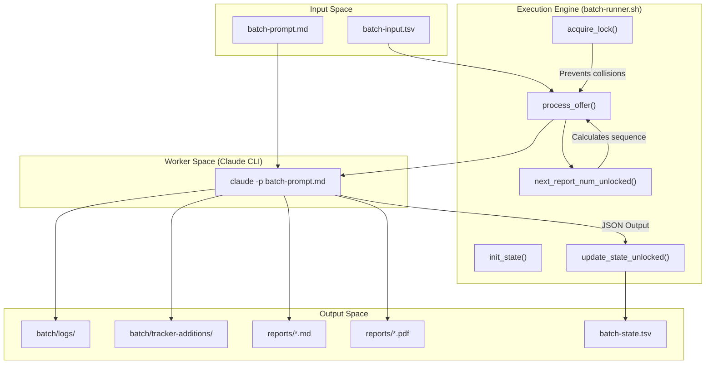
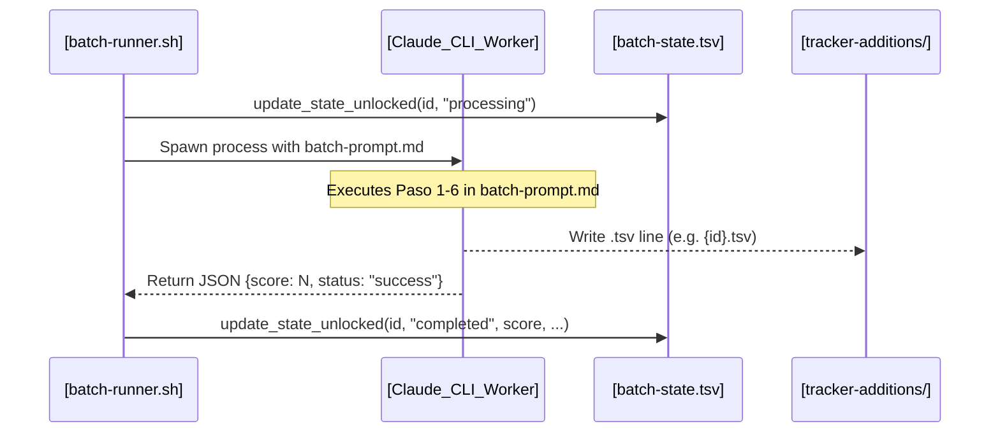

# batch-runner.sh Orchestrator

관련 소스 파일

다음 파일들이 이 위키 페이지를 생성하기 위한 컨텍스트로 사용되었습니다:

- [LICENSE](LICENSE)
- [batch/batch-prompt.md](batch/batch-prompt.md)
- [batch/batch-runner.sh](batch/batch-runner.sh)
- [batch/tracker-additions/.gitkeep](batch/tracker-additions/.gitkeep)
- [cv-sync-check.mjs](cv-sync-check.mjs)
- [docs/ARCHITECTURE.md](docs/ARCHITECTURE.md)

`batch-runner.sh` 스크립트는 대량 자동 채용 평가를 위한 중앙 orchestrator입니다. `claude -p` worker 집합을 관리하며, 병렬화, 상태 지속성, 실패 시 자동 복구를 처리하는 견고한 실행 계층을 제공합니다. 수동 개입 없이 job URL 목록을 구조화된 평가, PDF report, tracker entry 집합으로 변환합니다.

### 핵심 아키텍처 및 데이터 흐름

orchestrator는 input queue에서 읽고 persistent state file을 유지해 idempotency와 resumability를 보장하는 state machine으로 작동합니다. 전역 process lock과 병렬 실행 중 thread-safe update를 위한 fine-grained state lock이라는 이중 lock mechanism을 사용합니다.

#### 시스템 컴포넌트 상호작용
다음 다이어그램은 `batch-runner.sh`가 input file, Claude CLI, 최종 data destination 사이를 어떻게 조율하는지 보여줍니다.

**Orchestrator Logic Flow**

**Sources:** [batch/batch-runner.sh:13-23](), [batch/batch-runner.sh:95-109](), [batch/batch-runner.sh:235-250](), [batch/batch-runner.sh:314-411]()

---

### CLI Flags 및 구성

orchestrator는 실행 환경과 복구 동작을 제어하기 위한 여러 flag를 지원합니다:

| Flag | Default | 설명 |
| :--- | :--- | :--- |
| `--parallel N` | `1` | 동시에 실행할 `claude` worker process 수입니다. [batch/batch-runner.sh:30]() |
| `--dry-run` | `false` | Claude worker를 시작하지 않고 pending offer를 나열합니다. [batch/batch-runner.sh:31]() |
| `--retry-failed` | `false` | queue를 `batch-state.tsv`에서 `failed`로 표시된 ID만 처리하도록 필터링합니다. [batch/batch-runner.sh:32]() |
| `--start-from N` | `0` | 숫자로 `N`보다 낮은 모든 ID를 건너뜁니다. [batch/batch-runner.sh:33]() |
| `--max-retries N` | `2` | 단일 ID가 permanent failure가 되기 전 허용되는 최대 시도 횟수입니다. [batch/batch-runner.sh:34]() |
| `--min-score N` | `0` | `N`보다 낮은 점수의 offer에 대해 PDF 생성 및 tracker addition을 건너뜁니다. [batch/batch-runner.sh:35]() |
| `--model NAME` | `""` | 특정 model name을 `claude -p --model`에 전달합니다. [batch/batch-runner.sh:36]() |

**Sources:** [batch/batch-runner.sh:29-36](), [batch/batch-runner.sh:79-92]()

---

### 상태 관리 및 재개 가능성

시스템은 batch lifecycle을 관리하기 위해 두 개의 주요 TSV(Tab-Separated Values) 파일을 사용합니다.

#### 1. batch-input.tsv
작업 queue의 source of truth입니다.
*   **Format:** `id	url	source	notes` [batch/batch-runner.sh:58]()
*   `id`는 진행 상황 추적에 사용되는 고유 numeric identifier입니다.

#### 2. batch-state.tsv
`update_state_unlocked()`가 관리하는 persistence layer입니다. 이 파일 덕분에 스크립트는 작업을 중복하지 않고 중단 후 재개할 수 있습니다.
*   **Columns:** `id`, `url`, `status`, `started_at`, `completed_at`, `report_num`, `score`, `error`, `retries`. [batch/batch-runner.sh:143]()
*   **Statuses:** `none`, `processing`, `completed`, `failed`. [batch/batch-runner.sh:210-219]()

#### Lock Mechanisms
race condition을 방지하기 위해 `batch-runner.sh`는 두 단계의 locking을 구현합니다:
1.  **Process Lock(`acquire_lock`)**: 여러 orchestrator instance가 동시에 실행되지 않도록 `batch-runner.pid`를 사용합니다. [batch/batch-runner.sh:95-109]()
2.  **State Lock(`acquire_state_lock`)**: 병렬 worker 간 `batch-state.tsv` 접근을 동기화하기 위해 directory-based lock(`.batch-state.lock/`)을 사용합니다. 30초 timeout과 stale PID recovery를 포함합니다. [batch/batch-runner.sh:147-188]()

**Sources:** [batch/batch-runner.sh:16-27](), [batch/batch-runner.sh:95-116](), [batch/batch-runner.sh:141-193]()

---

### Worker 실행 및 병렬화

orchestrator는 `process_offer()`를 사용해 환경을 준비하고, `run_worker()`로 각 Claude process의 lifecycle을 관리합니다.

#### Sequence 생성
worker를 시작하기 전에 스크립트는 `next_report_num_unlocked()`를 계산합니다. `reports/` 디렉터리와 `batch-state.tsv` 파일을 모두 스캔해 가장 높은 기존 번호를 찾고 증가시킵니다(예: `042`). 이를 통해 report가 아직 disk에 작성되지 않았더라도 해당 ID가 state file에 예약되도록 보장합니다. [batch/batch-runner.sh:235-250]()

#### Worker Invocation
각 worker는 Claude CLI의 instance입니다. orchestrator는 `{{URL}}`, `{{REPORT_NUM}}`, `{{DATE}}`, `{{ID}}` 같은 placeholder가 포함된 `batch-prompt.md`를 통해 지침을 전달합니다. [batch/batch-prompt.md:46-54]()

**Sources:** [batch/batch-runner.sh:314-411](), [batch/batch-prompt.md:46-56]()

#### 데이터 흐름: Worker에서 Orchestrator까지
다음 다이어그램은 orchestrator가 worker output을 캡처해 global state를 업데이트하는 방식을 보여줍니다.

**Worker-Orchestrator Handshake**

**Sources:** [batch/batch-runner.sh:253-311](), [batch/batch-runner.sh:314-411](), [batch/batch-prompt.md:58-140]()

---

### 후처리 및 통합

batch가 완료되면 orchestrator는 자동 병합과 검증을 수행합니다:

1.  **Logs**: 각 worker의 standard output 및 error는 `batch/logs/{report_num}-{id}.log`로 redirect됩니다. [batch/batch-runner.sh:354]()
2.  **Tracker Integration**: 모든 worker가 완료된 후 orchestrator는 `merge-tracker.mjs`를 호출해 `batch/tracker-additions/`의 TSV fragment를 main `data/applications.md`로 수집합니다. [batch/batch-runner.sh:498-502]()
3.  **Integrity Check**: 마지막으로 `verify-pipeline.mjs`를 실행해 application database가 일관성을 유지하는지 확인합니다. [batch/batch-runner.sh:505-509]()
4.  **Automatic Resumption**: `get_status()`가 처리 전에 `batch-state.tsv`를 확인하므로 스크립트는 안전하게 재시작할 수 있습니다. `completed` 항목은 건너뛰고 `none` 또는 (`--retry-failed`가 활성화된 경우) `failed`만 대상으로 합니다. [batch/batch-runner.sh:210-219](), [batch/batch-runner.sh:455-465]()

**Sources:** [batch/batch-runner.sh:494-515](), [docs/ARCHITECTURE.md:54-71](), [docs/ARCHITECTURE.md:91-101]()
