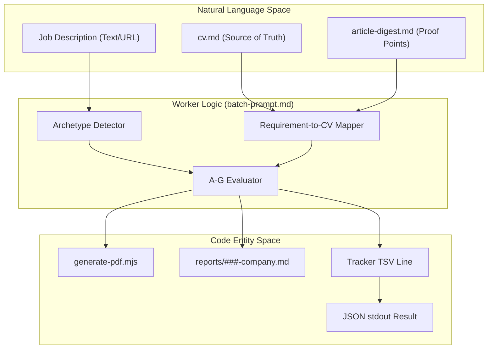
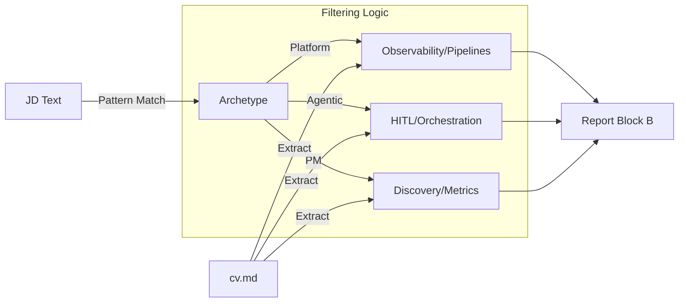

# batch-prompt.md Worker Template

<details>
<summary>관련 소스 파일</summary>

다음 파일들이 이 위키 페이지를 생성하기 위한 컨텍스트로 사용되었습니다:

- [LICENSE](LICENSE)
- [batch/batch-prompt.md](batch/batch-prompt.md)
- [batch/batch-runner.sh](batch/batch-runner.sh)
- [batch/tracker-additions/.gitkeep](batch/tracker-additions/.gitkeep)
- [cv-sync-check.mjs](cv-sync-check.mjs)
- [docs/ARCHITECTURE.md](docs/ARCHITECTURE.md)

</details>


`batch-prompt.md` 파일은 batch processing 중 `claude -p` worker instance가 사용하는 self-contained 고밀도 instruction set입니다. 원시 Job Description(JD)을 포괄적인 evaluation report, tailored CV, application tracker를 위한 structured data entry로 변환하는 로직을 정의합니다.

## 목적 및 범위

`career-ops` 아키텍처에서 orchestrator(`batch-runner.sh`)는 여러 worker process를 생성합니다. 각 worker는 system prompt로 `batch-prompt.md`를 사용해 초기화됩니다 [batch/batch-runner.sh:18](). 이 템플릿은 Claude의 internal state 관점에서 "zero-dependency"가 되도록 설계되었습니다. 즉, 다른 Markdown skill에 대한 외부 tool call 없이 평가를 완료하는 데 필요한 모든 규칙, archetype, pipeline step을 포함합니다 [batch/batch-prompt.md:9-10]().

## Placeholder Substitution

worker가 실행을 시작하기 전에 orchestrator는 처리 중인 특정 job에 대한 컨텍스트를 제공하기 위해 템플릿 내부의 특정 placeholder에 string substitution을 수행합니다.

| Placeholder | 설명 | Orchestrator의 소스 |
|-------------|-------------|------------------------|
| `{{URL}}` | 원본 job posting URL | `batch-input.tsv` |
| `{{JD_FILE}}` | scraped JD가 들어 있는 로컬 텍스트 파일 경로 | `batch/jobs/*.txt` |
| `{{REPORT_NUM}}` | 3자리 zero-padded sequence number(예: `042`) | `next_report_num_unlocked` |
| `{{DATE}}` | `YYYY-MM-DD` 형식의 현재 날짜 | `date +%Y-%m-%d` |
| `{{ID}}` | batch row의 unique identifier | `batch-input.tsv` |

Sources: [batch/batch-prompt.md:46-55](), [batch/batch-runner.sh:235-245]()

## 6단계 평가 파이프라인

worker는 수백 건의 평가 전반에서 일관성을 보장하기 위해 엄격한 순차 파이프라인을 따릅니다 [batch/batch-prompt.md:58-66]().

### 1. JD Ingestion
worker는 `{{JD_FILE}}`의 content를 읽습니다. 파일이 없거나 비어 있으면 `{{URL}}`을 사용해 content를 실시간으로 가져오기 위해 `WebFetch`로 fallback을 시도합니다 [batch/batch-prompt.md:60-64]().

### 2. Archetype Detection
시스템은 역할을 여섯 가지 canonical archetype 중 하나로 분류합니다 [batch/batch-prompt.md:70-83](). 이 분류는 후보자 이력에서 어떤 "proof points"를 우선시할지 결정합니다 [batch/batch-prompt.md:89-96]().

*   **AI Platform / LLMOps**: production, observability, pipeline에 집중합니다.
*   **Agentic Workflows**: orchestration, HITL(Human-in-the-loop), reliability에 집중합니다.
*   **Technical AI PM**: discovery, PRD, business-to-tech translation에 집중합니다.
*   **AI Solutions Architect**: end-to-end enterprise integration에 집중합니다.
*   **AI Forward Deployed Engineer**: rapid prototyping 및 client-facing delivery에 집중합니다.
*   **AI Transformation Lead**: change management와 organizational adoption에 집중합니다.

### 3. A-G Evaluation Blocks
worker는 다음으로 구성된 상세 Markdown report를 생성합니다:
*   **Block A (Role Summary):** Metadata 및 TL;DR [batch/batch-prompt.md:106-108]().
*   **Block B (CV Match):** JD requirements를 `cv.md` line에 직접 매핑 [batch/batch-prompt.md:110-121]().
*   **Block C (Level Strategy):** seniority 및 "vender senior" 전술 분석 [batch/batch-prompt.md:128-133]().
*   **Block D (Comp Research):** market rates 및 company reputation에 대한 web search [batch/batch-prompt.md:134-135]().
*   **Block E (Personalization):** CV 및 LinkedIn을 위한 상위 5개 구체적 변경 사항 [batch/batch-prompt.md:136-137]().
*   **Block F (Interview Prep):** JD에 매핑된 6-10개 STAR story [batch/batch-prompt.md:138-139]().
*   **Block G (Posting Legitimacy):** posting signal(Description quality, hiring freezes) 분석 [batch/batch-prompt.md:140-141]().

### 4. Report 및 PDF 생성
worker는 Markdown report를 `reports/`에 저장한 다음 `generate-pdf.mjs`를 호출합니다 [batch/batch-prompt.md:146-148](). 제안된 personalization change를 PDF engine에 전달해 해당 특정 회사에 맞춘 `cv.pdf`를 생성합니다.

### 5. Tracker TSV Generation
worker는 `merge-tracker.mjs` 유틸리티에 맞는 Tab-Separated Values(TSV) 한 줄을 생성하고, 이를 `batch/tracker-additions/`에 저장합니다 [batch/batch-prompt.md:150-151]().

### 6. JSON Output
마지막 단계는 structured JSON object를 `stdout`에 출력하는 것입니다. orchestrator는 이를 파싱해 worker가 성공했는지 실패했는지 판단합니다 [batch/batch-prompt.md:153-154]().

Sources: [batch/batch-prompt.md:58-154](), [docs/ARCHITECTURE.md:37-53]()

## 데이터 흐름 및 엔티티 매핑

다음 다이어그램은 `batch-prompt.md` instruction이 자연어 job description과 시스템의 structured code entity 사이의 간극을 어떻게 연결하는지 보여줍니다.

### Worker Execution Logic

Sources: [batch/batch-prompt.md:1-28](), [batch/batch-prompt.md:58-154](), [docs/ARCHITECTURE.md:37-53]()

## Tracker TSV Format

worker는 strict schema를 따르는 TSV line을 생성합니다. 이 line은 나중에 `merge-tracker.mjs`가 수집할 수 있도록 `batch/tracker-additions/`에 저장됩니다 [batch/batch-runner.sh:20]().

| Col | Field | 설명 |
|-----|-------|-------------|
| 1 | `#` | `{{REPORT_NUM}}` |
| 2 | `Date` | `{{DATE}}` |
| 3 | `Company` | Company Name |
| 4 | `Role` | Job Title |
| 5 | `Score` | Global Score (1-5) |
| 6 | `Status` | Default: `⏳ Evaluada` |
| 7 | `PDF` | 생성된 PDF의 relative path |
| 8 | `Report` | Markdown report의 relative path |
| 9 | `Notes` | Archetype + Score breakdown + TL;DR |

Sources: [batch/batch-prompt.md:150-151](), [docs/ARCHITECTURE.md:86-88]()

## JSON Result Schema

프로세스 끝에서 worker는 JSON block을 출력해야 합니다. `batch-runner.sh` orchestrator는 이 output을 캡처해 `batch-state.tsv` 파일을 업데이트합니다 [batch/batch-runner.sh:251-265]().

```json
{
  "status": "success",
  "id": "{{ID}}",
  "report_num": "{{REPORT_NUM}}",
  "company": "Company Name",
  "role": "Role Name",
  "score": 4.5,
  "report_path": "reports/001-company-2023-10-27.md",
  "pdf_path": "output/cv-candidate-company-2023-10-27.pdf"
}
```

실패가 발생하면(예: JD를 가져올 수 없음) worker는 error status를 출력하고 orchestrator는 이를 `batch-state.tsv`에 기록합니다 [batch/batch-runner.sh:267-270]().

Sources: [batch/batch-prompt.md:153-154](), [batch/batch-runner.sh:251-270]()

## Archetype Logic Flow

worker는 `Archetype`을 사용해 `cv.md` 및 `article-digest.md`에서 어떤 정보가 관련 있는지 필터링합니다 [batch/batch-prompt.md:89-96](). 이를 통해 "Solutions Architect" 평가는 "LLMOps Engineer" 평가와 다른 achievement를 강조하게 됩니다 [batch/batch-prompt.md:114-121]().

### Archetype Mapping Process

Sources: [batch/batch-prompt.md:70-83](), [batch/batch-prompt.md:89-104](), [cv-sync-check.mjs:49-56]()
