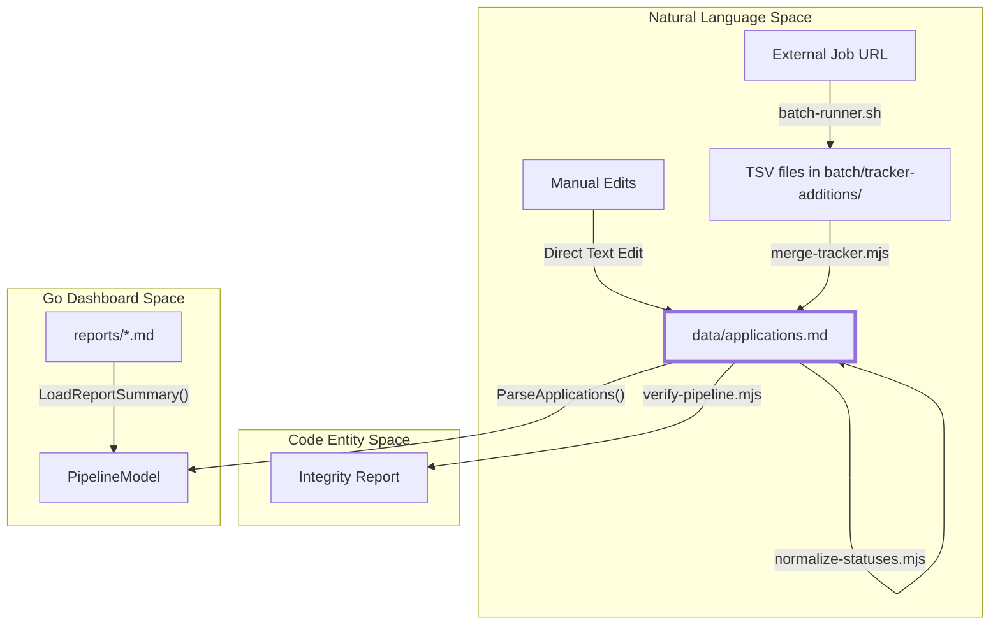
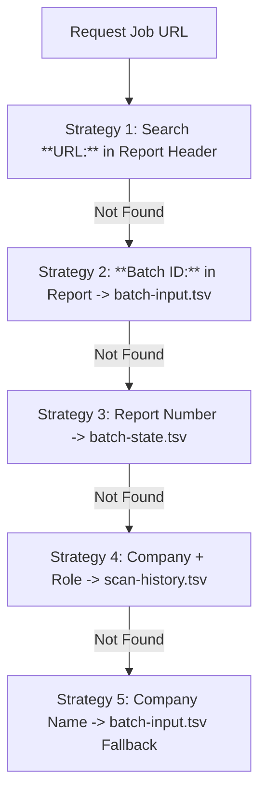

# 지원 Tracker 및 데이터 계층

관련 소스 파일

다음 파일들이 이 위키 페이지를 생성하기 위한 컨텍스트로 사용되었습니다:

- [batch/logs/.gitkeep](batch/logs/.gitkeep)
- [dashboard/internal/data/career.go](dashboard/internal/data/career.go)
- [dashboard/internal/data/career_test.go](dashboard/internal/data/career_test.go)
- [dashboard/internal/ui/screens/pipeline.go](dashboard/internal/ui/screens/pipeline.go)
- [dashboard/internal/ui/screens/pipeline_test.go](dashboard/internal/ui/screens/pipeline_test.go)
- [data/.gitkeep](data/.gitkeep)
- [dedup-tracker.mjs](dedup-tracker.mjs)
- [jds/.gitkeep](jds/.gitkeep)
- [merge-tracker.mjs](merge-tracker.mjs)
- [normalize-statuses.mjs](normalize-statuses.mjs)
- [output/.gitkeep](output/.gitkeep)
- [templates/states.yml](templates/states.yml)
- [verify-pipeline.mjs](verify-pipeline.mjs)

`data/` 디렉터리는 전체 career-ops 생태계의 persistent storage layer 역할을 합니다. 무거운 데이터베이스에 의존하는 전통적인 시스템과 달리, career-ops는 주로 `data/applications.md`를 중심으로 하는 **flat-file database** 접근 방식을 사용합니다. 이 Markdown 기반 아키텍처는 데이터를 사람이 읽을 수 있고, Git으로 version-control할 수 있으며, AI 에이전트와 사용자의 수동 개입 모두로 쉽게 편집할 수 있도록 보장합니다.

## Markdown 데이터베이스 스키마

데이터 계층의 핵심은 `data/applications.md`입니다. 이 파일은 pipe-delimited Markdown table을 사용해 모든 채용 공고를 lifecycle 전반에 걸쳐 추적합니다 [merge-tracker.mjs:24-26]().

### 표준 Table 구조
이 table은 Node.js 유지관리 스크립트와 Go 기반 dashboard 전반의 호환성에 필요한 엄격한 9열 스키마를 따릅니다 [merge-tracker.mjs:5-8]().

| Column | 이름 | 설명 |
| :--- | :--- | :--- |
| 1 | `#` | 순차 ID(Number) [dashboard/internal/data/career.go:80-83]() |
| 2 | `Date` | 최근 status change 날짜(YYYY-MM-DD) [dashboard/internal/data/career.go:86]() |
| 3 | `Company` | 채용 조직 이름 [dashboard/internal/data/career.go:87]() |
| 4 | `Role` | 구체적인 job title [dashboard/internal/data/career.go:88]() |
| 5 | `Score` | AI가 생성한 match score(예: `4.2/5`) [dashboard/internal/data/career.go:94-97]() |
| 6 | `Status` | 표준 상태(아래 State Machine 참조) [dashboard/internal/data/career.go:89]() |
| 7 | `PDF` | tailored CV 존재 여부 표시(Unicode ✅) [dashboard/internal/data/career.go:90]() |
| 8 | `Report` | `reports/`의 evaluation file에 대한 Markdown link [dashboard/internal/data/career.go:100-103]() |
| 9 | `Notes` | 컨텍스트를 위한 선택적 free-text [dashboard/internal/data/career.go:106-108]() |

**Sources:** [dashboard/internal/data/career.go:75-111](), [merge-tracker.mjs:5-8](), [verify-pipeline.mjs:75-80]()

## 표준 Status State Machine

데이터 무결성을 유지하고 dashboard filtering을 활성화하기 위해 `Status` 열은 `templates/states.yml`에 정의된 사전 정의 표준 상태 집합을 따라야 합니다 [templates/states.yml:1-7]().

### 상태 계층 및 Alias
시스템은 다양한 자연어 입력(alias)을 로직과 grouping에 사용하는 단일 표준 `id`로 매핑합니다 [templates/states.yml:9-57](). `dedup-tracker.mjs` 같은 스크립트는 `STATUS_RANK`를 사용해 pipeline에서 어떤 status가 "더 진전된" 상태인지 판단합니다 [dedup-tracker.mjs:28-50]().

| ID | Label | Common Aliases | Dashboard Group | Rank |
| :--- | :--- | :--- | :--- | :--- |
| `evaluated` | Evaluated | evaluada, condicional | evaluated | 2 |
| `applied` | Applied | aplicado, enviada, sent | applied | 3 |
| `responded` | Responded | respondido | responded | 4 |
| `interview` | Interview | entrevista | interview | 5 |
| `offer` | Offer | oferta | offer | 6 |
| `rejected` | Rejected | rechazado, rechazada | rejected | 1 |
| `discarded` | Discarded | cerrada, cancelada | discarded | 0 |
| `skip` | SKIP | no aplicar, monitor | skip | 0 |

**Sources:** [templates/states.yml:9-57](), [dedup-tracker.mjs:28-50](), [normalize-statuses.mjs:29-87](), [merge-tracker.mjs:37-68]()

## 데이터 흐름 및 유지관리 아키텍처

데이터 계층은 여러 batch process가 동시에 쓰더라도 flat-file이 일관성을 유지하도록 보장하는 Node.js 스크립트 모음으로 관리됩니다.

### 시스템 데이터 흐름
다음 다이어그램은 job data가 외부 URL에서 표준 `applications.md` 파일로, 마지막으로 TUI Dashboard로 이동하는 방식을 보여줍니다.

**Data Ingestion & Normalization Flow**

**Sources:** [merge-tracker.mjs:1-15](), [dashboard/internal/data/career.go:31-42](), [verify-pipeline.mjs:1-15](), [dashboard/internal/ui/screens/pipeline.go:124-139]()

### URL Enrichment 전략
Markdown table 자체는 공간 절약을 위해 전체 URL을 저장하지 않으므로, dashboard는 UI를 위해 원본 Job URL을 복구하고자 `ParseApplications`에서 5단계 전략을 사용합니다 [dashboard/internal/data/career.go:113-118]().

**URL Resolution Logic**

**Sources:** [dashboard/internal/data/career.go:113-165]()

## 유지관리 스크립트 개요

시스템은 데이터 계층의 상태를 유지하기 위해 여러 주요 스크립트에 의존합니다.

### [merge-tracker.mjs](#5.1)
이 스크립트는 batch data의 primary entry point입니다. 병렬 worker가 생성한 TSV 파일을 찾기 위해 `batch/tracker-additions/` 디렉터리를 모니터링합니다 [merge-tracker.mjs:27-34](). `normalizeCompany`과 `roleFuzzyMatch`를 사용해 fuzzy deduplication을 수행하고, 표준 상태에 대해 status를 검증합니다 [merge-tracker.mjs:39-68]().
*   **Key Function:** 8-col 및 9-col TSV data를 Markdown table로 수집합니다.
*   **Details:** [merge-tracker.mjs](#5.1)를 참조하세요.

### [dedup-tracker.mjs](#5.2)
시간이 지나면서 tracker에는 중복 entry가 쌓일 수 있습니다. 이 스크립트는 2단계 grouping(company, 그다음 role cluster)과 `STATUS_RANK` 계층을 사용해 어떤 entry를 유지할지 결정합니다 [dedup-tracker.mjs:157-180]().
*   **Key Function:** duplicate를 정리하고, discarded entry가 더 진행된 상태였다면 가장 "advanced" status를 승격합니다 [dedup-tracker.mjs:181-201]().
*   **Details:** [dedup-tracker.mjs](#5.2)를 참조하세요.

### [normalize-statuses.mjs & verify-pipeline.mjs](#5.3)
이 스크립트들은 데이터 계층의 최종 "polish"와 safety check를 처리합니다.
*   **normalize-statuses.mjs**: status/score cell에서 markdown formatting(예: bolding)을 제거하고 alias를 표준 형식으로 매핑합니다 [normalize-statuses.mjs:29-87]().
*   **verify-pipeline.mjs**: broken report link, schema violation, pending TSV file을 확인하는 diagnostic tool입니다 [verify-pipeline.mjs:127-174]().
*   **Details:** [normalize-statuses.mjs & verify-pipeline.mjs](#5.3)를 참조하세요.

### [Pattern Analysis & Follow-up Cadence Scripts](#5.4)
tracker data에 대해 작동해 insight를 제공하는 고급 analytics script입니다.
*   **analyze-patterns.mjs**: tracker history를 기반으로 rejection pattern과 tech stack gap을 감지합니다.
*   **followup-cadence.mjs**: `Date` 및 `Status` 열을 기반으로 follow-up의 urgency를 계산합니다.
*   **Details:** [Pattern Analysis & Follow-up Cadence Scripts](#5.4)를 참조하세요.

**Sources:** [merge-tracker.mjs:1-15](), [dedup-tracker.mjs:1-10](), [normalize-statuses.mjs:1-12](), [verify-pipeline.mjs:1-15]()
