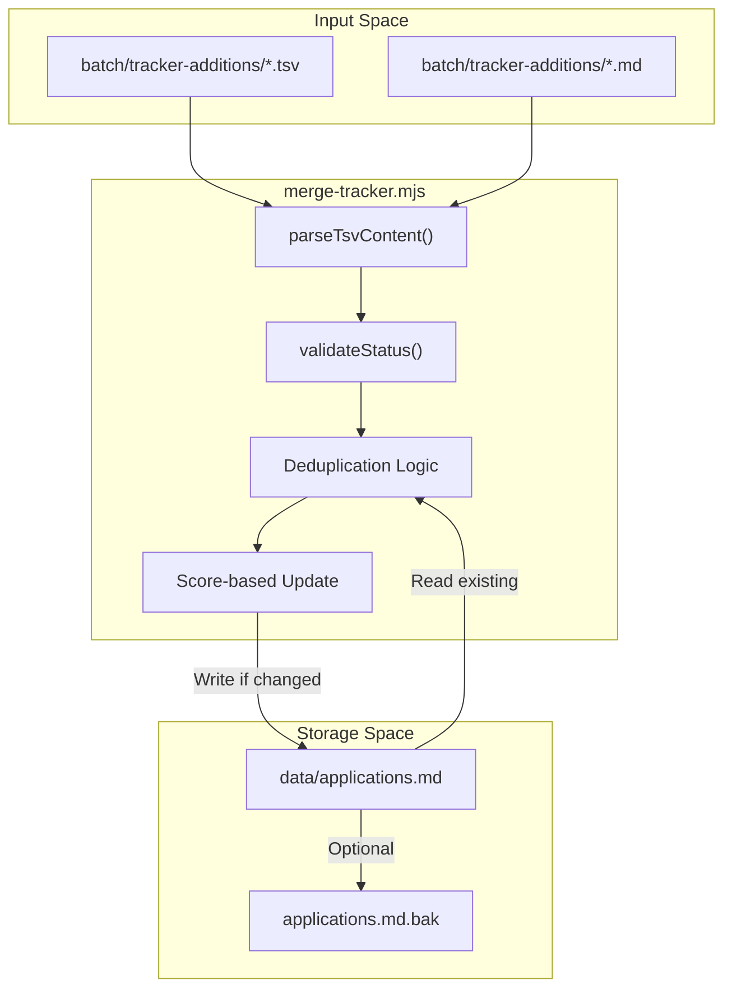
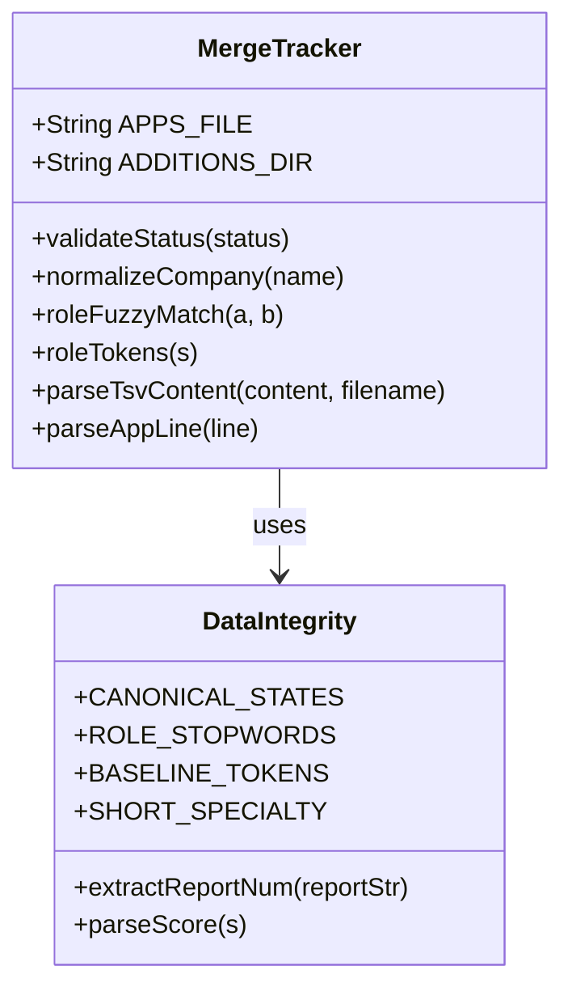

# merge-tracker.mjs

관련 소스 파일

다음 파일들이 이 위키 페이지를 생성하기 위한 컨텍스트로 사용되었습니다:

- [dedup-tracker.mjs](dedup-tracker.mjs)
- [merge-tracker.mjs](merge-tracker.mjs)
- [normalize-statuses.mjs](normalize-statuses.mjs)
- [verify-pipeline.mjs](verify-pipeline.mjs)

`merge-tracker.mjs`는 batch processing 하위 시스템에서 들어오는 새 job application data를 중앙 `applications.md` 데이터베이스로 수집하는 primary synchronization utility입니다 [merge-tracker.mjs:1-15](). 복잡한 TSV parsing, company 및 role name의 fuzzy deduplication, score-based update logic을 처리해 tracker가 모든 career operation의 single source of truth로 유지되도록 보장합니다.

### 핵심 로직 및 데이터 흐름

스크립트는 특정 디렉터리에서 "addition" 파일을 읽고, 이를 `applications.md`의 기존 entry와 비교한 뒤, matching rule의 계층에 따라 새 row를 추가하거나 기존 row를 업데이트하는 방식으로 작동합니다.

#### 상위 수준 데이터 흐름
다음 다이어그램은 batch worker output에서 최종 Markdown table로 데이터가 이동하는 방식을 보여줍니다.

**Data Ingestion Pipeline**

Sources: [merge-tracker.mjs:22-28](), [merge-tracker.mjs:107-184](), [merge-tracker.mjs:189-200]()

### 구현 세부 사항

#### 1. 유연한 TSV/Markdown Parsing
스크립트는 batch worker output의 변형에 대해 회복력 있게 설계되어 있습니다. 세 가지 주요 형식을 지원합니다 [merge-tracker.mjs:5-9]():
*   **9-column TSV**: 명시적인 `notes` field를 포함합니다(`num\tdate\tcompany\trole\tstatus\tscore\tpdf\treport\tnotes`).
*   **8-column TSV**: notes가 없는 표준 output입니다(`num\tdate\tcompany\trole\tstatus\tscore\tpdf\treport`).
*   **Pipe-delimited**: 원시 Markdown table row입니다(`| col | col | ... |`).

핵심 기능은 heuristic column detection입니다 [merge-tracker.mjs:141-163](). worker가 `status`와 `score` column을 서로 바꿔도, `parseTsvContent`는 column이 score regex(`/^\d+\.?\d*\/5$/`) 또는 status keyword list와 일치하는지 확인해 이를 감지합니다 [merge-tracker.mjs:145-148]().

#### 2. Status 검증 및 정규화
데이터 무결성을 유지하기 위해 들어오는 모든 status는 `validateStatus()`를 거칩니다 [merge-tracker.mjs:39-68]().
*   **Canonical States**: 내부 `CANONICAL_STATES` array에 정의된 상태(예: `Evaluated`, `Applied`, `Interview`)만 허용됩니다 [merge-tracker.mjs:37]().
*   **Alias Mapping**: "enviada", "sent", "aplicado" 같은 일반적인 변형은 자동으로 "Applied"에 매핑됩니다 [merge-tracker.mjs:48-59]().
*   **Fallback**: status를 인식할 수 없으면 기본값으로 "Evaluated"를 사용하고 warning을 기록합니다 [merge-tracker.mjs:66-67]().

#### 3. Fuzzy Deduplication 전략
`merge-tracker.mjs`는 다층 접근 방식으로 동일한 job posting에 대한 중복 entry를 방지합니다:
*   **Company Normalization**: `normalizeCompany()` 함수는 non-alphanumeric character를 제거하고 lowercase로 변환합니다 [merge-tracker.mjs:70-72]().
*   **Role Fuzzy Match**: `roleFuzzyMatch()` 함수는 job title을 token으로 분할해 비교합니다 [merge-tracker.mjs:122-128](). Jaccard-style ratio(threshold 0.6)를 사용하며, 동일 회사 내 서로 다른 역할 사이의 false positive를 방지하기 위해 하나 이상의 "discriminating" token("Engineer" 같은 baseline word가 아니라 "API" 또는 "SRE" 같은 단어)을 요구합니다 [merge-tracker.mjs:130-151]().
*   **Report ID Match**: report string에 report number(예: `[123]`)가 있으면 `extractReportNum()`으로 추출해 matching에 사용합니다 [merge-tracker.mjs:153-156]().

#### 4. Score-Based Update Logic
duplicate가 감지되면 스크립트는 새 데이터를 단순히 버리지 않습니다. 기존 entry와 새 entry의 score를 비교합니다 [merge-tracker.mjs:10-11]().
*   **Update In-Place**: 새 entry의 score(`parseScore()`로 파싱)가 더 높으면 기존 row의 score, status, report link를 업데이트합니다 [merge-tracker.mjs:11]().
*   **Preservation**: 기존 entry의 score가 더 높거나 같으면 tracker data의 품질 저하를 방지하기 위해 새 entry를 무시합니다.

### 시스템 엔티티 매핑

이 다이어그램은 스크립트의 논리적 작업을 source code에 정의된 특정 function 및 variable에 매핑합니다.

**Logic to Code Entity Mapping**

Sources: [merge-tracker.mjs:22-37](), [merge-tracker.mjs:39-128](), [merge-tracker.mjs:153-161]()

### CLI 사용법 및 Flag

스크립트는 안전한 데이터 관리를 위해 두 가지 중요한 flag를 제공합니다:

| Flag | 설명 |
| :--- | :--- |
| `--dry-run` | 모든 addition을 처리하고 예정된 변경 사항을 console에 기록하지만 `applications.md`는 수정하지 않습니다 [merge-tracker.mjs:29](). |
| `--verify` | `verify-pipeline.mjs`를 호출해 merge 이후 integrity check를 수행합니다 [merge-tracker.mjs:30](). |

### 실행 흐름
1.  **Environment Setup**: `data/` 및 `batch/tracker-additions/` 디렉터리가 존재하는지 확인합니다 [merge-tracker.mjs:32-34]().
2.  **Load Applications**: `applications.md`를 읽고 `parseAppLine()`으로 모든 기존 row를 파싱합니다 [merge-tracker.mjs:163-173]().
3.  **Scan Additions**: `batch/tracker-additions/`의 `.tsv` 파일을 순회합니다 [merge-tracker.mjs:27]().
4.  **Process and Merge**: 각 addition에 대해 company/role fuzzy matching으로 duplicate를 확인합니다. unique하면 새 ID를 할당하고, 더 높은 score를 가진 duplicate라면 in-place로 업데이트합니다.
5.  **Insertion**: 새로운 entry는 chronological order를 유지하기 위해 Markdown table의 header separator 뒤(보통 3번째 line)에 삽입됩니다 [merge-tracker.mjs:340-350]().
6.  **Cleanup**: 성공적으로 merge된 파일은 double-processing을 방지하기 위해 `merged/` 하위 디렉터리로 이동됩니다 [merge-tracker.mjs:28]().

Sources: [merge-tracker.mjs:1-35](), [merge-tracker.mjs:70-151](), [merge-tracker.mjs:320-360]()
