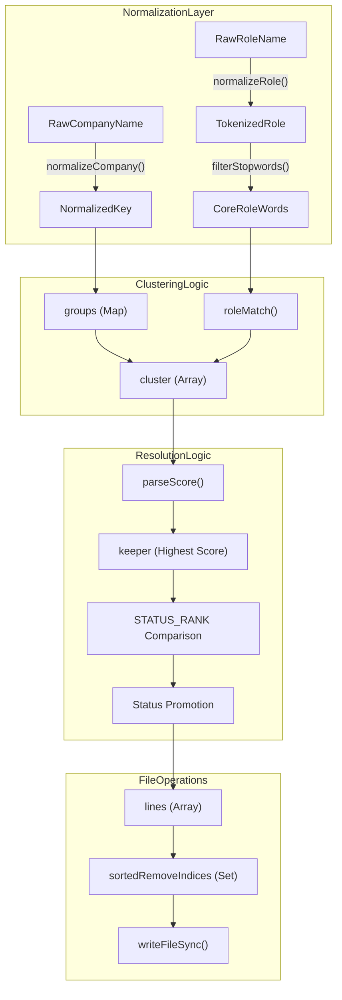
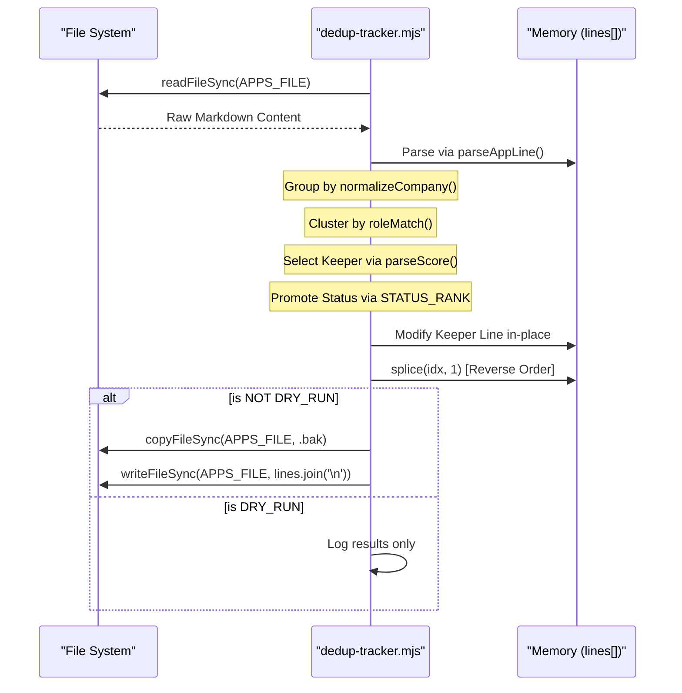

# dedup-tracker.mjs

관련 소스 파일

다음 파일들이 이 위키 페이지를 생성하기 위한 컨텍스트로 사용되었습니다:

- [dedup-tracker.mjs](dedup-tracker.mjs)
- [merge-tracker.mjs](merge-tracker.mjs)
- [normalize-statuses.mjs](normalize-statuses.mjs)
- [verify-pipeline.mjs](verify-pipeline.mjs)

`dedup-tracker.mjs`는 `applications.md` flat-file database의 무결성과 정돈된 상태를 보장하도록 설계된 유지관리 유틸리티입니다 [dedup-tracker.mjs:3-10](). 정규화된 회사명을 비교하고 fuzzy role matching을 수행해 중복된 job entry를 식별합니다. 이 스크립트는 가장 높은 점수의 평가를 "keeper"로 선택하면서, 버려지는 duplicate가 채용 pipeline에서 더 진전된 단계에 도달했다면 해당 status를 승격하는 방식으로 데이터 보존을 우선시합니다 [dedup-tracker.mjs:5-7]().

## 핵심 로직 및 계층

스크립트는 사전 정의된 application status 계층을 기반으로 작동합니다. 이를 통해 진행 상황을 잃지 않고 entry를 안전하게 병합할 수 있습니다. 예를 들어 한 entry가 높은 점수의 "Evaluated"로 표시되어 있지만 duplicate가 이미 "Interview" 단계에 있다면, 최종 entry는 높은 score를 유지하면서 "Interview"로 진전됩니다 [dedup-tracker.mjs:26-27]().

### STATUS_RANK 계층
`STATUS_RANK` object는 application의 "advancement"를 정의합니다. 값이 높을수록 pipeline에서 더 진전된 단계를 나타냅니다 [dedup-tracker.mjs:28-50](). `states.yml`의 English canonical과 backward compatibility를 위한 Spanish alias를 모두 포함합니다 [dedup-tracker.mjs:29-49]().

| Status (Canonical/Alias) | Rank | 설명 |
| :--- | :--- | :--- |
| `skip` / `discarded` / `no_aplicar` | 0 | 진입 지점 또는 명시적인 관심 거절입니다. |
| `rejected` / `rechazado` | 1 | 종료 상태(회사가 후보자를 거절). |
| `evaluated` / `evaluada` | 2 | 초기 AI 평가 완료. |
| `applied` / `aplicado` | 3 | 지원서 제출 완료. |
| `responded` / `respondido` | 4 | recruiter의 초기 연락. |
| `interview` / `entrevista` | 5 | 면접 프로세스 진행 중. |
| `offer` / `oferta` | 6 | Job offer 수신. |

**Sources:** [dedup-tracker.mjs:28-50]()

## 데이터 흐름: 중복 제거 파이프라인

스크립트는 entry를 식별, 병합, 정리하기 위해 다단계 프로세스를 따릅니다.

### 1. 정규화 및 그룹화
스크립트는 먼저 특수 문자, 괄호, 불필요한 공백을 제거해 회사명을 정규화합니다 [dedup-tracker.mjs:52-58](). 그런 다음 모든 entry를 이 정규화된 company key로 그룹화합니다 [dedup-tracker.mjs:146-151]().

### 2. Two-Tier Clustering
각 company group 안에서 스크립트는 보조 "Role Cluster" 검사를 수행합니다:
*   **Stopword Filtering:** 핵심 역할을 찾기 위해 일반적인 seniority(Senior, Junior, Lead)와 location(Remote, Tokyo, London) keyword를 제거합니다 [dedup-tracker.mjs:68-80]().
*   **Fuzzy Role Match:** role title을 token화하고 similarity ratio가 $\ge$ 0.6이면서 최소 2개 단어가 겹치는지 확인합니다 [dedup-tracker.mjs:82-96]().
*   **Cluster Formation:** 같은 회사 안에서 fuzzy role match를 통과한 entry는 `cluster`로 그룹화됩니다 [dedup-tracker.mjs:162-173]().

### 3. Keeper 선택 및 Status 승격
중복 cluster마다:
1.  **Selection:** 가장 높은 numeric score(`parseScore`로 파싱)를 가진 entry가 `keeper`로 선택됩니다 [dedup-tracker.mjs:178-179]().
2.  **Status Promotion:** 스크립트는 버려지는 entry를 순회합니다. 버려지는 entry 중 하나라도 `keeper`보다 높은 `STATUS_RANK`를 가지면 `keeper`의 status가 그 더 높은 값으로 업데이트됩니다 [dedup-tracker.mjs:181-190]().
3.  **In-place Modification:** 원래 `lines` array 안의 `keeper` line은 Markdown table 구조를 보존하면서 새 status를 반영하도록 수정됩니다 [dedup-tracker.mjs:193-201]().

### 4. 역순 삭제
line을 제거하는 동안 array index 무결성을 유지하기 위해, 스크립트는 삭제 표시된 모든 index를 `Set`에 모으고 내림차순으로 정렬한 뒤 array를 splice합니다 [dedup-tracker.mjs:217-220]().

### 엔티티 매핑: 로직에서 코드까지
다음 다이어그램은 중복 제거 개념을 구현의 특정 function 및 variable에 매핑합니다.

**Deduplication Logic Mapping**

**Sources:** [dedup-tracker.mjs:52-96](), [dedup-tracker.mjs:146-151](), [dedup-tracker.mjs:162-173](), [dedup-tracker.mjs:178-201](), [dedup-tracker.mjs:217-226]()

## 구현 세부 사항

### 파일 경로 해석
스크립트는 표준 `data/applications.md`와 legacy/root `applications.md`라는 두 가지 디렉터리 구조를 지원합니다 [dedup-tracker.mjs:18-20](). 또한 fresh setup을 위해 `data/` 디렉터리가 존재하는지 보장합니다 [dedup-tracker.mjs:24]().

### Backup 메커니즘
disk에 변경 사항을 쓰기 전에 스크립트는 현재 `applications.md`의 `.bak` 파일을 생성합니다 [dedup-tracker.mjs:225](). 이를 통해 중복 제거 로직이 예상치 못한 결과를 만들더라도 데이터를 복구할 수 있습니다.

### CLI Arguments
*   `--dry-run`: 모든 계산을 수행하고 duplicate를 식별하며 예정된 변경 사항을 console에 기록하지만, 파일을 수정하거나 backup을 생성하지 않습니다 [dedup-tracker.mjs:21](), [dedup-tracker.mjs:224-227]().

**System Execution Flow**

**Sources:** [dedup-tracker.mjs:18-24](), [dedup-tracker.mjs:103-120](), [dedup-tracker.mjs:193-201](), [dedup-tracker.mjs:217-227]()
