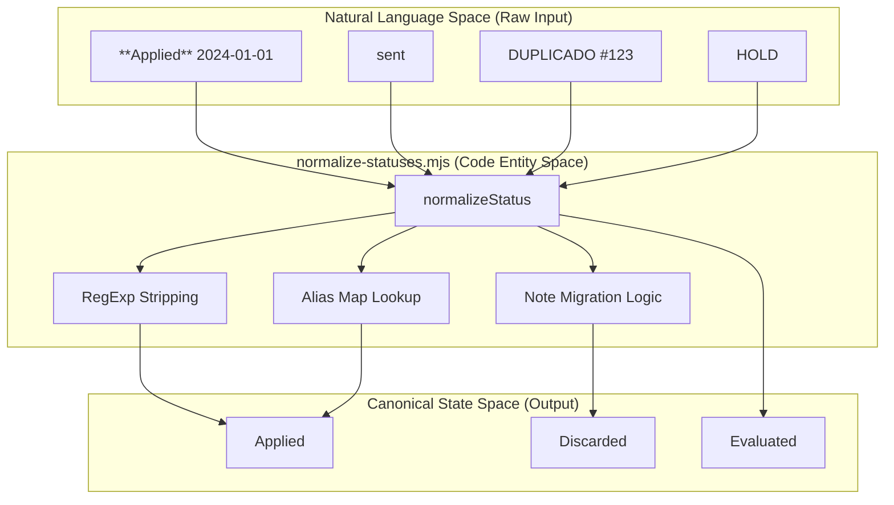
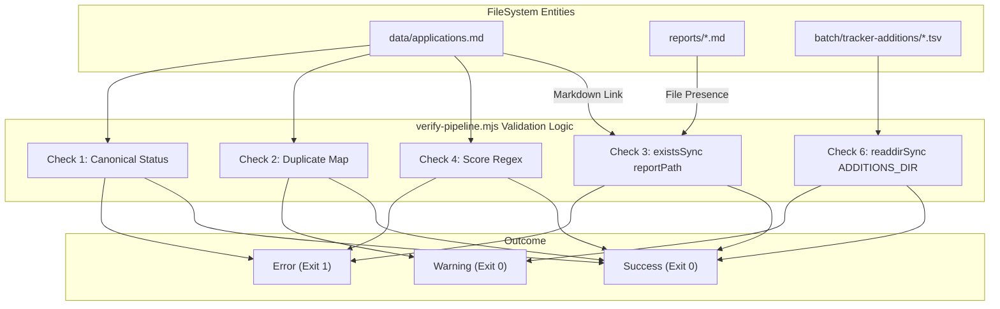

# normalize-statuses.mjs 및 verify-pipeline.mjs

관련 소스 파일

다음 파일들이 이 위키 페이지를 생성하기 위한 컨텍스트로 사용되었습니다:

- [dedup-tracker.mjs](dedup-tracker.mjs)
- [merge-tracker.mjs](merge-tracker.mjs)
- [normalize-statuses.mjs](normalize-statuses.mjs)
- [verify-pipeline.mjs](verify-pipeline.mjs)

이 섹션은 `applications.md` flat-file database를 유지관리하는 데 사용되는 두 가지 주요 data-integrity script를 다룹니다. 이 스크립트들은 application state가 canonical state machine과 일관되게 유지되고, pipeline에 구조적 오류나 broken reference가 없도록 보장합니다.

## normalize-statuses.mjs

`normalize-statuses.mjs`는 `applications.md`의 `STATUS` 열을 정리하고 표준화하도록 설계된 transformation script입니다. 수동 편집 또는 legacy batch output으로 인해 생긴 불일치를 다양한 입력을 엄격한 canonical state 집합으로 매핑하여 해결합니다 [normalize-statuses.mjs:5-6]().

### 핵심 로직 및 변환

스크립트는 Markdown table의 모든 row를 순회하며 status field를 추출하고, `normalizeStatus` 함수에 정의된 일련의 normalization rule을 적용합니다 [normalize-statuses.mjs:29-87]().

| Transformation Type | 로직 | 구현 |
|:---|:---|:---|
| **Bold Stripping** | status와 score에서 `**` marker를 제거합니다. | [normalize-statuses.mjs:31](), [normalize-statuses.mjs:138]() |
| **Alias Mapping** | "sent", "enviada", "aplicado" 같은 term을 "Applied"로 매핑합니다. | [normalize-statuses.mjs:78-83]() |
| **Date Stripping** | status string 뒤의 year/date를 제거합니다(예: "Rechazado 2024"). | [normalize-statuses.mjs:47-50]() |
| **Note Migration** | status가 duplicate를 나타내면(예: "DUPLICADO") status를 "Discarded"로 변경하고 원래 string을 `notas` column으로 이동합니다. | [normalize-statuses.mjs:34-37](), [normalize-statuses.mjs:127-134]() |
| **State Reset** | "HOLD", "MONITOR", "VERIFICAR" 같은 internal flag를 "Evaluated" 또는 "SKIP"으로 매핑합니다. | [normalize-statuses.mjs:52-59]() |

### 안전 메커니즘

데이터 손실을 방지하기 위해 스크립트는 두 가지 safety layer를 구현합니다:
1.  **Dry Run Mode**: `--dry-run` flag를 사용하면 파일을 수정하지 않고 console에서 변경 사항을 미리 볼 수 있습니다 [normalize-statuses.mjs:23](), [normalize-statuses.mjs:163-164]().
2.  **Automatic Backup**: 변경 사항을 쓰기 전에 스크립트는 현재 `applications.md`의 `.bak` copy를 생성합니다 [normalize-statuses.mjs:158-160]().

### Status 정규화 흐름

이 다이어그램은 Markdown table의 raw status string이 canonical entity로 처리되는 방식을 보여줍니다.

**Status Normalization Pipeline**

**Sources:** [normalize-statuses.mjs:29-87](), [normalize-statuses.mjs:100-147]()

---

## verify-pipeline.mjs

`verify-pipeline.mjs`는 전체 application tracking system을 위한 "Linter" 또는 "Health Check" 역할을 합니다. normalization script와 달리 데이터를 수정하지 않으며, database의 무결성을 검증하고 critical error가 발견되면 non-zero code로 종료합니다 [verify-pipeline.mjs:196]().

### 검증 항목

스크립트는 일곱 가지 별도 integrity check를 수행합니다 [verify-pipeline.mjs:5-12]():

1.  **Canonical Statuses**: 모든 status가 `CANONICAL_STATUSES`의 allowed list와 일치하고 markdown bolding이나 embedded date가 없는지 확인합니다 [verify-pipeline.mjs:36-39](), [verify-pipeline.mjs:84-108]().
2.  **Duplicate Detection**: normalized key(Company + Role)로 entry를 group화해 잠재적 double-entry를 표시합니다 [verify-pipeline.mjs:110-125]().
3.  **Report Link Integrity**: `report` column의 Markdown link를 파싱하고 대상 `.md` 파일이 실제로 `reports/` 디렉터리에 존재하는지 검증합니다 [verify-pipeline.mjs:127-138]().
4.  **Score Format**: score가 `X.XX/5` pattern을 따르거나 `N/A` 또는 `DUP`로 표시되어 있는지 검증합니다 [verify-pipeline.mjs:140-149]().
5.  **Row Structural Integrity**: 모든 row가 pipe-delimited column의 최소 요구 개수(9)를 포함하는지 확인합니다 [verify-pipeline.mjs:151-162]().
6.  **Pending Data Detection**: `batch/tracker-additions/` 디렉터리에서 아직 main tracker로 merge되지 않은 TSV 파일을 스캔합니다 [verify-pipeline.mjs:164-173]().
7.  **Visual Cleanliness**: TUI rendering을 방해하는 score bolding이 있는지 특별히 warning합니다 [verify-pipeline.mjs:175-183]().

### Error vs. Warning 분류

스크립트는 구조적 실패와 stylistic inconsistency를 구분합니다:
*   **Errors (❌)**: Broken report link, non-canonical status, invalid row format. non-zero exit code를 발생시킵니다 [verify-pipeline.mjs:55](), [verify-pipeline.mjs:196]().
*   **Warnings (⚠️)**: Potential duplicate, pending TSV, score의 bolding. 사용자에게 알리지만 pipeline 진행은 허용합니다 [verify-pipeline.mjs:56]().

### 시스템 무결성 검증 흐름

이 다이어그램은 validation check를 해당 check가 monitoring하는 특정 file entity에 매핑합니다.

**Pipeline Integrity Mapping**

**Sources:** [verify-pipeline.mjs:23-50](), [verify-pipeline.mjs:84-183]()

### 주요 데이터 구조

`verify-pipeline.mjs` 스크립트는 더 쉬운 validation을 위해 Markdown table을 `entries` object array로 파싱합니다 [verify-pipeline.mjs:68-80]():

| Property | Source Column | 설명 |
|:---|:---|:---|
| `num` | 1 | 고유 application ID입니다. |
| `company` | 3 | duplicate detection key generation에 사용됩니다. |
| `role` | 4 | duplicate detection key generation에 사용됩니다. |
| `score` | 5 | regex `^\d+\.?\d*\/5$`에 대해 검증됩니다. |
| `status` | 6 | `CANONICAL_STATUSES`에 대해 검증됩니다. |
| `report` | 8 | relative file path extraction을 위해 파싱됩니다. |

**Sources:** [verify-pipeline.mjs:36-50](), [verify-pipeline.mjs:68-80](), [verify-pipeline.mjs:143-144]()
