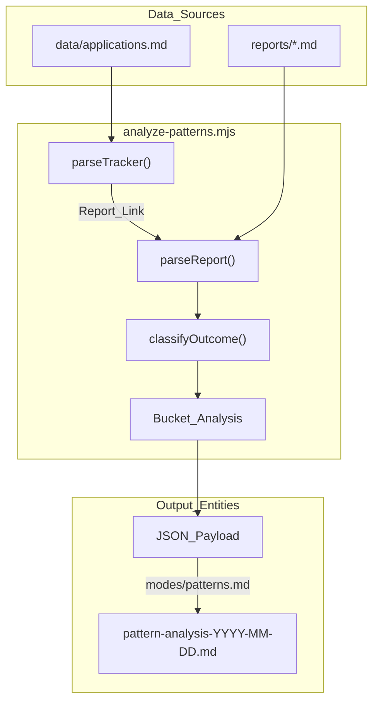
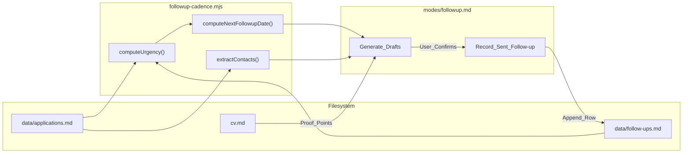

# 패턴 분석 및 Follow-up Cadence 스크립트

관련 소스 파일

다음 파일들이 이 위키 페이지를 생성하기 위한 컨텍스트로 사용되었습니다:

- [.agents/skills/career-ops/SKILL.md](.agents/skills/career-ops/SKILL.md)
- [.claude/skills/career-ops/SKILL.md](.claude/skills/career-ops/SKILL.md)
- [analyze-patterns.mjs](analyze-patterns.mjs)
- [followup-cadence.mjs](followup-cadence.mjs)
- [modes/followup.md](modes/followup.md)
- [modes/patterns.md](modes/patterns.md)

**Pattern Analysis**와 **Follow-up Cadence** 시스템은 `career-ops`의 분석 계층을 제공합니다. 다른 모드가 개별 채용 평가에 집중하는 반면, 이 스크립트들은 `data/applications.md`와 `reports/`의 집계 데이터를 분석해 지원이 실패하는 이유를 식별하고, 활성 lead가 식지 않도록 보장합니다.

## 1. Pattern Analysis(`analyze-patterns.mjs`)

`analyze-patterns.mjs` 스크립트는 모든 지원 이력을 파싱해 job attribute(archetype, remote policy, tech stack)와 success rate 사이의 상관관계를 식별하는 diagnostic tool입니다. `patterns` 모드를 통해 호출됩니다 [modes/patterns.md:29-30]().

### 구현 및 데이터 흐름
스크립트는 다단계 ingestion process를 수행합니다:
1.  **Tracker Parsing**: 모든 entry와 현재 status를 식별하기 위해 `data/applications.md`(또는 fallback `applications.md`)를 읽습니다 [analyze-patterns.mjs:19-21](), [analyze-patterns.mjs:62-79]().
2.  **Report Deep-Dive**: 각 application마다 `reports/`에서 해당 Markdown report를 찾고 A-F evaluation block에서 structured data를 추출합니다 [analyze-patterns.mjs:82-169]().
3.  **Classification**: raw status를 네 가지 outcome bucket으로 정규화합니다: `positive`(Interview/Offer/Responded/Applied), `negative`(Rejected/Discarded), `self_filtered`(SKIP), `pending`(Evaluated) [analyze-patterns.mjs:53-59]().
4.  **Bucket Analysis**: conversion rate를 계산하기 위해 `archetype`, `seniority`, `remotePolicy` 같은 차원별로 데이터를 그룹화합니다 [analyze-patterns.mjs:172-180]().

### 주요 함수
- `parseReport(reportPath)`: Regex를 사용해 evaluation report에서 metadata(Archetype, Seniority, Remote, Team Size, Comp, Domain)와 특정 score(CV Match, North Star, Global)를 추출합니다 [analyze-patterns.mjs:82-169]().
- `classifyRemote(raw)`: 위치 기반 rejection pattern을 감지하기 위해 다양한 remote string을 `global remote`, `geo-restricted`, `hybrid/onsite`로 bucket화합니다 [analyze-patterns.mjs:172-180]().
- `calculateGaps(reports)`: 반복되는 tech stack deficiency를 식별하기 위해 모든 report의 Block B에서 "Gaps" table을 집계합니다 [analyze-patterns.mjs:151-166]().

### Pattern Analysis 로직
다음 다이어그램은 스크립트가 flat-file database를 analytical insight로 연결하는 방식을 보여줍니다.

**System Logic: Pattern Detection Pipeline**

Sources: [analyze-patterns.mjs:62-169](), [modes/patterns.md:24-51]()

---

## 2. Follow-up Cadence(`followup-cadence.mjs`)

`followup-cadence.mjs` 스크립트는 지원 후 lifecycle을 관리합니다. 현재 status와 이전 history를 기반으로 다음 touchpoint가 언제 발생해야 하는지 계산합니다. 실제 communication draft 생성을 위해 `modes/followup.md`와 통합됩니다.

### 긴급도 단계 및 규칙
시스템은 `CADENCE` object에 정의된 엄격한 cadence configuration을 강제합니다 [followup-cadence.mjs:33-40]():
- **Applied**: 첫 follow-up은 7일 후(default), 이후 7일마다, 최대 2회 시도 [followup-cadence.mjs:157-162]().
- **Responded**: 1일 미만이면 urgent reply, 응답이 멈추면 3일마다 follow-up [followup-cadence.mjs:163-167]().
- **Interview**: 1일 이내 thank-you note [followup-cadence.mjs:168-171]().

### 데이터 상호작용
스크립트는 두 개의 주요 파일을 연관시킵니다:
1.  **`data/applications.md`**: application의 현재 상태에 대한 source of truth [followup-cadence.mjs:19-21]().
2.  **`data/follow-ups.md`**: double-pinging을 피하기 위해 보낸 message 이력을 기록하는 secondary ledger [followup-cadence.mjs:22-22]().

### 주요 함수
- `computeUrgency()`: 마지막 activity date를 `CADENCE` rule과 비교해 visual status(`urgent`, `overdue`, `waiting`, `cold`)를 결정합니다 [followup-cadence.mjs:156-173]().
- `extractContacts(notes)`: draft personalization을 위한 email address와 관련 name을 찾기 위해 Regex를 사용해 tracker의 notes column을 스캔합니다 [followup-cadence.mjs:131-145]().
- `computeNextFollowupDate()`: status와 history를 기반으로 다음 권장 action의 정확한 ISO date를 계산합니다 [followup-cadence.mjs:176-191]().

**Entity Mapping: Follow-up Generation**

Sources: [followup-cadence.mjs:33-40](), [followup-cadence.mjs:156-191](), [modes/followup.md:51-150]()

---

## 3. Agent Mode와의 통합

스크립트는 "script-first, agent-wrapped"로 설계되어 있습니다. `.mjs` 파일은 date math와 data parsing의 무거운 작업을 처리하고, `.md` mode file은 natural language generation과 user interaction을 처리합니다.

### Pattern Mode Workflow(`modes/patterns.md`)
1.  **Validation**: 실행 전에 최소 5개의 application이 "Evaluated" 이후의 outcome을 가지고 있는지 확인합니다 [modes/patterns.md:15-22]().
2.  **Execution**: `node analyze-patterns.mjs`를 실행하고 structured JSON output을 캡처합니다 [modes/patterns.md:26-32]().
3.  **Reporting**: JSON을 **Conversion Funnel** 및 **Archetype Performance** table을 포함한 `reports/pattern-analysis-{YYYY-MM-DD}.md`의 structured Markdown report로 형식화합니다 [modes/patterns.md:53-110]().
4.  **Action**: bad-fit role을 제외하도록 `portals.yml`을 업데이트하거나 minimum score threshold를 설정하도록 `config/profile.yml`을 자동 업데이트하는 옵션을 제공합니다 [modes/patterns.md:129-144]().

### Follow-up Mode Workflow(`modes/followup.md`)
1.  **Dashboard**: 모든 active application을 urgency 순으로 정렬한 cadence dashboard를 표시합니다 [modes/followup.md:34-50]().
2.  **Drafting**: `overdue` 또는 `urgent` entry의 경우, message에 포함할 구체적 value-add를 찾기 위해 evaluation report의 "Block B"(CV Match)와 `cv.md`를 읽습니다 [modes/followup.md:53-88]().
3.  **Tone Control**: "just checking in" 같은 phrase를 금지하고 draft를 150단어 이하로 유지하는 등 엄격한 제약을 강제합니다 [modes/followup.md:68-75]().
4.  **Persistence**: 사용자가 message가 전송되었다고 확인하면 agent는 다음 sequential ID와 함께 `data/follow-ups.md`에 row를 추가합니다 [modes/followup.md:126-150]().

Sources: [modes/patterns.md:1-155](), [modes/followup.md:1-174](), [.claude/skills/career-ops/SKILL.md:33-34]()
