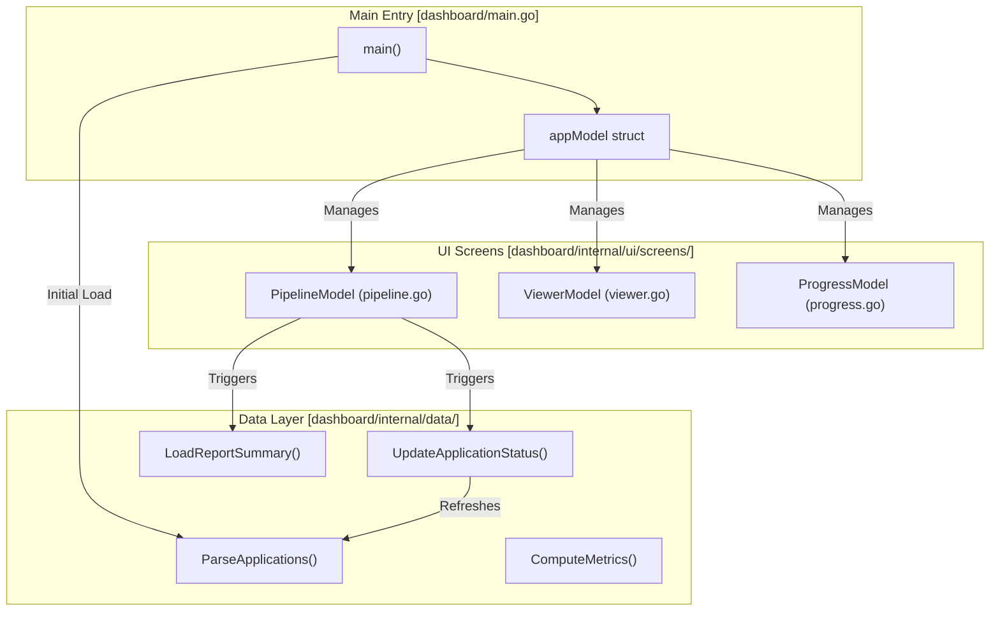

# Dashboard TUI (Go)

관련 소스 파일

다음 파일들이 이 위키 페이지를 생성하기 위한 컨텍스트로 사용되었습니다:

- [dashboard/go.mod](dashboard/go.mod)
- [dashboard/go.sum](dashboard/go.sum)
- [dashboard/internal/data/career.go](dashboard/internal/data/career.go)
- [dashboard/internal/data/career_test.go](dashboard/internal/data/career_test.go)
- [dashboard/internal/model/career.go](dashboard/internal/model/career.go)
- [dashboard/internal/theme/catppuccin_latte.go](dashboard/internal/theme/catppuccin_latte.go)
- [dashboard/internal/theme/theme.go](dashboard/internal/theme/theme.go)
- [dashboard/internal/ui/screens/pipeline.go](dashboard/internal/ui/screens/pipeline.go)
- [dashboard/internal/ui/screens/pipeline_test.go](dashboard/internal/ui/screens/pipeline_test.go)
- [dashboard/internal/ui/screens/progress.go](dashboard/internal/ui/screens/progress.go)
- [dashboard/internal/ui/screens/viewer.go](dashboard/internal/ui/screens/viewer.go)
- [dashboard/internal/ui/screens/viewer_test.go](dashboard/internal/ui/screens/viewer_test.go)
- [dashboard/main.go](dashboard/main.go)
- [templates/states.yml](templates/states.yml)

**Dashboard TUI**는 Go 프로그래밍 언어로 구축된 `career-ops` 생태계의 터미널 기반 그래픽 인터페이스입니다. 구직 지원 파이프라인의 중앙 집중식 view를 제공하여 사용자가 터미널을 벗어나지 않고도 evaluation report를 탐색, 필터링, 읽을 수 있게 합니다.

이 애플리케이션은 Model-View-Update(MVU) 아키텍처를 따르는 **Bubble Tea** 프레임워크 위에 구축되었으며, 정교한 terminal styling을 위해 **Lip Gloss**를 활용합니다. 빌드 및 실행에는 Go 1.24+가 필요합니다 [dashboard/go.mod:1-10]().

## 아키텍처 및 데이터 흐름

dashboard는 `applications.md` flat-file database 위의 read-write interface로 작동합니다. Markdown table을 구조화된 Go model로 파싱하고, status가 업데이트되면 변경 사항을 filesystem에 다시 동기화합니다.

### 시스템 토폴로지
다음 다이어그램은 `appModel`이 data layer와 UI screen 사이를 어떻게 조율하는지 보여줍니다.

**Dashboard Component Interaction**

Sources: [dashboard/main.go:26-34](), [dashboard/main.go:36-41](), [dashboard/main.go:64-76](), [dashboard/main.go:154-183]()

### Model-View-Update(MVU) 구현
`dashboard/main.go`의 `appModel`은 root orchestrator 역할을 합니다:
*   **Model**: `PipelineModel`, `ViewerModel`, `ProgressModel`, 현재 `viewState`(예: `viewPipeline`, `viewReport`, `viewProgress`)를 보유합니다 [dashboard/main.go:20-34]().
*   **Update**: 화면 전환을 위한 `PipelineOpenReportMsg`, 데이터를 수정하는 `PipelineUpdateStatusMsg`, OS 수준 browser command를 트리거하는 `PipelineOpenURLMsg` 같은 high-level message를 처리합니다 [dashboard/main.go:69-108]().
*   **View**: 상태를 기반으로 활성 screen을 조건부로 렌더링합니다 [dashboard/main.go:143-152]().

## 시각적 테마(Catppuccin Mocha)

dashboard는 고대비의 현대적인 미감을 제공하기 위해 **Catppuccin Mocha** color palette를 사용합니다. theme은 `theme` package에 중앙화되어 있으며, 모든 UI component에서 사용하는 base color(Base, Surface, Overlay)와 accent color(Blue, Mauve, Green 등)를 정의합니다 [dashboard/internal/theme/theme.go:9-27](). Latte와 Mocha 사이를 전환하기 위한 automatic background detection을 지원합니다 [dashboard/internal/theme/theme.go:29-44]().

| Color Entity | Code Reference | TUI에서의 사용 |
| :--- | :--- | :--- |
| `Base` | `theme.Base` | 기본 배경 |
| `Blue` | `theme.Blue` | header 및 primary action |
| `Mauve` | `theme.Mauve` | 보조 header(H2) |
| `Green` | `theme.Green` | 높은 score 및 "Applied" status |
| `Red` | `theme.Red` | 낮은 score 및 "Rejected" status |

Sources: [dashboard/internal/theme/theme.go:9-27](), [dashboard/internal/theme/theme.go:29-44]()

## 핵심 화면

dashboard는 세 가지 주요 기능 영역으로 나뉩니다:

### 1. Pipeline Screen
애플리케이션의 entry point입니다. `applications.md` 데이터를 정렬 및 필터링 가능한 list로 표시합니다.
*   **Functionality**: metrics header, status별 tab-based filtering(ALL, EVALUATED, APPLIED, INTERVIEW, TOP ≥4, SKIP), 여러 sorting mode(Score, Date, Company, Status)를 포함합니다 [dashboard/internal/ui/screens/pipeline.go:59-92]().
*   **Lazy Loading**: UI의 반응성을 유지하기 위해 filesystem에서 report summary(Archetype, TL;DR, Remote, Comp)를 비동기적으로 가져오는 `PipelineLoadReportMsg`를 emit합니다 [dashboard/internal/ui/screens/pipeline.go:32-36]().
*   **Search**: company, role, notes field에 대한 real-time substring filtering을 지원합니다 [dashboard/internal/ui/screens/pipeline.go:118-121]().
*   **자세한 내용은 [Pipeline Screen & Viewer](#6.1)를 참조하세요**.

Sources: [dashboard/internal/ui/screens/pipeline.go:102-121](), [dashboard/main.go:64-67]()

### 2. Report Viewer
AI 에이전트가 생성한 detailed evaluation report를 읽기 위한 전용 screen입니다.
*   **Markdown Rendering**: `ViewerModel`은 header, code block, table을 강조하는 custom Markdown styler를 구현합니다 [dashboard/internal/ui/screens/viewer.go:218-302]().
*   **Navigation**: Vim-style keybinding(`j`/`k`, `G`, `g`)과 page navigation을 지원합니다 [dashboard/internal/ui/screens/viewer.go:85-130]().
*   **자세한 내용은 [Pipeline Screen & Viewer](#6.1)를 참조하세요**.

Sources: [dashboard/main.go:82-90](), [dashboard/internal/ui/screens/viewer.go:19-28]()

### 3. Progress Analytics
pipeline velocity와 conversion rate에 대한 시각적 피드백을 제공하는 상위 수준 analytics screen입니다.
*   **Metrics**: funnel stage, score distribution, weekly activity를 포함한 `ProgressMetrics`를 표시합니다 [dashboard/internal/model/career.go:35-55]().
*   **State Transition**: `PipelineOpenProgressMsg`를 통해 트리거됩니다 [dashboard/main.go:95-102]().

Sources: [dashboard/main.go:38-39](), [dashboard/main.go:95-106]()

## 데이터 통합

dashboard는 단순한 viewer가 아니라 `career-ops` 데이터 구조와 긴밀히 통합되어 있습니다:
*   **Parsing**: `data.ParseApplications`를 통해 `applications.md`의 pipe-delimited Markdown table을 읽습니다 [dashboard/internal/data/career.go:29-41]().
*   **Enrichment**: 5단계 resolution strategy를 사용해 tracker entry를 물리 report file 및 job URL에 매핑합니다 [dashboard/internal/data/career.go:113-167]().
*   **Writing**: `data.UpdateApplicationStatus`를 통해 application status를 직접 업데이트할 수 있으며, 이는 Markdown file을 수정하고 UI refresh를 트리거합니다 [dashboard/main.go:69-76]().
*   **자세한 내용은 [Dashboard Data Layer](#6.2)를 참조하세요**.

Sources: [dashboard/main.go:36-41](), [dashboard/internal/data/career.go:113-167]()
