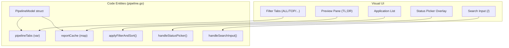
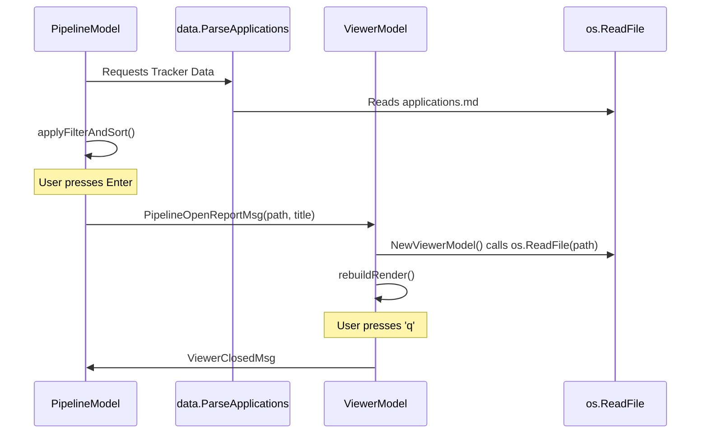

# Pipeline Screen 및 Viewer

관련 소스 파일

다음 파일들이 이 위키 페이지를 생성하기 위한 컨텍스트로 사용되었습니다:

- [dashboard/go.mod](dashboard/go.mod)
- [dashboard/internal/data/career.go](dashboard/internal/data/career.go)
- [dashboard/internal/data/career_test.go](dashboard/internal/data/career_test.go)
- [dashboard/internal/ui/screens/pipeline.go](dashboard/internal/ui/screens/pipeline.go)
- [dashboard/internal/ui/screens/pipeline_test.go](dashboard/internal/ui/screens/pipeline_test.go)
- [dashboard/internal/ui/screens/viewer.go](dashboard/internal/ui/screens/viewer.go)
- [dashboard/internal/ui/screens/viewer_test.go](dashboard/internal/ui/screens/viewer_test.go)
- [templates/states.yml](templates/states.yml)

Dashboard TUI는 **Bubble Tea** Model-View-Update(MVU) 아키텍처를 사용해 구축되었습니다. 터미널을 벗어나지 않고 job application pipeline을 탐색할 수 있는 고성능 인터페이스를 제공하며, 사용자가 evaluation report를 필터링, 정렬, 미리보기할 수 있게 합니다. 시스템은 두 가지 주요 model로 나뉩니다. list view를 위한 `PipelineModel`과 document inspection을 위한 `ViewerModel`입니다.

## Pipeline Screen(PipelineModel)

`PipelineModel`은 application 관리를 위한 primary entry point 역할을 합니다. `applications.md`의 flat-file data를 interactive하고 categorized되며 searchable한 dashboard로 변환합니다 [dashboard/internal/ui/screens/pipeline.go:102-121]().

### Filtering 및 Sorting 로직
pipeline interactivity의 핵심은 `applyFilterAndSort` method입니다 [dashboard/internal/ui/screens/pipeline.go:137](). 현재 선택된 tab, search query, sort mode를 기반으로 raw application list를 처리합니다.

*   **Tabs(Filter Modes):** `pipelineTabs`에 정의되어 있습니다 [dashboard/internal/ui/screens/pipeline.go:83-92]().
    *   `ALL`: filtering 없음.
    *   `EVALUATED`: status가 "Evaluated"인 application을 표시합니다 [templates/states.yml:10-14]().
    *   `APPLIED`: status가 "Applied" 또는 "Responded"인 application을 표시합니다 [templates/states.yml:16-26]().
    *   `INTERVIEW`: "Interview" 또는 "Offer" 상태의 application을 표시합니다 [templates/states.yml:28-38]().
    *   `TOP ≥4`: score가 4.0 이상인 application을 필터링합니다 [dashboard/internal/ui/screens/pipeline.go:75]().
    *   `SKIP`, `REJECTED`, `DISCARDED`: status-specific view입니다 [dashboard/internal/ui/screens/pipeline.go:72-74]().
*   **Search Sub-state:** 사용자는 `/`를 눌러 company, role, notes를 기준으로 필터링하는 substring search에 들어갈 수 있습니다 [dashboard/internal/ui/screens/pipeline.go:119-121](). 이 filter는 active tab과 함께 합성됩니다 [dashboard/internal/ui/screens/pipeline_test.go:157-172]().
*   **Sort Modes:** 사용자는 `score`, `date`, `company`, `status`를 순환할 수 있습니다 [dashboard/internal/ui/screens/pipeline.go:59-64]().
*   **View Modes:** application을 status priority별로 분류하는 `grouped` view 또는 `flat` list를 지원합니다 [dashboard/internal/ui/screens/pipeline.go:98-99]().

### Lazy-Loaded Report Cache
풍부한 preview를 제공하면서도 UI 반응성을 유지하기 위해 dashboard는 evaluation report에 lazy-loading mechanism을 사용합니다.
1.  사용자가 `cursor`를 이동하면 `loadCurrentReport()`가 트리거됩니다 [dashboard/internal/ui/screens/pipeline.go:244]().
2.  이것은 `PipelineLoadReportMsg`를 emit합니다 [dashboard/internal/ui/screens/pipeline.go:32-36]().
3.  main loop가 이를 받아 `data.LoadReportSummary`를 호출하고, regex를 사용해 Markdown file에서 특정 block(Archetype, TL;DR, Remote, Comp)을 파싱합니다 [dashboard/internal/data/career.go:16-27]().
4.  data는 `EnrichReport`를 통해 반환되며, 중복 disk I/O를 방지하기 위해 `reportCache map[string]reportSummary`에 저장됩니다 [dashboard/internal/ui/screens/pipeline.go:165-173]().

### Status Picker Overlay
사용자는 `c` key를 사용해 application status를 직접 업데이트할 수 있습니다. 이는 keyboard input을 가로채 `statusOptions`에서 선택하도록 하는 modal-like state인 `statusPicker`를 활성화합니다 [dashboard/internal/ui/screens/pipeline.go:116](), [dashboard/internal/ui/screens/pipeline.go:96](). status를 선택하면 `PipelineUpdateStatusMsg`가 트리거됩니다 [dashboard/internal/ui/screens/pipeline.go:39-43]().

### UI 컴포넌트 매핑
다음 다이어그램은 Pipeline Screen의 시각적 컴포넌트를 그 기반 code structure에 매핑합니다.

**Pipeline Screen Entity Mapping**

Sources: [dashboard/internal/ui/screens/pipeline.go:83-121](), [dashboard/internal/ui/screens/pipeline.go:137](), [dashboard/internal/ui/screens/pipeline.go:238-243]()

---

## Viewer Screen(ViewerModel)

`ViewerModel`은 evaluation report를 읽기 위해 설계된 특수 Markdown renderer입니다. 사용자가 선택된 application에서 `enter`를 누르면 트리거됩니다 [dashboard/internal/ui/screens/pipeline.go:21]().

### Markdown Rendering
`viewer.go`는 **Lipgloss**와 **ansi** wrapping을 사용해 custom rendering logic을 구현합니다 [dashboard/internal/ui/screens/viewer.go:20-28]().
*   **Table Block Detection:** viewer는 `isTableLine`을 통해 Markdown table을 감지하고 [dashboard/internal/ui/screens/viewer.go:304-307](), `renderTableBlock`을 사용해 렌더링합니다 [dashboard/internal/ui/screens/viewer.go:237]().
*   **Paragraph Wrapping:** 텍스트는 terminal width에서 padding을 뺀 너비로 wrap됩니다 [dashboard/internal/ui/screens/viewer.go:282-286]().
*   **Fenced Code:** code block은 감지되어 별도의 background style로 렌더링됩니다 [dashboard/internal/ui/screens/viewer.go:241-262]().
*   **Inline Elements:** bold, code span, link는 `renderInlineElements`를 통해 처리됩니다 [dashboard/internal/ui/screens/viewer.go:286]().

### Navigation 및 Keybindings
viewer는 표준 pager navigation을 지원합니다 [dashboard/internal/ui/screens/viewer.go:85-130]():
*   `j`/`down`, `k`/`up`: 줄 단위 scrolling.
*   `ctrl+d`, `pgdown`: half-page jump.
*   `ctrl+u`, `pgup`: half-page reverse jump.
*   `g`/`home`, `G`/`end`: 문서 시작/끝으로 이동.

### 데이터 흐름: Pipeline에서 Viewer까지
list와 viewer 사이의 전환은 message passing을 통해 top-level application이 관리합니다.

**Data Flow Diagram**

Sources: [dashboard/internal/ui/screens/pipeline.go:21-25](), [dashboard/internal/ui/screens/viewer.go:31-51](), [dashboard/internal/data/career.go:31-41]()

---

## 주요 함수 참조

### Pipeline Logic
| Function | 설명 |
| :--- | :--- |
| `applyFilterAndSort` | `activeTab`과 `searchQuery`를 기반으로 `apps`를 `filtered`로 필터링합니다. [dashboard/internal/ui/screens/pipeline.go:137]() |
| `WithReloadedData` | cursor와 search state를 보존하면서 새 data로 model을 재구성합니다. [dashboard/internal/ui/screens/pipeline.go:177-224]() |
| `adjustScroll` | `cursor`가 visible viewport 안에 남아 있도록 보장합니다. [dashboard/internal/ui/screens/pipeline.go:222]() |
| `handleSearchInput` | rune을 `searchQuery`로 처리하고 live filtering을 트리거합니다. [dashboard/internal/ui/screens/pipeline.go:242]() |

### Viewer Logic
| Function | 설명 |
| :--- | :--- |
| `rebuildRender` | 현재 terminal width를 기반으로 raw line에서 `renderedLines`를 다시 계산합니다. [dashboard/internal/ui/screens/viewer.go:54-57]() |
| `renderAll` | styling을 위해 block(table, code, paragraph)을 식별하는 main loop입니다. [dashboard/internal/ui/screens/viewer.go:219-302]() |
| `clampScrollOffset` | rendered content의 끝을 지나 scrolling하지 못하도록 방지합니다. [dashboard/internal/ui/screens/viewer.go:59-70]() |
| `renderHeader` | report title과 scroll percentage가 포함된 top bar를 그립니다. [dashboard/internal/ui/screens/viewer.go:157-195]() |

Sources: [dashboard/internal/ui/screens/pipeline.go:1-243](), [dashboard/internal/ui/screens/viewer.go:1-302](), [dashboard/internal/data/career.go:1-167]()
