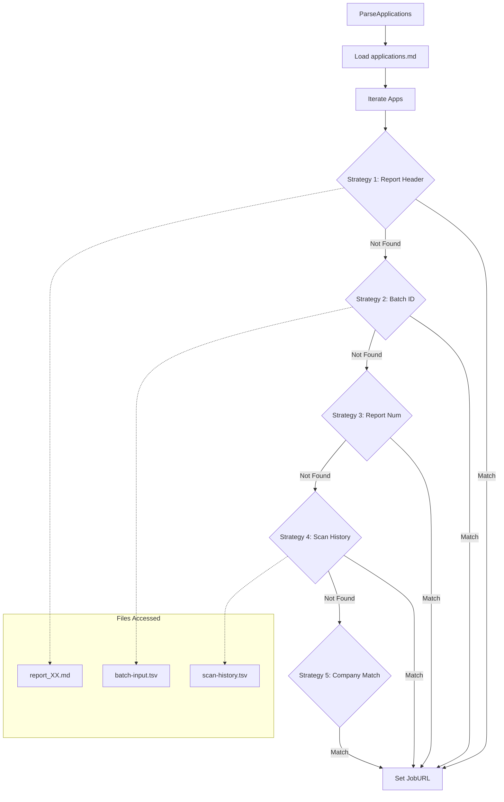
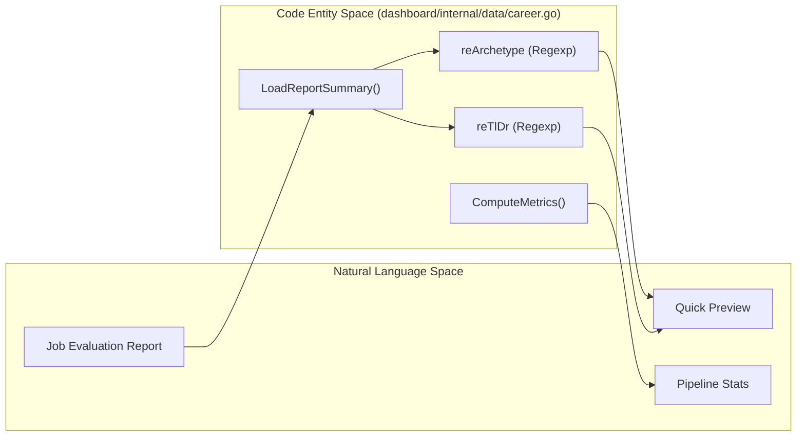
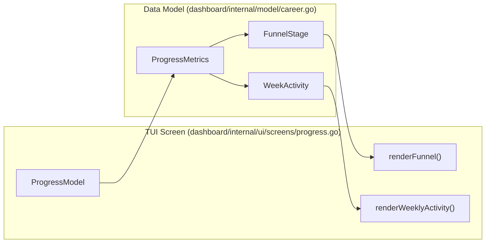

# Dashboard Data Layer

관련 소스 파일

다음 파일들이 이 위키 페이지를 생성하기 위한 컨텍스트로 사용되었습니다:

- [dashboard/internal/data/career.go](dashboard/internal/data/career.go)
- [dashboard/internal/data/career_test.go](dashboard/internal/data/career_test.go)
- [dashboard/internal/model/career.go](dashboard/internal/model/career.go)
- [dashboard/internal/ui/screens/pipeline.go](dashboard/internal/ui/screens/pipeline.go)
- [dashboard/internal/ui/screens/pipeline_test.go](dashboard/internal/ui/screens/pipeline_test.go)
- [dashboard/internal/ui/screens/progress.go](dashboard/internal/ui/screens/progress.go)
- [dashboard/main.go](dashboard/main.go)
- [templates/states.yml](templates/states.yml)

Dashboard Data Layer는 flat-file Markdown database(`applications.md`)를 TUI를 위한 구조화된 데이터로 변환하는 Go 기반 엔진입니다. 시스템의 canonical state machine에 따라 parsing, 복잡한 URL enrichment 전략, metric computation, status normalization을 처리합니다.

## 데이터 모델

시스템은 application data와 aggregate performance를 표현하기 위해 `dashboard/internal/model/career.go`에 정의된 주요 구조체를 사용합니다.

### CareerApplication
tracker의 단일 row를 나타내며, 관련 report file의 metadata로 보강됩니다.
[dashboard/internal/model/career.go:4-22]()

| Field | Type | 설명 |
| :--- | :--- | :--- |
| `Number` | `int` | tracker column 기반 sequential ID입니다. [dashboard/internal/data/career.go:81-83]() |
| `Date` | `string` | evaluation/application 날짜입니다. |
| `Company` | `string` | 대상 조직 이름입니다. |
| `Score` | `float64` | "Score" column에서 파싱한 numeric value입니다(예: 4.5). |
| `Status` | `string` | 정규화된 state입니다(예: "Applied", "Interview"). |
| `JobURL` | `string` | 원본 job posting URL입니다(enrichment로 해석). |
| `Archetype` | `string` | report markdown에서 lazy-loaded된 "Arquetipo"입니다. |
| `TlDr` | `string` | report에서 lazy-loaded된 "TL;DR" summary입니다. |

### PipelineMetrics 및 ProgressMetrics
이 model들은 dashboard header와 전용 progress screen에 표시되는 aggregate statistic을 보유합니다.
[dashboard/internal/model/career.go:25-32]()
[dashboard/internal/model/career.go:35-55]()

| Model | Field | 설명 |
| :--- | :--- | :--- |
| `PipelineMetrics` | `Total` | tracker의 전체 entry 수입니다. |
| `PipelineMetrics` | `AvgScore` | 모든 numerical score의 arithmetic mean입니다. |
| `ProgressMetrics` | `FunnelStages` | conversion analysis를 위한 `FunnelStage` slice입니다. |
| `ProgressMetrics` | `WeeklyActivity` | ISO week별로 그룹화된 application count입니다. |

Sources: [dashboard/internal/model/career.go:1-75](), [dashboard/internal/data/career.go:81-83]()

## Application Parsing

`ParseApplications` 함수는 data ingestion의 entry point입니다. root 또는 `data/` 디렉터리에서 `applications.md`를 찾고 Markdown table을 순회합니다. [dashboard/internal/data/career.go:31-41]()

### Table Ingestion 로직
parser는 Markdown table format의 두 가지 변형을 처리합니다:
1.  **Pure Pipe:** 표준 Markdown `| Field | Field |`. [dashboard/internal/data/career.go:67-73]()
2.  **Mixed Tab/Pipe:** `| `로 시작하지만 field separation에 tab을 사용하는 line으로, 일부 batch export에서 흔합니다. [dashboard/internal/data/career.go:58-66]()

### Field Mapping
| Column Index | Model Field | 로직 |
| :--- | :--- | :--- |
| 0 | `Number` | 첫 번째 column에서 `int`로 파싱합니다. [dashboard/internal/data/career.go:81-83]() |
| 1 | `Date` | Raw string입니다. [dashboard/internal/data/career.go:86]() |
| 2 | `Company` | Raw string입니다. [dashboard/internal/data/career.go:87]() |
| 4 | `Score` | `reScoreValue` regex `(\d+\.?\d*)/5`로 파싱합니다. [dashboard/internal/data/career.go:94-97]() |
| 5 | `Status` | Raw string입니다(나중에 정규화). [dashboard/internal/data/career.go:89]() |
| 6 | `HasPDF` | `✅` Unicode checkmark에 대한 boolean check입니다. [dashboard/internal/data/career.go:90]() |
| 7 | `ReportPath` | `reReportLink`를 통해 Markdown link `[num](path)`에서 파싱합니다. [dashboard/internal/data/career.go:100-103]() |

Sources: [dashboard/internal/data/career.go:16-27](), [dashboard/internal/data/career.go:29-111](), [dashboard/internal/data/career_test.go:9-43]()

## 5단계 URL Enrichment 전략

`applications.md`는 table을 compact하게 유지하기 위해 job URL을 직접 저장하지 않으므로, data layer는 원본 posting URL을 해석하기 위해 `ParseApplications`에서 5단계 전략을 사용합니다.

### Resolution 계층
1.  **Report Header:** report `.md`의 처음 1000 bytes에서 `**URL:**` field를 스캔합니다. [dashboard/internal/data/career.go:133-141]()
2.  **Batch ID Lookup:** report에서 `**Batch ID:**`를 스캔하고 `batch/batch-input.tsv`에서 ID를 조회합니다. [dashboard/internal/data/career.go:143-149]()
3.  **Report Number Mapping:** `ReportNumber`를 `batch-state.tsv`의 completed entry와 매칭합니다(legacy). [dashboard/internal/data/career.go:151-157]()
4.  **Scan History:** `enrichFromScanHistory`를 통해 `Company` + `Role`을 `data/scan-history.tsv`와 매칭합니다. [dashboard/internal/data/career.go:161]()
5.  **Company Fallback:** `enrichAppURLsByCompany`를 통해 company name과 일치하는 entry를 `batch-input.tsv`에서 검색합니다. [dashboard/internal/data/career.go:164]()

### 데이터 흐름: URL Resolution

Sources: [dashboard/internal/data/career.go:113-167](), [dashboard/internal/data/career.go:170-198]()

## Status Management

data layer는 UI와 `templates/states.yml` 구성 사이의 일관성을 강제합니다.

### NormalizeStatus
tracker의 raw string을 canonical label로 변환합니다. Markdown bolding(`**`)을 제거하고, status에 덧붙은 date를 제거하며, `states.yml` 정의를 기반으로 alias(예: "entrevista" → "Interview")를 매핑합니다.
[dashboard/internal/data/career.go:348-369]()

### UpdateApplicationStatus
TUI가 status update를 disk에 다시 쓸 수 있게 합니다. `applications.md` 파일을 읽고, `Company`와 `Role`로 특정 row를 찾은 뒤, 다른 column은 보존하면서 status field를 교체합니다. [dashboard/main.go:69-77]()

### StatusPriority
"Grouped" view의 sorting order를 결정합니다. priority는 `STATUS_RANK` map으로 정의됩니다:
1.  **Offer**(가장 높음)
2.  **Interview**
3.  **Responded**
4.  **Applied**
5.  **Evaluated**
6.  **Rejected / Discarded / SKIP**(가장 낮음)

[dashboard/internal/data/career.go:406-424]()

Sources: [dashboard/internal/data/career.go:348-424](), [templates/states.yml:9-57](), [dashboard/main.go:69-77]()

## Report Summary Loading

TUI에서 높은 성능을 유지하기 위해 report는 lazy-loaded됩니다. 사용자가 application을 선택하면 `LoadReportSummary`가 regex를 사용해 특정 report file에서 핵심 metadata를 파싱합니다. [dashboard/main.go:171-183]()

| Metadata | Regex Pattern | File Reference |
| :--- | :--- | :--- |
| **Archetype** | `reArchetype` / `reArchetypeColon` | [dashboard/internal/data/career.go:19,24]() |
| **TL;DR** | `reTlDr` / `reTlDrColon` | [dashboard/internal/data/career.go:20,21]() |
| **Remote** | `reRemote` | [dashboard/internal/data/career.go:22]() |
| **Comp** | `reComp` | [dashboard/internal/data/career.go:23]() |

### Code Entity Association

Sources: [dashboard/internal/data/career.go:16-27](), [dashboard/internal/data/career.go:312-346](), [dashboard/main.go:171-183]()

## Metrics Computation

data layer는 두 단계의 metric calculation을 제공합니다:
1. **ComputeMetrics**: main dashboard header를 위한 `PipelineMetrics`를 생성하며, average score와 actionable count를 계산합니다. [dashboard/internal/data/career.go:371-404]()
2. **ComputeProgressMetrics**: analytics screen(`progress.go`)을 위한 `ProgressMetrics`를 생성하며, funnel conversion rate(Response, Interview, Offer)와 weekly activity trend를 포함합니다. [dashboard/internal/data/career.go:426-538]()

### Analytics Data Association

Sources: [dashboard/internal/data/career.go:371-538](), [dashboard/internal/model/career.go:24-74](), [dashboard/internal/ui/screens/progress.go:18-34]()
