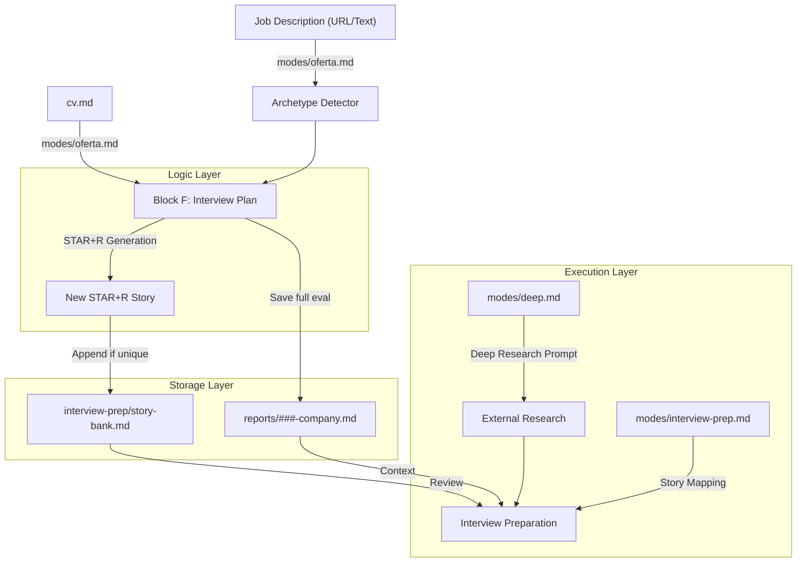
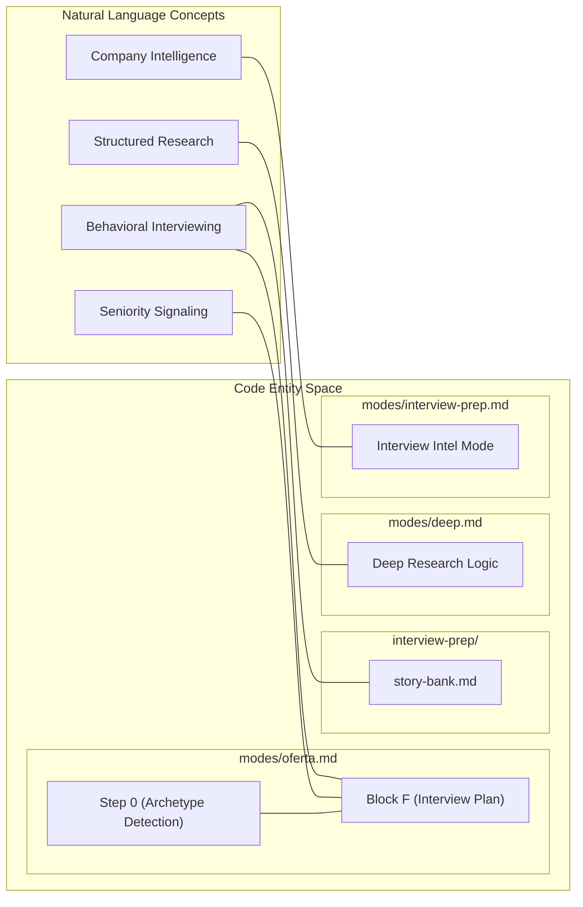

# 면접 준비 및 Story Bank

관련 소스 파일

다음 파일들이 이 위키 페이지를 생성하기 위한 컨텍스트로 사용되었습니다:

- [interview-prep/story-bank.md](interview-prep/story-bank.md)
- [modes/deep.md](modes/deep.md)
- [modes/interview-prep.md](modes/interview-prep.md)
- [modes/oferta.md](modes/oferta.md)

**interview-prep/** 하위 시스템은 행동 사례와 심층 회사 인텔리전스의 지속적이고 진화하는 저장소를 구축하여 후보자를 "qualified applicant"에서 "hired professional"로 전환하도록 설계되었습니다. 정적인 CV와 달리 Story Bank는 모든 job evaluation마다 성장하며, 여러 지원을 거치면서 후보자의 면접 성과가 누적적으로 향상되도록 보장합니다.

## 지속적 Story 저장소: `story-bank.md`

이 하위 시스템의 핵심은 Markdown 기반 "experience database"인 `interview-prep/story-bank.md`입니다 [interview-prep/story-bank.md:1-3](). 이 파일은 전문적 성과를 문서화하기 위해 **STAR+R** 프레임워크(Situation, Task, Action, Result + **Reflection**)를 사용합니다.

**Reflection**의 추가는 seniority를 드러내기 위한 기술적 설계 선택입니다. junior 후보자가 "what"에 집중하는 반면, 시스템은 senior 후보자에게 "lessons learned" 또는 "what I would do differently"를 추출하도록 유도합니다 [modes/oferta.md:72-72]().

### 데이터 흐름: 생성에서 지속성까지

Story는 job evaluation 프로세스 중 수집되어 장기 재사용을 위해 저장됩니다.

1.  **Trigger:** 사용자가 `/career-ops oferta` 또는 `auto-pipeline`을 실행합니다 [modes/oferta.md:1-3]().
2.  **Extraction:** **Block F (Interview Plan)**에서 AI는 JD requirements를 후보자의 `cv.md` 및 `article-digest.md`에 매핑합니다 [modes/oferta.md:65-70]().
3.  **Formatting:** AI는 특정 role archetype(예: FDE, LLMOps, PM)에 맞춘 6-10개의 STAR+R story를 생성합니다 [modes/oferta.md:76-82]().
4.  **Persistence:** 시스템은 이러한 story가 `interview-prep/story-bank.md`에 존재하는지 확인합니다. 없으면 새 항목을 파일에 추가합니다 [modes/oferta.md:74-74](), [interview-prep/story-bank.md:7-12]().

### Story Bank 구조

bank는 면접 준비 중 빠르게 검색할 수 있도록 story를 "Theme"별로 구성합니다 [interview-prep/story-bank.md:17-26]().

| Field | 설명 | Source |
| :--- | :--- | :--- |
| **Theme** | 행동 범주입니다(예: Conflict, Leadership, Technical Debt). | [interview-prep/story-bank.md:18-18]() |
| **Source** | story가 유래한 특정 `reports/` 파일에 대한 참조입니다. | [interview-prep/story-bank.md:19-19]() |
| **STAR+R** | Reflection을 포함한 핵심 narrative component입니다. | [interview-prep/story-bank.md:20-24]() |
| **Best for** | 이 story로 답할 수 있는 특정 면접 질문 목록입니다. | [interview-prep/story-bank.md:25-25]() |

**Sources:** [interview-prep/story-bank.md:1-27](), [modes/oferta.md:65-82]()

---

## Interview Prep 로직(Block F)

`modes/oferta.md`를 통해 특정 job offer를 평가할 때, 시스템은 Block F에서 맞춤형 **Interview Plan**을 생성합니다. 이 plan은 Step 0에서 수행된 **Archetype Detection**의 영향을 크게 받습니다 [modes/oferta.md:5-10]().

### Archetype 기반 Framing
시스템은 hiring team의 기대와 정렬되도록 감지된 role type에 따라 story를 다르게 framing합니다 [modes/oferta.md:76-82]():

| Archetype | Story Framing Focus |
| :--- | :--- |
| **FDE (Forward Deployed)** | Delivery speed 및 client-facing impact [modes/oferta.md:77-77](). |
| **SA (Solutions Architect)** | Architectural decision 및 system integration [modes/oferta.md:78-78](). |
| **LLMOps** | Metrics, evaluation, production hardening [modes/oferta.md:80-80](). |
| **Agentic** | Orchestration, error handling, Human-in-the-loop(HITL) [modes/oferta.md:81-81](). |
| **Transformation** | Organizational change 및 adoption metrics [modes/oferta.md:82-82](). |
| **PM** | Product discovery 및 trade-off [modes/oferta.md:79-79](). |

**Sources:** [modes/oferta.md:5-10](), [modes/oferta.md:76-82]()

---

## 회사별 인텔리전스(`interview-prep.md`)

`modes/interview-prep.md` 모드는 application이 `Interview` status에 도달했을 때 targeted intelligence를 제공합니다 [modes/interview-prep.md:1-3]().

### Research 실행
이 모드는 targeted `WebSearch` query를 실행해 세 가지 distinct audience 전반에서 structured data를 추출합니다 [modes/interview-prep.md:15-19]():
*   **Recruiter / HR screen:** comp range(Levels.fyi/Glassdoor), process timeline, benefits에 집중합니다 [modes/interview-prep.md:21-26]().
*   **Hiring manager / leadership:** engineering blog, product roadmap, hiring driver에 집중합니다 [modes/interview-prep.md:30-34]().
*   **Peer / technical panel:** LeetCode/Glassdoor의 특정 coding question 및 Blind의 technical bar에 집중합니다 [modes/interview-prep.md:38-42]().

### Audience Mapping
핵심 기능은 interview round를 특정 audience(`recruiter-screen`, `hiring-manager`, `peer-tech`, `panel-mixed`)로 분류하는 것입니다. 이 분류는 준비 전략을 결정합니다 [modes/interview-prep.md:67-77]().

**Sources:** [modes/interview-prep.md:1-112]()

---

## Deep Research 모드(`deep.md`)

`modes/deep.md` skill은 Perplexity 또는 Claude 같은 외부 research tool을 위한 포괄적인 prompt를 생성합니다 [modes/deep.md:22-25]().

### 언어 결정
이 모드는 표준 JD-language default를 재정의합니다. 출력 언어는 다음 기준으로 결정됩니다:
1.  **사용자 프롬프트 언어** [modes/deep.md:10-12]().
2.  **`config/profile.yml`** locale 설정 [modes/deep.md:13-15]().
3.  fallback으로 **JD 언어** [modes/deep.md:16-17]().

### Research 축
생성된 prompt는 여섯 가지 핵심 차원을 다룹니다:
1.  **AI Strategy:** Engineering blog, AI stack, ML feature [modes/deep.md:29-33]().
2.  **Recent Movements:** Funding, leadership change, pivot [modes/deep.md:35-39]().
3.  **Engineering Culture:** Deployment cadence 및 remote-first policy [modes/deep.md:41-46]().
4.  **Probable Challenges:** Scaling issue 및 reliability pain point [modes/deep.md:48-52]().
5.  **Competitive Landscape:** Moat 및 differentiation [modes/deep.md:54-57]().
6.  **Candidate Angle:** `cv.md`와 `profile.yml`을 사용하는 개인화된 value proposition [modes/deep.md:59-64]().

**Sources:** [modes/deep.md:1-68]()

---

## 기술적 데이터 흐름: Story Lifecycle

다음 다이어그램은 story가 Job Description에서 persistent Story Bank로, 그리고 최종적으로 면접으로 이동하는 방식을 보여줍니다.

### 시스템 아키텍처: Story Propagation

**Sources:** [modes/oferta.md:65-74](), [interview-prep/story-bank.md:1-12](), [modes/deep.md:1-45](), [modes/interview-prep.md:1-10]()

### 엔티티 매핑: 자연어에서 코드까지
이 다이어그램은 개념적인 면접 준비 단계를 이를 구현하는 특정 파일과 block에 매핑합니다.

**Sources:** [modes/oferta.md:5-10](), [modes/oferta.md:65-72](), [interview-prep/story-bank.md:1-5](), [modes/deep.md:1-10](), [modes/interview-prep.md:15-19]()
