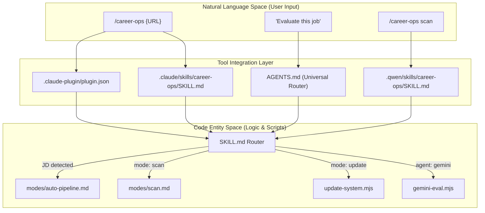
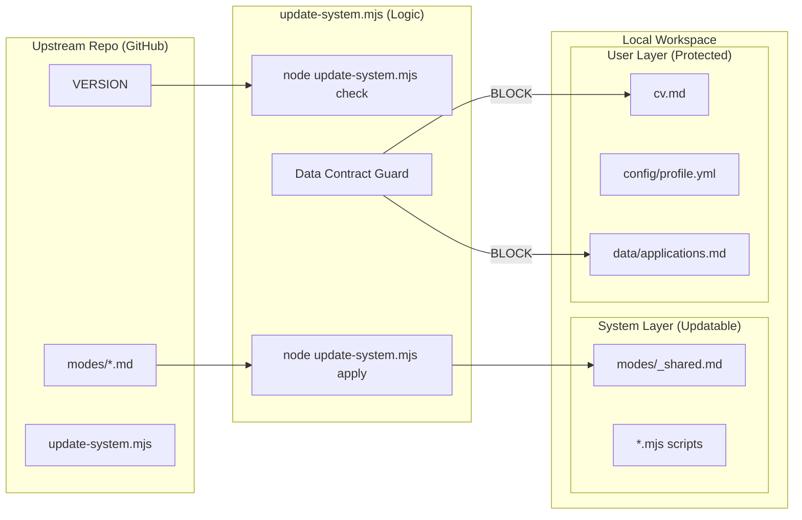

# Multi-Agent 및 Tool Integration

관련 소스 파일

다음 파일들이 이 위키 페이지를 생성하기 위한 컨텍스트로 사용되었습니다:

- [.agents/skills/career-ops/SKILL.md](.agents/skills/career-ops/SKILL.md)
- [.claude-plugin/marketplace.json](.claude-plugin/marketplace.json)
- [.claude-plugin/plugin.json](.claude-plugin/plugin.json)
- [.claude/skills/career-ops/SKILL.md](.claude/skills/career-ops/SKILL.md)
- [.qwen/skills/career-ops/SKILL.md](.qwen/skills/career-ops/SKILL.md)
- [AGENTS.md](AGENTS.md)
- [CLAUDE.md](CLAUDE.md)
- [GEMINI.md](GEMINI.md)
- [analyze-patterns.mjs](analyze-patterns.mjs)
- [followup-cadence.mjs](followup-cadence.mjs)
- [modes/followup.md](modes/followup.md)
- [modes/patterns.md](modes/patterns.md)
- [modes/tr/README.md](modes/tr/README.md)
- [modes/tr/_shared.md](modes/tr/_shared.md)
- [modes/tr/basvuru.md](modes/tr/basvuru.md)
- [modes/tr/is-ilani.md](modes/tr/is-ilani.md)
- [modes/tr/pipeline.md](modes/tr/pipeline.md)

이 페이지는 `career-ops`가 cross-tool command center로 작동하는 방식을 개괄합니다. **Claude Code**에 최적화되어 있지만, 시스템 아키텍처는 tool-agnostic하게 설계되어 여러 AI coding assistant(Gemini, Qwen, Copilot, Kimi)와 통합되며, 사용자 데이터를 보존하는 견고한 self-update mechanism을 유지합니다.

## 통합 아키텍처

시스템은 통합을 위해 계층형 접근 방식을 사용합니다. 상위 수준의 "Slash Commands"는 특정 "Skills"에 매핑되고, 이는 다시 "Modes"(Markdown 기반 instruction set)로 라우팅됩니다. 이를 통해 사용자가 Claude Code를 사용하는 terminal에 있든 다른 agent를 사용하는 IDE에 있든, underlying logic은 일관되게 유지됩니다.

### Multi-Agent Routing Flow

다음 다이어그램은 자연어 intent(예: "evaluate this job")가 여러 entry point에서 `modes/` 디렉터리에 정의된 core logic으로 이동하는 방식을 보여줍니다.

**다이어그램: Intent Routing to Code Entities**

Sources: [.claude/skills/career-ops/SKILL.md:9-37](), [AGENTS.md:45-48](), [.claude-plugin/plugin.json:1-18]()

---

## Agent Routing Layer(AGENTS.md 및 SKILL.md)

`career-ops`는 통합 skill standard를 통해 여러 agent에 대한 명시적 지원을 제공합니다. `AGENTS.md` 파일은 모든 AI CLI client가 공유하는 universal routing layer 역할을 합니다 [AGENTS.md:1-10]().

*   **Claude Code**: `.claude/skills/career-ops/SKILL.md`를 사용해 command를 dispatch하고 auto-pipeline detection을 처리합니다 [ .claude/skills/career-ops/SKILL.md:12-36]().
*   **Qwen 및 기타 도구**: `.qwen/skills/` 및 `.agents/skills/`의 integration file은 서로 다른 agent ecosystem을 위한 compatibility shim을 제공합니다.
*   **Marketplace Integration**: `.claude-plugin/` 디렉터리에는 marketplace visibility 및 permission management(예: WebSearch 및 Bash access)를 위한 `plugin.json`과 `marketplace.json`이 포함되어 있습니다 [.claude-plugin/plugin.json:10-17]().

자세한 내용은 [Agent Routing Layer (AGENTS.md, CLAUDE.md, GEMINI.md, Qwen)](#8.1)를 참조하세요.

---

## Gemini Evaluator(gemini-eval.mjs)

Claude의 무료 티어 대안을 원하는 사용자를 위해 시스템에는 `gemini-eval.mjs`가 포함되어 있습니다. 이 standalone script는 전체 agent environment 없이도 Google의 Gemini model을 사용해 고품질 job evaluation을 수행할 수 있게 합니다.

*   **Logic Parity**: Claude 기반 pipeline과 evaluation이 일치하도록 `modes/oferta.md`, `modes/_shared.md`, `cv.md`를 읽습니다 [GEMINI.md:1-3]().
*   **Model Lifecycle**: `gemini-2.0-flash`를 지원하고 model transition을 자동으로 관리합니다.
*   **CLI Usage**: `node gemini-eval.mjs {JD_TEXT}`로 호출됩니다.

자세한 내용은 [Gemini Evaluator (gemini-eval.mjs)](#8.2)를 참조하세요.

---

## 시스템 업데이트 및 버전 관리

AI agent가 사용자 데이터를 덮어쓰지 않고 항상 최신 scoring logic과 template을 사용하도록, `career-ops`는 특수 update utility인 `update-system.mjs`를 사용합니다.

### Data Contract
시스템은 `DATA_CONTRACT.md`에 정의된 엄격한 경계를 강제합니다. 이 분리는 `cv.md` 또는 `config/profile.yml` 같은 개인 파일이 update process에 의해 절대 수정되지 않도록 보장합니다 [AGENTS.md:11-23]().

**다이어그램: Update Boundary Enforcement**

Sources: [AGENTS.md:11-23](), [AGENTS.md:27-44]()

### Update Commands
사용자는 다음 command로 시스템 상태를 관리할 수 있습니다:
*   `node update-system.mjs check`: 새 version을 확인하고 JSON status를 반환합니다 [AGENTS.md:29-34]().
*   `node update-system.mjs apply`: system file의 안전한 update를 수행합니다 [AGENTS.md:36-36]().
*   `node update-system.mjs rollback`: 실패 시 이전 version으로 되돌립니다 [AGENTS.md:43-43]().

자세한 내용은 [System Update & Version Management](#8.3)를 참조하세요.

Sources: [AGENTS.md:25-44](), [.claude/skills/career-ops/SKILL.md:6-6]()
