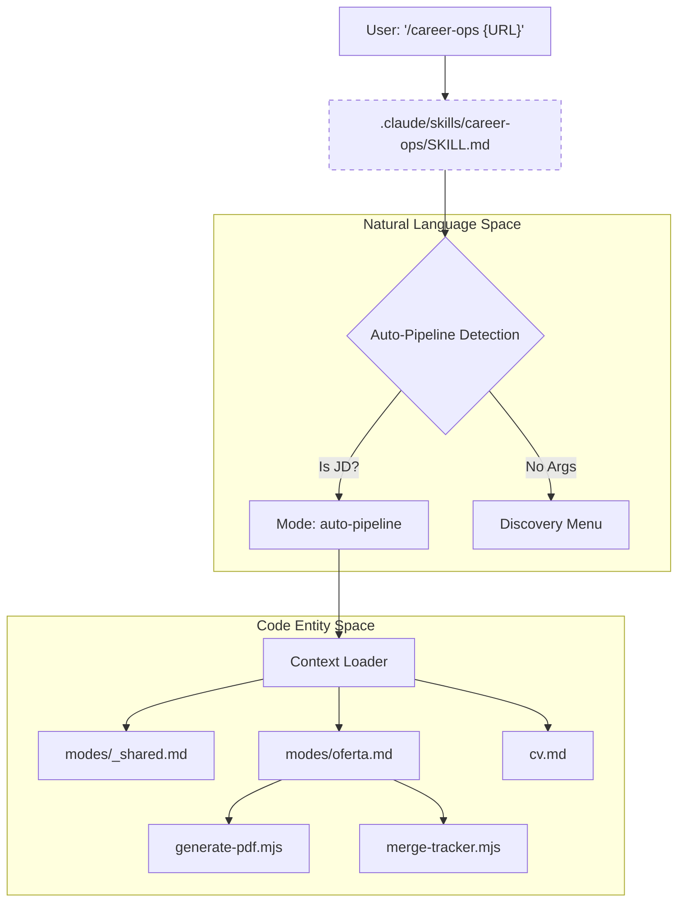
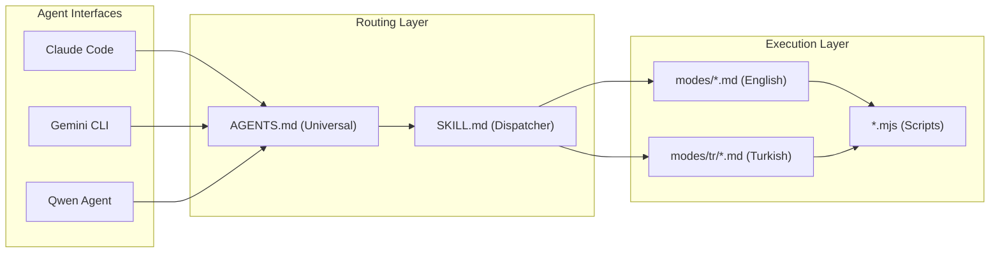

# Agent Routing Layer (AGENTS.md, CLAUDE.md, GEMINI.md, Qwen)

관련 소스 파일

다음 파일들이 이 위키 페이지를 생성하기 위한 컨텍스트로 사용되었습니다:

- [.agents/skills/career-ops/SKILL.md](.agents/skills/career-ops/SKILL.md)
- [.claude-plugin/marketplace.json](.claude-plugin/marketplace.json)
- [.claude-plugin/plugin.json](.claude-plugin/plugin.json)
- [.claude/skills/career-ops/SKILL.md](.claude/skills/career-ops/SKILL.md)
- [.qwen/skills/career-ops/SKILL.md](.qwen/skills/career-ops/SKILL.md)
- [AGENTS.md](AGENTS.md)
- [CLAUDE.md](CLAUDE.md)
- [GEMINI.md](GEMINI.md)
- [analyze-patterns.mjs](analyze-patterns.mjs)
- [followup-cadence.mjs](followup-cadence.mjs)
- [modes/followup.md](modes/followup.md)
- [modes/patterns.md](modes/patterns.md)
- [modes/tr/README.md](modes/tr/README.md)
- [modes/tr/_shared.md](modes/tr/_shared.md)
- [modes/tr/basvuru.md](modes/tr/basvuru.md)
- [modes/tr/is-ilani.md](modes/tr/is-ilani.md)
- [modes/tr/pipeline.md](modes/tr/pipeline.md)

**Agent Routing Layer**는 모든 AI 지원 CLI client와 IDE extension을 위한 universal entry point입니다. [open agent skill standard](https://agentskills.io)를 구현하여 `career-ops`가 Claude Code, Codex, Gemini, OpenCode, Qwen, Copilot 전반에서 일관된 "Skill"로 작동할 수 있게 합니다. 이 계층은 mode dispatching, automatic context loading, environment-specific override를 처리합니다.

## Universal Routing Logic (AGENTS.md)

`AGENTS.md` 파일은 모든 AI agent를 위한 primary manifest 역할을 합니다. 시스템의 출처, **Data Contract**, 그리고 모든 agent가 session initialization 시 따라야 하는 onboarding workflow를 정의합니다.

### Data Contract
system update가 personal data를 덮어쓰지 않도록 routing layer는 엄격한 경계를 강제합니다:

| Layer | Files / Paths | Update Policy |
| :--- | :--- | :--- |
| **User Layer** | `cv.md`, `config/profile.yml`, `modes/_profile.md`, `data/*`, `reports/*` | **절대** auto-updated되지 않음 [[AGENTS.md:15-17]]() |
| **System Layer** | `modes/_shared.md`, `AGENTS.md`, `*.mjs`, `dashboard/`, `templates/` | `update-system.mjs`를 통해 auto-updatable [[AGENTS.md:19-21]]() |

**핵심 규칙:** Agent는 customizations(archetypes, salary targets)를 항상 `modes/_profile.md` 또는 `config/profile.yml`에 작성해야 하며, system-level `_shared.md`에는 절대 작성하면 안 됩니다 [[AGENTS.md:23]]().

### Session Initialization 및 Onboarding
모든 agent session은 `cv.md`, `config/profile.yml`, `portals.yml`에 대한 silent check로 시작됩니다 [[AGENTS.md:74-80]](). 이 파일들이 없으면 agent는 **Onboarding Mode**로 진입하여 사용자의 CV 생성과 profile 설정을 안내합니다 [[AGENTS.md:83-110]]().

**Sources:**
- [AGENTS.md:11-44]()
- [AGENTS.md:72-106]()

## Mode Dispatcher (SKILL.md)

`.claude/skills/career-ops/SKILL.md`에 위치한 dispatcher(`.agents/skills/` 및 `.qwen/skills/`에 shim 포함)는 `/career-ops` slash command를 위한 routing table 역할을 합니다.

### Mode Routing Table
dispatcher는 `$mode` argument를 특정 Markdown instruction set에 매핑합니다:

| Input | Mode | 설명 |
| :--- | :--- | :--- |
| (empty) | `discovery` | command menu를 표시합니다 [[.claude/skills/career-ops/SKILL.md:18]]() |
| JD Text/URL | `auto-pipeline` | job description 자동 감지 [[.claude/skills/career-ops/SKILL.md:19]]() |
| `oferta` | `oferta` | A-F evaluation only [[.claude/skills/career-ops/SKILL.md:20]]() |
| `scan` | `scan` | Portal scanning(subagent에 위임) [[.claude/skills/career-ops/SKILL.md:31]]() |
| `apply` | `apply` | Form-filling assistant(subagent에 위임) [[.claude/skills/career-ops/SKILL.md:30]]() |

### Context Loading 전략
dispatcher는 주어진 mode에 필요한 file만 로드하여 token usage를 최적화합니다:
1.  **Shared Context:** `auto-pipeline` 또는 `oferta` 같은 mode는 `modes/_shared.md` + `modes/{mode}.md`를 읽습니다 [[.claude/skills/career-ops/SKILL.md:77-80]]().
2.  **Standalone:** `deep` 또는 `tracker` 같은 research mode는 해당 mode file만 로드합니다 [[.claude/skills/career-ops/SKILL.md:82-85]]().
3.  **Subagent Delegation:** 고복잡도 task(`scan`, `apply`)는 injected context와 함께 general-purpose subagent를 실행합니다 [[.claude/skills/career-ops/SKILL.md:87-96]]().

**Sources:**
- [.claude/skills/career-ops/SKILL.md:12-39]()
- [.claude/skills/career-ops/SKILL.md:73-98]()

## Multi-Agent Integration Flow

다음 다이어그램은 **Natural Language Space**(User Intents)를 **Code Entity Space**(Scripts and Mode files)에 연결합니다.

### Command Execution Pipeline
Title: Agent Command Resolution & Context Injection

**Sources:**
- [.claude/skills/career-ops/SKILL.md:36-38]()
- [.claude/skills/career-ops/SKILL.md:77-80]()

## Platform Overlays

`AGENTS.md`가 universal rule을 제공하는 한편, platform-specific overlay는 세부 조정을 가능하게 합니다:

*   **CLAUDE.md**: `@AGENTS.md`를 import하고 Claude Code specific optimization을 추가합니다 [[CLAUDE.md:1-2]]().
*   **GEMINI.md**: Google Gemini CLI를 위해 `@./AGENTS.md`를 import합니다 [[GEMINI.md:1]]().
*   **Qwen Integration**: `.qwen/skills/career-ops/SKILL.md`를 통해 관리되며, Alibaba의 Qwen agent에 대한 호환성을 제공합니다.
*   **Marketplace Manifest**: `.claude-plugin/plugin.json` 및 `marketplace.json`은 Claude extension ecosystem을 위한 permission(Bash, WebFetch, WebSearch)과 metadata를 정의합니다 [[.claude-plugin/plugin.json:1-18]]() [[.claude-plugin/marketplace.json:1-18]]().

## Localized Routing (i18n)

routing layer는 language-specific subdirectory(예: `modes/tr/`)를 통해 localized workflow를 지원합니다.

### Turkish Mode (modes/tr/)
Turkish integration(`modes/tr/README.md`)은 agent 동작을 DACH/TR market에 맞게 조정하며, **SGK**, **Kıdem Tazminatı**(severance), **TÜFE**(inflation) adjustment 같은 특정 개념을 처리합니다 [[modes/tr/README.md:53-65]]().

*   **Activation:** 사용자는 command 또는 `config/profile.yml`의 `language.modes_dir: modes/tr` 설정을 통해 활성화할 수 있습니다 [[modes/tr/README.md:18-38]]().
*   **Turkish Dispatcher:** `modes/tr/is-ilani.md`는 Turkish로 full A-G evaluation을 수행하기 위해 표준 `oferta.md`를 대체합니다 [[modes/tr/is-ilani.md:1-150]]().

### Agent System Topology
Title: Multi-Platform System Topology

**Sources:**
- [modes/tr/README.md:1-49]()
- [modes/tr/is-ilani.md:1-150]()
- [.claude-plugin/plugin.json:10-17]()
