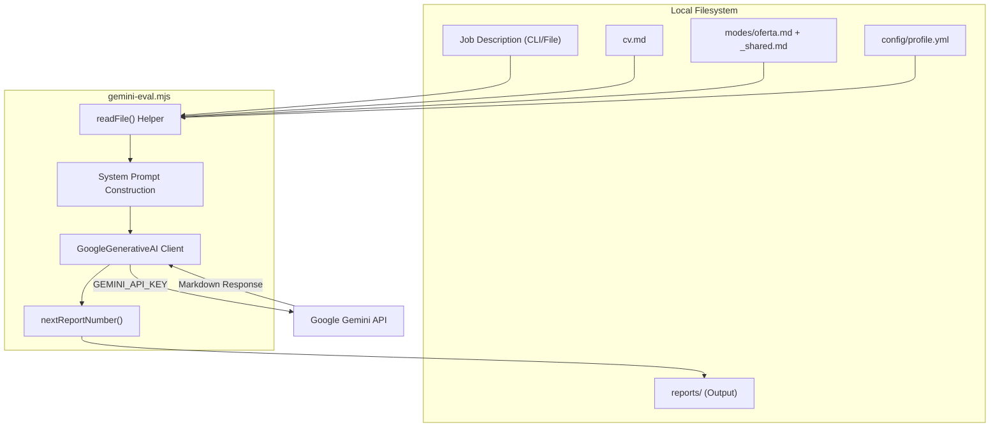
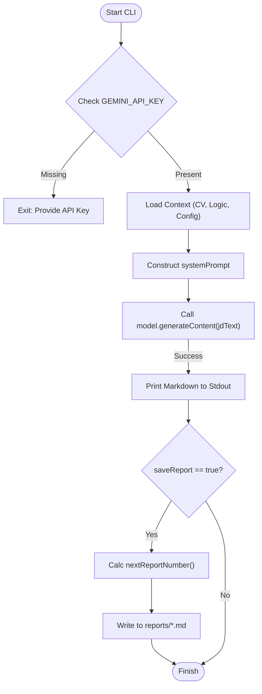

# Gemini Evaluator (gemini-eval.mjs)

관련 소스 파일

다음 파일들이 이 위키 페이지를 생성하기 위한 컨텍스트로 사용되었습니다:

- [.env.example](.env.example)
- [.envrc](.envrc)
- [.gitignore](.gitignore)
- [flake.lock](flake.lock)
- [flake.nix](flake.nix)
- [gemini-eval.mjs](gemini-eval.mjs)

`gemini-eval.mjs` 스크립트는 표준 Claude 기반 평가 파이프라인에 대한 고성능 무료 티어 대안을 제공합니다. Google의 Gemini model을 사용해 사용자의 CV와 비교하여 job description(JD)을 분석하고, `career-ops` 생태계의 나머지 부분에서 사용하는 것과 동일한 구조화된 A-G scoring report를 생성합니다.

### 목적 및 범위
이 evaluator는 비용이 발생하거나 Claude Code token quota를 소비하지 않고 대량의 job offer를 처리하려는 사용자를 위해 설계되었습니다. generous free tier(15 RPM / 1M tokens per day)를 제공하는 `gemini-2.5-flash` model을 활용합니다 [[gemini-eval.mjs:17-17](), [.env.example:9-9]()]. primary agent와 동일한 Markdown 기반 logic file을 읽는 standalone CLI tool로 작동하여 서로 다른 LLM backend 간 일관성을 보장합니다 [[gemini-eval.mjs:5-8](), [gemini-eval.mjs:179-184]())].

---

### CLI 사용법 및 구성

스크립트는 direct text input과 file-based ingestion을 모두 지원합니다.

| Command | 설명 |
|:---|:---|
| `node gemini-eval.mjs "JD text"` | 제공된 string을 직접 평가합니다. [[gemini-eval.mjs:11-11](), [gemini-eval.mjs:79-79]()]. |
| `node gemini-eval.mjs --file ./jd.txt` | 로컬 text file에서 JD를 읽습니다. [[gemini-eval.mjs:12-12](), [gemini-eval.mjs:80-80]()]. |
| `node gemini-eval.mjs --model <name>` | default model을 재정의합니다(예: `gemini-1.5-pro`). [[gemini-eval.mjs:81-81](), [gemini-eval.mjs:114-115]()]. |
| `node gemini-eval.mjs --no-save` | `reports/` 디렉터리에 쓰지 않고 evaluation을 실행합니다. [[gemini-eval.mjs:86-86](), [gemini-eval.mjs:116-117]()]. |

#### 환경 설정
1. **API Key**: [Google AI Studio](https://aistudio.google.com/apikey)에서 key를 얻고 `.env` 파일에 `GEMINI_API_KEY`를 추가합니다 [[gemini-eval.mjs:15-15](), [.env.example:10-10]())].
2. **Dependencies**: `@google/generative-ai`와 `dotenv`가 필요합니다 [[gemini-eval.mjs:45-45](), [gemini-eval.mjs:92-92]())].

Sources: [gemini-eval.mjs:11-12](), [gemini-eval.mjs:79-86](), [gemini-eval.mjs:90-93](), [.env.example:9-10]()

---

### 구현 세부 사항: 데이터 흐름

스크립트는 local filesystem과 Google Generative AI SDK 사이의 bridge 역할을 합니다. Claude `oferta` mode의 동작을 반영하는 comprehensive system prompt를 구성하기 위해 여러 context file을 집계합니다.

#### Context Aggregation
스크립트는 prompt context를 구성하기 위해 다음 파일을 읽습니다:
*   `modes/_shared.md`: 전역 evaluation rule 및 scoring definition [[gemini-eval.mjs:54-54](), [gemini-eval.mjs:179-179]())].
*   `modes/oferta.md`: 6-block evaluation structure를 위한 specific logic [[gemini-eval.mjs:55-55](), [gemini-eval.mjs:180-180]())].
*   `cv.md`: 사용자의 primary resume/CV source of truth [[gemini-eval.mjs:58-58](), [gemini-eval.mjs:181-181]())].
*   `config/profile.yml`: 후보자 preference 및 target role [[gemini-eval.mjs:60-60](), [gemini-eval.mjs:183-183]())].

#### 시스템 엔티티 매핑
다음 다이어그램은 CLI 스크립트가 filesystem 및 external API와 어떻게 상호작용하는지 보여줍니다.

**다이어그램: Gemini Evaluator Component Interaction**

Sources: [gemini-eval.mjs:52-63](), [gemini-eval.mjs:146-152](), [gemini-eval.mjs:154-162](), [gemini-eval.mjs:179-184]()

---

### Model Lifecycle Management

스크립트에는 사용자가 언제 더 새로운 Flash model로 migrate해야 하는지 알 수 있도록 hardcoded model deprecation schedule이 포함되어 있습니다.

| Model Name | Deprecation Date | Role |
|:---|:---|:---|
| `gemini-2.0-flash` | 2026-03-31 | Legacy(사용하지 말 것) [[gemini-eval.mjs:20-20]()] |
| `gemini-2.5-flash` | 2026-06-17 | **Current Default** [[gemini-eval.mjs:22-22](), [gemini-eval.mjs:103-103]()] |
| `gemini-2.5-flash-lite` | 2026-07-22 | Future alternative [[gemini-eval.mjs:23-23]()] |

`GEMINI_MODEL` environment variable 또는 `--model` flag로 재정의하지 않는 한, 스크립트는 기본적으로 `gemini-2.5-flash`를 사용합니다 [[gemini-eval.mjs:103-103](), [gemini-eval.mjs:114-115]())].

Sources: [gemini-eval.mjs:19-25](), [gemini-eval.mjs:103-103]()

---

### 로직 실행 및 오류 처리

#### Prompt Construction
`systemPrompt`는 `career-ops`의 identity와 로드된 logic file을 연결하여 구성됩니다 [[gemini-eval.mjs:188-191]()]. 이를 통해 Gemini output이 Claude와 정확히 같은 schema를 따르도록 보장합니다:
1. **Block A**: Role Summary
2. **Block B**: CV Match Analysis
3. **Block C**: Level Strategy
4. **Block D**: Compensation Research
5. **Block E**: Personalization Plan
6. **Block F**: Interview Prep / Story Bank

#### Credential Scrubbing
로그에 secret이 우발적으로 노출되는 것을 방지하기 위해 스크립트는 기본적인 credential scrubbing을 구현합니다. API call 중 오류가 발생하면 스크립트는 `GEMINI_API_KEY`가 console에 출력되거나 debug log에 기록되지 않도록 보장합니다.

#### Report Generation
`saveReport`가 활성화되어 있으면(default), 스크립트는 다음을 수행합니다:
1. `nextReportNumber()`를 사용해 다음 사용 가능한 report ID를 계산합니다(예: `042`) [[gemini-eval.mjs:154-162]())].
2. JD에서 company name을 정규화합니다.
3. Markdown file을 `reports/XXX-company-role.md`에 씁니다 [[gemini-eval.mjs:61-61](), [gemini-eval.mjs:104-104]())].

**다이어그램: Logical Execution Flow**

Sources: [gemini-eval.mjs:104-104](), [gemini-eval.mjs:131-141](), [gemini-eval.mjs:154-162](), [gemini-eval.mjs:188-191]()

---

### 비교: Gemini vs. Claude Pipeline

두 pipeline 모두 동일한 `modes/` logic을 사용하지만, execution environment와 cost structure가 다릅니다.

| Feature | Claude Pipeline (`claude oferta`) | Gemini Evaluator (`gemini-eval.mjs`) |
|:---|:---|:---|
| **Cost** | 유료(Claude Code / API usage) | 무료(Google AI Studio limit 내) [[gemini-eval.mjs:17-17]()] |
| **Tooling** | `claude` CLI 필요 | `node` + `@google/generative-ai` 필요 [[gemini-eval.mjs:45-45]()] |
| **Context** | agent memory로 관리 | Stateless(full context를 매번 전송) [[gemini-eval.mjs:188-191]()] |
| **Integration** | Deep(`playwright`, `git` 접근 가능) | Shallow(JD text processing only) [[gemini-eval.mjs:5-8]()] |

Sources: [gemini-eval.mjs:5-8](), [gemini-eval.mjs:17-17](), [.env.example:9-10]()
