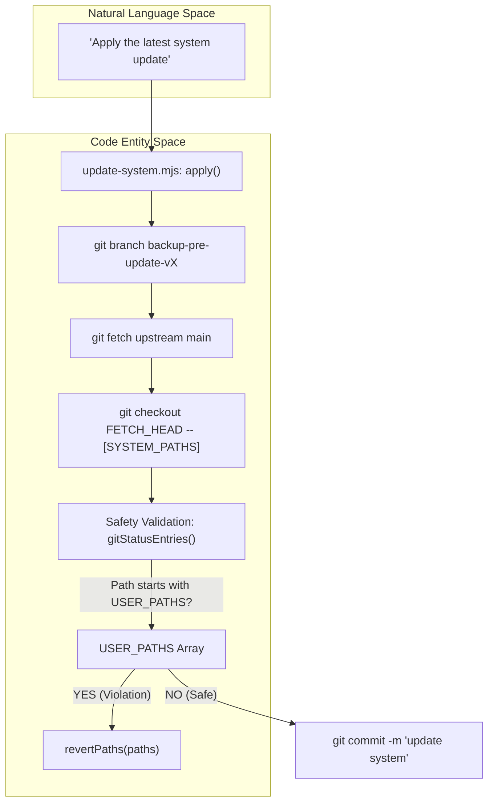
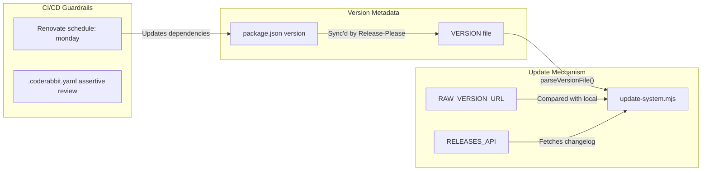

# 시스템 업데이트 및 버전 관리

관련 소스 파일

다음 파일들이 이 위키 페이지를 생성하기 위한 컨텍스트로 사용되었습니다:

- [.coderabbit.yaml](.coderabbit.yaml)
- [.github/workflows/release.yml](.github/workflows/release.yml)
- [DATA_CONTRACT.md](DATA_CONTRACT.md)
- [VERSION](VERSION)
- [modes/_profile.template.md](modes/_profile.template.md)
- [release-please-config.json](release-please-config.json)
- [renovate.json](renovate.json)
- [update-system.mjs](update-system.mjs)
- [writing-samples/README.md](writing-samples/README.md)

Career-Ops 시스템은 개인 사용자 데이터를 엄격히 보호하면서 AI 에이전트의 로직과 도구를 발전시키도록 설계된 견고한 업데이트 메커니즘을 구현합니다. 이는 프로젝트의 **Data Contract**에 정의된 엄격한 관심사 분리를 통해 달성됩니다.

## Data Contract: System Layer vs. User Layer

시스템은 업데이트가 후보자별 정보를 절대 덮어쓰지 않도록 두 계층을 구분합니다. 이 경계는 `DATA_CONTRACT.md`에 정의되어 있으며 `update-system.mjs` 스크립트가 강제합니다.

### User Layer(시스템이 변경할 수 없음)
User Layer에는 개인 데이터, 커스터마이징, 작업 산출물이 포함됩니다. 업데이트 프로세스는 이 파일들을 읽거나 수정하거나 삭제하는 것이 명시적으로 금지됩니다 [DATA_CONTRACT.md:69-70]().

| File/Path | 목적 |
|-----------|---------|
| `cv.md` | 후보자 CV source of truth [DATA_CONTRACT.md:11]() |
| `config/profile.yml` | 정체성, 목표, 보상 범위 [DATA_CONTRACT.md:12]() |
| `modes/_profile.md` | 개인 archetype 및 협상 스크립트 [DATA_CONTRACT.md:13]() |
| `data/` | tracker, pipeline, history database [DATA_CONTRACT.md:17-20]() |
| `reports/` | 생성된 evaluation report [DATA_CONTRACT.md:22]() |
| `interview-prep/story-bank.md` | 축적된 STAR+R story [DATA_CONTRACT.md:15]() |

### System Layer(자동 업데이트 가능)
System Layer에는 핵심 로직, agent instruction, utility script가 포함됩니다. 이 항목들은 업데이트 프로세스 중 안전하게 교체됩니다 [DATA_CONTRACT.md:71-72]().

| File/Path | 목적 |
|-----------|---------|
| `modes/*.md` | AI agent 동작 및 scoring logic [DATA_CONTRACT.md:32-47]() |
| `*.mjs` | Node.js utility script [DATA_CONTRACT.md:55]() |
| `dashboard/` | Go TUI application source [DATA_CONTRACT.md:58]() |
| `batch/` | Batch processing orchestrator 및 template [DATA_CONTRACT.md:56-57]() |

**Sources:** [DATA_CONTRACT.md:1-72](), [update-system.mjs:31-105]()

---

## 기술적 구현: update-system.mjs

`update-system.mjs` 스크립트는 system layer의 lifecycle을 관리하는 primary tool입니다. atomic operation과 rollback capability를 위해 `git`을 사용합니다.

### Command Reference
스크립트는 네 가지 주요 operation을 지원합니다 [update-system.mjs:10-13]():
*   `check`: `localVersion()`을 `RAW_VERSION_URL`과 비교하고 GitHub Releases API에서 최신 changelog를 가져옵니다 [update-system.mjs:156-236]().
*   `apply`: backup creation 및 safety validation을 포함한 multi-step update workflow를 실행합니다.
*   `rollback`: backup branch에 캡처된 상태로 시스템을 되돌립니다.
*   `dismiss`: `.update-dismissed` flag file을 생성해 update notification을 숨깁니다 [update-system.mjs:158-161]().

### Version Resolution Logic
`check()` 함수는 `Promise.allSettled`를 사용해 raw `VERSION` file과 GitHub Releases API에서 데이터를 병렬로 가져옵니다 [update-system.mjs:174-183](). 파일이 아직 bump되지 않았거나 raw host에 접근할 수 없는 경우를 처리하기 위해 둘 중 더 높은 version을 사용합니다 [update-system.mjs:224-231]().

### System Update Flow
이 다이어그램은 자연어 command가 update safety check의 code-level execution으로 전환되는 방식을 보여줍니다.

Title: System Update Safety Workflow

**Sources:** [update-system.mjs:31-90](), [update-system.mjs:93-105](), [update-system.mjs:132-142](), [update-system.mjs:156-241]()

---

## 버전 관리 및 Release Infrastructure

프로젝트는 code, manifest, CLI 간 일관성을 보장하기 위해 자동화 도구로 관리되는 Semantic Versioning(SemVer)을 따릅니다.

### Release Components
*   **VERSION File**: 현재 SemVer string(예: `1.8.0`)을 포함하는 plain text file이며, update script가 local state를 식별하는 데 사용합니다 [VERSION:1](), [update-system.mjs:113-116]().
*   **Release-Please**: Conventional Commits를 기반으로 version bump와 CHANGELOG update를 자동화합니다. `release-please-config.json`을 사용해 `package.json`과 manifest 전반의 version을 동기화합니다 [.github/workflows/release.yml:14-17](), [release-please-config.json:8-14]().

### Version Propagation and CI Guardrails
Title: Version Propagation and CI Guardrails

**Sources:** [VERSION:1](), [update-system.mjs:27-28](), [update-system.mjs:107-111](), [release-please-config.json:1-17](), [renovate.json:9]()

---

## CI Guardrails 및 Security

시스템은 regression이나 security vulnerability가 system layer에 들어오지 않도록 여러 계층의 automated review를 사용합니다.

### CodeRabbit AI Review
`.coderabbit.yaml` configuration은 critical file에 대한 특정 지침과 함께 "assertive" review를 강제합니다:
*   **CLAUDE.md**: agent instruction conflict를 모니터링합니다 [.coderabbit.yaml:13-14]().
*   **_shared.md**: scoring logic 변경이 flag됩니다 [.coderabbit.yaml:15-16]().
*   **DATA_CONTRACT.md**: user-layer file의 재분류는 거부됩니다 [.coderabbit.yaml:17-18]().
*   **Scripts (*.mjs)**: command injection, path traversal, SSRF를 검사합니다 [.coderabbit.yaml:19-20]().

### Automated Dependency Management
*   **Renovate**: GitHub Actions, Go, npm dependency의 non-major update를 group화하도록 구성되어 있습니다. 업데이트는 월요일 오전으로 예약됩니다 [renovate.json:5-28]().
*   **Semantic Commits**: Renovate는 `release-please`를 위한 깨끗하고 parseable한 history를 유지하기 위해 semantic commit을 사용하도록 구성되어 있습니다 [renovate.json:6]().

**Sources:** [.coderabbit.yaml:1-25](), [renovate.json:1-30](), [update-system.mjs:3-16]()
