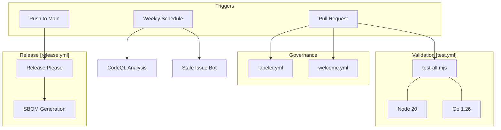
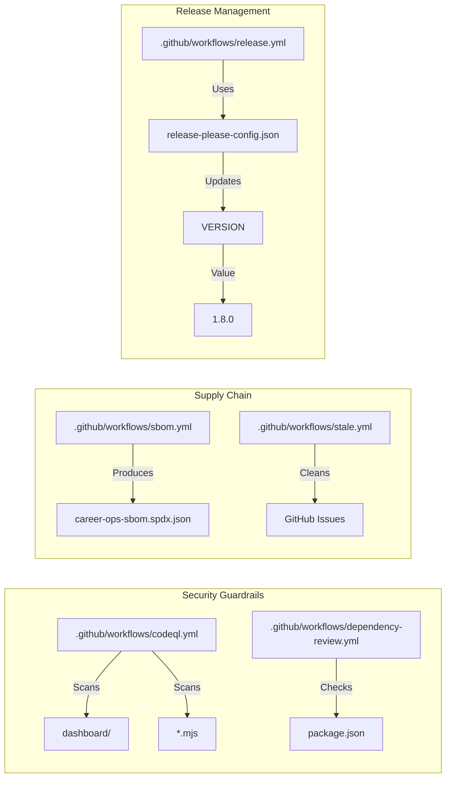

# 인프라 및 CI/CD

관련 소스 파일

다음 파일들은 이 위키 페이지를 생성하기 위한 컨텍스트로 사용되었습니다.

- [.github/labeler.yml](.github/labeler.yml)
- [.github/workflows/codeql.yml](.github/workflows/codeql.yml)
- [.github/workflows/dependency-review.yml](.github/workflows/dependency-review.yml)
- [.github/workflows/labeler.yml](.github/workflows/labeler.yml)
- [.github/workflows/release.yml](.github/workflows/release.yml)
- [.github/workflows/sbom.yml](.github/workflows/sbom.yml)
- [.github/workflows/stale.yml](.github/workflows/stale.yml)
- [.github/workflows/test.yml](.github/workflows/test.yml)
- [.github/workflows/welcome.yml](.github/workflows/welcome.yml)
- [VERSION](VERSION)
- [modes/_profile.template.md](modes/_profile.template.md)
- [release-please-config.json](release-please-config.json)

`career-ops` 저장소는 AI agent 모드, 데이터 처리 스크립트, Go 기반 dashboard의 무결성을 보장하기 위해 견고한 자동화 인프라를 활용합니다. 이 인프라는 자동화된 테스트, dependency 관리, 보안 스캔, 표준화된 release 프로세스 전반에 걸쳐 있습니다.

## 자동화 아키텍처

자동화 스택은 주로 GitHub Actions에 의해 구동되며, GitHub Actions는 Node.js 스크립트와 Go build 실행을 오케스트레이션합니다. 이 시스템은 엄격한 labeling taxonomy를 통해 핵심 아키텍처 변경과 주변부 업데이트를 구분합니다.

### CI/CD Workflow 토폴로지

다음 다이어그램은 code 변경 시 다양한 workflow가 codebase와 상호작용하는 방식을 보여줍니다.

**다이어그램: CI/CD Pipeline 오케스트레이션**

**출처:** [.github/workflows/test.yml:1-20](), [.github/workflows/release.yml:1-18](), [.github/workflows/codeql.yml:1-51](), [.github/workflows/stale.yml:1-35](), [.github/workflows/welcome.yml:1-34]().

---

## Testing 및 CI Pipeline

저장소의 주요 gatekeeper는 `test-all.mjs` master runner를 실행하는 `test.yml` workflow입니다. 이 suite는 `.mjs` 파일의 syntax validation, 개인 데이터 leak 방지, dashboard에 대한 Go build 검증을 포함한 중요한 검사를 수행합니다.

*   **실행 환경:** Node 20 및 Go 1.26을 사용해 `ubuntu-latest`에서 실행됩니다 [.github/workflows/test.yml:12-17]().
*   **PR 거버넌스:** `labeler.yml` workflow는 수정된 파일 경로를 기반으로 PR을 `🔴 core-architecture`, `⚠️ agent-behavior`, `📊 dashboard` 같은 bucket으로 자동 분류합니다 [.github/labeler.yml:1-56]().
*   **Contributor 온보딩:** `welcome.yml` workflow는 first-time contributor에게 인사를 전하고 `CONTRIBUTING.md` 및 `SUPPORT.md` 링크를 제공합니다 [.github/workflows/welcome.yml:19-33]().

자세한 내용은 [Testing 및 CI Pipeline](#9.1)을 참조하세요.

**출처:** [.github/workflows/test.yml:1-20](), [.github/labeler.yml:1-56](), [.github/workflows/welcome.yml:1-34]().

---

## Release Engineering 및 보안

저장소는 conventional commit을 기반으로 versioning 및 changelog 생성을 자동화하기 위해 "Release Please" 전략을 따릅니다. 보안은 자동화된 dependency 업데이트, SBOM 생성, CodeQL 스캔을 포함하는 다층적 접근 방식으로 유지됩니다.

### Dependency 및 보안 매트릭스

| Component | Tool | Frequency / Trigger |
| :--- | :--- | :--- |
| **Versioning** | `release-please` | `main`에 Push [.github/workflows/release.yml:1-18]() |
| **Dependencies** | `Renovate` | `renovate.json`을 통해 구성됨 (Internal) |
| **Security Scan** | `CodeQL` | 매주 (월요일 오전 4시) + PR [.github/workflows/codeql.yml:7-8]() |
| **Dep Review** | `dependency-review` | 모든 PR (High에서 실패) [.github/workflows/dependency-review.yml:23-27]() |
| **SBOM** | `anchore/sbom-action` | Release 게시 시 [.github/workflows/sbom.yml:3-4]() |

### Code Entity Association: 보안 및 Release

이 다이어그램은 보안 및 release 자동화를 해당 자동화가 관리하는 특정 configuration 파일 및 entity에 매핑합니다.

**다이어그램: 보안 및 Release Entity 매핑**

자세한 내용은 [Release Engineering 및 보안](#9.2)을 참조하세요.

**출처:** [VERSION:1-1](), [release-please-config.json:1-17](), [.github/workflows/sbom.yml:16-21](), [.github/workflows/dependency-review.yml:1-27](), [.github/workflows/codeql.yml:1-51]().

---

## 하위 페이지
- **[Testing 및 CI Pipeline](#9.1)**: `test-all.mjs`, Node/Go test matrix, PR labeling logic을 자세히 살펴봅니다.
- **[Release Engineering 및 보안](#9.2)**: release manifest, Renovate configuration, SBOM 생성, 자동화된 보안 스캔에 대한 세부 정보입니다.
