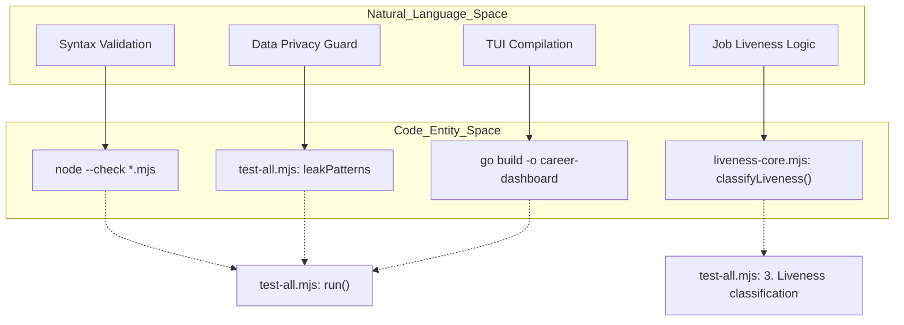
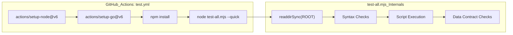

# Testing 및 CI Pipeline

관련 소스 파일

다음 파일들은 이 위키 페이지를 생성하기 위한 컨텍스트로 사용되었습니다.

- [.github/labeler.yml](.github/labeler.yml)
- [.github/workflows/labeler.yml](.github/workflows/labeler.yml)
- [.github/workflows/test.yml](.github/workflows/test.yml)
- [.github/workflows/welcome.yml](.github/workflows/welcome.yml)
- [check-liveness.mjs](check-liveness.mjs)
- [liveness-core.mjs](liveness-core.mjs)
- [test-all.mjs](test-all.mjs)

이 페이지는 `career-ops` 저장소의 자동화된 품질 보증 및 지속적 통합 인프라를 자세히 설명합니다. 이 시스템은 JavaScript syntax와 Go compilation부터 복잡한 AI agent 동작 및 데이터 privacy 제약까지 모든 것을 검증하는 다층 testing 전략을 사용합니다.

## Master Test Runner (`test-all.mjs`)

`test-all.mjs` 스크립트는 모든 local 및 CI 기반 test의 중앙 orchestrator 역할을 합니다 [test-all.mjs:4-7](). 이 스크립트는 `DATA_CONTRACT.md`에 정의된 "User Layer" 경계를 존중하면서 "System Layer"의 무결성을 보장하기 위해 모든 PR 제출 전에 실행되도록 설계되었습니다.

### 실행 흐름

runner는 여섯 개의 구분된 validation 단계를 수행합니다.

1.  **Syntax Checks**: root directory의 모든 `.mjs` 파일을 순회하고 `node --check`를 사용해 검증합니다 [test-all.mjs:51-59]().
2.  **Script Execution**: 핵심 utility 스크립트(예: `verify-pipeline.mjs`, `normalize-statuses.mjs`, `merge-tracker.mjs`)를 실행해 비어 있거나 누락된 데이터를 crash 없이 graceful하게 처리하는지 확인합니다 [test-all.mjs:63-83]().
3.  **Liveness Classification**: `liveness-core.mjs`를 import하여 regex 기반 job status detection logic을 알려진 "expired" 및 "active" HTML snippet에 대해 unit test합니다 [test-all.mjs:87-138]().
4.  **Dashboard Build**: Go 기반 TUI가 올바르게 compile되는지 검증합니다 [test-all.mjs:142-149](). 이 단계는 `--quick` flag를 사용해 건너뛸 수 있습니다 [test-all.mjs:11]().
5.  **Data Contract Validation**: `CLAUDE.md`, `VERSION`, `modes/_shared.md` 같은 필수 system file이 존재하는지 확인하는 동시에 [test-all.mjs:156-173](), `config/profile.yml` 같은 user-specific file이 올바르게 gitignore 처리되어 있는지 검증합니다 [test-all.mjs:176-188]().
6.  **Personal Data Leak Check**: private data가 실수로 commit되는 것을 방지하기 위해 codebase에서 PII(Personally Identifiable Information) pattern(예: 특정 이름, email 또는 local path)을 scan합니다 [test-all.mjs:192-210]().

### Liveness Logic Testing

`liveness-core.mjs`의 `classifyLiveness` function은 만료된 job posting을 걸러내기 위해 `scan` mode와 `check-liveness.mjs`에서 사용하는 핵심 component입니다 [liveness-core.mjs:49-78](). test suite는 다양한 scenario를 simulate하여 이 logic을 검증합니다.

| Scenario | Input Pattern | Expected Result |
| :--- | :--- | :--- |
| **Expired Page** | "The job you are looking for is no longer open." | `expired` [test-all.mjs:92-101]() |
| **Active Page** | 표시되는 "Apply for this Job" button | `active` [test-all.mjs:103-116]() |
| **Closed Banner** | "Applications have closed for this job" | `expired` [test-all.mjs:118-135]() |
| **Minimal Content** | body text가 300자 미만 | `expired` [liveness-core.mjs:73-75]() |

**출처:** [test-all.mjs:1-210](), [liveness-core.mjs:1-79](), [check-liveness.mjs:1-117]()

---

## CI/CD Workflows

저장소는 모든 Pull Request에서 품질 표준을 강제하기 위해 GitHub Actions를 사용합니다.

### Test Workflow (`test.yml`)
이 workflow는 `main` branch를 target으로 하는 모든 PR에서 실행됩니다 [test.yml:3-5](). 이 workflow는 이중 언어 환경을 설정합니다.
- **Node.js 20**: `.mjs` test suite 실행용 [test.yml:12-14]().
- **Go 1.26**: dashboard compile용 [test.yml:15-17]().

실행되는 기본 command는 `node test-all.mjs --quick`입니다 [test.yml:19]().

### PR Taxonomy 및 Labeling (`labeler.yml`)
시스템은 `actions/labeler@v6`를 사용해 수정된 파일을 기준으로 PR을 자동 분류합니다 [labeler.yml:1-17]().

| Label | Scope | Files Monitored |
| :--- | :--- | :--- |
| `🔴 core-architecture` | System definition | `CLAUDE.md`, `DATA_CONTRACT.md`, `modes/_shared.md` [.github/labeler.yml:1-6]() |
| `⚠️ agent-behavior` | AI instruction | `modes/*.md`, `.claude/skills/**` [.github/labeler.yml:8-13]() |
| `🔧 scripts` | Utility logic | `*.mjs`, `batch/**` [.github/labeler.yml:15-19]() |
| `📊 dashboard` | TUI interface | `dashboard/**` [.github/labeler.yml:41-44]() |
| `🌐 i18n` | Translation | `README.*.md`, `modes/de/**` 등 [.github/labeler.yml:32-39]() |

### Contributor Onboarding (`welcome.yml`)
전용 workflow는 first-time contributor에게 인사를 전하고 `CONTRIBUTING.md` 및 community Discord로 가는 즉시 접근 가능한 link를 제공합니다 [welcome.yml:1-34]().

**출처:** [.github/workflows/test.yml:1-20](), [.github/labeler.yml:1-56](), [.github/workflows/welcome.yml:1-34]()

---

## Code Entity Mapping

다음 다이어그램은 testing에 대한 natural language requirement가 특정 code entity에 매핑되는 방식과 CI pipeline이 이러한 check를 orchestrate하는 방식을 보여줍니다.

### Test Orchestration Mapping
"이 다이어그램은 high-level 'Test Phases'를 이를 실행하는 특정 JavaScript function 및 shell command와 연결합니다."

**출처:** [test-all.mjs:51-59](), [test-all.mjs:194-197](), [test-all.mjs:144](), [liveness-core.mjs:49]()

### CI Pipeline Flow
"이 다이어그램은 GitHub Actions 환경에서의 operation sequence를 보여줍니다."

**출처:** [.github/workflows/test.yml:11-19](), [test-all.mjs:51-53](), [test-all.mjs:63-72](), [test-all.mjs:156-165]()
